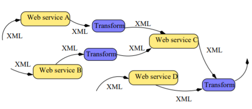

# Web Data Management and Distribution
# preliminaries
## Web data handling
- Web data: by far the **largest** information system ever seen, and a fantastic
means of sharing information.
- The challenge, under a data management perspective: master the size and
extreme variability of Web information, and make it usable.
## The role of XML
- XML describes **content**, and promotes machine-to-machine communication and **data exchange**.
- XML is a generic data format, apt to be specialized for a wide range of fields
  - ⇒ (X)HTML is a specialized XML dialect for data presentation
- XML makes easier **data integration**, since data from different sources now share a common format;
- XML comes equipped with many software products, APIs and tools

# xml,Semi-structured data model
## Semi-structured data model
- A data model, based on **graphs**, for representing both regular and irregular
data.
- Basic ideas
  - Self-describing data. The content comes with its own description;
    - ⇒ contrast with the relational model, where schema and content are represented separately.
  - Flexible typing. Data may be typed (i.e., “such nodes are integer values” or “this part of the graph complies to this description”); often no typing, or a very flexible one
  - Serialized form. The graph representation is associated to a serialized form, convenient for exchanges in an heterogeneous environment.
## Self-describing data
  
## Tree-based representation
- One choice:Data can be graphically represented as trees: label structure can be captured by tree edges, and values reside at leaves.

- Another choice is to represent both labels and values as vertices(The XML data model adopts this)
  
## representation of regular data
  
1. relational data can be represented
2. for regular data, the semi-structure representation is highly
redundant.

## Representation of irregular data
  
- Node identity:Nodes can be identified, and referred to by their identity. Cycles and objects models can be described as well.

## xml in brief
1. XML is a simplified version of SGML, a long-term used language
for technical documents.
2. HTML, up to version 4.0, is also a variant of SGML. The successor of HTML 4.0, is XHTML, an XML dialect.

## XML documents
- An XML document is a labeled, unranked, ordered tree:
  - **Labeled** means that some annotation, the label, is attached to each node.
  - **Unranked** means that there is no a priori bound on the number of children of a node.
  - **Ordered** means that there is an order between the children of each node.
- XML specifies nothing more than a syntax: no meaning is attached to the labels.

## XML documents are trees
  

## Serialized representation of XML document
  

## XML describes structured content
  

# xml syntax
## Serialized form, tree form
Typically, an application gets a document in serialized form, parse it in tree form, and serializes it back at the end.
  

- The serialized form is a textual, linear representation of the tree; it complies to a (sometimes complicated) syntax;
There exist an **object-oriented model for the tree form**: the **Document Object Model**(DOM) (W3C).

## The syntax for serialized document, in brief
  

## From serialized to tree form: 
### text and elements
  

### nesting elements
  

### attributes
  
- Unlike elements, attributes are **not ordered**, and **there cannot be two attributes with the same name in an element**.
### the document root
  

## summary: syntax and vocabulary
- Serialized form
  - A document begins with a prologue,
  - It consists of a single upper-level tag,
  - Each opening tag <name> has a corresponding closing tag </name>; everything between is either text or properly enclosed tag content.
- Tree form
  - A document is a tree with a root node (Document node in DOM),
  - The root node has one and only one element child (Element node in DOM), called the element root)
  - Each element node is the root of a subtree which represents its
  structured content
## Entities and references
- Entities are used for the physical organization of a document.
- An entity is **declared** (in the document type), then **referenced**.

  

## Predefined entities
- Several symbols cannot be directly used in an XML document, since they would be misinterpreted by the parser.
- They must be introduced as entity references.
  

## Comments and instructions
Comments can be put at any place in the serialized form.
- They appear as Comment nodes in the DOM tree (they are typically ignored by applications).
- Processing instructions: specific commands, useful for some applications, simply ignored by others.
  

## Literal sections
  

# Typing
## To type or not to type
- What kind of data: very regular one (as in relational databases), less regular
(hypertext systems) - all kind of data from very structured to very unstructured.
- What kind of typing (unlike in relational systems)
  - Possibly irregular, partial, tolerant, flexible
  - Possibly evolving
  - Possibly very large and complex
  - Ignored by some applications such as keyword search.

**Typing is not compulsory.**

## Type declaration
- XML documents may be typed, although they do not need to. The simplest (and oldest) typing mechanism is based on **Document Type Definitions (DTD)**.
- A DTD may be specified in the prologue with the keyword **DOCTYPE** using an ad hoc syntax.

  

## Document Type Definition
  

- A DTD may also be specified externally using an URI.
  

## Interpreting labels: Namespaces
A particular label, e.g., job, may denote different notions in different contexts, e.g., a hiring agency or a computer ASP (application service provider).
The notion of namespace is used to distinguish them
  

## DTD vs. XML schema
DTD: old style typing, still very used
XML schema: more modern, used e.g. in Web services
  
  

# The XML world
## Popular XML dialects
  

## XML standards
  

## Zoom:
### DOM
- Document Object Model - DOM
- Document model that is tree-based
- Used in APIs for different programming languages (e.g. Java)
- Object-oriented access to the content:
  - Root of the document
  - First child of a node (with a particular label)
  - Next one (with a particular label)
  - Parent of a node
  - Attribute of a node...

### XPATH
- Language for expressing **paths** in an XML document
  - Navigation: child, descendant, parent, ancestor
  - Tests on the nature of the node
  - More complex selection predicates
- Means to specify portions of a document
- Basic tool for other XML languages: Xlink, XSLT, Xquery

### XLINK
- XML Linking Language
- Advanced hypertext primitives
- Allows inserting in XML documents descriptions of links to external Web resources
- Simple monodirectional links ala (HREF) HTML
- Mulridirectional links
- XLink relies on XPath for addressing portions of XML documents
- XML trees + XLINK ⇒ graph

### XSLT
- Transformation langage: “Perl for XML”
- An XSLT style sheet includes a set of transformation rules: pattern/template
- Pattern: based on XPATH expressions; it specifies a structural context in the
tree
- Template: specifies what should be produced
- Principle: when a pattern is matched in the source document, the corresponding templates produces some data

### XQuery
- Query language: “SQL for XML”
- Like SQL: select portions of the data and reconstruct a result
- Query structure: FLW (pronounced "flower")
- Exemple
```
    FOR $p IN document("bib.xml")//publisher
    LET $b := document("bib.xml)//book[publisher = $p]
    WHERE count($b) > 100
    RETURN $p
```
- $p : scans the sequence of publishers
- $b : scans the sequence of books for a publisher
- WHERE filters out some publishers
- RETURN constructs the result

# Use Cases
## Exploiting XML content
- Publishing: an XML document can easily be converted to another XML document (same content, but another structure)
  - ⇒ Web publishing is the process of transforming XML documents to XHTML.
- Integration: XML documents from many sources can be transformed in a common dialect, and constitute a collection.
  - ⇒ Search engines, or portals, provide browsing and searching services on collections of XML documents.
- Distributed Data Processing: many softwares can be adapted to consume/produce XML-represented data.
  - ⇒ Web services provide remote services for XML data processing.

## Web Publishing
### restructuring to XHTML
- The Web application produces some XML content, structured in some application-dependent dialect, on the server.
- In a second phase, the XML content is transformed in an XHTML document that can be visualized by humans.
- The transformation is typically expressed in XSLT, and can be processed either on the server or on the client.
  

### content + presentation instructions
  

  
  

## Web Integration: gluing together heterogeneous sources
  

## Data integration, a larger perspective
  

## Distributed Data Management with XML
  

## Exploiting XML documents: the big picture
  
