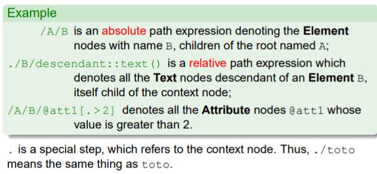

# Introduction
## XPath
- An expression language to be used in another host language (e.g., XSLT, XQuery).
- Allows the description of paths in an XML tree, and the retrieval of nodes that match these paths.
- Can also be used for performing some (limited) operations on XML data.
  

## XPath Data Model
- XPath expressions operate over XML trees, which consist of the following node types:
  - Document: the root node of the XML document;
  - Element: element nodes;
  - Attribute: attribute nodes, represented as children of an Element node;
  - Text: text nodes, i.e., leaves of the XML tree.

1. The XPath data model features also ProcessingInstruction and Comment node types.
1. Syntactic features specific to serialized representation (e.g., entities, literal section) are ignored by XPath.

## From serialized representation to XML trees
  

## XPath Data Model (cont.)
- The root node of an XML tree is the (unique) Document node;
- The root element is the (unique) Element child of the root node;
- A node has a name, or a value, or both
  - an **Element** node has a name, but no value;
  - a Text **node** has a value (a character string), but no name;
  - an **Attribute** node has both a name and a value.
- Attributes are special! Attributes are not considered as first-class nodes in an XML tree. They must be addressed specifically, when needed.
- The expression “textual value of an Element N” denotes the concatenation of all the Text node values which are descendant of N, taken in the document order.

# Path Expression
## XPath Context
- A step is evaluated in a specific context [< N1,N2,··· ,Nn >,Nc] which consists of:
  - **a context list** < N1,N2,··· ,Nn > of nodes from the XML tree;
  - **a context node** Nc belonging to the context list.
- The context length n is a positive integer indicating the size of a contextual list of nodes; it can be known by using the function last();
- The context node position c ∈ [1,n] is a positive integer indicating the position of the context node in the context list of nodes; it can be known by using the function position().

## XPath steps
- The basic component of XPath expression are steps, of the form:
$$axis::node-test[P1][P2]. . . [Pn]$$
- axis is an axis name indicating what the direction of the step in the XML tree is (child is the default).
- node-test is a node test, indicating the kind of nodes to select. 
- Pi is a predicate, that is, any XPath expression, evaluated as a boolean, indicating an additional condition. There may be no predicates at all.

- A step is evaluated with respect to a context, and returns a node list.
  

## Path Expressions
- A path expression is of the form: 
$$[/]step1/step2/. . . /stepn$$
  - A path that begins with / is an absolute path expression;
  - A path that does not begin with / is a relative path expression.

  

## Evaluation of Path Expressions
- Each step stepi is interpreted with respect to a context; its result is a node list.
- A step stepi is evaluated with respect to the context of stepi−1. More precisely:
  - For i = 1 (first step) if the path is absolute, the context is a singleton, the root of the XML tree; else (relative paths) the context is defined by the environment;
  - For i > 1 if N =< N1,N2,··· ,Nn > is the result of step stepi−1, stepi is successively evaluated with respect to the context [N ,Nj], for each j ∈ [1,n].
- The result of the path expression is the node set obtained after evaluating the last step.

## Evaluation of /A/B/@att1
  
1. The first step, A, is evaluated with respect to this context.
2. The result is A, the root element.
3. A is the context for the evaluation of the second step, B.
4. The result is a node list with two nodes B[1], B[2]
5. @att1 is first evaluated with the context node B[1].
6. The result is the attribute node of B[1].
7. @att1 is also evaluated with the context node B[2].
8. The result is the attribute node of B[2].
9. Final result: the node set union of all the results of the last step, @att1.

## Axes
- An axis = a set of nodes determined from the context node, and an ordering of the sequence.
- **child** (default axis).
- **parent** Parent node.
- **attribute** Attribute nodes.
- **descendant** Descendants, excluding the node itself.
- **descendant-or-self** Descendants, including the node itself.
- **ancestor** Ancestors, excluding the node itself.
- **ancestor-or-self** Ancestors, including the node itself.
- **following** Following nodes in document order.
- **following-sibling** Following siblings in document order.
- **preceding** Preceding nodes in document order.
- **preceding-sibling**Preceding siblings in document order.
- **self** The context node itself.

## Examples of axis interpretation
  
  
  
  
  
  
  
  
## Abbreviations (summary)
  
  

## XPath Predicates
- Boolean expression, built with tests and the Boolean connectors *and* and *or* (negation is expressed with the *not()* function);
- a test is
  - either an XPath expression, whose result is converted to a Boolean;
  - a comparison or a call to a Boolean function.
- predicate evaluation requires several rules for converting nodes and node sets to the appropriate type.
  

## Predicate evaluation
  

## XPath 1.0 Type System
  

- Rules for converting a nodeset to a string:
  - The string value of a nodeset is the string value of its first item in document order.
  - The string value of an element or document node is the concatenation of the character data in all text nodes below.
  - The string value of a text node is its character data.
  - The string value of an attribute node is the attribute value.

  

# Operators and Functions
- **+, -, \*, div, mod** standard arithmetic operators (Example: 1+2*-3).
- Warning! **div** is used instead of the usual **/**.
- **or, and** boolean operators (Example: @a and c=3)
- **=, !=** equality operators. Can be used for strings, booleans or numbers. 
- Warning! //a!=3 means: there is an a element in the document whose string value is different from 3.
- **<, <=, >=, >** relational operators (Example: ($a<2) and ($a>0)).
- Warning! Can only be used to compare numbers, not strings. If an XPath expression is embedded in an XML document, < must be escaped as lt;. 
- **|** union of nodesets (Example: node()|@*)
- $a is a reference to the variable a. Variables can not be defined in XPath, they can only be referred to.

## Node Functions
- **count(\$s)** returns the **number of items** in the nodeset \$s
- **local-name(\$s)** returns the **name** of the first item of the nodeset \$s in document order, **without** the namespace prefix; if \$s is omitted, it is taken to be the context item
- **namespace-uri(\$s)** returns the **namespace URI** bound to the prefix of the name of the first item of the nodeset \$s in document order; if \$s is omitted, it is taken to be the context item
- **name(\$s)**returns the **name** of the first item of the nodeset \$s in document order, **including** its namespace p

## String Functions
- **concat(\$s1,...,\$sn)** **concatenates** the strings $s1, . . . , $sn
- **starts-with(\$a,\$b)** returns true() if the string \$a **starts with** \$b
- **contains(\$a,\$b)** returns true() if the string \$a **contains** \$b
- **substring-before(\$a,\$b)** returns the **substring** of \$a **before** the first occurrence of \$b
- **substring-after(\$a,$\b)** returns the **substring** of \$a **after** the first occurrence of \$b
- **substring(\$a,\$n,\$l)** returns the **substring** of \$a of length \$l starting at index \$n (indexes start from 1). \$l may be omitted.
- **string-length(\$a)** returns the **length** of the string \$a
- **normalize-space(\$a)** **removes** all leading and trailing **whitespace** from \$a, and **collapse** all whitespace to a single character
- **translate(\$a,\$b,\$c)** returns the string \$a, where all occurrences of a character from \$b has been **replaced** by the character at the same place in \$c.

## Boolean and Number Functions
- **not(\$b)** returns the **logical negation** of the boolean \$b
- **sum(\$s)** returns the **sum** of the values of the nodes in the nodeset \$s
- **floor(\$n)** rounds the number \$n to the **next lowest** integer
- **ceiling(\$n)** rounds the number \$n to the **next greatest** integer
- **round(\$n)** rounds the number \$n to the **closest** integer

  

# XPath examples
  

  

# XPath 2.0
## XPath 2.0
- An extension of XPath 1.0, backward compatible with XPath 1.0. 
- Main differences:
  - Improved data model tighly associated with XML Schema.
  - a new sequence type, representing ordered set of
  nodes and/or values, with duplicates allowed.
  - XSD types can be used for node tests.
  - More powerful new operators (loops) and better control of the output (limited tree restructuring capabilities)
  - Extensible Many new built-in functions; possibility to add user-defined functions.
- XPath 2.0 is also a subset of XQuery 1.0.

## Path expressions in XPath 2.0
- New node tests in XPath 2.0:
  - item() any node or atomic value
  - element() any element (eq. to child:: * in XPath 1.0)
  - element(author) any element named author
  - element(*, xs:person) any element of type xs:person
  - attribute() any attribute
- Nested paths expressions:
  - Any expression that returns a sequence of nodes can be used as a step.

$$/book/(author | editor)/name$$

