# Use of XQuery for Web Data Integration
## The Web as Database Queried in XQuery 
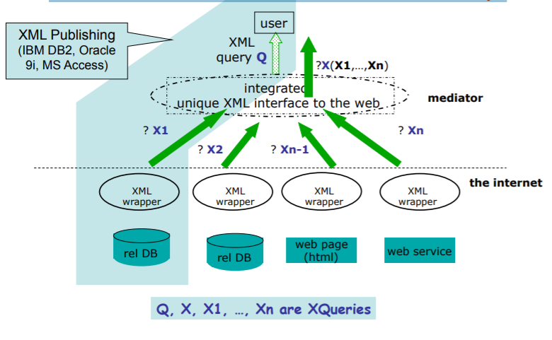  
## A Simple Publishing Scenario 
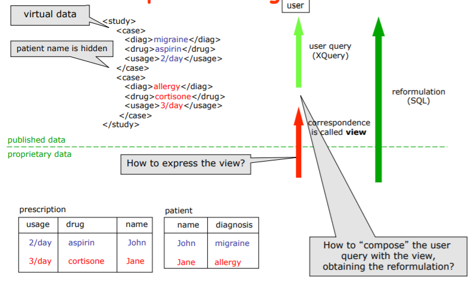  
## Encoding relational data as XML 
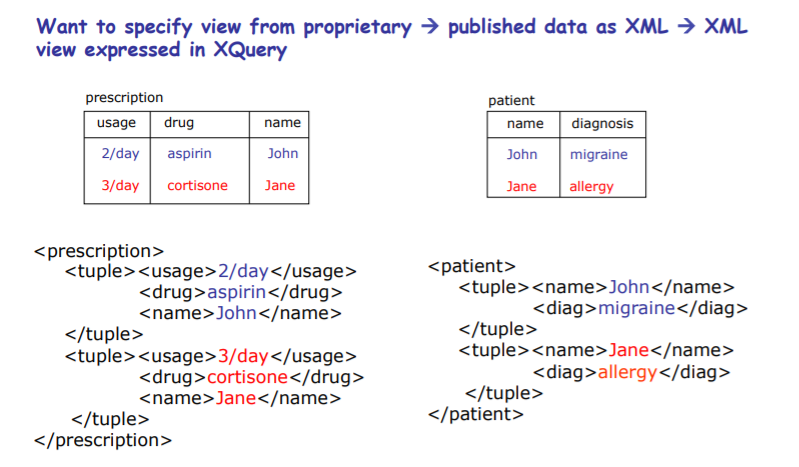  
## Proprietary!Published View:
XML -> XML 
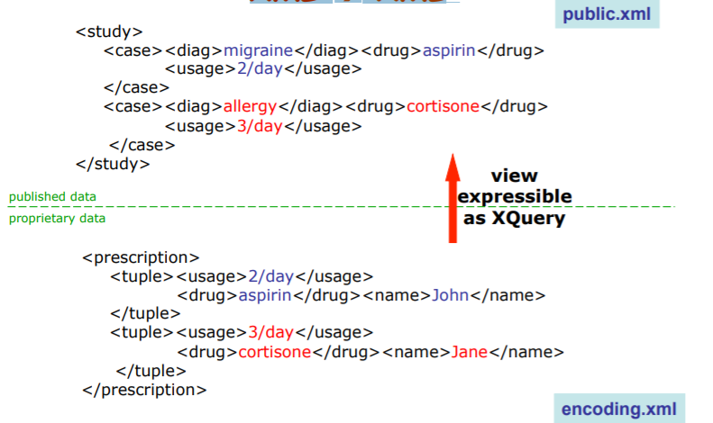  
## The View
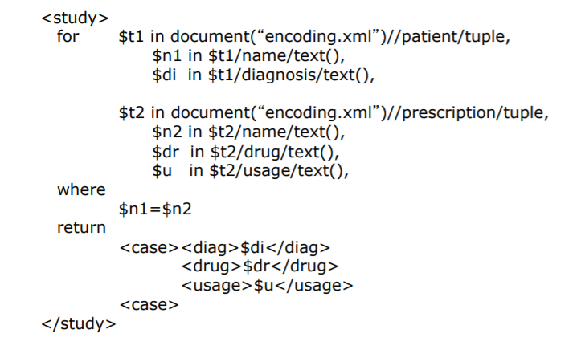  
## A Client Query
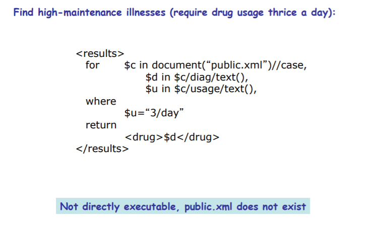  
## The Reformulated Query
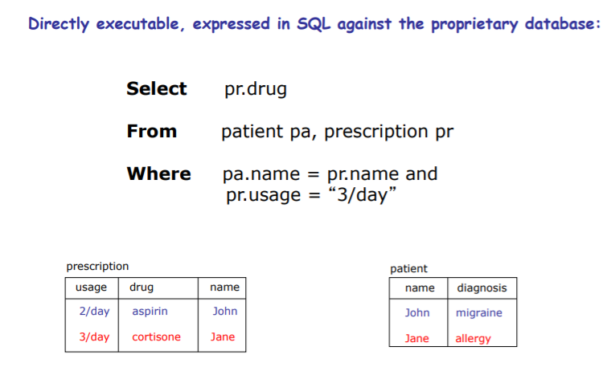  
# XQuery Evaluation Models
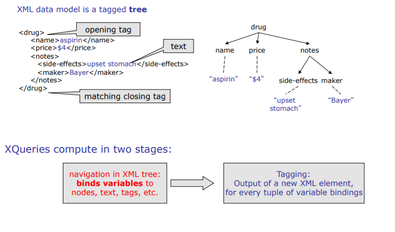  
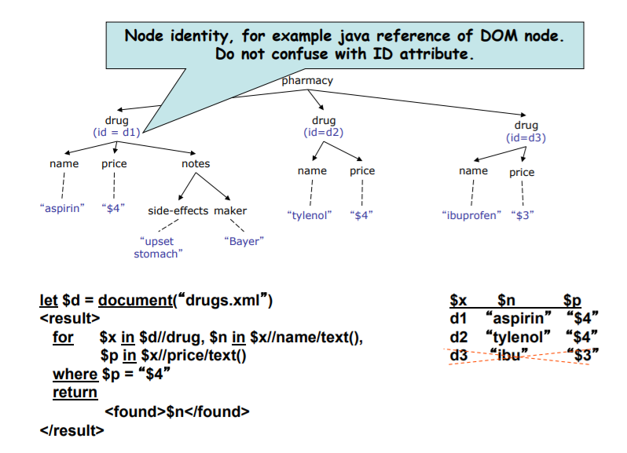  
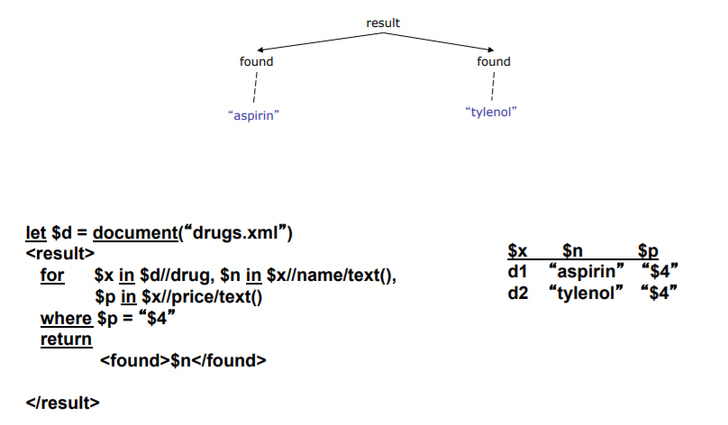  

## Descendant Navigation 
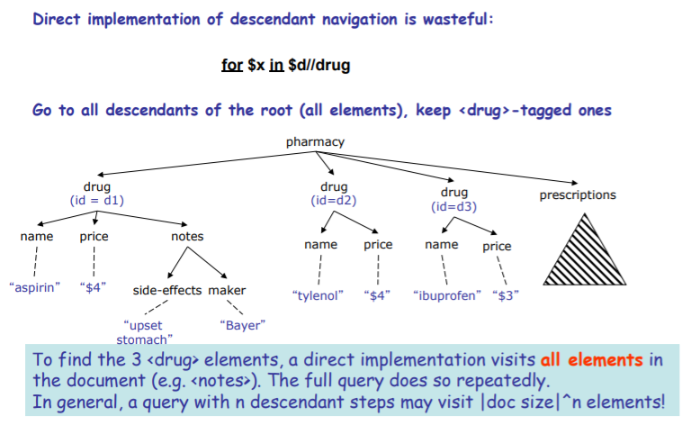  

## Index-based
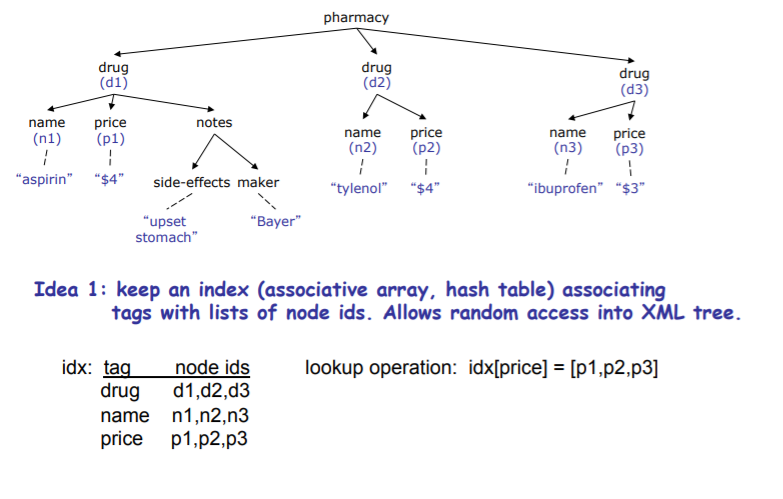  
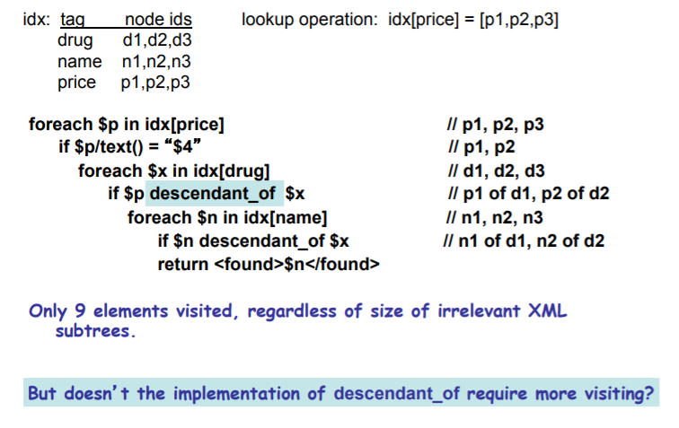  
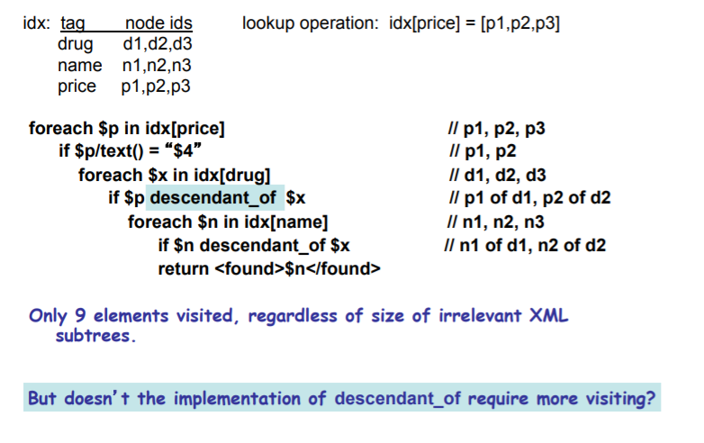  

## Ancestor-Descendant Testing in O(1) 
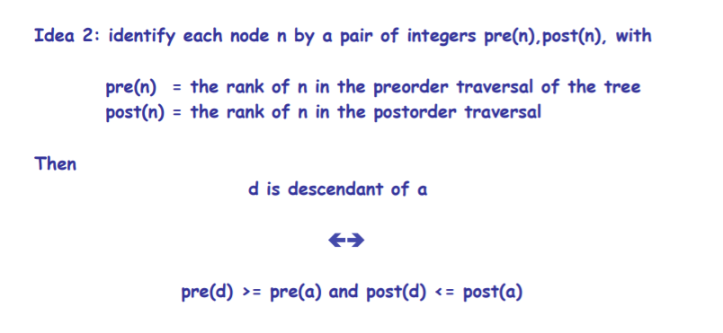  

## Example post-preorder node ids
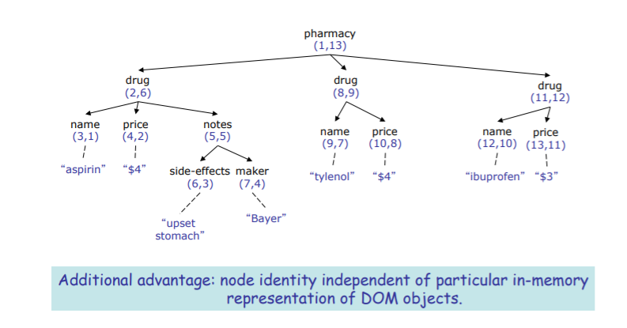  

## Stream-based XQuery Execution
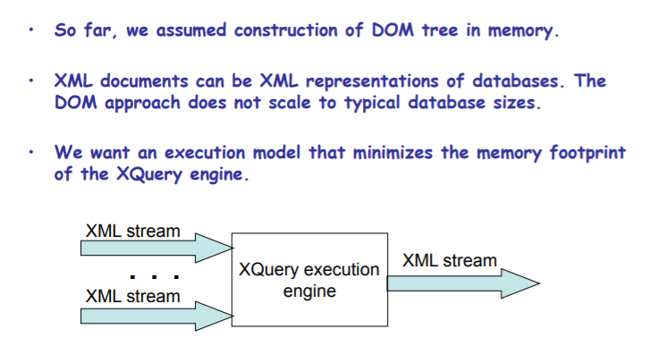  

## Applications of Stream-based Execution
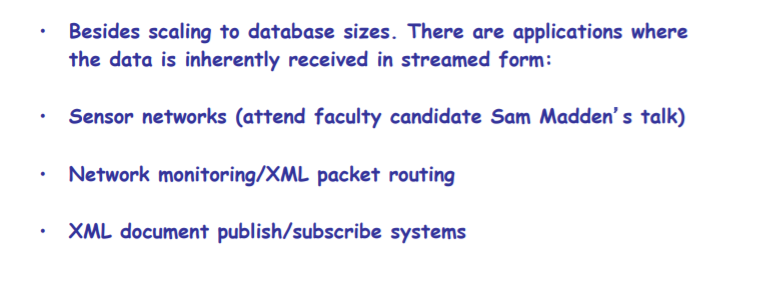  

## Stream-based XML Parsing
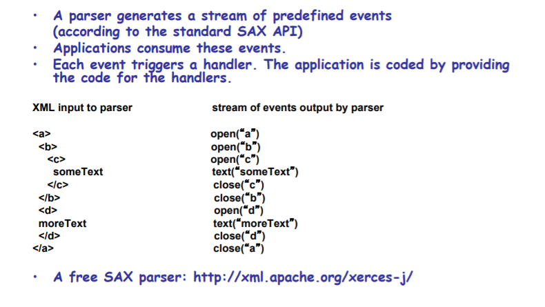  

## Stream-Based XQuery Navigation 
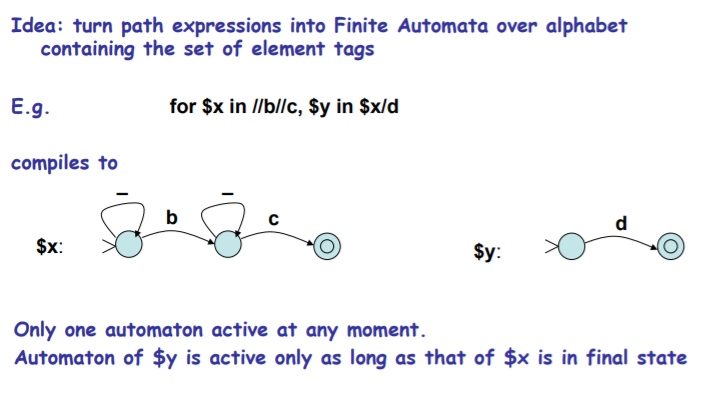  

## Matching XPaths Against Streams
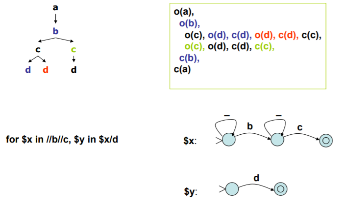  

## Automaton Extended with Stack
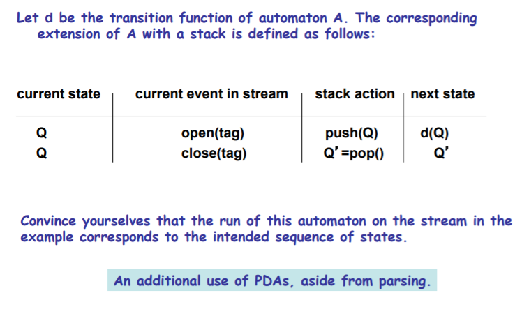  
# Optimization
## Semantic Optimization 
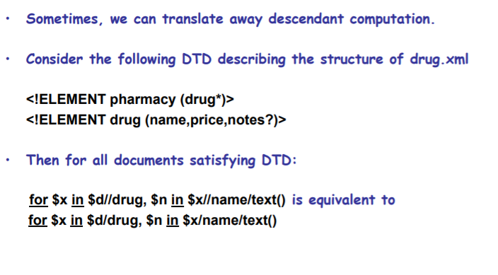  

## Semantic Optimization As Typechecking 
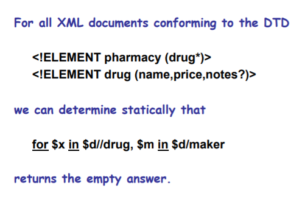  

# Flavor of Standardization Issues
## Element Equality in XQuery 
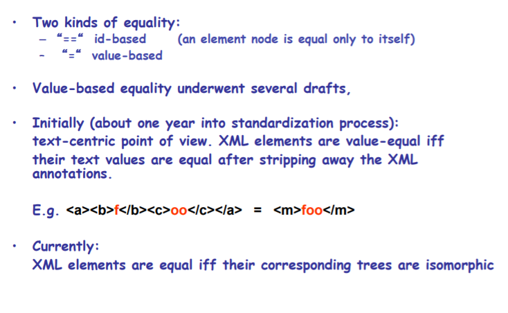  

## Id-based Element Equality
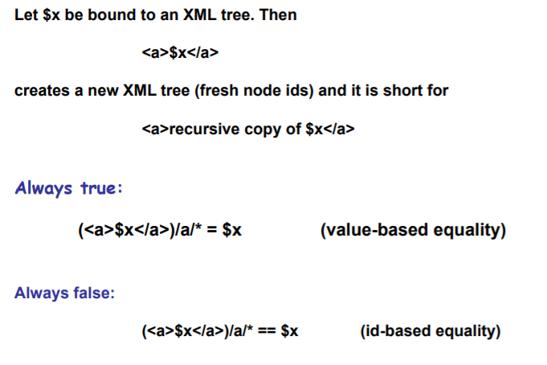  

# More on Optimization 
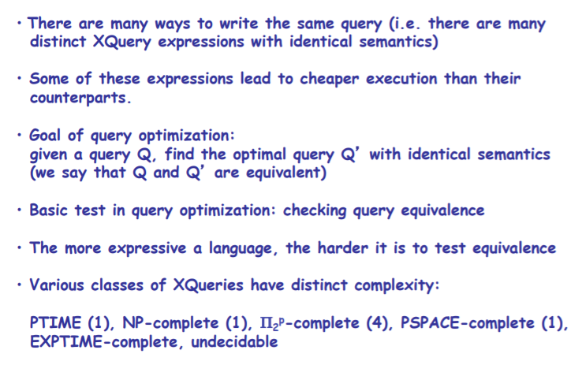  
