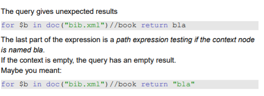

# Why XQuery?

- XQuery vs XSLT
  - XSLT is a procedural language, good at transforming XML documents
  - XQuery is a declarative language, good at efficiently retrieving some content from large (collections of) documents

# Main principles
- Closed-form evaluation. XQuery relies on a data model, and each query maps
an instance of the model to another instance of the model.
- Composition. XQuery relies on expressions which can be composed to form arbitrarily rich queries.
- Type awareness. XQuery may associate an XSD schema to query interpretation. But XQuery also operates on schema-free documents.
- XPath compatibiliy. XQuery is an extension of XPath 2.0 (thus, any XPath expression is also an XQuery expression).
- Static analysis. Type inference, rewriting, optimisation: the goal is to exploit the declarative nature of XQuery for clever evaluation.

# A simple model for document collections
- A value is a sequence of 0 to n items.
- An item is either a node or an atomic value.
- There exist 7 kinds of nodes:
  - Document, the document root;
  - Element, named, mark the structure of the document;
  - Attributes, named and valued, associated to an Element;
  - Text, unnamed and valued;
  - Comment;
  - ProcessingInstruction;
  - Namespace.

- The model is quite general: everything is a sequence of items. This covers anything from a single integer value to wide collections of larges XML documents.

# Examples of values
  

# Sequences: details 
- There is no distinction between an item and a sequence of length 1 ⇒ everything is a sequence.
- Sequence cannot be nested (a sequence never contains another sequence)
- The notion of “null value” does not exist in the XQuery model: a value is there, or not.
- A sequence may be empty
- A sequence may contain heterogeneous items (see previous examples).
- Sequences are ordered: two sequences with the same set of items, but ordered differently, are different.

# Items: details
- Nodes have an identity; values do not.
- Element and Attribute have type annotations, which may be inferred from the XSD schema (or unknown if the schema is not provided).
- Nodes appear in a given order in their document. Attribute order is undefined.

# Syntactic aspects of XQuery
- XQuery is a case-sensitive language (keywords must be written in lowercase).
- XQuery builds queries as composition of expressions.
- An expression produces a value, and is side-effect free (no modification of the context, in particular variable values).
- XQuery comments can be put anywhere. 

# Evaluation context
- An expression is always evaluated with respect to a context. It is a slight generalization of XPath and XSLT contexts, and includes:
- Bindings of namespace prefixes with namespaces URIs
- Bindings for variables
- In-scope functions
- A set of available collections and a default collection
- Date and time
- Context (current) node
- Position of the context node in the context sequence
- Size of the sequence

# XQuery expressions
- An expression takes a value (a sequence of items) and returns a value.
- Expressions may take several forms
  - path expressions;
  - constructors;
  - FLWOR expressions;
  - list expressions;
  - conditions;
  - quantified expressions;
  - data types expressions;
  - functions

# Simple expressions
  

# Retrieving documents and collections
- A query takes in general as input one or several sequences of XML documents, called collections.
- XQuery identifies its input(s) with the following functions:
  - doc() takes the URI of an XML document and returns a singleton document tree;
  - collection() takes a URI and returns a sequence.
- The result of the doc() function is the root node of the document tree, and its type is Document.

# XPath and beyond
  
- The XPath expression is evaluated for each item (document) in the sequence delivered by collection(’movies’).

# Constructors
- XQuery allows the construction of new elements, whose content may freely mix literal tags, literal values, and results of XQuery expressions.
- An expression e must be surrounded by curly braces {} in order to be recognized and processed.

  

# Variables
- A variable is a name that refers to a value. It can be used in any expression (including identity) in its scope.
  

# FLWOR expressions
- The most powerful expressions in XQuery. A FLWOR (“flower”) exp.:
  - iterates over sequences (for);
  - defines and binds variables (let);
  - apply predicates (where);
  - sort the result (order);
  - construct a result (return).

  

# FLWOR expressions and XPath
- In its simplest form, a FLWR expression provides just an alternative to XPath
expressions. For instance:
  
- Not all FLWR expressions can be rewritten with XPath.

# A complex FLWOR example
  

# for and let
- Both clauses bind variables. However:
  

# for + return = an expression!
- The combination for and return defines an expression: for defines the input sequence, return the output sequence.
  

# Defining variables with let
- let binds a name to a value, i.e., a sequence obtained by any convenient mean, ranging from literals to complex queries:
  

# The where clause
- where is quite similar to its SQL synonym. The difference lies in the much more flexible structure of XML documents
  
- Looks like a SQL query? Yes but predicates are interpreted according to the XPath rules:
  1. if a path does not exists, the result is false, no typing error!
  2. if a path expression returns several nodes: the result is true if there is at
  least one match.
  

# The return clause
- return is a mandatory part of a FLWR expression. It is instantiated once for each binding of the variable in the for clause.
  

# Joins
- Nested FLWOR expressions makes it easy to express joins on document, à la SQL:
  

- The join condition can be expressed either as an XPath predicate in the second for, or as a where clause

# Join and grouping
  

# Operations on lists
- XQuery proposes operators to manipulate lists:
  1. concatenation
  2. set operations: (union, intersection, difference)
  3. Functions (remove(), index-of(), count(), avg(), min(), max(), etc.)
- The distinct values from a list can be gathered in another list. (This loses identity and order.)
  

# if-then-else expressions
  

# some expressions
- some expresses the existential quantifier:
  

# every expressions
- every expresses the universal quantifier:
  

# XQuery processing model
  

# When XQuery doesn’t behave as expected
1. The query does not parse (applet grammar check page) ⇒ reformulate it. You may start from the XQuery use cases.
2. The query parses, but does not work.
3. The query works, but the results are unexpected ⇒ figure out what the parser understood.

- Sometimes the query parses but will not work (the engine will refuse it). The parser only checks that the production is well-formed. It does not check that the context provides sufficient information to run the query:
  - the functions called in the query are defined
  - the variables referred in the query are defined
  - the numeric operations are legal etc.

  

- Sometimes the query parses but will not work (the engine will refuse it).
- The parser saw this as a sequence formed of:
  - a for-return expression
  - a path expression
  

  

  

# More on comparisons
1. Two atomic values:
   - determine the types of both operands
   - cast then to a common type
   - compare the values according to the rules of that type
2. One atomic value and a node:
   - Cast the node to a string, then proceed as above.
3. Two lists (one list may be of length one):
   - Compare all list item pairs, return true if the predicate is satisfied at least for one item pair.
- Casting is described in the XQuery Functions and Operators document.

# XQuery implementations
- Among those that are free and/or open-source:
- Galax : complete, not very efficient
- Saxon : in memory; by Michael Kay, XSL guru
- MonetDB : based on in-memory column-oriented engine; among the fastest
- eXist : very user-friendly interface
- QizX : Xavier Franc. Nice but not great
BerkeleyDB XML : now belongs to Oracle

# SQL/XML: bridging the two worlds
- Recent SQL versions (2003) include:
  - a native XML atomic type, which can be queried in XQuery style
  - a set of XML publishing functions: extracting XML elements out of relational data by querying
- mapping rules: exporting relational tables in XML
- Advantages:
  - Unified manipulation of relational and XML data
  - Efficient relational query engine well exploited
  - Ease of transformation from one format to another
- Disadvantage:
  - Complexity

# SQL/XML: bridging the two worlds
  
