[toc]
# What is a network

- a system of links that interconnect nodes in order to exchange information
- two type of nodes:
- 
  - hosts: sources and sinks of information
  - Router: relay nodes that simply forward information

# packet vs circuits

- Internet is a packet switching network.

# ip: the glue of the internet
- hosts and routers are tied together by ip(internet protocol),a single common interface between users and the network and between networks.

# hierarchical addressing
- DNS is a distributed directory system that translates names into ip address.

# osi system interconnection(OSI)
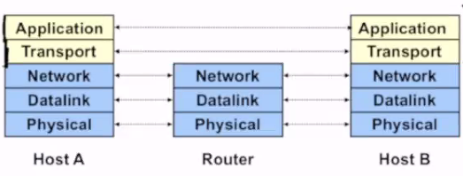  
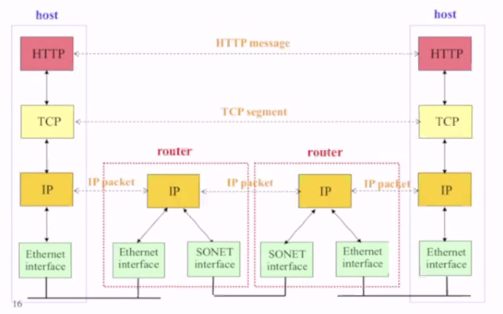  

# router forward packets
- routers determine the next hop for a packet based on the destination ip address.
- routing algorithms ensure packets follow the shortest path

# properties of links

- capacity: width of the link

# example of commication media
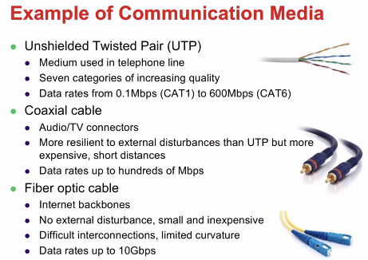  

# examples of capacity-delay
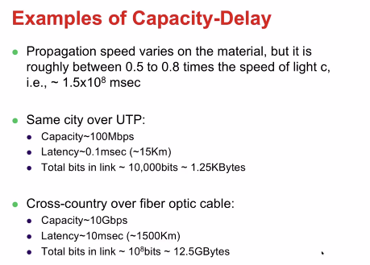  

- packet delay = Transmission delay + propagation delay

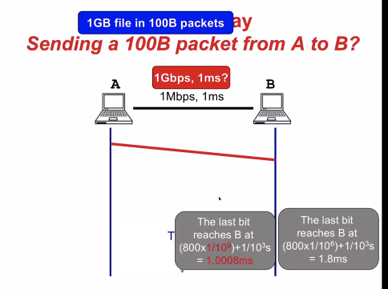  

# circuit switching
- time division
  each circuit allocated certain time slots
- frequency division

# circuit switching
- pros
  - guaranteed performance
  - fast transfer (once connection is established)

- cons
  - waste capacity if it is busy
  - connection setup time is overhead
  - when have failures, have to establish connection from scratch.

# packet switching 
- data is sent as chunks of formatted bits(packets)
- packets consist of a header and payload
- switch forward packets based on their headers.
- each packet travels independently
- no link resources are reserved in advance

# statical multiplexing
- pipe view
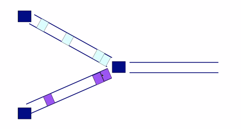  

- we need some control protocol to ensure queues are stable: TCp

# queues introduce queuing delays
- with queues: queuing delay = rx delay + prop delay + queuing delay
- made worse at high load

packet switching: pros and cons
- cons:
  - guaranteed performance
  - header overhead per packet
  - queues and queuing delays
- pro:
- efficient use of capacity
- no overhead dur to connection setup
- resilient - can route around trouble

# ECE view on bandwidth
1. range of frequencies occupied by the signal travelling on the link

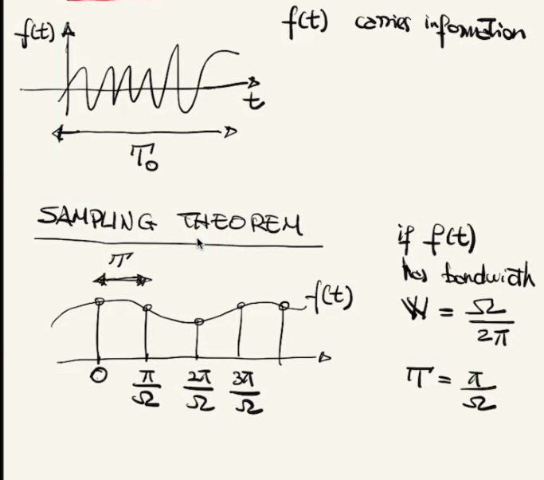 
if i sample f(t) at sampling frequency a least twice bandwidth then i can recover f(t)(T< pi/Ω) from samples.

- To reconstruct signal from samples what we can do is a low pass filter
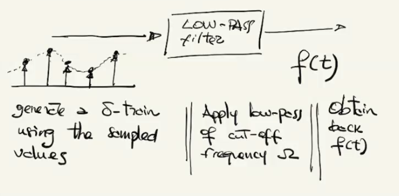  

- generate a $\delta$-train using the sampled values
- apply low-pass of cut-off - frequency Ω
- obtain back $f(t)$

## Why?
- Remember that sampling in the time domain corresponds to replicating signal in frequency domain.
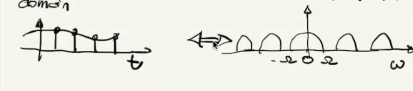  

To get back f(t) from sampled signal, we can apply a filter to eliminate the replicas.

If signal has duration $T_0$ and bandwidth $\Omega$ (means limited), we can reconstruct it using **at least**
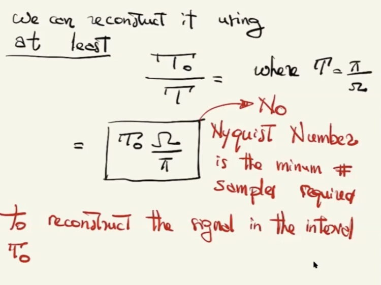  

Nyquist Number is the minimum number of samples required to reconstruct the signal in the interval.

Transmitting $f(t)$ over time $T_o$ is the same as transmitting $N_0$ real numbers.(samples).
$f(t)$ has a discrete representation in terms of N0 numbers.
It seems that by sampling theorem, transmitting $f(t)$ we achieve a rate of $N_0$/$T_0$ reals/time
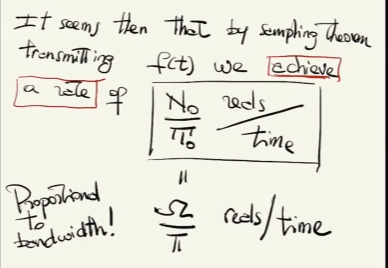  

## how to go to bits/time
- Question: can real numbers(samples) be arbitrary or are they constrained?

1. we can not have f(T) of arbitrary energy.
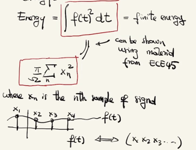  
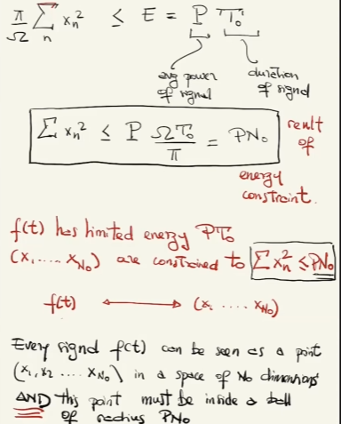  

Every signal f(t) can be seen as a point (x1,x2,xN0) in a space of $N_o$ dimensions and this point must be inside a ball of radius $PN_0$

1. f(t) can be seen as a point( by sampling theorem)
2. The point must be inside a ball (by energy constraint)

### How many different signals bandlimited and if a given energy I can have?

Noise constraint 
when points are too closed in space their coordinates are also close which means the reconstructed signals look very much.

And because of noise they are undistinguishable.

How many signal we can distinguish if noise has energy $\sqrt{NN_0}$
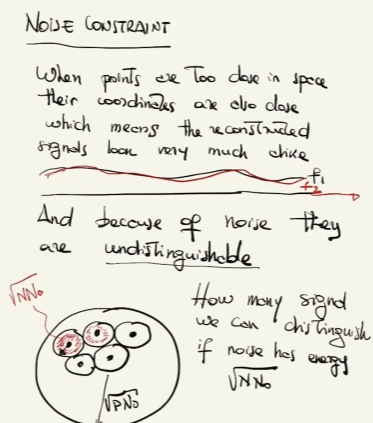  

number of signals that can be distinguished from  noise balls that fit inside space without overlap.
$$M = \frac{Volume \ signal \ ball}{Volume \  noise \ ball} = \frac{P+N}{N_0}$$

if we can transmit a bandlimited signal of finite energy over a noisy of noise energy(NN0) over a time interval T0,then we can have at most $M=(\sqrt{1+P / N})^{N_{0}}$ possibilities.

## how many bits does this physical possibility correspond to?
By transmitting one of the M signals at we are communicating $\log_2M \ bits$

- bit-rate
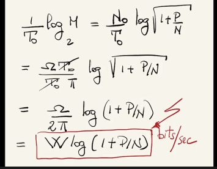  

SNR signal to noise ratio that is average power of received signal / avg power of the noise
$$C=W \log (1+SNR) \frac{bits}{rec}$$
How many distinct signals can I send?
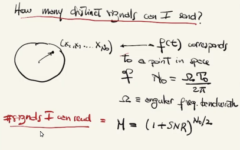  

Transmitting one signal out of the M possible ones corresponds to transmitting
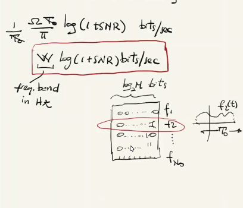  

- Example
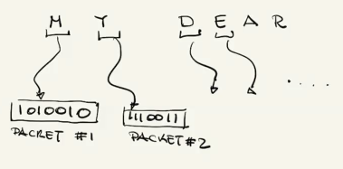  

assume we send this email over a connection line
7 bits/sec == 1 character per second
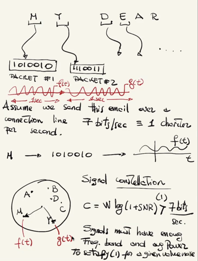  

signal must have enough Frequency band and average power to satisfy condition for a given noise

If instead we want to send 1M characters per second

# queueing delay

- single link : packet delay = tx delay + pro delay
- network packet delay = tx delay + prop delay + queueing delay

## queueing theory
- network we have random packet arrival at intermediate nodes.
- random amount of traffic - **model**

- To design protocols efficiently, we should have an idea of things like
  - How long is a packet queued at intermediate nodes?
  - How large are the queues?

### random arrival process for packets entering the queue

- random service process for packets exiting the queue
- model the arrivals as a poisson process
  - P(n arrivals in interval of time of size T) = $\frac{(\lambda T)^{n}}{n !} e^{-\lambda T}$
  - $\lambda$ = intensity of p.p is a parameter
  - number of arrivals n1,n2 in disjoint intervals of time are independent random variables.

#### why poisson
- it can be shown that poisson formula arises whenever the probability of arrival in a very small interval is proportioned to the site of that interval. 
- How can we simulate an arrival process?
  1. draw a random number n ~ poisson
  2. place them uniformly at random in the inter-arrival time t2-t1 ~ Wxpo($\lambda$)

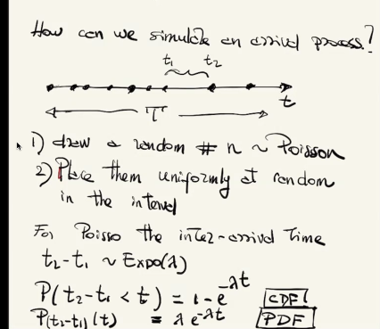  

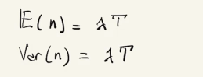  

### properties that are useful in the problems
- merging property

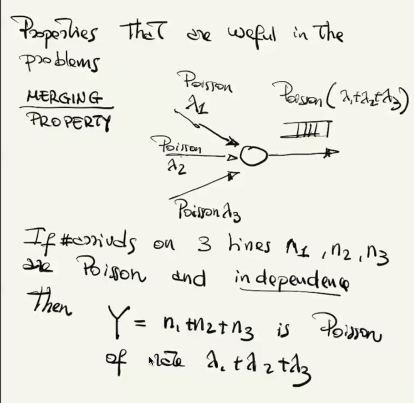  

- splitting  property
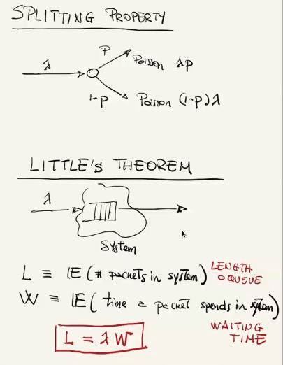  

