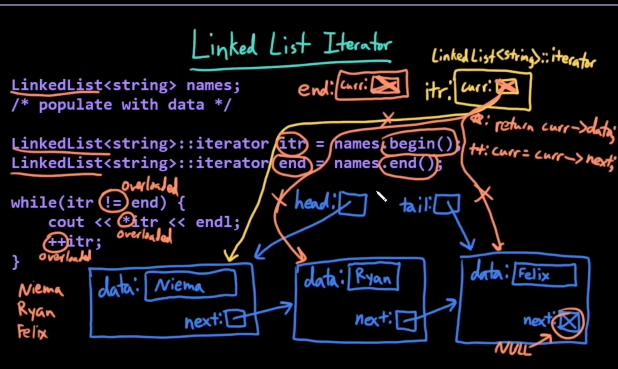
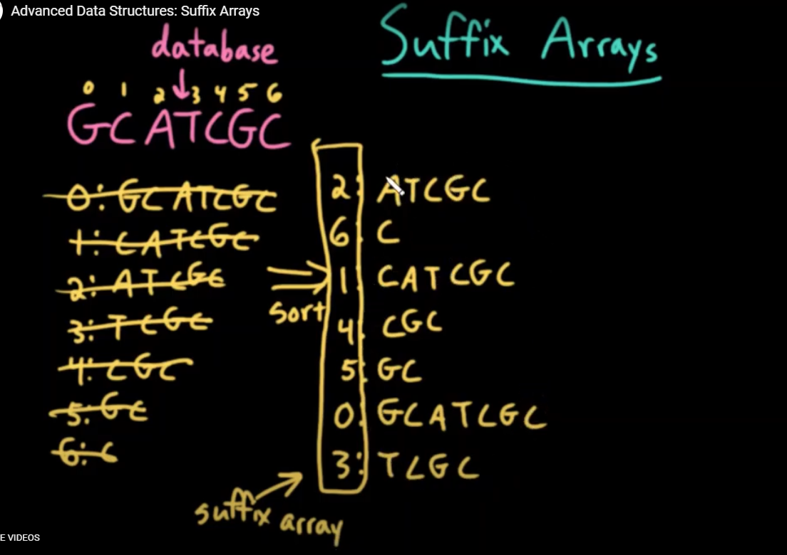

[toc]
# Java v.s c++
## string
### java
- immutable
- s.substring(beginIndex,endIndex)
- can concatenate any type

### c++
- mutable
- can only concatenate string
- s.substr(beginIndex,length)

## compare
### java
- a.equals(b)
- a.compareTo(b)

### c++
- a == b
- a != b
- a < b
- a > b


## variable

### java
- variable initialization is checked
```java
int fast;
int furious;
int fastFurious = fast + furious; //compile error
```
- narrowing is checked
```java
int x = 40000;
short y = x; //compile error
```
- variables cannot be declared outside of a class
```java
int x = 4;
class MyClass(){

} //compile error
```
### c++
- variable initialization is not checked
``` c++
int fast;
int furious;
int fastFurious = fast + furious; // undefined error
```
- narrowing is not checked
``` c++
int x = 40000;
short y = x; //overflow
```
- variables can be declared outside of a class
```c++
int x = 4; //global variable
class MyClass(){

} //right
```

## classes,source code, headers
### java
```java
class Student{
    public static int numStudents = 0;
    private String name;
    public Student(String n){};
    public void setName(String n){}; // must implement method
    public String getName(){};
}

```

### c++
```c++
class Student{
    public:
        static int numStudents;
        Student(string);
        void setName(string n);
        string getName() const;
    private:
        string name;        
}; // just declaration
int Student::numStudents = 0;
Student::Student(string n){};
void Student:: setName(string n){};
string Student::getName() const{};
```

### c++ member Initializer list
```c++
class Point{
    private:
        int x;
        int y;
    public:
        Point(int i, int j);
};
Point::Point(int i,int j){
    x = i;
    y = j;
};

class Point{
    private:
        int x;
        int y;
    public:
        Point(int i, int j);
};
Point::Point(int i,int j): x(i),y(j){};
```

### source file vs header files
```c++
// student.h
class Student{
    public:
        static int numStudents;
        Student(string);
        void setName(string n);
        string getName() const;
    private:
        string name;        
}; 

//student.cpp
int Student::numStudents = 0;
Student::Student(string n){};
void Student:: setName(string n){};
string Student::getName() const{};
```


## c++ memory diagrams
  

### reference
  

### pointers
#### c++
  

#### java
  


## the const keyword
```c++
const int s = 42;
s = 32; // compile error
int const a = 42;
a = 4; // compile error


int a = 42;
const int * ptr1 = &a;
int const* ptr2 = &a;
*ptr1 = 1; // error
*ptr2 = 1; //error

int * const ptr3 = &a;
ptr3 = &b; //error

const int* const ptr4 = &a;
ptr4 = &b; // error
*ptr4 = 1; //error


int a = 42;
const int & ref1 = a;
ref1 = 20;// error
int const &ref2 = a;
ref2 = 20; //error

class Student{
    public:
        static int numStudents;
        Student(string);
        void setName(string n);
        string getName() const;  // cannot modify by object, cannot assign instance var, can only call other const function
    private:
        string name;        
}; 

//student.cpp
int Student::numStudents = 0;
Student::Student(string n){};
void Student:: setName(string n){};
string Student::getName() const{};
```

## c++ functions
```c++
int main(){}; // must be int

```

### pass by value vs pass by reference
```c++
void swap1(int a,int b){
    int temp = a;
    a = b;
    b = temp;
}
swap1(a,b);// a,b not changed
void swap2(int & a,int & b){
    int temp = a;
    a = b;
    b = temp;
}
swap2(a,b);// a,b changed
```

## c++ vectors
```c++
vector<int> a;
a.push_back(42);
a.push_back(21);
a.pop_back(33);
std::cout << a[0] << std::endl;

vector<int> b = a; // full copy of a
```

## c++ input /output

```c++
int n;
cout << "Enter a number";
cin >> n;

string message;
cout << "Enter a message";
getline(cin,message);

if (cin.fail()){
    cerr<< "Bad input!" << endl;
}
```

## c++ template
```java
class Node<Data>{
    public final Data data;
    public Node(Data d){
        data = d;
    }
}
Node<String> a = new Node<String>(s);
Node<Integer> b = new Node<Integer>(n);
```

```c++
template<typename Data>
class Node{
    public:
        Data const data;
        Node(const Data &d): data(d) {};
};
Node<string> a(s);
Node<int> b(n);
```

# c++ iterators
## motivation for iterators
```c++
for (string name:names){
    cout << name << endl;
}
```

## iterators over arrays
  


## using iterators
  

## creating an iterator class
### operators in the iterator class
- == true if iterators are pointing to the same item
- != false
- * return a reference to the current data value
- ++(pre) and --(post) move current iterator to the next item

### functions in the data structure classes:
- begin() returns iterator to **the first** element
- end()  returns iterator to **just after** the last element

# time complexity
## notation of complexity

- big-O: upper bound
- big Ω: lower bound
- big θ: both upper bound and lower bound


## finding big-o time complexity
1. determine f(n)
2. drop all lower terms of n
3. drop constant coefficient

## common big-o time complexity
### polynomial
- o(1) - constant
- o(logn) -- logarithmic
- o(n) -- linear
- o(nlogn)
- o(n2) -- quadratic
- o(n3) -- cubic

### bad
- o(k^n) exponential
- o(n!) Factorial

# space complexity


# Trees
## what are trees
- no undirected cycles
- connected
  
## special cases of trees
- empty (null)
  - 0 nodes
  - 0 edges
- single node tree
  - 1 node 
  - 0 edges

- rooted trees
  - only one root node(no parent)

- unrooted trees

- leaves : 1 neighbor
- internal nodes: multiple neighbors
- root: no parent

## tree traversal
### dfs
- preorder:visit,left,right
- inorder:left,visit,right
- postorder: left,right,visit

### bfs
- levelorder: 1st level(left to right), 2en level

## properties of a binary search tree(BST)
1. rooted binary tree
2. every node is larger than all nodes in its left subtree
3. every node is smaller than all nodes in its right subtree

## bst find algorithm
1. start at the root
2. if query == current: success
3. otherwise, traverse the left/right
4. no such child: fail

## bst insert algorithm
1. perform find algorithm
2. if find: duplicate
3. insert the new element at the site of failure

## bst successor: next largest node
1) if the node has a right child,traverse right once, then all the way left
2) other wise, traverse up the tree. The first time the current node is its parent's left child ,the parent is our successor

## bst remove algorithm
- no children: just delete the node
- one child: direct my child to my parent
- thw children: replace my value with my successor,and remove me.

## bst time complexity
- height of a node: the longest distance from node to a leaf
- height of a tree: Height of  the root of the tree 
- depth of a node: number of nodes in the path from that node to the root
## tree balance
### best vs worst vs average case
- best: query is the root O(1)
- worst perfectly unbalanced,query not found O(n)
- average case:
  - Theoretical expected value over all  trees and queries
  - all n elements are equally likely to be searched for.
  - all n! possible insertion orders are equally likely 


# treaps tree + heap
- bst properties wrt keys
  - larger than all keys in the left subtree
  - smaller than all keys in right subtree
- heap property wrt priorities
  - larger than all priorities below

  

# AVL rotations
  


# treap insertion
1. insert via BST insert algorithm
2. use AVL rotation to bubble up to fix Heap wrt priorities


Randomized search tree
- user elements as keys (maintain bst)
- random generate priorities (maintain heap property)

# AVL trees
- balance factor BF: height of right subtree - height of left subtree
- avl tree: in which every node has BF of -1,0,or 1

# AVL tree insertion
1. regular BST insertion
2. update balance factor
3. fix broken balance factor using AVL rotation


# red-black trees
1. all nodes must be red or black
2. the root must be black
3. if a node is red,all of its children must be black.
4. for every node u, every possible path from u to a null reference must have the same munber of black nodes
5. null reference are black

# red-black tree vs avl tree
- red-black tree is not necessarily an avl tree

# the set adt
- set: store multiple elements
- find,insert,remove

# the map adt
- map: store multiple pairs
- get,put,remove

# implementing the set and map adts
- unsorted linked list
- sorted linked list
- unsorted arraylist
- sorted arraylist
- slef-balancing BST:
- Hash table


# tries
- trie: Tree structure in wich elements are represented by  paths
- a four path trie
  

# multiway tries
- trie in which nodes can have more than 2 children

## mwt time complexity
- n : number of words
- k : length of longest word
- O(n*k)


## mwt space complexity
-   

- $\Sigma$ = alphabet
- $|\Sigma|$ = length of alphabet
- O($n^k$)


# ternary search trees (TSTs)
-  BST:O(klogn),memory efficient
-  MWT:O(k), memory inefficient
-  TST: somewhere in between
  
  


## tst time complexity
- worst O(n)
- average O(logn)

# hash function
- input : an object x
- output: an integer representation of x
- property of equality: if x is equal ot y,h(x) must be the same
- property of inequality: if x is not equal to y, it would be nice if h(x) is not equal to h(y)

## examples:
```python
def h(s): //valid not good
    return 0
def h(s): //valid
    out = 0
    for c in s:
    out += ascii value of c
    return out

def h(s): //invalid
    return a random integer

def h(s): //valid,best
    out = 0
    for c in s:
        out *= 31
        out += ascii value of c
    return out
def h(s): // invalid
    return current time
```

$P_{N, M}(\geq 1 collision) =
1-P_{N, m}(0$ collisions $) = 
1- 1 \cdot \frac{m-1}{m} \cdot \frac{m-2}{m} \cdot \cdots \frac{m-N+1}{m}
$

## load factor
expected total number of collisions:$\sum_{i=1}^{N-1} \frac{i}{n}=\frac{N(N-1)}{2 m} = 1$  
-> $N=\sqrt{2 m}$

$M=O\left(N^{2}\right)$

expected total number of collisions $=\frac{1}{2}\left(1+\frac{1}{1-\alpha}\right)$

# collision resolution strategies
## open addressing(linear probing)
  

## double hashing
  


## closed addressing(separate chaining)
  


# bloom filters and count-min sketches
## bloom filters
  


## designing an optimal bloom filter
1. each hash function uniformly distributed
2. each insertion is independent

  
  


## count-min sketches
- probabilistic data
- memory-efficient
- provides upper-bound on counts

  

## design an optimal count-min sketch
  

# Aho-Corasick Automaton
## matching a database of many short strings to a long query string
  

## aho-corasick automaton
  

## dictionary link
  

# suffix arrays and burrows-wheeler transform(BWT)
## suffix arrays
  


## suffix array search
  

- O(klogn)

## burrows wheeler tranform
  

## inverting the bwt
  


## pattern matching usring the BWT
  


# Message encoding
## Coding Tree
  

## information vs. data
- information: content of some message
  - tells us details about some system
- data: raw unit of information
  - representation of information

## entropy
- entropy: measure of disorder(non-uniformity) of a system
- Shannon entropy: expected value(average) of the information contained in some data


## data uniformity and information
- uniformity: lack of variation among symbols in a message

- more uniform -> less entropy -> less information

# Huffman coding
## prefix code
- an encoding in which no symbol is represented by a code that is a prefix of the code representing another symbol

  

## a lower bound on data compression
$$\sum_{x} P_{x} \log _{2}\left(\frac{1}{x}\right)$$

  

## huffman tree construction
1. compute frequencies of symbols in message
2. start with a forest of single-node trees(symbol w/frequency)
3. while there is more than one tree in the forest
   1. remove 2 trees with lowest frequency from forest
   2. create new node with frequency = t1's frequency + t2' frequency to be their parent
   3. insert this new node into the forest

## huffman encoding& decoding
  

# bitwise input/output(I/O)
## bytewise(I/O)
  
## bitwise I/O
  

## reading from a bitwise buffer
  


## writing to a bitwise buffer
  

# graphs
## directed vs undirected
- directed: an edge(u,v) is from u to v, not v to u
- undirected: an edge(u,v) is from u to v and v to u
## weighted vs unweighted

## cycles
- a valid path starting and ending at the same node
  
## classes of graphs
- structured: a disconnected collection of nodes
- sequential: an ordered collection of connected nodes
- hierarchical: a ranked collection of connected nodes
- structured: a collection of both connected and disconnected nodes

## multigraphs
- multigraphs: graph in which a pair of nodes may have multiple distinct edges


# graph representation
## adjacency matrix
  

## adjecency list
  


# breadth first search(BFS)
  


# depth first search(DFS)
  

# bfs and dfs time complexity
  


# dijkstra's algorithm
  

# dijkstra's algorithm time complexity
  


#