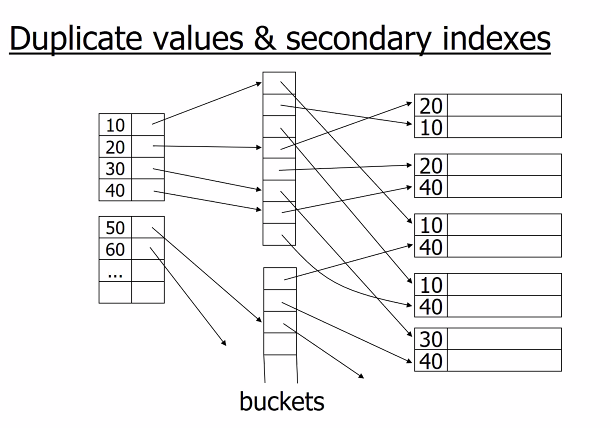

# application view of  a relational database 

- persistent data structure
  - large volume of data
  - independent from processes using the data

- Transaction management(ACID)
  - Atomicity: all or none happens,despite failure,errors
  - concurrency
  - isolation: one at a time
  - durability: recovery from failures and errors

# data  structure: relation model
- relational databases
- scheme
  - collection of tables
  - each table has a set of attributes
  - no repeating relation names, no repeating attributes in one table
- data
  - set of tuples
  - tuples have one value for each attribute of the table they belong

# primary keys and foreign keys
- primary key:unique

# programming interface
- jdbc/odbc

# hardware & physical organization
  

# memory hierarchy
- cache hierarchy
- ran
- disk
- tertiary storage

# colatile vs non-volatile
- persistence important for transaction atomicity and durability

# peculiarityes of storage mediums affect algorithm choice

- block-based access
- how many blocks were accessed not how many objects

- moore 's law:
- all improves, but at different speed
- dis transfer rate improves a lot
- disk access time improves less

# 2-phase merge sort: an algorithm tuned for blocks
- when considering block based storage,  algorithm we have learned may not always be the best.

  
  

  

# 2- phase merge sort : most files can bt sorted in just two passes.
  

# the records are packed row-oriented
  
- pack each block with maximum number of records
- do not reclaim deleted records:
  - when delete one record, just leave the space marked blank, not moving every record behind to the front
- utilize overflow blocks for insertion with out of order primary key
  -   
- a novel generation of databases features column storage
  - benefits when we only need to focus on a few columns of the records

# indexing 

## terms and distinctions
- primary index
  -  the index on the atribute that determines the sequencing of the table
-  secondary index
   -  index on any other attribute
-  dense index
   -  every value of the indexed attribute appears in the index
-  sparse index
   -  many values do not appear

## dense and sparse primary indexes
  

## multi-level indexes
- treat the index as a file and build an index on it
- two levels are usually sufficient.More than three levels are rare.
- Can we build a dense second level index fro a dense index?

## a note on pointers
- record pointers consist of block pointer and postion of record in the block

## representation of duplicate values in primary indexes.

## deletion from dense index
- deletion from dense primary index file with no duplicate values is handled in the same way with deletion from a sequential file

## deletion from sparse inde
- if the deleted entry does not appear in the index do nothing.
- if the deled 

## duplicate values & secondary indexes
  

## why bucket + record pointers is useful
- enables the processing of queries working with pointers only
- very common technique in information retrieval

## advantage of buckets: processing queries using pointers only
  

## b+ tree - another kind of index
  

  

### size of nodes:
-  n+1 pointers
-  n data

### b+ tree rules
1. all leaved at same lowest level (balanced)

