# application view of  a relational database 

- persistent data structure
  - large volume of data
  - independent from processes using the data

- Transaction management(ACID)
  - Atomicity: all or none happens,despite failure,errors
  - concurrency
  - isolation: one at a time
  - durability: recovery from failures and errors

# data  structure: relation model
- relational databases
- scheme
  - collection of tables
  - each table has a set of attributes
  - no repeating relation names, no repeating attributes in one table
- data
  - set of tuples
  - tuples have one value for each attribute of the table they belong

# primary keys and foreign keys
- primary key:unique

# programming interface
- jdbc/odbc

# SQL language
- selection $\sigma$: select tuples that satisfy the condition
- projection $\pi$ : return a table that only has the attribute
  - set version: no duplicate tuples
  - bag version: allow duplicates
- cartesian product $x$: the schema of the result has all attributes of both R and S

## duplicates and nulls
- Duplicate eliminationmust be explicitly requested (distinct)
- nulls:all aggregation operations, except count, ignore NULL values

# hardware & physical organization
  

# memory hierarchy
- cache hierarchy
- ran
- disk
- tertiary storage

# volatile vs non-volatile
- persistence important for transaction atomicity and durability

# peculiarities of storage mediums affect algorithm choice

- block-based access
- how many blocks were accessed not how many objects
- Flash is different on reading Vs writing
- Accessing consecutive blocks costs less

- moore 's law:
- all improves, but at different speed
- dis transfer rate improves a lot
- disk access time improves less

# 2-phase merge sort: an algorithm tuned for blocks
- when considering block based storage,  algorithm we have learned may not always be the best.

  

  

  

# 2- phase merge sort : most files can be sorted in just two passes.
  

# the records are packed row-oriented 
- pack each block with maximum number of records
- do not reclaim deleted records:
  - when delete one record, just leave the space marked blank, not moving every record behind to the front
- utilize overflow blocks for insertion with out of order primary key
-  
  -   
- a novel generation of databases features column storage
  - benefits when we only need to focus on a few columns of the records

# indexing 
## definition
- Data structure used for quickly locating tuples that meet a specific type fo condition

## evaluation
- access time
- insertion time
- deletion time
- disk space needed

# conventional index
## terms and distinctions
- primary index
  -  the index on the attribute that determines the sequencing of the table
-  secondary index
   -  index on any other attribute
-  dense index
   -  every value of the indexed attribute appears in the index
-  sparse index
   -  many values do not appear

## dense and sparse primary indexes
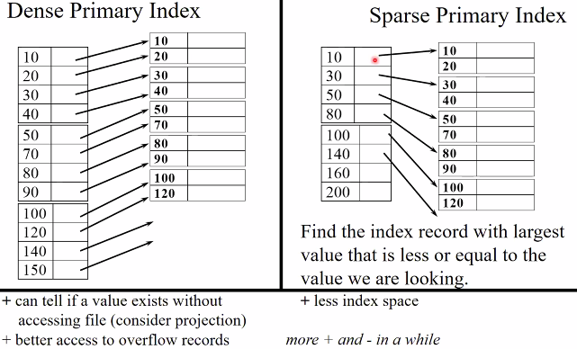  

## sparse vs dense tradeoff
- sparse: Less index space per record can keep more of index in memory,better for insertions
- dense: Can tell if any record exists without accessing file,needed for secondary indexes

## multi-level indexes
- treat the index as a file and build an index on it
- two levels are usually sufficient.More than three levels are rare.
- Can we build a dense second level index for a dense index?

## a note on pointers
- record pointers consist of block pointer and position of record in the block
- Using the block pointer only, saves space at no extra disk accesses cost
- But a block pointer cannot serve as record identifier

## representation of duplicate values in primary indexes.
  
## deletion from dense index
- deletion from dense primary index file with no duplicate values is handled in the same way with deletion from a sequential file
  

## deletion from sparse index
- if the deleted entry does not appear in the index do nothing.
  

- if the deleted entry appears in the index replace it with the next search-key value

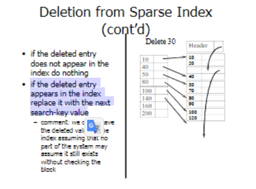  

- unless the next search key value has its own index entry. In this case delete the entry
  

## insertion in sparse index
- if no new block is created then do nothing
  
- else create overflow record
  

## secondary indexes
- file not sorted on secondary search key
- First level has to be dense,
next levels are sparse (as usual)
  

## duplicate values & secondary indexes
- one option
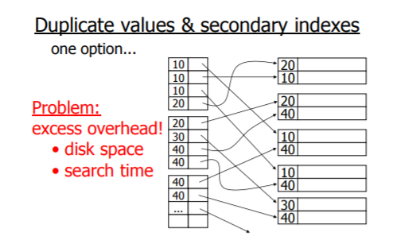  

- another option: lists of pointers
  

- yet another idea: chain records with same key
  

## why bucket + record pointers is useful
- enables the processing of queries working with pointers only
- very common technique in information retrieval

## advantage of buckets: processing queries using pointers only
  

## summary of conventional index
- Advantages
  - simple algorithms
  - index is sequential file
- Disadvantages
  - eventually sequentiality is lost because of overflows, reorganizations are needed

# b+ tree - another kind of index
  

- sample of non-leaf node

  
- sample of leaf node

  

- another kind of notation

  

### size of nodes:
-  n+1 pointers
-  n keys

### b+ tree rules
1. all leaves at same lowest level (balanced)
2. Non-root nodes have to be at least half-full
   1. Non-leaf: ceil[(n+1)/2]pointers
   2. Leaf: floor[(n+1)/2] pointers to data
3. Pointers in leaves point to records except for “sequence pointer”

## B+ tree deletions in practice
- often, coalescing is not implemented
  - To hard and not worth it

- LRU is not a gool policy for b+tree  
 buffers 
  - should try to keep root in memory at all times

# hashing schemes
## hashing
- hashing function h returns the address of bucket
- if the keys for a specific hash value do not fit into one page the bucket is a linked list of pages
  

- Example hash function
  

- good hash function L: expected number of keys is the same for all buckets

- within a bucket:
  -  do we keep keys sorted?
  - Yes, if CPU time critical & Inserts/Deletes not too frequent

  
  

- Rule of thumb
- Try to keep space utilization between 50% and 80%
- if > 80, overflows significant depends on how good hash function on # keys

- how do we cope with growth
  - overflows and reorganizations
  - dynamic hashing
    - extensible
    - linear

Extensible hashing: two ideas
1. use i of b bits output by hash function
  

2. use directory

  
  
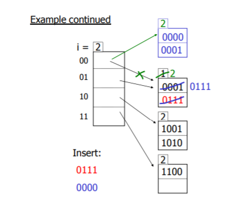  

  

Extensible hashing :deletion
1. no merging of blocks
2. merge blocks and cut directory if possible(reverse insert procedure)

## summery Extensible hashing
- can handle growing files
  - with less wasted space
  - with no full reorganization
- indirection
- directory doubles in size

## linear hashing
- another dynamic hashing scheme

### Two ideas
1. usr i **low** order bits of hash
2. file grows linearly

  

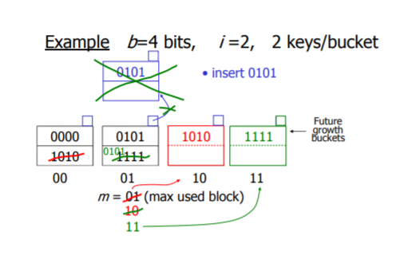  

  

When do we expand file 
- keep track of $\frac{number \ of \  used \ slots}{total \ slots \ in \ primary \ buckets} = U$
- if U > threshold then increase M (and i,when m reaches 2**i)

## summery linear hashing
- can handle growing files
  - with less wasted space
  - with no full reorganization
- not indirection like extensible hashing
- can still have overflow chains

  

## index vs hashing
- hashing good for probes given key
  - e.g select * from R where R.A = 5
- indexing good for range searches
  - e.g select* from R where R.A >5

# index
## note 
- CANNOT SPECIFY TYPE OF INDEX (e.g. B-tree, Hashing, …) OR PARAMETERS (e.g. Load Factor, Size of Hash,...)
- ATTRIBUTE LIST -> MULTIKEY INDEX

## multi-key index
- e.g find records where DEPTE = "TOY" AND SALARY > 50K
### Strategy I:
- Use one index, say Dept.
- Get all Dept = “Toy” records and check their salary
### Strategy II:
- Use 2 Indexes; Manipulate Pointers

  

### Strategy III:
- Multiple Key Index
  
  

#### Interesting application
  
  

# Bit map indices: alternate structure,heavily used in OLAP

  

## 2nlogm compression
- naive solution needs mn bits,where m is number of distinct values and n is number of tuples.
- but there is just n 1's.
- bit encoding of sequence of runs
- 10 here means 1 one, 110 means 2 one
  
  

## insertion and deletion and miscellaneous engineering
- assume tuples are inserted in order
- deletion : do nothing
- insertion : in tuple t with value v is inserted,add one run in v's sequence( compact bitmap)

# query processing
- The query processor turns user queries and data modification commands into a query plan -a sequence of operations (or algorithm) on the database
  - from high level queries to low level commands

## relational algebra
- e.g. 

Select B,D
From R,S
Where R.A = “c” AND S.E = 2 AND R.C=S.C
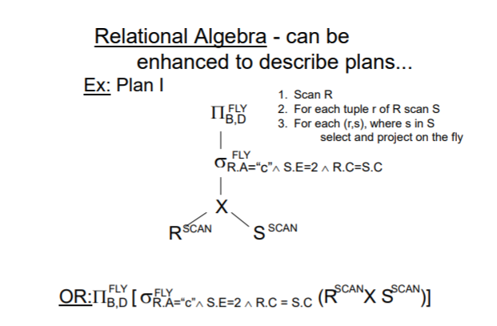  

  

  
  

### natural join
- SELECT t1.id,t2.id,desc1,desc2,desc3,desc4 FROM t1 INNER JOIN t2 ON t1.id = t2.id;
- equals
- SELECT t1.id,t2.id,desc1,desc2,desc3,desc4 FROM t1 NATURAL JOIN t2;
## from query to optimal plan
  

- Example: The Journey of a Query
  

  

## Algebraic Operators: A Bag version
- Union of R and S: a tuple t is in the result as many times as the sum of the number of times it is in R plus the times it is in S
- Intersection of R and S: a tuple t is in the result the minimum of the number of times it is in R and S
- Difference of R and S: a tuple t is in the result the number of times it is in R minus the number of times it is in S
- $\delta(R)$ converts the bag R into a set
- example
  
R union S = {a,a,b,b,b,c,c}
R - S = {B}
## extended projection
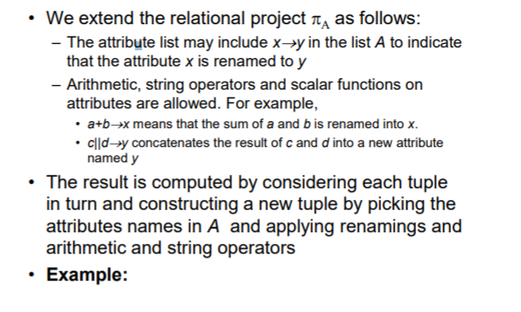  
SELECT 2*A AS D, B, C AS CPRIME FROM T
$\pi_{2*A -> D, B, C -> CPRIME} T$

## Cartesian Products => Joins
- Product of R and S (R$\times$S):
  - If an attribute named a is found in both schemas then
rename one column into R.a and the other into S.a
  - If a tuple r is found n times in R and a tuple s is found m
times in S then the product contains nm instances of the
tuple rs
- Joins
  - Natural Join R S = pA sC(RS) where
    - C is a condition that equates all common attributes
    - A is the concatenated list of attributes of R and S with no
duplicates
    - you may view tha above as a rewriting rule
  - Theta Join
      - arbitrary condition involving multiple attributes
      - $R \theta_{condition} S = \sigma_{condition} (R \times S)$

1. Equi JOIN
    1. NATURAL
    2. USING(a,b)
    3. =
    ...
2. Theta JOIN
    1. &gt;=
    2. &lt;=
    3. &gt;
    4. ...

R(A, B, C),S(A, B, D)

$R \bowtie S = \pi_{R.A -> A, R.B-> B, C, D} \sigma_{R.A=S.A AND R.B = S.B}{R \times S}$ 

## Grouping and Aggregation
  

## Grouping and Aggregation: An Alternate approach 
  

SELECT Dept, AVG(Salary) AS AvgSal FROM EmployeeGROUP BY DeptHAVING , SUM(Salary) >100
$\pi_{Dept, AvgSal} \sigma_{SumSal > 100}\gamma_{Dept; ,AVG(Salary) --> AvgSal, SUM(Salary) -->SumSal} ( Employee)$
## Sorting and Lists
- lists:ordered
- bags: not ordered
  

# Relational algebra optimization
## Algebraic Rewritings: Commutativity and Associativity
  
  

## Algebraic Rewritings for Selection: Decomposition of Logical Connectives
  
No
## Pushing the Selection Thru Binary Operators: Union and Difference
  
## Pushing Selection thru Cartesian Product and Join
  

## Pushing Simple Projections Thru Binary Operators
  

## Pushing Simple Projections Thru Binary Operators: Join and Cartesian Product
  

## Notes
- No transformation is always good at the l.q.p level
- Usually good:
  - early selections
  - elimination of cartesian products
  - elimination of redundant subexpressions
- Many transformations lead to “promising” plans
  - Commuting/rearranging joins
  - In practice too “combinatorially explosive” to be handled as rewriting of l.q.p.

# Algorithms for Relational Algebra Operators
- Three primary techniques
  - Sorting
  - Hashing
  - Indexing
- Three degrees of difficulty
  - data small enough to fit in memory
  - too large to fit in main memory but small enough to be handled by a “two-pass" algorithm
  - so large that “two-pass” methods have to be generalized to “multi-pass” method (quite unlikely nowadays)

## The dominant cost of operators running on disk:
- Count # of disk blocks that must be read (or written) to execute query plan

- additional parameters:
  

- Clustering index

  

# Pipelining 
  

## Example
- $R1 \bowtie R2$
- Iteration join (conceptually – without
  taking into account disk block issues)
  

- Merge join (conceptually)
  

- Procedure Output-Tuples(Deal with duplicate values)

  

Join with index (Conceptually) 
  

- Hash join

  

# Disk-oriented Computation Model
  

## notation
  

## One-Pass Main Memory Algorithms for Unary Operators
  

## One-Pass Nested Loop Join
  

## Generalization of Nested-Loops
  

## Simple Sort-Merge Join
  
- Cost:
- totally： 5 B(R) + 5 B(S)
- sorting:  4 B(R) + 4 B(S)
## Efficient Sort-Merge Join
  
- ignore phase 2
- totally 3 B(R) + 3 B(S)
### Example

## Two-Pass Hash-Based Algorithms
  

## Hash-Join Algorithms
 
- totally 3 B(R) + 3 B(S)

## Index-Based Join: The Simplest Version
  

## Opportunities in Joins Using Sorted Indexes

- Estimating cost of query plan
  - Estimating sizeof results
  - Estimating # of IOs
  

- Example
  

- Size estimates for $W=R 1 \times R 2$
  - $\mathrm{T}(\mathrm{W})=\mathrm{T}(\mathrm{R} 1) \times \mathrm{T}(\mathrm{R} 2)$
  - $S(W)=\quad S(R 1)+S(R 2)$
- Size estimate for $\mathrm{W}=\sigma_{\text {z=val }}(\mathrm{R})$
  - $S(W)=S(R)$
  - $\mathrm{T}(\mathrm{W})=\frac{\mathrm{T}(\mathrm{R})}{\mathrm{V}(\mathrm{R}, \mathrm{Z})}$
- Size estimate for $\mathrm{W}=\sigma_{\mathrm{z} \geq \mathrm{val}}(\mathrm{R})$
  - T(W) = 

  
  
  

- size estimate for $W=R 1 \bowtie R 2$
  
  

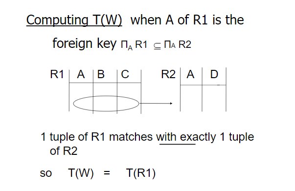  

  
  

- Example

  

  

# Arranging the Join Order: the Wong-Youssefi algorithm (INGRES)

## challenges with Large Natural Join Expressions

  
  

## Wong-Yussefi algorithm assumptions and objectives
  
  

# failure recovery

## Integrity or correctness of data
- Would like data to be “accurate” or“correct” at all times

## Integrity or consistency constraints
  

- Big working assumption:

If T starts with consistent state +T executes until completion & in isolationT leaves consistent state

## How can we prevent/fixviolations?Preview of the next episodes:
- Failure Recovery: fixing violations due to failures only•
- Concurrency Control: fixing violations due to concurrency & data sharing only
- finally a mix of the two: fixing violations that are stem from interaction of failures with sharing

# failure and recovery
## failure model
  

- Desired events:see product manuals
- Undesired expected events:
  - System crash
    - memory lost
    - cpu halts, resets

- Examples:
  - Disk data is lost
  - Memory lost without CPU halt
  - Skynet’sCPU decides to wipe out its programmers

  

  

  

  

## one solution: undo logging(immediate modify)
  

- one complication
  - Log is first written in memory
  - Not written to disk on every action
- two complication

## Undo logging rules
1. For every action generate undo log record (containing old value)
2. Before x is modified on disk, log records pertaining to  x must be on disk (write ahead logging: WAL)
3. Before commit is flushed to log, all writes of transaction must be reflected on disk

## Recovery rules
  
  

## redo logging rules
  
  
  
  

- solution: checkpoints
- 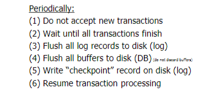  

## Key drawbacks:
- Undo logging:
  - cannot bring backup DB copies up to date,real writes at end of transaction needed
- Redo logging
  - need to keep all modified blocks in memory until commit

## recovery process

  

# concurrency control

- Want schedules that are “good”, I.e.,equivalent to serial regardless of
  - initial state
  - transaction semantics
- Only look at order of read and writes
- Example: SC=r1(A)w1(A)r2(A)w2(A)r1(B)w1(B)r2(B)w2(B)

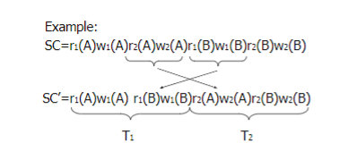  

  

  

  

## definition
- S1, S2 are conflict equivalent schedules if S1 can be transformed into S2 by a series of swaps on non-conflicting actions.
- A schedule is conflict serializable if it is conflict equivalent to some serial schedule.(T1- > T2)

## Precedence graphP(S)  (S is schedule)
- Nodes: transactions in S
- Arcs:  Ti Tj whenever
  - pi(A), qj(A) are actions in S
  - pi(A) <S qj(A)
  - at least one of pi, qj is a write

## lemma 
  

  

  

  

## How to enforce serializable schedules?
- Option 1: 
  - run system, recording P(S)
  - check for P(S) cycles and declare if execution was good
  - or abort transactions as soon as they generate a cycle
- prevent P(S) cycles from occurring 
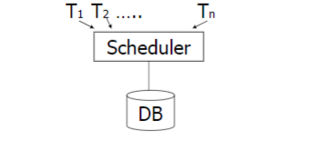  

## A locking protocol
  

  

  

  

  

  

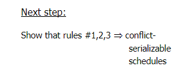  

  

  

  

  

  

  

  

  

  

  

## Lock types beyond S/X
Examples:
- (1) increment lock
- (2) update lock

  

  

  

  

  

  

  

  

- Still have a problem: Phantoms
  

## Tree-based concurrency control
  

  

  

  

  

## Validation-based Concurrency Control
  

  

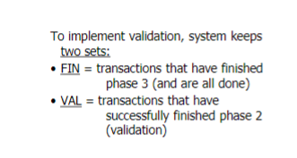  

  

  

  

  

  

  

  

# More on Concurrency Control and Recovery
- Cascading rollback, recoverable schedule
- Deadlocks
  - Prevention
  - Detection

  

  

  

  

  

  

## How to achieve recoverable schedules?
  

## Deadlocks
- Detection
  - Wait-for graph
- Prevention
  - Resource ordering
  - Timeout
  - Wait-die
  - Wound-wait

  

  

  

  

  

# Integration
  

  

  

  

  

  

  

  

  

  
