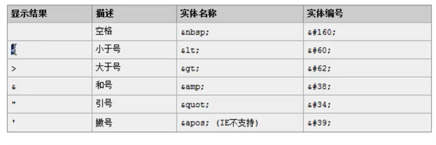

# html 的 基本结构
```html
<html>
    <head> 
    <!-- 包含title,css代码，js代码 -->
        <meta charset="UTF-8">  
        <title>8.iframe标签.html</title>
    </head>

    <body>
        <!-- 显示的主体内容 -->
    </body>
</html>
```

# html标签
- 单标签 《br /》 换行  《hr /》 水平线
- 双标签 《p》《/p》

# 常用标签
- 《font》 《/ font》 设置字体
- 常用转义
  

- 《h1》《/h1》 到 《h6》《/h6》  标题
- 《a》《/a》 超链接 target属性可以设置哪个窗口进行跳转
-   《ul》
  
    《li》列表项《/li》

    《/ul》 有序列表标签

- 《img》《/img》 图片标签 src设置路径
-   《table》
  
    《tr》

        《td》《/td》 单元格

    《/tr》行
  
    《/table》 表格
- 《iframe》《/iframe》  在一个页面中打开一个单独的页面

- 表单

```html
<form>
    <input> </input> <!--   各种输入模式       -->
    <select>
        <option>
        </option>
    </select> 下拉列表
</form>
```
- 《div》《/div》 div默认独占一行
- 《span》 《/span》  span长度决定于封装数据的长度
- 《p》 《/p》 p 段落标签， 默认会在段落的上方和下方各空出一行

# 表单格式化
```html
<form>
    <table>
    </table>
</form>
```
#  表单提交

《form  action = "www.baidu.com" method = "get"》

《/form》

- 需要提交的表单项需要有name
- 单选，复选，下拉列表中的option标签都要有value标签
- 表单项需要在form标签中

# get请求特点：
1. 浏览器地址栏的地址是 action属性[+?+请求参数] 请求参数的格式是name= value & name = value
2. 不安全
3. 有长度限制

# post请求特点：
1. 浏览器地址栏只有action属性
2. 相对于get安全
3. 理论上没有数据长度的限制

# CSS格式
```css
p{
    属性名：属性值
}
```

# CSS与html的结合方式
## 方式一
《div style = "border: 1px solid red;"》
## 方式二
```html
<html lang="en">
<head>
    <meta charset="UTF-8">
    <title>Title</title>
    <!--style标签专门用来定义css样式代码-->
    <style type="text/css">
        div{
            border: 1px solid red;
        }
    </style>
</head>

<body>
    <div>div标签1</div>
    <div>div标签2</div>
</body>
</html>
```
## 方式三
```html
<html lang="en">
<head>
    <meta charset="UTF-8">
    <title>Title</title>
    <!--link标签专门用来引入css样式代码-->
    <link rel="stylesheet" type="text/css" href="1.css"/>

</head>

<body>
    <div>div标签1</div>
    <div>div标签2</div>

    <span>span标签1</span>
    <span>span标签2</span>
</body>
</html>
```

# 标签名选择器
- 举例

```css
div{
    border: 1px solid red;
}
```

# id选择器
- 举例

```css
#id001{
    color: blue;
    font-size: 30px;
    border: 1px yellow solid;
}
```

# class选择器
- 举例

```css
.class01{
    color: blue;
    font-size: 30px;
    border: 1px yellow solid;    
}

# 组合选择器
- 举例
```css
.class01,#id001{
    color: blue;
    font-size: 30px;
    border: 1px yellow solid;    
}
```