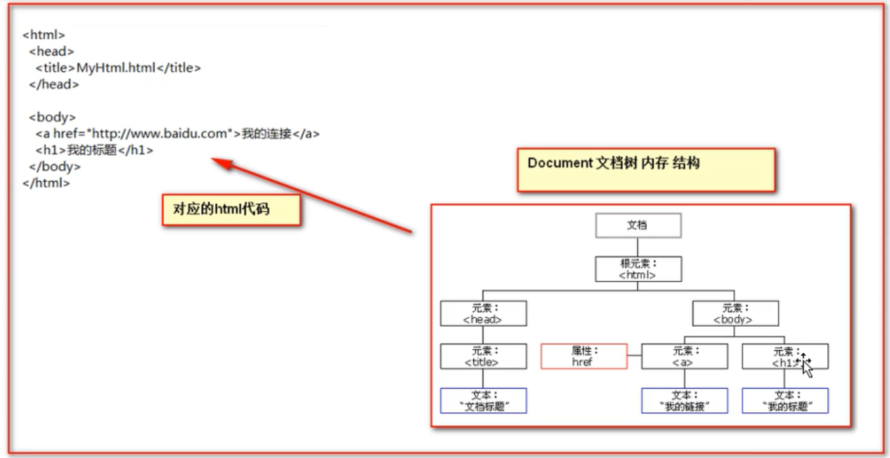

# javascript 与 html结合

## 方式一
```html
<!DOCTYPE html>
<html lang="en">
<head>
    <meta charset="UTF-8">
    <title>Title</title>
    <script type="text/javascript">
        // alert是JavaScript语言提供的一个警告框函数。
        // 它可以接收任意类型的参数，这个参数就是警告框的提示信息
        alert("hello javaScript!");
    </script>
</head>
<body>
</body>
</html>
```

## 方式二
```html
<!DOCTYPE html>
<html lang="en">
<head>
    <meta charset="UTF-8">
    <title>Title</title>
    <!--
        现在需要使用script引入外部的js文件来执行
            src 属性专门用来引入js文件路径（可以是相对路径，也可以是绝对路径）

        script标签可以用来定义js代码，也可以用来引入js文件
        但是，两个功能二选一使用。不能同时使用两个功能
    -->
    <script type="text/javascript" src="1.js"></script>
    <script type="text/javascript">
        alert("国哥现在可以帅了");
    </script>
</head>
<body>
</body>
</html>
```

# javascript 数据类型
- 数值类型 number
- 字符串类型 string
- 对象类型 object
- 布尔类型 boolean
- 函数类型 function
- undefined 默认值
- null 空值
- NAN 非数字 not a number

## typeof 函数
返回数据类型

# 关系运算
等于： == 字面值相同
全等于： === 字面值相同，数据类型也相同

# 逻辑运算
- &&，||，！
- 所有变量都可以看做boolean类型的变量
- false时，&&返回最第一个为假的值， true时，返回最后一个表达式的值
- false时，|| 返回最后一个表达式的值，true时，返回第一个为真的值

# 数组
``` js
var arr1 = []
var arr2 = [1,2,3]
```

# 函数
## 方式一
```js
function fun(){
    alert("1");
}
fun();
```

## 方式二
```js
var fun1 = function（）{
    alert("2");
}
fun1();
```

## js函数不允许重载，会被最新的function替代

## 隐形参数
```js
function fun1(){
    alert(arguments[0]);
    alert(arguments[1]);
}
```
# 自定义对象
## obj形式
```js
var 变量名 = new Object();
变量名.属性名 = 值；
变量名.函数名 = function(){}；
```

## 花括号形式
```js
var 变量名 = {
    属性名： 值,
    函数名： function(){}
};
```

# 事件

## onload 加载完成
### 静态注册事件
```html
<body onload = "alert(1);"></body>
<body onload = "func1();"></body>
```
### 动态注册事件
```js
window.onload = function(){};
```
## onclick 单击
### 静态注册事件
```html
<button onclick = "func1();"></button>
```
### 动态注册事件
```js
window.onload = function(){
    var btnobj = document.getElementbyId("btn01");
    btnobj.onclick = function(){};
};
```
## onblur 失去焦点
- 类似onload
## onchange 内容发生改变
- 类似onload
## onsubmit 表单提交
- 类似onload
- return false可以阻止表单提交

# dom模型
- document object model
- 把标签，属性，文字转化为对象来管理

  

```java
class Dom{
private String id; // id 属性
private String tagName; //表示标签名
private Dom parentNode; //父亲
private List<Dom> children; // 孩子结点
private String innerHTML; // 起始标签和结束标签中间的内容
}
```

# document 对象方法
- getElementById()
- getElementByName()
- getElementByTagName()
- 以上优先级从高到低
- 要在页面加载之后进行

- childNodes：属性，获取当前节点的所有子节点
- firstChild：属性，获取当前节点的第一个子节点
- lastChild：属性，获取当前节点的最后一个子节点
- parentNode：属性，获取当前节点的父节点
- nextSibling：属性，获取当前节点的下一个节点
- previousSibling：属性，获取当前节点的上一个节点
- className:用于获取或设置标签的 class 属性值
- innerHTML:属性，表示获取/设置起始标签和结束标签中的内容
- innerText:属性，表示获取/设置起始标签和结束标签中的文本

```js
window.onload = function(){
    var divObj = document.createElement("div") 
    // <div></div>
    div.innerHTML = "123";
    // <div>123 </div>
    document.body.appendChild(divObj);
}
```

```js
window.onload = function(){
    var divObj = document.createElement("div") 
    document.body.appendChild(divObj);

    var textObj = document.createTextNode("123");
    divObj.appendChild(textObj);
    document.body.appendChild(divObj);
}
```
