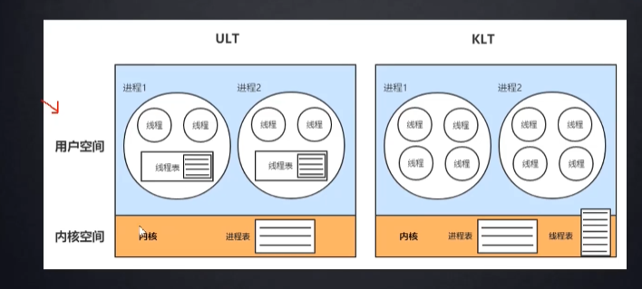

[toc]
# 线程池相关

## 两种线程模型
- 用户级线程： 不需要用户态，内核态切换，速度快，线程阻塞会引起进程阻塞
- 内核级线程： 线程阻塞不会引起进程阻塞
  

## 什么时候用线程池
- 单个任务处理时间比较短
- 需要处理的任务数量很大

## 线程池优势
- 减少线程创建，消亡的开销，提高性能
- 提高响应速度，当任务到达时，任务可以不需要等待到线程创建就能立即执行
- 提高线程的可管理性，可统一分配，调优和监控

```Java
public ThreadPoolExecutor(int corePoolSize,
                            int maximumPoolSize,
                            long keepAliveTime,
                            TimeUnit unit,
                            BlockingQueue<Runnable> workQueue,
                            RejectedExecutionHandler handler)
                            
```

## 线程池的基本原理
1. 线程优先给核心线程
2. 核心线程不够，放入等待队列
3. 等待队列放满，放入临时线程
4. 临时线程达到最大，启动拒绝策略
   - abort policy 报异常(默认)
   - discardpolicy 丢弃任务
   - callerrunsppolicy
   - discardoldestpolicy

## 线程池的五种状态
- running：能接受新任务以及处理已添加的任务
- shutdown：不接受新任务，可以处理已经添加的任务
- stop：不接受新任务，不处理已经添加的任务，并且中断正在处理的任务
- tidying：所有的任务已经终止，ctl记录的任务数量为0，ctl负责记录线程池的运行状态与活动线程数量
- terminated：线程池彻底终止，则线程池转变为terminated状态

```java
    private final AtomicInteger ctl = new AtomicInteger(ctlOf(RUNNING, 0));
    private static final int COUNT_BITS = Integer.SIZE - 3;
    private static final int COUNT_MASK = (1 << COUNT_BITS) - 1;

    // runState is stored in the high-order bits
    private static final int RUNNING    = -1 << COUNT_BITS;
    private static final int SHUTDOWN   =  0 << COUNT_BITS;
    private static final int STOP       =  1 << COUNT_BITS;
    private static final int TIDYING    =  2 << COUNT_BITS;
    private static final int TERMINATED =  3 << COUNT_BITS;
```

- 高三位记录线程当前状态，剩余位记录活动线程数量