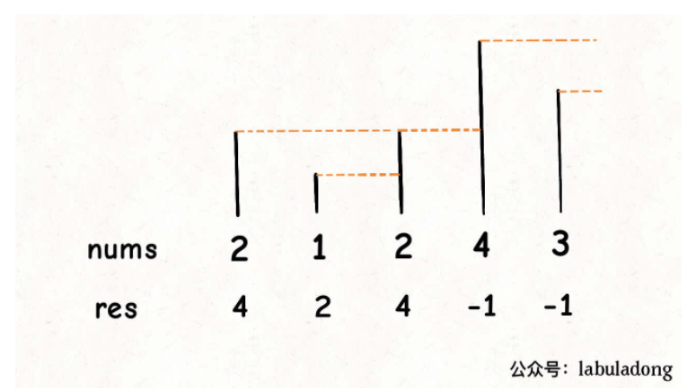

- 双指针不一定是o(n2) ,也可能是nlgn
- 困难题不要按照规则模拟,肯定超时
- 一定要注意移位运算符的优先级是最低的
```python 
class Solution:
    def networkDelayTime(self, times: List[List[int]], N: int, K: int) -> int:
        dp = [[float("inf") for j in range(N+1)] for i in range(N+1)]

        for i in range(1,N+1):
            dp[i][i] = 0

        for u,v,w in times:
            dp[u][v] = w

        for k in range(1,N+1):
            for i in range(1,N+1):
                for j in range(1,N+1):
                    dp[i][j] = min(dp[i][j],dp[i][k] + dp[k][j])

        ans = max(dp[K][1:])
        return ans if ans != float("inf") else -1
```
``` python
class Solution:
    def networkDelayTime(self, times: List[List[int]], N: int, K: int) -> int:
        cost = dict()
        visited = set()
        dp = [float("inf")]*(N+1)
        for u,v,w in times:
            if u not in cost:
                cost[u] = list()
            cost[u].append((v,w))

        cur = [(0,K)]

        while cur:
            mid_distance,u = heapq.heappop(cur)

            dp[u] = min(dp[u],mid_distance)
            visited.add(u)
            if u in cost:
                for v,w in cost[u]:
                    if v not in visited:
                        heapq.heappush(cur,(mid_distance+w,v))
        #     print(cur)
        # print(dp)
            
        return max(dp[1:]) if max(dp[1:]) != float("inf") else -1
```
```python
class Solution:
    def minCostConnectPoints(self, points: List[List[int]]) -> int:
        length = len(points)
        parents = [i for i in range(length)]
        def find(u):
            while parents[u] != u:
                parents[u] = parents[parents[u]]
                u = parents[u]
            return u
        def union(a,b):
            a,b = x
            pa = find(a)
            pb = find(b)
            if pa != pb:
                parents[pa] = pb

        def distance(x):
            return abs(points[x[0]][0]-points[x[1]][0])+abs(points[x[0]][1]-points[x[1]][1])
        pools = []
        for i in range(length):
            for j in range(i+1,length):
                pools.append([i,j])

        pools.sort(key = distance)
        count = 0
        for x in pools:
            a,b = x
            pa = find(a)
            pb = find(b)
            if pa != pb:
                parents[pa] = pb
                count += distance(x)

        return count
```

- 图的问题一定要想到visited数组
- 树的定义： 全部连通（并查集） +    边树+1== 节点数
- 树和图可以互相转换
- 数据量小于16考虑数位dp
- 若数据有明确上限和下限并且数据量很大考虑二分法
- 单调栈 ： 单调且按顺序  对于字符串，数组依次、连续的处理有用
- 对于明显的结果可以直接返回结果，有可能会减少复杂度
- 图的问题可以借用辅助点（虚点），比如gcd问题 以及有多个子图的问题
- 1 + n/2 + n/3 ..... 为调和级数，表面O(n2) ,实则为nlogn

- union-find 模板
```python
    length = len(points)
    parents = [i for i in range(length)]
    def find(u):
        while parents[u] != u:
            parents[u] = parents[parents[u]]
            u = parents[u]
        return u
    def union(a,b):
        a,b = x
        pa = find(a)
        pb = find(b)
        if pa != pb:
            parents[pa] = pb                    
```

- 二位数组的问题也可以看作图的问题使用unionfind以及最短路劲算法


- 找到一条从左上角到右下角的「最短路径」

常用的方法：

「二分答案」：我们可以对最短路径的长度进行二分。

「并查集」：我们可以将所有边按照长度进行排序并依次添加进并查集，直到左上角和右下角连通为止。

「最短路」：我们可以使用任一单源最短路径的算法，只需要在维护当前路径长度时，将其修改为题目中的定义即可。

树状数组：
单点修改，求前缀和
```python
    sum_ = [0]*(10**5+1)
    def lowbit(x):
        return x & (-x)
    def add(x,k):
        while x< 10**5+1:
            sum_[x] += k
            x += lowbit(x)
    def get(x):
        ret = 0
        while x >0:
            ret += sum_[x]
            x -= lowbit(x)
        return ret

```

- o(n) : 双指针，优先队列，unionfind，记忆化dfs，栈，队列，s
- o(nlogn): 二分，树状数组，排序
记忆化dfs需要先设置 dic[index] = float("inf"),之后if index in dic 才能正确运行，不会出现循环调用

- 向右跳无边界的题目有可能需要自定义常数

- 组合数计算
```c++
void pre(){
    for(int i = 0; i < 1001; i++) C[i][0] = C[i][i] = 1;
    for(int i = 1; i < 1001; i++) {
        for(int j = 1; j <= i; j++) {
            C[i][j] = (C[i - 1][j - 1] + C[i - 1][j]) % mod;
        }
    }      
}

```

- 整数分块

牛牛的数学老师教会了牛牛除法，牛牛十分开心，他知道任意一个正整数都可以表示为n = p\times k + mn=p×k+m (kk 为商，mm为余数) 的方式，现在死脑筋的牛牛想要计算对于小于等于nn的每一个数p(p\geq 1)p(p≥1)， 计算所有 k \times mk×m 的和。这可难倒了牛牛，请你来帮帮他吧。(由于答案可能过大，请对10^9+710 9+7取模)

$$\sum_{p=1}^{n}\lfloor n / p\rfloor *(n \bmod p)$$
$$\sum_{p=1}^{n}\lfloor n / p\rfloor *(n-\lfloor n / p\rfloor * p)$$

## 模板
```python
class Solution:
    def cowModCount(self , num ):
        # write code here
        const = 10 **9 + 7
        res = 0
        start = 1
        while start <= num:
            end = (num//(num//start))
            res += num * (num//start)*(end-start+1)
            res -= (num//start)* (num//start)*(end+start)*(end-start+1)//2
            start = end +1
            res %= const
        return res

```

# 单调栈模板（第一个比当前元素小的数）
  
```java
    int[] left = new int[numbers.length];
    LinkedList<Integer> stack = new LinkedList<>();
    LinkedList<Integer> stack1 = new LinkedList<>();
    stack.add(Integer.MAX_VALUE);
    stack1.add(-1);
    for (int i=0;i< numbers.length;i++){
        int num = numbers[i];
        while (num >= stack.getLast()){
            stack.removeLast();
            stack1.removeLast();
        }
        left[i] = stack1.getLast()+1;
        stack.add(num);
        stack1.add(i);
    }
```

- 求区间内max，min的问题可以逆向思维考虑每个元素是区间最大值的范围
