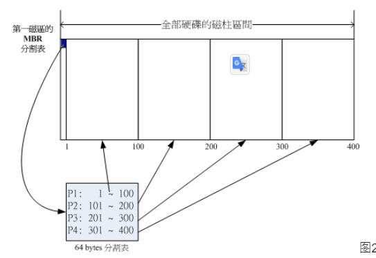
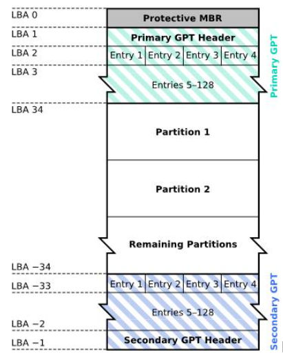
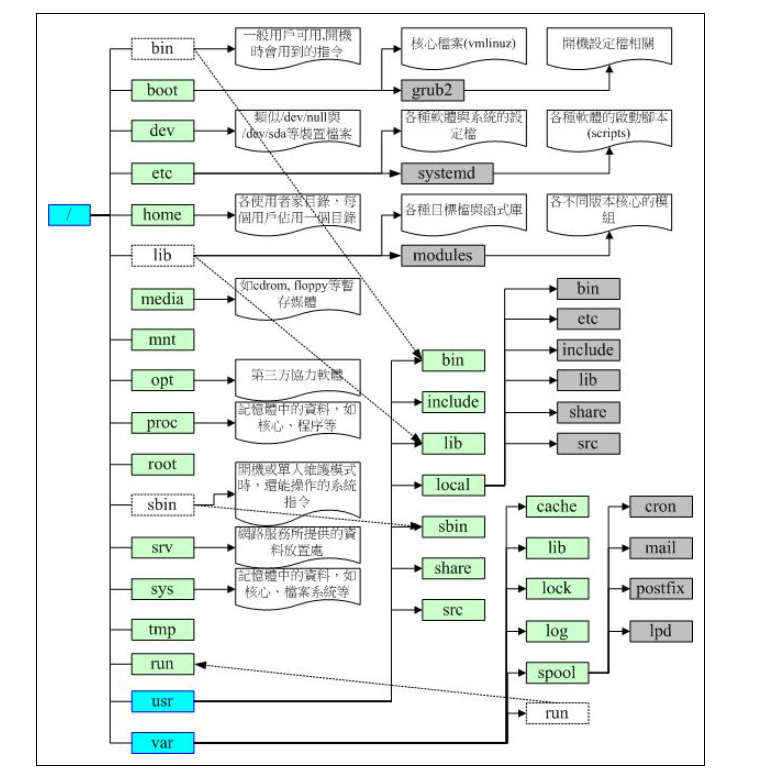
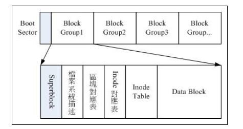
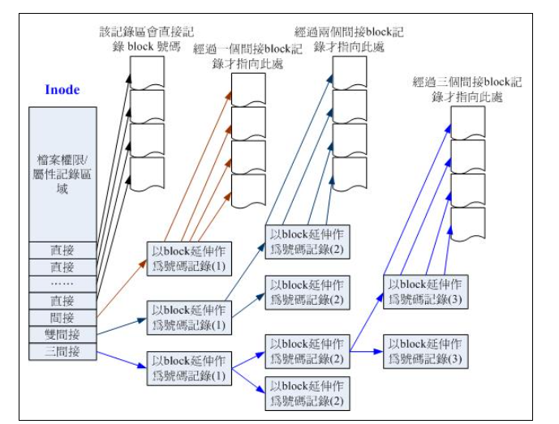

# MSDOS（MBR） 与 GPT 磁盘分区表（partition table）

## MSDOS （MBR） 分区
### 格式
- 主要开机记录区（Master Boot Record, MBR）：可以安装开机管理程序的地方，有446 Bytes
- 分区表（partition table）：记录整颗硬盘分区的状态，有64 Bytes

- 主要分区与延伸分区最多可以有四笔（硬盘的限制）
- 延伸分区最多只能有一个（操作系统的限制）
- 逻辑分区是由延伸分区持续切割出来的分区；
- 能够被格式化后，作为数据存取的分区为主要分区与逻辑分区。延伸分区无法格式化；
- 逻辑分区的数量依操作系统而不同，在Linux系统中SATA硬盘已经可以突破63个以上的分区限制；
  

### 限制
- 操作系统无法抓取到 2.2T 以上的磁盘容量！
- MBR 仅有一个区块，若被破坏后，经常无法或很难救援。
- MBR 内的存放开机管理程序的区块仅 446Bytes，无法容纳较多的程序码。

## GUID partition table, GPT 磁盘分区表
  
- 与 MBR 仅使用第一个 512Bytes 区块来纪录不同， GPT 使用了 34 个 LBA 区块来纪录分区信息
- GPT 除了前面 34 个 LBA 之外，整个磁盘的最后 33 个 LBA 也拿来作为另一个备份
- GPT 分区默认可以提供多达 128 笔纪录
- GPT 分区已经没有所谓的主、延伸、逻辑分区的概念，既然每笔纪录都可以独立存在， 当然每个都可以视为是主分区，每一个分区都可以拿来格式化使用

# 开机启动的流程
1. BIOS：开机主动执行的固件，会认识第一个可开机的设备；
2. MBR：第一个可开机设备的第一个扇区内的主要开机记录区块，内含开机管理程序；
3. 开机管理程序（boot loader）：一支可读取核心文件来执行的软件；
4. 核心文件：开始操作系统的功能...

# bootloader的主要任务
- 提供菜单：使用者可以选择不同的开机项目，这也是多重开机的重要功能！
- 载入核心文件：直接指向可开机的程序区段来开始操作系统；
- 转交其他loader：将开机管理功能转交给其他loader负责。

# 文件系统与目录树的关系（挂载）
- 所谓的“挂载”就是利用一个目录当成进入点，将磁盘分区的数据放置在该目录下； 也就是说，进入该目录就可以读取该分区的意思
- 设备与磁盘分区对应的关系，就是 windows 概念下的挂载

# linux目录配置的依据（FHS）

## 必须存在度目录
- /bin: 可以被root和一般用户使用的指令
- /boot: 开机会使用的文件
- /dev: 装置与周边设备
- /etc：系统主要的设定档： 比如账号和密码，各种服务的启动档，可以让一般使用者查阅，只有root用户可以修改
- /lib： 在开机时会使用的函数库，以及在/bin或/sbin底下的指令会呼叫的函式库。
- /media： 可移除的装置，比如光盘
- /mnt: 临时挂载的装置
- /opt: 给第三方软件放置的位置
- /run: 系统开机后所产生的各项资讯
- /sbin： 只有root才能用来使用的指令，其他使用者最多只能查询，比如开机，修复，还原系统的指令
- /srv: 一些网络服务启动后所需要取用的资料目录
- /tmp: 正在执行的程序临时放置文件的地方，任何人能存取，不能放重要资料
- /usr:可分享不可变动的，类似windows中window的一部分+program files
  - /usr/bin/： 一般用用户能使用的指令，相当于/bin
  - /usr/lib/： 基本上与/lib功能相同
  - /usr/local/： 在本机自行安装自己下载的软件
  - /usr/sbin/： 非系统正常运行所需要的系统指令，比如服务器的服务指令
  - /usr/share/： 几乎都是文字档案及共享文件
  - /usr/games/： 与问阿金相关的资料
  - /usr/include/： c和c++ 的header和include放置处
  - /usr/libexec/： 不被使用者惯用的脚本
  - /usr/lib<qual>/： /lib<qual>连接到这个目录
  - /usr/src/： 原始码放置的位置
- /var: 系统运行后才会逐渐占用硬盘容量的目录
  - /var/cache/： 程序运行的缓存
  - /var/lib/： 程序执行过程中需要是用的资料放置的位置
  - /var/lock/： 锁
  - /var/log/： 登录文件放置的位置
  - /var/mail/： 电子邮件的目录
  - /var/run/： 程序启动后的pid会放置到这个目录
  - /var/spool/： 放置一些排队等待其他程序使用的资料

## 建议可以存在的目录
- /home: 使用者家目录
- /lib<qual>: 用来存放和lib不同的格式的二进制函数库
- /root:root用户的家目录

## 其他目录
- /lost+found: 文件系统出现错误时，将一些遗失的片段放置到这个目录下
- /proc：本身是一个虚拟档案系统，放置记忆体中的资料
- /sys:类似proc

## 目录树
  

# 磁盘与档案系统管理
## 为什么要格式化磁盘
- 每种作业系统所设定的档案属性和权限不同

## indexed allocation 索引式档案系统
- inode: 记录档案的属性，一个档案占用一个inode，同时记录该档案的资料所在的block号码
- block： 记录实际档案的内容，一个档案可能占用多个block
- superblock: 记录文件系统的整体资讯，包括inode、block的总量，使用量，剩余量以及档案系统的格式
- inode和block规划好了，除非重新格式化，否则固定不再变动

  

## inode table
- 每个inode大小固定为128bytes
- 每个档案占用一个inode
- 能建立的档案数量与inode的数量有关
- 系统读取档案时先找到inode，分析inode所记录的权限与使用者是否相同，若符合才能开始实际读取block的内容

  

## superblock
- 记录整个filesystem相关资讯
- block与inode的总量
- 未使用inode，block数量
- block与inode大小
- filesystem挂载时间等系统相关资讯
- valid bit

## 目录树的读取（举例读取/etc/passwd）
1. /的inode
2. /的block
3. etc/ 的inode
4. etc/ 的block
5. passwd的inode
6. passwd的block

## 资料的不一致状态 - 日志式档案系统
- 产生原因： 断电，系统核心错误等
- 解决方法： 日志
  1. 当系统要写入一个档案时，先在日志记录区块中记录要写入的资讯
  2. 实际写入
  3. 在日志记录区块中完成档案的记录

## 挂载点的意义
- 将档案系统和目录树结合的动作叫做挂在
- 挂载点一定是目录，该目录为进入该档案系统的入口

- 同一个filesystem的某个inode只会对应到一个档案内容
- 可以通过inode号码来确认不同档名是否为相同的档案

## XFS档案系统
- EXT档案系统： 预先规划处inode。block metadata区域，格式化很慢,对于巨型档案效率低
- 资料区： 类似ext系统，包括inode，data block，superblock
- 档案系统活动登录区： 记录档案系统的变化，类似日志区

## 即时运作区
- 当有档案要被建立时，xfs会在这个区段里找到一个到数个extent区块，将档案放在这个区块内，等分配完毕后，在写入到data section的inode与block中。

## hard link
- 多个档名对应同一个inode
- 在某个目录下新增一个档名连接到某个inode号码的关联记录
- inode号码相同，有多少个档名连接到这个inode
- 优势： 安全，将任何一个档名删除，其实inode和block都还存在
- 缺点： 不能跨文件系统，不能link目录
### symbolic link
- 建立一个独立的档案，档案会让资料的读取指向他link的那个档案的档名
- 当来源被删除后，symbolic link的档案也会失效
- 优点： 限制较少

## 档案系统的挂载和卸载
- 挂载点是目录
- 这个目录是进入磁盘分割槽的入口
- 单一档案系统不应该重复挂载在不同的目录中
- 单一目录不应该重复挂载多个档案系统
- 要作为挂载点的目录，理论上应该是空目录，否则原目录底下的东西会暂时消失

