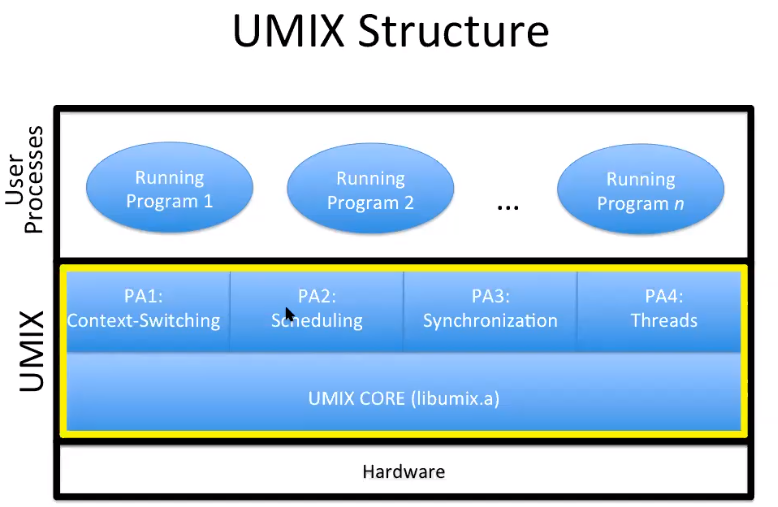  
# introduction
## what is an operating system
- software that makes computer easier to use
- improves the computer's capabilities
  - performance:speed,efficiency
  - reliability:correctness,fault tolerance
  - security: privacy,authenticity,integrity

## operating system vs. the Kernel
- our focus is much more limited:kernel

## two purposes of the kernel
- to provide abstract machine
- to manage resources

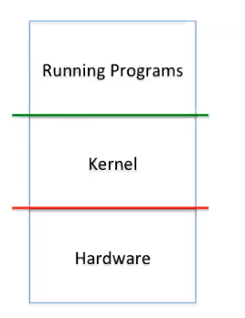  

## turn undesirable into desirable
- Undesirable inconveniences of	reality
  - Complexity	of	hardware	
  - Single/limited	number	of	processors	
- Small/limited	amount	of	memory	
- Desirable	conveniences:	illusions	
  - Simple,	easy-to-use	resources	
  - Multiple/unlimited	number	of	processors	
  - Large/unlimited	amount	of	memory	

## From	Programmer’s Point of View
- Algorithm/program	design is hard	enough!	
- Allow	programmer to focus	on algorithm design	
- Not how to make machine run the	algorithm	
- Minimize accounting for computer	limitations	
- Introduces unnecessary complexity	
- May lead to modifying	the	algorithm	
- May make the	program	not	portable	

## Three Key Ideas
- Abstraction	
  - What is	the	desired	illusion	
- Mechanism	
  - How	to create illusion:	basic	functionality	
  - Fixed: works one way, the only	way	
- Policy	
  - Which way to use mechanism, to meet a goal	
  - Variable: many possible, select	best for situation

# processes
## Basic	Resources	for	Processes
- CPU	
  - Processing	cycles	(time)	
  - To	execute	instructions	
- Memory	
  - Bytes	or	words	(space)	
  - To	maintain	state	
- Other	resources	(e.g.,	I/O)
## Context	of	a	Process
- Context:	machine	and	kernel-related	state	
- CPU	context:	values	of	registers	
  - PC	(program	counter)	
  - SP	(stack	pointer),	FP	(frame	pointer),	GP	(general)	
- Memory	context:	pointers	to	memory	areas	
  - Code,	static	variables	(init,	uninit),	heap,	shared,	…	
  - Stack	of	activation	records	
- Other	(kernel-related	state,	…)	

## Process	Memory	Structure
- Text	
  - Code:	program	instructions	
- Data	
  - Global	variables	
  - Heap	(dynamic	allocation)	
- Stack	
  - Activation	records	
  - Automatic	growth/shrinkage

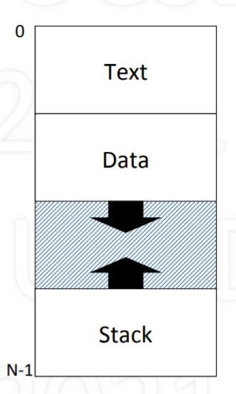  

## process stack
- Stack	of	activation	records	
  - One	per	pending	procedure	
- An	acitvation	record	may	store	
  - where	to	return	to	
  - link	to	previous	record	
  - automatic	(local)	variables	
  - other	(e.g.,	register	values)	
- Stack	pointer	points	to	top
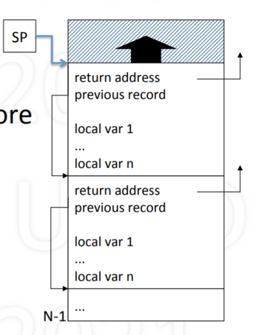  

## Goal:	Support	Multiple	Processes
## Multiprogramming
- Given	a	running	process	
  - At	some	point,	it	needs	a	resource,	e.g.,	I/O	device	
  - Say	resource	is	busy,	process	can’t	proceed	
  - So,	“voluntarily”	gives	up	CPU	to	another	process	
- yield	(p)	
  - Let	process	p	run	(voluntarily	give	up	CPU	to	p)	
  - Requires	context	switching

## Context	Switching
- Allocating	CPU	from	one	process	to	another	
  - First,	save	context	of	currently	running	process	
  - Next,	restore	(load)	context	of	next	process	to	run	
- Loading	the	context	
  - Load	general	registers,	stack	pointer,	etc.	
  - Load	program	counter	(must	be	last	instruction!)	

## Simple	Context	Switching
- Two	processes:	A	and	B
-  A	calls	yield(B)	to	voluntarily	give	up	CPU	to	B	
- Save	and	restore	registers	
  - General-purpose,	stack	pointer,	program	counter	
- Switch	text	and	data	
- Switch	stacks	
  - Note	that	PC	is	in	the	middle	of	yield!	

## The	magic	of	yield
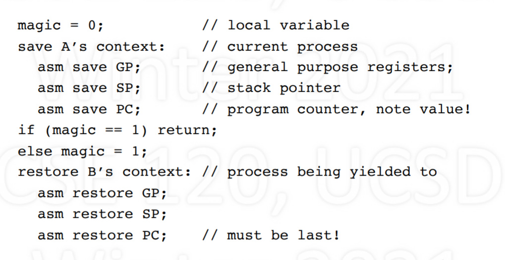  
## Example
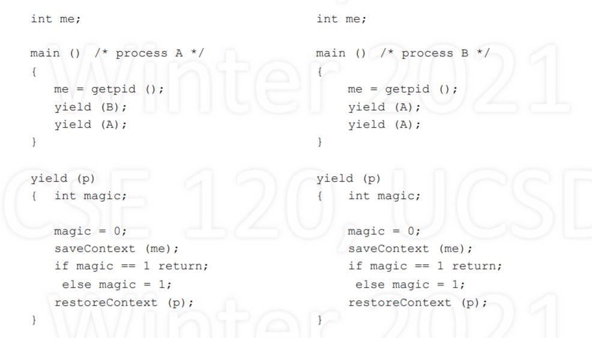  
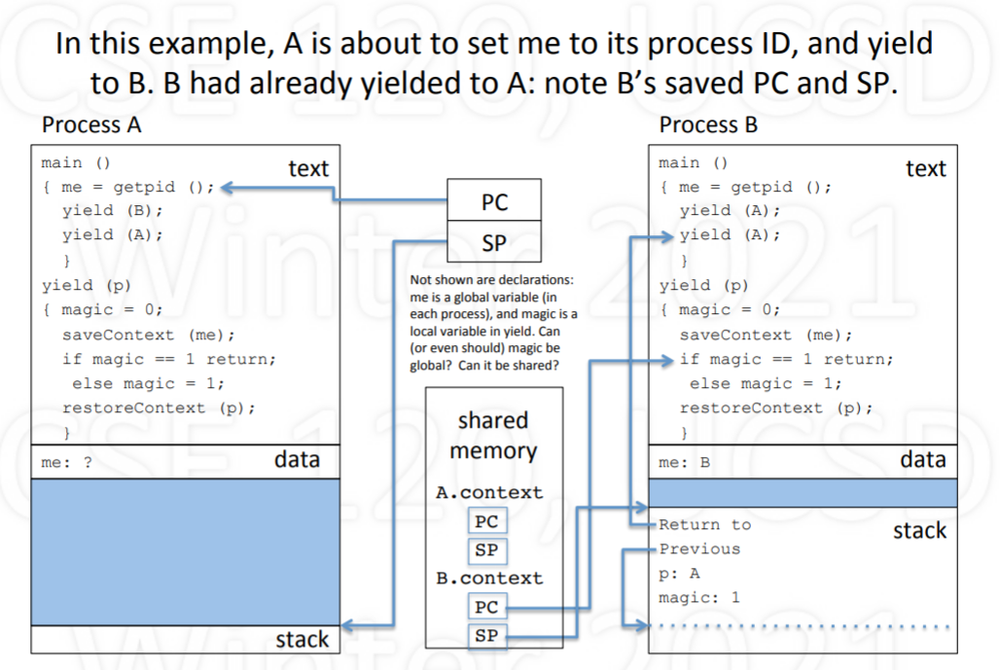  

## yielding via kernel
- yield	routine	is	common	code:	put	in	kernel	
- Process	contexts	are	also	in	the	kernel	
  - This	way	they	are	protected	
  - Only	needed	by	yield	routine	anyway	
- But	what	is	the	kernel?	
  - code	that	supports	processes	
  - runs	as	an	extension	of	current	process	
- Has	text,	data,	and	multiple	stacks

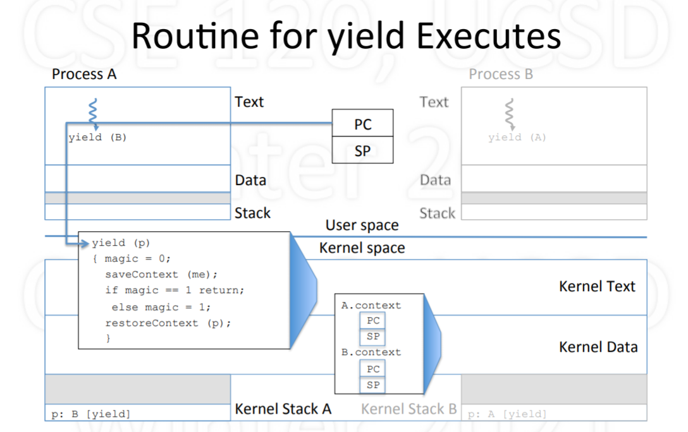  

# Timesharing
## time sharing
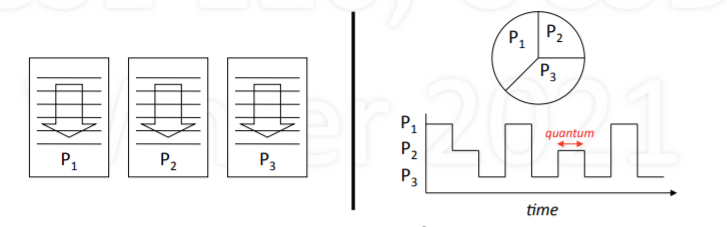  

- Timesharing:	multiplexing	use	of	CPU	over	time	
- Multiple	processes,	single	CPU	(uniprocessor)	
- Conceptually,	each	process	makes	progress	over	time	
- In	reality,	each	periodically	gets	quantum	of	CPU	time	
- Illusion	of	parallel	progress	by	rapidly	switching	CPU	

## How	is	Timesharing	Implemented?
- Kernel	keeps	track	of	progress	of	each	process	
- Characterizes	state	of	process’s	progress	
  - Running:	actually	making	progress,	using	CPU	
  - Ready:	able	to	make	progress,	but	not	using	CPU	
  - Blocked:	not	able	to	make	progress,	can’t	use	CPU	
- Kernel	selects	a	ready	process,	lets	it	run	
  - Eventually,	the	kernel	gets	back	control	
  - Selects	another	ready	process	to	run,	…	

## Process State Diagram
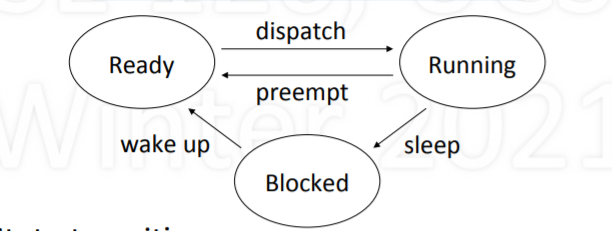  
State	transitions	
  - Dispatch:	allocate	the	CPU	to	a	process	
  - Preempt:	take	away	CPU	from	process	
  - Sleep:	process	gives	up	CPU	to	wait	for	event	
  - Wakeup:	event	occurred,	make	process	ready	

## Logical	vs.	Physical	Execution
  

## Process	vs.	Kernel
- Kernel:	code	that	supports	processes	
  - system	calls:	fork	(	),	exit	(	),	read	(	),	write	(	),	…	
  - management:	context	switching,	scheduling,	…
- When	does	the	kernel	run?	
  - when	system	call	or	hardware	interrupt	occurs	
- The	kernel	runs	as	part	of	the	running	process	
  - due	to	that	process	having	made	a	system	call	
  - in	response	to	device	issuing	interrupt	

## Process	Running	in	User	Space
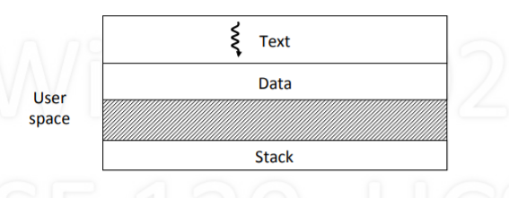  

## Process	Running	in	Kernel	Space
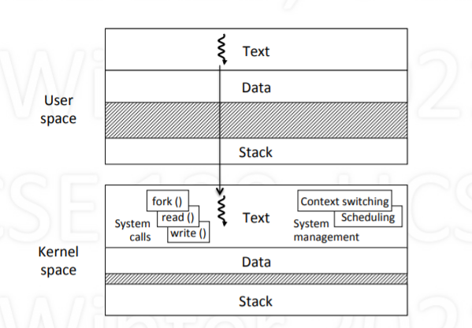  

## Kernel	Maintains	List	of	Processes
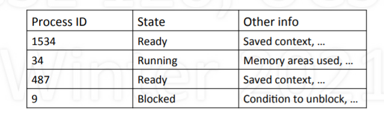  
- All	processes:	unique	names	(IDs)	and	states	
- Other	info	kernel	needs	for	managing	system	
  - contents	of	CPU	contexts	
  - areas	of	memory	being	used	
  - reasons	for	being	blocked	

- How	Does	Kernel	Get	Control	
  - Process	can	give	up	control	voluntarily	
  - Makes	system	call	that	blocks,	e.g.,	read	()	
  - System-call	function	calls	yield	()	to	give	up	CPU	
  - Kernel	selects	a	ready	process,	dispatches	it	
- Or,	CPU	is	forcibly	taken	away:	preemption	
  - Interrupt	generated	when	hardware	timer	expires	
  - Interrupt	forces	control	to	go	to	kernel	
  - While	kernel	running,	resets	timer	for	next	time

## How	a	Context	Switch	Occurs
- Process	makes	system	call	or	interrupt	occurs	
  - What’s	done	by	hardware	
  - Switch	from	user	to	kernel	mode:	amplifies	power	
  - Go	to	fixed	kernel	location:	trap/interrupt	handler	
- What’s	done	in	software	(in	the	kernel)	
  - Save	context	of	current	process	
  - Select	a	process	that	is	ready;	restore	its	context	
  - RTI:	return	from	interrupt/trap

## How	to	Get	Parallelism	in	Process
- Process	is	a	“program	in	execution”	
  - assumed	(so	far)	a	single	path	of	execution	
  - in	a	memory	composed	of	text,	data,	stack	
- What	if	we	want	multiple	paths	of	execution?	
  - Single	text,	but	multiple	executions	in	parallel	
  - Single	data,	any	execution	can	see	others’	updates	
  - Need	separate	stacks:	one	per	ongoing	execution	
- Multiple	processes?		No	(separate	memories)

## Threads	
- Thread:	single	sequential	path	of	execution	
- Abstraction	is	independent	of	memory	
  - Contrast	to	process:	path	of	execution	+	memory	
- A	thread	is	part	of	a	process	
  - Lives	in	the	memory	of	a	process	
  - Distinction	allows	multiple	threads	in	a	process	
- To	the	user:	unit	of	parallelism	
- To	the	kernel:	unit	of	schedulability

- Implementing	Threads
- Thread	calls	are	system	calls	
  - ForkThread():	like	process	Fork()	but	for	threads	
  - Thread	system	call	functions	are	in	kernel	
- Thread	management	functions	are	in	kernel	
  - Thread	context	switching	
  - Thread	scheduling	
- Each	thread	requires	user	and	kernel	stacks	
- Kernel	can	schedule	threads	on	separate	CPUs

## Single	Process,	Mul6ple	Threads	
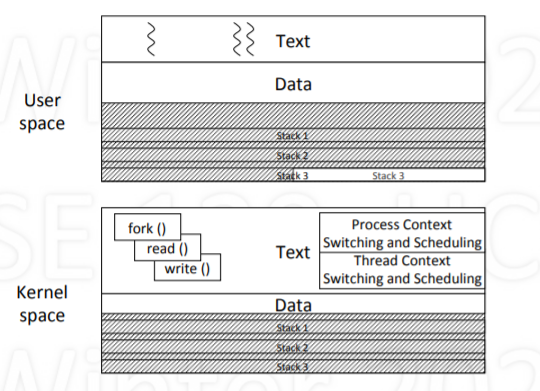  

## Many	Processes	with	Threads
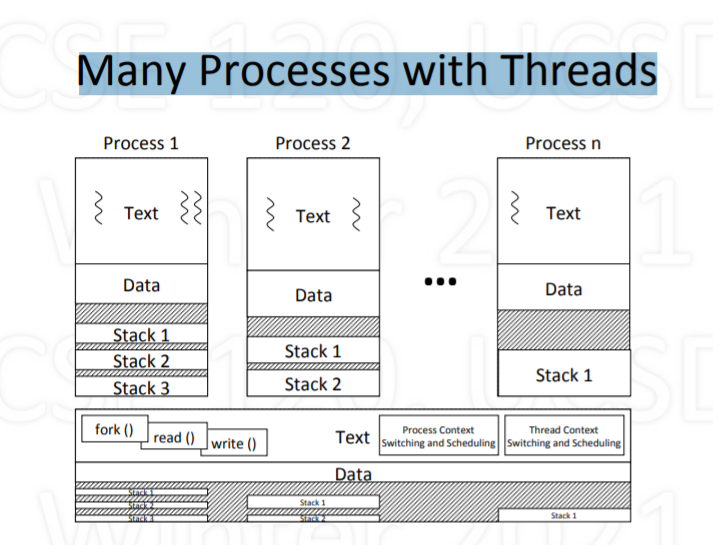  

## User-Level	Threads
- Can	support	threads	at	user	level	
- Included	via	thread	library	
- Thread	calls	at	user	level	
  - ForkThread	(),	YieldThread	(),	…	
- Thread	Management	at	user	level	
- Supports	threads	regardless	of	kernel	support	
- However,	no	true	parallelism	
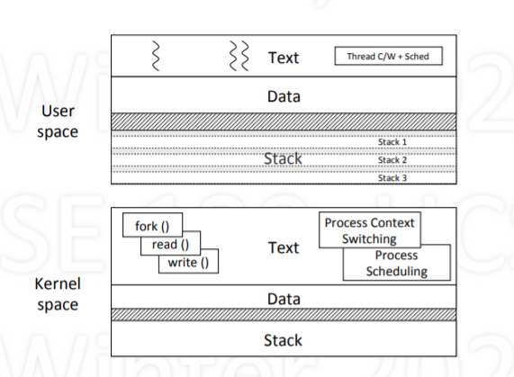  
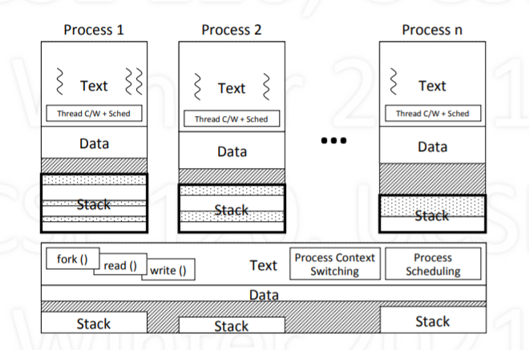  

## Pros	and	Cons
- User-level	threads	
  - Portability:	works	on	any	kernel	
  - Efficient:	thread-switching	occurs	in	user	space	
  - User	can	decide	on	scheduling	policy	
  - But	no	true	parallelism	(without	special	support)	
- Kernel-level	threads	
  - Can	achieve	true	parallelism	
  - Overhead:	thread	switch	requires	kernel	call	

## Thread	Support	vs.	Execution
- Distinguish	between	
  - Where	is	thread	abstraction	supported?	
  - Where	is	thread	executing?	
- User-level	vs.	kernel-level	threads	
  - Is	thread	support	part	of	user	or	kernel	code?	
- Running	in	user	space	vs.	kernel	space	
  - Is	thread	running	in	user	or	kernel	space?	
- Make	sure	you	understand	the	dis6nc6on!
