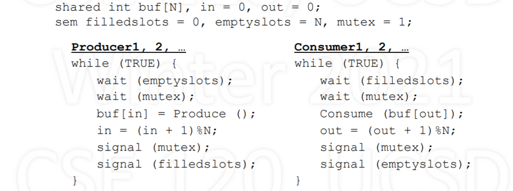
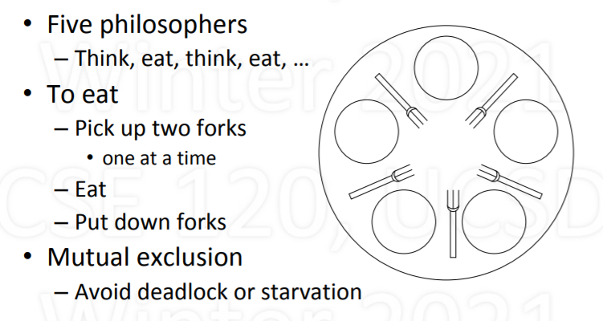

  
# introduction
## what is an operating system
- software that makes computer easier to use
- improves the computer's capabilities
  - performance:speed,efficiency
  - reliability:correctness,fault tolerance
  - security: privacy,authenticity,integrity

## operating system vs. the Kernel
- our focus is much more limited:kernel

## two purposes of the kernel
- to provide abstract machine
- to manage resources

  

## turn undesirable into desirable
- Undesirable inconveniences of	reality
  - Complexity	of	hardware	
  - Single/limited	number	of	processors	
- Small/limited	amount	of	memory	
- Desirable	conveniences:	illusions	
  - Simple,	easy-to-use	resources	
  - Multiple/unlimited	number	of	processors	
  - Large/unlimited	amount	of	memory	


## From	Programmer’s Point of View
- Algorithm/program	design is hard	enough!	
- Allow	programmer to focus	on algorithm design	
- Not how to make machine run the	algorithm	
- Minimize accounting for computer	limitations	
- Introduces unnecessary complexity	
- May lead to modifying	the	algorithm	
- May make the	program	not	portable	

## Three Key Ideas
- Abstraction	
  - What is	the	desired	illusion	
- Mechanism	
  - How	to create illusion:	basic	functionality	
  - Fixed: works one way, the only	way	
- Policy	
  - Which way to use mechanism, to meet a goal	
  - Variable: many possible, select	best for situation

# processes
## Basic	Resources	for	Processes
- CPU	
  - Processing	cycles	(time)	
  - To	execute	instructions	
- Memory	
  - Bytes	or	words	(space)	
  - To	maintain	state	
- Other	resources	(e.g.,	I/O)
## Context	of	a	Process
- Context:	machine	and	kernel-related	state	
- CPU	context:	values	of	registers	
  - PC	(program	counter)	
  - SP	(stack	pointer),	FP	(frame	pointer),	GP	(general)	
- Memory	context:	pointers	to	memory	areas	
  - Code,	static	variables	(init,	uninit),	heap,	shared,	…	
  - Stack	of	activation	records	
- Other	(kernel-related	state,	…)	

## Process	Memory	Structure
- Text	
  - Code:	program	instructions	
- Data	
  - Global	variables	
  - Heap	(dynamic	allocation)	
- Stack	
  - Activation	records	
  - Automatic	growth/shrinkage

  


## process stack
- Stack	of	activation	records	
  - One	per	pending	procedure	
- An	acitvation	record	may	store	
  - where	to	return	to	
  - link	to	previous	record	
  - automatic	(local)	variables	
  - other	(e.g.,	register	values)	
- Stack	pointer	points	to	top
  


## Goal:	Support	Multiple	Processes
## Multiprogramming
- Given	a	running	process	
  - At	some	point,	it	needs	a	resource,	e.g.,	I/O	device	
  - Say	resource	is	busy,	process	can’t	proceed	
  - So,	“voluntarily”	gives	up	CPU	to	another	process	
- yield	(p)	
  - Let	process	p	run	(voluntarily	give	up	CPU	to	p)	
  - Requires	context	switching

## Context	Switching
- Allocating	CPU	from	one	process	to	another	
  - First,	save	context	of	currently	running	process	
  - Next,	restore	(load)	context	of	next	process	to	run	
- Loading	the	context	
  - Load	general	registers,	stack	pointer,	etc.	
  - Load	program	counter	(must	be	last	instruction!)	

## Simple	Context	Switching
- Two	processes:	A	and	B
-  A	calls	yield(B)	to	voluntarily	give	up	CPU	to	B	
- Save	and	restore	registers	
  - General-purpose,	stack	pointer,	program	counter	
- Switch	text	and	data	
- Switch	stacks	
  - Note	that	PC	is	in	the	middle	of	yield!	

## The	magic	of	yield
  
## Example
  
  

## yielding via kernel
- yield	routine	is	common	code:	put	in	kernel	
- Process	contexts	are	also	in	the	kernel	
  - This	way	they	are	protected	
  - Only	needed	by	yield	routine	anyway	
- But	what	is	the	kernel?	
  - code	that	supports	processes	
  - runs	as	an	extension	of	current	process	
- Has	text,	data,	and	multiple	stacks

  


# Timesharing
## time sharing
  

- Timesharing:	multiplexing	use	of	CPU	over	time	
- Multiple	processes,	single	CPU	(uniprocessor)	
- Conceptually,	each	process	makes	progress	over	time	
- In	reality,	each	periodically	gets	quantum	of	CPU	time	
- Illusion	of	parallel	progress	by	rapidly	switching	CPU	

## How	is	Timesharing	Implemented?
- Kernel	keeps	track	of	progress	of	each	process	
- Characterizes	state	of	process’s	progress	
  - Running:	actually	making	progress,	using	CPU	
  - Ready:	able	to	make	progress,	but	not	using	CPU	
  - Blocked:	not	able	to	make	progress,	can’t	use	CPU	
- Kernel	selects	a	ready	process,	lets	it	run	
  - Eventually,	the	kernel	gets	back	control	
  - Selects	another	ready	process	to	run,	…	

## Process State Diagram
  
State	transitions	
  - Dispatch:	allocate	the	CPU	to	a	process	
  - Preempt:	take	away	CPU	from	process	
  - Sleep:	process	gives	up	CPU	to	wait	for	event	
  - Wakeup:	event	occurred,	make	process	ready	

## Logical	vs.	Physical	Execution
  

## Process	vs.	Kernel
- Kernel:	code	that	supports	processes	
  - system	calls:	fork	(	),	exit	(	),	read	(	),	write	(	),	…	
  - management:	context	switching,	scheduling,	…
- When	does	the	kernel	run?	
  - system	call
  - hardware	interrupt	occurs	
- The	kernel	runs	as	part	of	the	running	process	
  - due	to	that	process	having	made	a	system	call	
  - in	response	to	device	issuing	interrupt	

## Process	Running	in	User	Space
  

## Process	Running	in	Kernel	Space
  

## Kernel	Maintains	List	of	Processes
  
- All	processes:	unique	names	(IDs)	and	states	
- Other	info	kernel	needs	for	managing	system	
  - contents	of	CPU	contexts	
  - areas	of	memory	being	used	
  - reasons	for	being	blocked	

- How	Does	Kernel	Get	Control	
  - Process	can	give	up	control	voluntarily	
  - Makes	system	call	that	blocks,	e.g.,	read	()	
  - System-call	function	calls	yield	()	to	give	up	CPU	
  - Kernel	selects	a	ready	process,	dispatches	it	
- Or,	CPU	is	forcibly	taken	away:	preemption	
  - Interrupt	generated	when	hardware	timer	expires	
  - Interrupt	forces	control	to	go	to	kernel	
  - While	kernel	running,	resets	timer	for	next	time

## How	a	Context	Switch	Occurs
- Process	makes	system	call	or	interrupt	occurs	
- What’s	done	by	hardware	
  - Switch	from	user	to	kernel	mode:	amplifies	power	
  - Go	to	fixed	kernel	location:	trap/interrupt	handler	
- What’s	done	in	software	(in	the	kernel)	
  - Save	context	of	current	process	
  - Select	a	process	that	is	ready;	restore	its	context	
  - RTI:	return	from	interrupt/trap

## How	to	Get	Parallelism	in	Process
- Process	is	a	“program	in	execution”	
  - assumed	(so	far)	a	single	path	of	execution	
  - in	a	memory	composed	of	text,	data,	stack	
- What	if	we	want	multiple	paths	of	execution?	
  - Single	text,	but	multiple	executions	in	parallel	
  - Single	data,	any	execution	can	see	others’	updates	
  - Need	separate	stacks:	one	per	ongoing	execution	
- Multiple	processes?		No	(separate	memories)

## Threads	
- Thread:	single	sequential	path	of	execution	
- Abstraction	is	independent	of	memory	
  - Contrast	to	process:	path	of	execution	+	memory	
- A	thread	is	part	of	a	process	
  - Lives	in	the	memory	of	a	process	
  - Distinction	allows	multiple	threads	in	a	process	
- To	the	user:	unit	of	parallelism	
- To	the	kernel:	unit	of	schedulability

- Implementing	Threads
- Thread	calls	are	system	calls	
  - ForkThread():	like	process	Fork()	but	for	threads	
  - Thread	system	call	functions	are	in	kernel	
- Thread	management	functions	are	in	kernel	
  - Thread	context	switching	
  - Thread	scheduling	
- Each	thread	requires	user	and	kernel	stacks	
- Kernel	can	schedule	threads	on	separate	CPUs

## Single	Process,	Multiple	Threads	
  

## Many	Processes	with	Threads
  

## User-Level	Threads
- Can	support	threads	at	user	level	
- Included	via	thread	library	
- Thread	calls	at	user	level	
  - ForkThread	(),	YieldThread	(),	…	
- Thread	Management	at	user	level	
- Supports	threads	regardless	of	kernel	support	
- However,	no	true	parallelism	
  
  

## Pros	and	Cons
- User-level	threads	
  - Portability:	works	on	any	kernel	
  - Efficient:	thread-switching	occurs	in	user	space	
  - User	can	decide	on	scheduling	policy	
  - But	no	true	parallelism	(without	special	support)	
- Kernel-level	threads	
  - Can	achieve	true	parallelism	
  - Overhead:	thread	switch	requires	kernel	call	

## Thread	Support	vs.	Execution
- Distinguish	between	
  - Where	is	thread	abstraction	supported?	
  - Where	is	thread	executing?	
- User-level	vs.	kernel-level	threads	
  - Is	thread	support	part	of	user	or	kernel	code?	
- Running	in	user	space	vs.	kernel	space	
  - Is	thread	running	in	user	or	kernel	space?	
- Make	sure	you	understand	the	distinction!

# Scheduling
## There	is	No	Single	Best	Policy
Different	for	
– your	personal	computer	
– large	time-shared	computer	
– computer	controlling	a	nuclear	power	plant	

## Longest	First	vs.	Shortest	First
  

- Given	n	processes	with	service	times	S1,	…	,	Sn
  - Note:	processes	are	numbered	1,	2,	3,	…,	n	
-  Average	turnaround	time	computed	as	follows
   - [S1	+	(S1	+	S2)	+	(S1	+	S2	+	S3)	+	…	+	(S1	+	…	+	Sn)]	/	n	
   - [(n	×	S1)	+	((n-1)	×	S2)	+	((n-2)	×	S3)	+	…	+	Sn]	/	n
- In	general:	order	by	shortest	to	longest	

## Consider	Different	Arrival	Times
  

## FCFS:	First	Come	First	Served
  
- Average	turnaround	time	=	(5	+	7	+	7)/3	=	6.3	
- Non-preemptive,	simple,	no	starvation	
- Poor for short	processes	

## RR: Round	Robin
  
- Average	turnaround	time	=	(9	+	6	+	2)/3	=	5.7	
- Preemptive,	simple,	no	starvation	
- Process	waits	at	most	(n	-	1)	x	quantum	

## SPN:	Shortest	Process	Next
  
- Average	turnaround	time	=	(5	+	8	+	4)/3	=	5.7	
- Optimal	for	non-preemptive,	allows	starvation	
- Assumes	service	times	are	known	

## SRT:	Shortest	Remaining	Time
  
- Average	turnaround	time	=	(9	+	4	+	1)/3	=	4.7	
- Assumes	service	times	are	known	
- Optimal	for	preemptive,	but	allows	starvation	

## Multi-Level	Feedback	Queues
- Priority	queues:	0	(high),	…,	N	(low)	
- New	processes	enter	queue	0	
- Select	from	highest	priority	queue	
- Run	for	T	=	2k quantums
  -  Used	T:	move	to	next	lower	queue,	FIFO	
  -  Used	<	T:	back	to	same	queue,	RR	
-  Due	to	yield	or	higher	priority	arrival	
- Periodically	boost	(e.g.,	all	to	highest	queue)

  
  
- Average	Turnaround	Time	=	(9	+	6	+	1)/3	=	5.3	
- Complex,	adaptive,	highly	responsive	
- Favors	shorter	over	longer,	possible	starvation

## Priority	Scheduling
  
- Allows	scheduling	based	on	external	criteria	
  - E.g.,	priority	=	1/CPU_time_used,	or	=	f	(pay)	

## Fair	Share	(Proportional	Share)	
  
- Goal:	utilization	over	long	run,	actual	≈	request	
- How	do	we	determine	who	runs	each	quantum?	
- Select	process	with	minimum	actual/request	ratio	

## Stride	Scheduling	
- For	processes	A,	B,	C	…	with	requests	RA,	RB,	RC	…	
- Calculate	strides:	SA	=	1/RA,	SB	=	1/RB,	SC	=	1/RC	…	
- For	each	process	x,	maintain	pass	value	Px	(init	0)	
- Schedule:	repeat	every	quantum	
  - Select	process	x	with	minimum	pass	value	Px,	run	
  - Increment	pass	value	by	stride	value:	Px	=	Px	+	Sx
- Optimization:	use	only	integers	for	Rx,	Sx	and	Px		
  - Calculate	Sx	=	L/Rx	using	very	large	L,	e.g.,	L	=	100000

## Stride	Scheduling	Example
  


## Real	Time	Scheduling
- Correctness	of	real-time	systems	depend	on	
  - logical	result	of	computations	
  - and	the	timing	of	these	results	
- cType	of	real-time	systems	
  - Hard	vs.	soft	real-time	
  - Periodic	vs.	aperiodic
- Scheduling	
  - Earliest	Deadline	First	(EDF)	
  - Rate	Monotonic	Scheduling	(RMS)	

## Periodic	Processes	(or	Tasks)
  
- Periodic	processes:	computation	is	cyclic	
- For	each	process,	given	
  - C	=	CPU	burst,	T	=	period,	U	=	C/T	=	utilization	

## EDF:	Earliest	Deadline	First
  
- Schedule	process	with	earliest	deadline	
- If	earlier	deadline	process	appears,	preempt	
- Works	for	periodic	and	aperiodic	processes	
- Achieves	100%	utilization	(ignoring	overhead!)	
- Expensive:	requires	ordering	by	deadlines	

  

## RMS:	Rate	Monotonic	Scheduling	
  

- If	periodic	processes,	prioritize	based	on	rates	
- At	start	of	period,	select	highest	priority	
- Preempt	if	necessary	
- When	burst	done,	wait	till	next	period	
- If	U1	+	…	+	Un	≤		n	($2^{1 / n}$	–	1),	all	deadlines	met

### RMS	Test	Passes,	All	Deadlines	Met	
  

### RMS	Test	Fails,	Deadline	Missed
  

### RMS	Test	Fails,	But	Deadlines	Met
  

## RMS	Optimal	But	Limited
- RMS	is	simple	and	efficient	
  - Static	priority	scheduling	based	on	rates	
- RMS	is	optimal	for	static	priority	algorithms	
  - If	RMS	can’t	schedule,	no	other	static	priority	can	
- RMS	is	limited	in	what	it	guarantees	
  - Utilization	bounded	by	n	(21/n	–	1)	>	ln	2	≈	69%	
  - Deadline	guarantee	applies	only	if	test	passes	
- RMS	is	limited	to	periodic	processes	

## Summary
- CPU	scheduling	is	policy:	depends	on	goals


|  scheduling  | property  |
|  :---:  | :---:  |
| First	come	first	served | very	simple,	non-preemptive |
| Round	robin|simple,	preemptive |
| Shortest	process	next | theoretical,	non-preemptive |
| Shortest	remaining	time | theoretical,	preemptive	|
| Multi-level	feedback | adaptive,	responsive,	complex	|
| Priority| external	criteria |
| Fair	share | proportional	allocation	|
| Earliest	deadline	firs | 100%	utilization,	high overhead	|
| Rate	monotonic	sched | <	100% util,	low	overhead |


# Synchronization
## Synchronization
- Synchronize:	events	happen	at	the	same	time	
- Process	synchronization	
  - Events	in	processes	that	occur	“at	the	same	time”	
  - Actually,	when	one	process	waits	for	another	
-  Uses	of	synchronization	
   - Prevent	race	conditions	
   - Wait	for	resources	to	become	available

## The	Credit/Debit	Problem
- Say	you	have	$1000	in	your	bank	account	
- You	deposit	$100	
- You	also	withdraw	$100	
- How	much	should	be	in	your	account?	
-  What	if	deposit/withdraw	occur	at	same	time?

## Credit/Debit	Problem:	Race	Condition	
  

## To	Avoid	Race	Conditions
- Identify	related	critical	sections	
  - Section(s)	of	code	executed	by	different	processes	
  - Must	run	atomically,	with	respect	to	each	other	
- Enforce	mutual	exclusion	
  - Only	one	process	active	in	a	critical	section

## What	Does	Atomic	Really	Mean?
- Atomic	means	“indivisible”	
- We	seek	effective	atomicity	
  - can	interrupt,	as	long	as	interruption	has	no	effect	
-  It	is	OK	to	interrupt	process	in	critical	section	
  -  as	long	as	other	processes	have	no	effect	
- How	to	determine	
  - Consider	effect	of	critical	section	in	isolation	
  - Next	consider	interruptions:	if	same	result,	OK

## How	to	Achieve	Mutual	Exclusion?
- Surround	critical	section	with	entry/exit	code	
- Entry	code	should	act	as	a	barrier	
  - If	another	process	is	in	critical	section,	block	
  - Otherwise,	allow	process	to	proceed	
- Exit	code	should	release	other	entry	barriers

## Requirements	for	Good	Solution
- Given	multiple	cooperating	processes	
  - Each	process	has	a	critical	section	
  - All	critical	sections	are	to	be	mutually	exclusive	
1. At	most	one	in	a	critical	section	at	a	time	
2. Can’t	prevent	entry	if	all	others	not	in	theirs	
3. Should	eventually	be	able	to	enter	
4. No	assumptions	about	CPU	speed	or	number

## Software	Lock?
  
- Lock	indicates	if	any	process	in	critical	section

## Take	Turns?
  
- Alternate	which	process	enters	critical	section

## State	Intention?
  

- Process	states	intent	to	enter	critical	section

## Peterson’s	Solution
  
- If	competition,	take	turns;	otherwise,	enter	
- There	is	a	version	for	n	>	2;	more	complex

# What	about	Disabling	Interrupts?
- No	interrupts	⇒	no	uncontrolled	context	switches(just yield)
- No	uncontrolled	context	switches	⇒	no	races	
- No	races	⇒	mutual	exclusion	

# Test-and-Set	Lock	Instruction:	TSL
- TSL	mem	(test-and-set	lock:	contents	of	mem)
  - do atomically (i.e., locking the memory bus) [ test if mem == 0 AND set mem = 1 ]
- Operations	occur	without	interruption	
  - Memory	bus	is	locked	
  - Not	affected	by	hardware	interrupts

## What	TSL	Does,	Expressed	in	C	
Assume	C	function,	TSL(int	*),	that	is	atomic	
```c
TSL(int *lockptr)
{ 
  int oldval;
  oldval = *lockptr
  *lockptr = 1;
  return ((oldval == 0) ? 1 : 0);
} 
```
## Mutual	Exclusion	Using	TSL
  
- Shared	variable	solution	using	TSL(int	*)	
  - tests	if	lock	==	0	(if	so,	will	return	1;	else	0)	
  - before	returning,	sets	lock	to	1	
- Simple,	works	for	any	number	of	threads	
- Still	“suffers”	from	busy	waiting	

# Semaphores
- Synchronization	variable	
  - Takes	on	integer	values	
  - Can	cause	a	process	to	block/unblock	
- wait	and	signal	operations	
  - wait	(s) decrement;	block	if	<	0	
  - signal	(s) increment;	if	any	blocked,	unblock	one	
- No	other	operations	allowed	
  - In	particular,	cannot	test	value	of	semaphore!	

## Examples	and	Interpretation
- wait	(s) decrement;	block	if	<	0	
- signal	(s) increment;	if	any	blocked,	unblock	
- wait	(1) s	→	0 -	GO	
- wait	(0) s	→	-1 -	STOP	(i.e.,	block)	
- signal	(-1) s	→	0 -	GO	and	allow	one	to	GO	
- signal	(0) s	→	1 -	GO

## USAGE1:Mutual	Exclusion
  

## USAGE2: Order	How	Processes	Execute
  
- Cause	a	process	to	wait	for	another	
- Use	semaphore	indicating	condition;	initially	0	
  - the	condition	in	this	case:	“P0	has	completed”	
- Used	for	ordering	processes	
  - In	contrast	to	mutual	exclusion	

## Semaphore	Implementation
  

## Alternative	Implementation
  

## Wait	and	Signal	Must	Be	Atomic
- Bodies	of	wait	and	signal	are	critical	sections	
- So,	still	need	mechanism	for	mutual	exclusion!	
- Use	a	lower-level	(more	basic)	mechanism	
  - Test-and-set	lock	
  - Peterson’s	solution	
- So,	busy-waiting	still	exists	(can	never	remove)	
  - But	at	lower-level	(within	semaphore	operations)	
  - Occurrence	limited	to	brief/known	periods	of	time	

## Analysis:	Lower-Level	Busy	Waiting	
- A	calls	wait	(s),	switch	to	B,	B	calls	wait	(s)	
  - Switch	occurs	while	A	executing	body	of	wait	
- Body	of	wait	is	critical	section,	so	B	must	block	
  - Use	test-set	lock	or	Peterson’s:		busy	waiting	
- How	long	will	B	be	blocked?	
  - For	time	it	takes	to	execute	body	of	wait	
- Small/known	amount	of	time!	
  - Compare	to	user	critical	section:	unknown	time

## Are	These	Equivalent?
  

- no  implementation2 has bug in wait
- \+ and \- has to be finished in the first line


# InterProcess Communication	(IPC)
## Cooperating	Processes	
- Performance:	speed	
  - Exploit	inherent	parallelism	of	computation	
  - Allow	some	parts	to	proceed	while	others	do	I/O	
- Modularity:	reusable	self-contained	programs	
  - Each	may	do	a	useful	task	on	its	own	
  - May	also	be	useful	as	a	sub-task	for	others	

## Examples	of	Cooperating	Processes
  


## Inter-Process	Communication	
- To	cooperate,	need	ability	to	communicate	
- IPC:	inter-process	communication	
  - Communication	between	processes	
- IPC	requires	
  - data	transfer
  - synchronization	
- Need	mechanisms	for	both

- Semaphore is not IPC(no data transfer)

## Three	Abstractions	for	IPC
- Shared	memory	+	semaphores	
- Monitors	
- Message	passing	

## The	Producer/Consumer	Problem
  

- Producer	produces	data,	inserts	in	shared	buffer	
- Consumer	removes	data	from	buffer,	consumes	it

## Producer/Consumer:	Shared	Memory
  

- No	synchronization	
  - Consumer	must	wait	for	something	to	be	produced	
- What	about	Producer?	
  - No	mutual	exclusion	for	critical	sections	
  - Relevant	if	multiple	producers	or	multiple	consumers

## Recall	Semaphores
- Semaphore:	synchronization	variable	
  - Takes	on	integer	values	
  - Has	an	associated	list	of	waiting	processes	
-  Operations	
   - wait	(s) {	s	=	s–1;	block	if	s	<	0	}	
   - signal	(s) {	s	=	s+1;	unblock	a	process	if	any	}	
- No	other	operations	allowed	(e.g.,	can’t	test	s)

## Semaphores	for	Synchronization	
  
- Buffer	empty,	Consumer	waits	
- Buffer	full,	Producer	waits	
- General	synchronization	vs.	mutual	exclusion	


## Multiple	Producers
  
- There	is	a	race	condition	in	the	Producer	code	
- Inconsistent	updating	of	variables	buf	and	in	
- Need	mutual	exclusion	

## Semaphore	for	Mutual	Exclusion	

  
- Works	for	multiple	producers	and	consumers	
- But	not	easy	to	understand:	easily	leads	to	bugs	
  - Example:	what	if	wait	statements	are	interchanged?

## Monitors
- Programming	language	construct	for	IPC	
  - Variables	(shared)	requiring	controlled	access	
  - Accessed	via	procedures	(mutual	exclusion)	
  -  Condition	variables	(general	synchronization)	(cannot store value ,cannot remember anything)
     - wait	(cond):	block	until	another	process	signals	cond
     - signal	(cond):	unblock	a	process	waiting	on	cond
- Only	one	process	can	be	active	inside	monitor	
  - Active	=	running	or	able	to	run;	others	must	wait	

## Producer/Consumer	using	a	Monitor
  


## How	Synchronization	Works
  

## Issues	with	Monitors
- Given	P1	waiting	on	condition	c,	P2	signals	c
  - P1	and	P2	able	to	run:	breaks	mutual	exclusion	
  - One	solution:	signal	just	before	returning	
- Condition	variables	have	no	memory	
  - Signal	without	someone	waiting	does	nothing	
  - Signal	is	“lost”	(no	memory,	no	future	effect)	
- Monitors	bring	structure	to	IPC	
  - Localizes	critical	sections	and	synchronization	

## Message	Passing	
  
- Two	methods	
  - send (destination, &message)
  - receive (source, &message)
- Data	transfer:	in	to	and	out	of	kernel	message	buffers	
- Synchronization:	receive	blocks	to	wait	for	message

## Producer/Consumer:	Message-Passing
  

## An	Optimization
  

- consume and produce may take time

## Issues	with	Message	Passing
- Who	should	messages	be	addressed	to?	
  - ports	(“mailboxes”)	rather	than	processes	
- How	to	make	process	receive	from	anyone?	
  - pid = receive (*, &message)
- Kernel	buffering:	outstanding	messages	
  - messages	sent	that	haven’t	been	received	yet	
- Good	paradigm	for	IPC	over	networks	
 Safer	than	shared	memory	paradigms	

 # Deadlock
 ## What	is	Deadlock?
 - Set	of	processes	are	permanently	blocked	
  - Unblocking	of	one	relies	on	progress	of	another	
  - But	none	can	make	progress!	
- Example	
  - Processes	A	and	B	
  - Resources	X	and	Y	
  - A	holding	X,	waiting	for	Y	
  - B	holding	Y,	waiting	for	X	
  - Each	is	waiting	for	the	other;	will	wait	forever	
  

## Traffic	Jam	as	Example	of	Deadlock
  

## Four	Conditions	for	Deadlock
- Mutual	Exclusion	
  - Only	one	process	may	use	a	resource	at	a	time	
- Hold-and-Wait	
  - Process	holds	resource	while	waiting	for	another	
- No	Preemption	
  - Can’t	take	a	resource	away	from	a	process	
- Circular	Wait	
  - The	waiting	processes	form	a	cycle	

## How	to	Attack	the	Deadlock	Problem
- Deadlock	Prevention	
  - Make	deadlock	impossible	by	removing	condition	
- Deadlock	Avoidance	
  - Avoid	getting	into	situations	that	lead	to	deadlock	
- Deadlock	Detection	
  - Don’t	try	to	stop	deadlocks	
  - Rather,	if	they	happen,	detect	and	resolve	

## Deadlock	Prevention
- Simply	prevent	any	single	condition	for	deadlock	
- Mutual	exclusion	
  - Relax	where	sharing	is	possible	
- Hold-and-wait	
  - Get	all	resources	simultaneously	(wait	until	all	free)	
- No	preemption	
  - Allow	resources	to	be	taken	away	
- Circular	wait	
  - Order	all	the	resources,	force	ordered	acquisition	

## Deadlock	Avoidance
- Avoid	situations	that	lead	to	deadlock	
  - Selective	prevention	
  - Remove	condition	only	when	deadlock	is	possible	
- Works	with	incremental	resource	requests	
  - Resources	are	asked	for	in	increments	
  - Do	not	grant	request	that	can	lead	to	a	deadlock	
- Need	maximum	resource	requirements	

## Banker’s	Algorithm
- Fixed	number	of	processes	and	resources	
  - Each	process	has	zero	or	more	resources	allocated	
- System	state:	either	safe	or	unsafe	
  - Depends	on	allocation	of	resources	to	processes	
- Safe:	deadlock	is	absolutely	avoidable	
  - Can	avoid	deadlock	by	certain	order	of	execution	
- Unsafe:	deadlock	is	possible	(but	not	certain)	
  - May	not	be	able	to	avoid	deadlock	

## Banker’s	Algorithm
- Given	
  - process/resource	claim	matrix	
  - process/resource	allocation	matrix	
  - resource	availability	vector	
- Is	there	a	process	ordering	such	that	
  - a	process	can	run	to	completion,	return	resources	
  - resources	can	then	be	used	by	another	process	
  - eventually,	all	the	processes	complete	

## Deadlock	Detection	and	Recovery
- Do	nothing	special	to	prevent/avoid	deadlocks	
  - If	they	happen,	they	happen	
  - Periodically,	try	to	detect	if	a	deadlock	occurred	
  - Do	something	(or	even	nothing)	about	it	
- Reasoning	
  - Deadlocks	rarely	happen	
  - Cost	of	prevention	or	avoidance	not	worth	it	
  - Deal	with	them	in	special	way	(may	be	very	costly)	
- Most	general	purpose	OS’s	take	this	approach!

## Detecting	a	Deadlock	
  

## Recovery	from	Deadlock
- Terminate	all	deadlocked	processes	
  - Will	remove	deadlock,	but	drastic	and	costly	
- Terminate	deadlocked	processes	one	at	a	time	
  - Do	until	deadlock	goes	away	(need	to	detect)	
  - What	order	should	processes	be	ended?	
- What	about	resources	in	inconsistent	states	
  - Such	as	files	that	are	partially	written?	
  - Or	interrupted	message	(e.g.,	file)	transfers?	

## Classical	Synchronization	Problems
- Producer/Consumer	(Bounded	Buffer)	
- Dining	Philosophers	
- Readers/Writers	

## The	Dining	Philosopher’s	Problem
  
  
  
