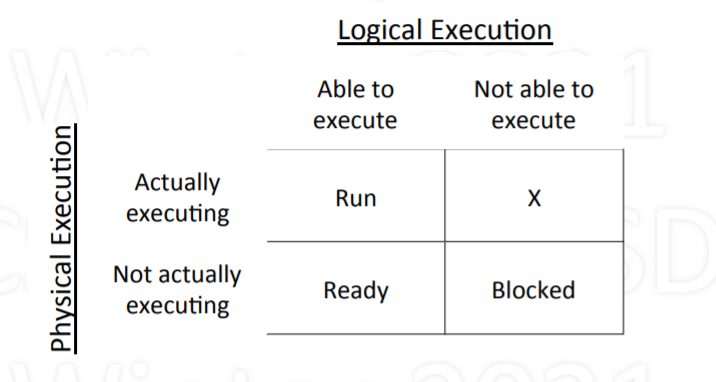
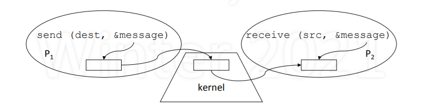
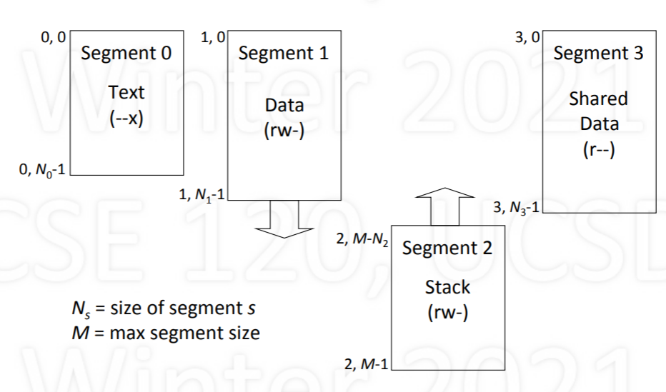

[toc]
  
# introduction
## what is an operating system
- software that makes computer easier to use
- improves the computer's capabilities
  - performance:speed,efficiency
  - reliability:correctness,fault tolerance
  - security: privacy,authenticity,integrity

## operating system vs. the Kernel
- our focus is much more limited:kernel

## two purposes of the kernel
- to provide abstract machine
- to manage resources

  

## turn undesirable into desirable
- Undesirable inconveniences of	reality
  - Complexity	of	hardware	
  - Single/limited	number	of	processors	
- Small/limited	amount	of	memory	
- Desirable	conveniences:	illusions	
  - Simple,	easy-to-use	resources	
  - Multiple/unlimited	number	of	processors	
  - Large/unlimited	amount	of	memory	


## From	Programmer’s Point of View
- Algorithm/program	design is hard	enough!	
- Allow	programmer to focus	on algorithm design	
- Not how to make machine run the	algorithm	
- Minimize accounting for computer	limitations	
- Introduces unnecessary complexity	
- May lead to modifying	the	algorithm	
- May make the	program	not	portable	

## Three Key Ideas
- Abstraction	
  - What is	the	desired	illusion	
- Mechanism	
  - How	to create illusion:	basic	functionality	
  - Fixed: works one way, the only	way	
- Policy	
  - Which way to use mechanism, to meet a goal	
  - Variable: many possible, select	best for situation

# processes
## Basic	Resources	for	Processes
- CPU	
  - Processing	cycles	(time)	
  - To	execute	instructions	
- Memory	
  - Bytes	or	words	(space)	
  - To	maintain	state	
- Other	resources	(e.g.,	I/O)
## Context	of	a	Process
- Context:	machine	and	kernel-related	state	
- CPU	context:	values	of	registers	
  - PC	(program	counter)	
  - SP	(stack	pointer),	FP	(frame	pointer),	GP	(general)	
- Memory	context:	pointers	to	memory	areas	
  - Code,	static	variables	(init,	uninit),	heap,	shared,	…	
  - Stack	of	activation	records	
- Other	(kernel-related	state,	…)	

## Process	Memory	Structure
- Text	
  - Code:	program	instructions	
- Data	
  - Global	variables	
  - Heap	(dynamic	allocation)	
- Stack	
  - Activation	records	
  - Automatic	growth/shrinkage

  


## process stack
- Stack	of	activation	records	
  - One	per	pending	procedure	
- An	acitvation	record	may	store	
  - where	to	return	to	
  - link	to	previous	record	
  - automatic	(local)	variables	
  - other	(e.g.,	register	values)	
- Stack	pointer	points	to	top
  


## Goal:	Support	Multiple	Processes
## Multiprogramming
- Given	a	running	process	
  - At	some	point,	it	needs	a	resource,	e.g.,	I/O	device	
  - Say	resource	is	busy,	process	can’t	proceed	
  - So,	“voluntarily”	gives	up	CPU	to	another	process	
- yield	(p)	
  - Let	process	p	run	(voluntarily	give	up	CPU	to	p)	
  - Requires	context	switching

## Context	Switching
- Allocating	CPU	from	one	process	to	another	
  - First,	save	context	of	currently	running	process	
  - Next,	restore	(load)	context	of	next	process	to	run	
- Loading	the	context	
  - Load	general	registers,	stack	pointer,	etc.	
  - Load	program	counter	(must	be	last	instruction!)	

## Simple	Context	Switching
- Two	processes:	A	and	B
-  A	calls	yield(B)	to	voluntarily	give	up	CPU	to	B	
- Save	and	restore	registers	
  - General-purpose,	stack	pointer,	program	counter	
- Switch	text	and	data	
- Switch	stacks	
  - Note	that	PC	is	in	the	middle	of	yield!	

## The	magic	of	yield
  
## Example
  
  

## yielding via kernel
- yield	routine	is	common	code:	put	in	kernel	
- Process	contexts	are	also	in	the	kernel	
  - This	way	they	are	protected	
  - Only	needed	by	yield	routine	anyway	
- But	what	is	the	kernel?	
  - code	that	supports	processes	
  - runs	as	an	extension	of	current	process	
- Has	text,	data,	and	multiple	stacks

  


# Timesharing
## time sharing
  

- Timesharing:	multiplexing	use	of	CPU	over	time	
- Multiple	processes,	single	CPU	(uniprocessor)	
- Conceptually,	each	process	makes	progress	over	time	
- In	reality,	each	periodically	gets	quantum	of	CPU	time	
- Illusion	of	parallel	progress	by	rapidly	switching	CPU	

## How	is	Timesharing	Implemented?
- Kernel	keeps	track	of	progress	of	each	process	
- Characterizes	state	of	process’s	progress	
  - Running:	actually	making	progress,	using	CPU	
  - Ready:	able	to	make	progress,	but	not	using	CPU	
  - Blocked:	not	able	to	make	progress,	can’t	use	CPU	
- Kernel	selects	a	ready	process,	lets	it	run	
  - Eventually,	the	kernel	gets	back	control	
  - Selects	another	ready	process	to	run,	…	

## Process State Diagram
  
State	transitions	
  - Dispatch:	allocate	the	CPU	to	a	process	
  - Preempt:	take	away	CPU	from	process	
  - Sleep:	process	gives	up	CPU	to	wait	for	event	
  - Wakeup:	event	occurred,	make	process	ready	

## Logical	vs.	Physical	Execution
  

## Process	vs.	Kernel
- Kernel:	code	that	supports	processes	
  - system	calls:	fork	(	),	exit	(	),	read	(	),	write	(	),	…	
  - management:	context	switching,	scheduling,	…
- When	does	the	kernel	run?	
  - system	call
  - hardware	interrupt	occurs	
- The	kernel	runs	as	part	of	the	running	process	
  - due	to	that	process	having	made	a	system	call	
  - in	response	to	device	issuing	interrupt	

## Process	Running	in	User	Space
  

## Process	Running	in	Kernel	Space
  

## Kernel	Maintains	List	of	Processes
  
- All	processes:	unique	names	(IDs)	and	states	
- Other	info	kernel	needs	for	managing	system	
  - contents	of	CPU	contexts	
  - areas	of	memory	being	used	
  - reasons	for	being	blocked	

- How	Does	Kernel	Get	Control	
  - Process	can	give	up	control	voluntarily	
  - Makes	system	call	that	blocks,	e.g.,	read	()	
  - System-call	function	calls	yield	()	to	give	up	CPU	
  - Kernel	selects	a	ready	process,	dispatches	it	
- Or,	CPU	is	forcibly	taken	away:	preemption	
  - Interrupt	generated	when	hardware	timer	expires	
  - Interrupt	forces	control	to	go	to	kernel	
  - While	kernel	running,	resets	timer	for	next	time

## How	a	Context	Switch	Occurs
- Process	makes	system	call	or	interrupt	occurs	
- What’s	done	by	hardware	
  - Switch	from	user	to	kernel	mode:	amplifies	power	
  - Go	to	fixed	kernel	location:	trap/interrupt	handler	
- What’s	done	in	software	(in	the	kernel)	
  - Save	context	of	current	process	
  - Select	a	process	that	is	ready;	restore	its	context	
  - RTI:	return	from	interrupt/trap

## How	to	Get	Parallelism	in	Process
- Process	is	a	“program	in	execution”	
  - assumed	(so	far)	a	single	path	of	execution	
  - in	a	memory	composed	of	text,	data,	stack	
- What	if	we	want	multiple	paths	of	execution?	
  - Single	text,	but	multiple	executions	in	parallel	
  - Single	data,	any	execution	can	see	others’	updates	
  - Need	separate	stacks:	one	per	ongoing	execution	
- Multiple	processes?		No	(separate	memories)

## Threads	
- Thread:	single	sequential	path	of	execution	
- Abstraction	is	independent	of	memory	
  - Contrast	to	process:	path	of	execution	+	memory	
- A	thread	is	part	of	a	process	
  - Lives	in	the	memory	of	a	process	
  - Distinction	allows	multiple	threads	in	a	process	
- To	the	user:	unit	of	parallelism	
- To	the	kernel:	unit	of	schedulability

- Implementing	Threads
- Thread	calls	are	system	calls	
  - ForkThread():	like	process	Fork()	but	for	threads	
  - Thread	system	call	functions	are	in	kernel	
- Thread	management	functions	are	in	kernel	
  - Thread	context	switching	
  - Thread	scheduling	
- Each	thread	requires	user	and	kernel	stacks	
- Kernel	can	schedule	threads	on	separate	CPUs

## Single	Process,	Multiple	Threads	
  

## Many	Processes	with	Threads
  

## User-Level	Threads
- Can	support	threads	at	user	level	
- Included	via	thread	library	
- Thread	calls	at	user	level	
  - ForkThread	(),	YieldThread	(),	…	
- Thread	Management	at	user	level	
- Supports	threads	regardless	of	kernel	support	
- However,	no	true	parallelism	
  
  

## Pros	and	Cons
- User-level	threads	
  - Portability:	works	on	any	kernel	
  - Efficient:	thread-switching	occurs	in	user	space	
  - User	can	decide	on	scheduling	policy	
  - But	no	true	parallelism	(without	special	support)	
- Kernel-level	threads	
  - Can	achieve	true	parallelism	
  - Overhead:	thread	switch	requires	kernel	call	

## Thread	Support	vs.	Execution
- Distinguish	between	
  - Where	is	thread	abstraction	supported?	
  - Where	is	thread	executing?	
- User-level	vs.	kernel-level	threads	
  - Is	thread	support	part	of	user	or	kernel	code?	
- Running	in	user	space	vs.	kernel	space	
  - Is	thread	running	in	user	or	kernel	space?	
- Make	sure	you	understand	the	distinction!

# Scheduling
## There	is	No	Single	Best	Policy
Different	for	
– your	personal	computer	
– large	time-shared	computer	
– computer	controlling	a	nuclear	power	plant	

## Longest	First	vs.	Shortest	First
  

- Given	n	processes	with	service	times	S1,	…	,	Sn
  - Note:	processes	are	numbered	1,	2,	3,	…,	n	
-  Average	turnaround	time	computed	as	follows
   - [S1	+	(S1	+	S2)	+	(S1	+	S2	+	S3)	+	…	+	(S1	+	…	+	Sn)]	/	n	
   - [(n	×	S1)	+	((n-1)	×	S2)	+	((n-2)	×	S3)	+	…	+	Sn]	/	n
- In	general:	order	by	shortest	to	longest	

## Consider	Different	Arrival	Times
  

## FCFS:	First	Come	First	Served
  
- Average	turnaround	time	=	(5	+	7	+	7)/3	=	6.3	
- Non-preemptive,	simple,	no	starvation	
- Poor for short	processes	

## RR: Round	Robin
  
- Average	turnaround	time	=	(9	+	6	+	2)/3	=	5.7	
- Preemptive,	simple,	no	starvation	
- Process	waits	at	most	(n	-	1)	x	quantum	

## SPN:	Shortest	Process	Next
  
- Average	turnaround	time	=	(5	+	8	+	4)/3	=	5.7	
- Optimal	for	non-preemptive,	allows	starvation	
- Assumes	service	times	are	known	

## SRT:	Shortest	Remaining	Time
  
- Average	turnaround	time	=	(9	+	4	+	1)/3	=	4.7	
- Assumes	service	times	are	known	
- Optimal	for	preemptive,	but	allows	starvation	

## Multi-Level	Feedback	Queues
- Priority	queues:	0	(high),	…,	N	(low)	
- New	processes	enter	queue	0	
- Select	from	highest	priority	queue	
- Run	for	T	=	2k quantums
  -  Used	T:	move	to	next	lower	queue,	FIFO	
  -  Used	<	T:	back	to	same	queue,	RR	
-  Due	to	yield	or	higher	priority	arrival	
- Periodically	boost	(e.g.,	all	to	highest	queue)

  
  
- Average	Turnaround	Time	=	(9	+	6	+	1)/3	=	5.3	
- Complex,	adaptive,	highly	responsive	
- Favors	shorter	over	longer,	possible	starvation

## Priority	Scheduling
  
- Allows	scheduling	based	on	external	criteria	
  - E.g.,	priority	=	1/CPU_time_used,	or	=	f	(pay)	

## Fair	Share	(Proportional	Share)	
  
- Goal:	utilization	over	long	run,	actual	≈	request	
- How	do	we	determine	who	runs	each	quantum?	
- Select	process	with	minimum	actual/request	ratio	

## Stride	Scheduling	
- For	processes	A,	B,	C	…	with	requests	RA,	RB,	RC	…	
- Calculate	strides:	SA	=	1/RA,	SB	=	1/RB,	SC	=	1/RC	…	
- For	each	process	x,	maintain	pass	value	Px	(init	0)	
- Schedule:	repeat	every	quantum	
  - Select	process	x	with	minimum	pass	value	Px,	run	
  - Increment	pass	value	by	stride	value:	Px	=	Px	+	Sx
- Optimization:	use	only	integers	for	Rx,	Sx	and	Px		
  - Calculate	Sx	=	L/Rx	using	very	large	L,	e.g.,	L	=	100000

## Stride	Scheduling	Example
  


## Real	Time	Scheduling
- Correctness	of	real-time	systems	depend	on	
  - logical	result	of	computations	
  - and	the	timing	of	these	results	
- cType	of	real-time	systems	
  - Hard	vs.	soft	real-time	
  - Periodic	vs.	aperiodic
- Scheduling	
  - Earliest	Deadline	First	(EDF)	
  - Rate	Monotonic	Scheduling	(RMS)	

## Periodic	Processes	(or	Tasks)
  
- Periodic	processes:	computation	is	cyclic	
- For	each	process,	given	
  - C	=	CPU	burst,	T	=	period,	U	=	C/T	=	utilization	

## EDF:	Earliest	Deadline	First
  
- Schedule	process	with	earliest	deadline	
- If	earlier	deadline	process	appears,	preempt	
- Works	for	periodic	and	aperiodic	processes	
- Achieves	100%	utilization	(ignoring	overhead!)	
- Expensive:	requires	ordering	by	deadlines	

  

## RMS:	Rate	Monotonic	Scheduling	
  

- If	periodic	processes,	prioritize	based	on	rates	
- At	start	of	period,	select	highest	priority	
- Preempt	if	necessary	
- When	burst	done,	wait	till	next	period	
- If	U1	+	…	+	Un	≤		n	($2^{1 / n}$	–	1),	all	deadlines	met

### RMS	Test	Passes,	All	Deadlines	Met	
  

### RMS	Test	Fails,	Deadline	Missed
  

### RMS	Test	Fails,	But	Deadlines	Met
  

## RMS	Optimal	But	Limited
- RMS	is	simple	and	efficient	
  - Static	priority	scheduling	based	on	rates	
- RMS	is	optimal	for	static	priority	algorithms	
  - If	RMS	can’t	schedule,	no	other	static	priority	can	
- RMS	is	limited	in	what	it	guarantees	
  - Utilization	bounded	by	n	(21/n	–	1)	>	ln	2	≈	69%	
  - Deadline	guarantee	applies	only	if	test	passes	
- RMS	is	limited	to	periodic	processes	

## Summary
- CPU	scheduling	is	policy:	depends	on	goals


|  scheduling  | property  |
|  :---:  | :---:  |
| First	come	first	served | very	simple,	non-preemptive |
| Round	robin|simple,	preemptive |
| Shortest	process	next | theoretical,	non-preemptive |
| Shortest	remaining	time | theoretical,	preemptive	|
| Multi-level	feedback | adaptive,	responsive,	complex	|
| Priority| external	criteria |
| Fair	share | proportional	allocation	|
| Earliest	deadline	firs | 100%	utilization,	high overhead	|
| Rate	monotonic	sched | <	100% util,	low	overhead |


# Synchronization
## Synchronization
- Synchronize:	events	happen	at	the	same	time	
- Process	synchronization	
  - Events	in	processes	that	occur	“at	the	same	time”	
  - Actually,	when	one	process	waits	for	another	
-  Uses	of	synchronization	
   - Prevent	race	conditions	
   - Wait	for	resources	to	become	available

## The	Credit/Debit	Problem
- Say	you	have	$1000	in	your	bank	account	
- You	deposit	$100	
- You	also	withdraw	$100	
- How	much	should	be	in	your	account?	
-  What	if	deposit/withdraw	occur	at	same	time?

## Credit/Debit	Problem:	Race	Condition	
  

## To	Avoid	Race	Conditions
- Identify	related	critical	sections	
  - Section(s)	of	code	executed	by	different	processes	
  - Must	run	atomically,	with	respect	to	each	other	
- Enforce	mutual	exclusion	
  - Only	one	process	active	in	a	critical	section

## What	Does	Atomic	Really	Mean?
- Atomic	means	“indivisible”	
- We	seek	effective	atomicity	
  - can	interrupt,	as	long	as	interruption	has	no	effect	
-  It	is	OK	to	interrupt	process	in	critical	section	
  -  as	long	as	other	processes	have	no	effect	
- How	to	determine	
  - Consider	effect	of	critical	section	in	isolation	
  - Next	consider	interruptions:	if	same	result,	OK

## How	to	Achieve	Mutual	Exclusion?
- Surround	critical	section	with	entry/exit	code	
- Entry	code	should	act	as	a	barrier	
  - If	another	process	is	in	critical	section,	block	
  - Otherwise,	allow	process	to	proceed	
- Exit	code	should	release	other	entry	barriers

## Requirements	for	Good	Solution
- Given	multiple	cooperating	processes	
  - Each	process	has	a	critical	section	
  - All	critical	sections	are	to	be	mutually	exclusive	
1. At	most	one	in	a	critical	section	at	a	time	
2. Can’t	prevent	entry	if	all	others	not	in	theirs	
3. Should	eventually	be	able	to	enter	
4. No	assumptions	about	CPU	speed	or	number

## Software	Lock?
  
- Lock	indicates	if	any	process	in	critical	section

## Take	Turns?
  
- Alternate	which	process	enters	critical	section

## State	Intention?
  

- Process	states	intent	to	enter	critical	section

## Peterson’s	Solution
  
- If	competition,	take	turns;	otherwise,	enter	
- There	is	a	version	for	n	>	2;	more	complex

# What	about	Disabling	Interrupts?
- No	interrupts	⇒	no	uncontrolled	context	switches(just yield)
- No	uncontrolled	context	switches	⇒	no	races	
- No	races	⇒	mutual	exclusion	

# Test-and-Set	Lock	Instruction:	TSL
- TSL	mem	(test-and-set	lock:	contents	of	mem)
  - do atomically (i.e., locking the memory bus) [ test if mem == 0 AND set mem = 1 ]
- Operations	occur	without	interruption	
  - Memory	bus	is	locked	
  - Not	affected	by	hardware	interrupts

## What	TSL	Does,	Expressed	in	C	
Assume	C	function,	TSL(int	*),	that	is	atomic	
```c
TSL(int *lockptr)
{ 
  int oldval;
  oldval = *lockptr
  *lockptr = 1;
  return ((oldval == 0) ? 1 : 0);
} 
```
## Mutual	Exclusion	Using	TSL
  
- Shared	variable	solution	using	TSL(int	*)	
  - tests	if	lock	==	0	(if	so,	will	return	1;	else	0)	
  - before	returning,	sets	lock	to	1	
- Simple,	works	for	any	number	of	threads	
- Still	“suffers”	from	busy	waiting	

# Semaphores
- Synchronization	variable	
  - Takes	on	integer	values	
  - Can	cause	a	process	to	block/unblock	
- wait	and	signal	operations	
  - wait	(s) decrement;	block	if	<	0	
  - signal	(s) increment;	if	any	blocked,	unblock	one	
- No	other	operations	allowed	
  - In	particular,	cannot	test	value	of	semaphore!	

## Examples	and	Interpretation
- wait	(s) decrement;	block	if	<	0	
- signal	(s) increment;	if	any	blocked,	unblock	
- wait	(1) s	→	0 -	GO	
- wait	(0) s	→	-1 -	STOP	(i.e.,	block)	
- signal	(-1) s	→	0 -	GO	and	allow	one	to	GO	
- signal	(0) s	→	1 -	GO

## USAGE1:Mutual	Exclusion
  

## USAGE2: Order	How	Processes	Execute
  
- Cause	a	process	to	wait	for	another	
- Use	semaphore	indicating	condition;	initially	0	
  - the	condition	in	this	case:	“P0	has	completed”	
- Used	for	ordering	processes	
  - In	contrast	to	mutual	exclusion	

## Semaphore	Implementation
  

## Alternative	Implementation
  

## Wait	and	Signal	Must	Be	Atomic
- Bodies	of	wait	and	signal	are	critical	sections	
- So,	still	need	mechanism	for	mutual	exclusion!	
- Use	a	lower-level	(more	basic)	mechanism	
  - Test-and-set	lock	
  - Peterson’s	solution	
- So,	busy-waiting	still	exists	(can	never	remove)	
  - But	at	lower-level	(within	semaphore	operations)	
  - Occurrence	limited	to	brief/known	periods	of	time	

## Analysis:	Lower-Level	Busy	Waiting	
- A	calls	wait	(s),	switch	to	B,	B	calls	wait	(s)	
  - Switch	occurs	while	A	executing	body	of	wait	
- Body	of	wait	is	critical	section,	so	B	must	block	
  - Use	test-set	lock	or	Peterson’s:		busy	waiting	
- How	long	will	B	be	blocked?	
  - For	time	it	takes	to	execute	body	of	wait	
- Small/known	amount	of	time!	
  - Compare	to	user	critical	section:	unknown	time

## Are	These	Equivalent?
  

- no  implementation2 has bug in wait
- \+ and \- has to be finished in the first line


# InterProcess Communication	(IPC)
## Cooperating	Processes	
- Performance:	speed	
  - Exploit	inherent	parallelism	of	computation	
  - Allow	some	parts	to	proceed	while	others	do	I/O	
- Modularity:	reusable	self-contained	programs	
  - Each	may	do	a	useful	task	on	its	own	
  - May	also	be	useful	as	a	sub-task	for	others	

## Examples	of	Cooperating	Processes
  


## Inter-Process	Communication	
- To	cooperate,	need	ability	to	communicate	
- IPC:	inter-process	communication	
  - Communication	between	processes	
- IPC	requires	
  - data	transfer
  - synchronization	
- Need	mechanisms	for	both

- Semaphore is not IPC(no data transfer)

## Three	Abstractions	for	IPC
- Shared	memory	+	semaphores	
- Monitors	
- Message	passing	

## The	Producer/Consumer	Problem
  

- Producer	produces	data,	inserts	in	shared	buffer	
- Consumer	removes	data	from	buffer,	consumes	it

## Producer/Consumer:	Shared	Memory
  

- No	synchronization	
  - Consumer	must	wait	for	something	to	be	produced	
- What	about	Producer?	
  - No	mutual	exclusion	for	critical	sections	
  - Relevant	if	multiple	producers	or	multiple	consumers

## Recall	Semaphores
- Semaphore:	synchronization	variable	
  - Takes	on	integer	values	
  - Has	an	associated	list	of	waiting	processes	
-  Operations	
   - wait	(s) {	s	=	s–1;	block	if	s	<	0	}	
   - signal	(s) {	s	=	s+1;	unblock	a	process	if	any	}	
- No	other	operations	allowed	(e.g.,	can’t	test	s)

## Semaphores	for	Synchronization	
  
- Buffer	empty,	Consumer	waits	
- Buffer	full,	Producer	waits	
- General	synchronization	vs.	mutual	exclusion	


## Multiple	Producers
  
- There	is	a	race	condition	in	the	Producer	code	
- Inconsistent	updating	of	variables	buf	and	in	
- Need	mutual	exclusion	

## Semaphore	for	Mutual	Exclusion	

  
- Works	for	multiple	producers	and	consumers	
- But	not	easy	to	understand:	easily	leads	to	bugs	
  - Example:	what	if	wait	statements	are	interchanged?

## Monitors
- Programming	language	construct	for	IPC	
  - Variables	(shared)	requiring	controlled	access	
  - Accessed	via	procedures	(mutual	exclusion)	
  -  Condition	variables	(general	synchronization)	(cannot store value ,cannot remember anything)
     - wait	(cond):	block	until	another	process	signals	cond
     - signal	(cond):	unblock	a	process	waiting	on	cond
- Only	one	process	can	be	active	inside	monitor	
  - Active	=	running	or	able	to	run;	others	must	wait	

## Producer/Consumer	using	a	Monitor
  


## How	Synchronization	Works
  

## Issues	with	Monitors
- Given	P1	waiting	on	condition	c,	P2	signals	c
  - P1	and	P2	able	to	run:	breaks	mutual	exclusion	
  - One	solution:	signal	just	before	returning	
- Condition	variables	have	no	memory	
  - Signal	without	someone	waiting	does	nothing	
  - Signal	is	“lost”	(no	memory,	no	future	effect)	
- Monitors	bring	structure	to	IPC	
  - Localizes	critical	sections	and	synchronization	

## Message	Passing	
  
- Two	methods	
  - send (destination, &message)
  - receive (source, &message)
- Data	transfer:	in	to	and	out	of	kernel	message	buffers	
- Synchronization:	receive	blocks	to	wait	for	message

## Producer/Consumer:	Message-Passing
  

## An	Optimization
  

- consume and produce may take time

## Issues	with	Message	Passing
- Who	should	messages	be	addressed	to?	
  - ports	(“mailboxes”)	rather	than	processes	
- How	to	make	process	receive	from	anyone?	
  - pid = receive (*, &message)
- Kernel	buffering:	outstanding	messages	
  - messages	sent	that	haven’t	been	received	yet	
- Good	paradigm	for	IPC	over	networks	
 Safer	than	shared	memory	paradigms	

 # Deadlock
 ## What	is	Deadlock?
 - Set	of	processes	are	permanently	blocked	
  - Unblocking	of	one	relies	on	progress	of	another	
  - But	none	can	make	progress!	
- Example	
  - Processes	A	and	B	
  - Resources	X	and	Y	
  - A	holding	X,	waiting	for	Y	
  - B	holding	Y,	waiting	for	X	
  - Each	is	waiting	for	the	other;	will	wait	forever	
  

## Traffic	Jam	as	Example	of	Deadlock
  

## Four	Conditions	for	Deadlock
- Mutual	Exclusion	
  - Only	one	process	may	use	a	resource	at	a	time	
- Hold-and-Wait	
  - Process	holds	resource	while	waiting	for	another	
- No	Preemption	
  - Can’t	take	a	resource	away	from	a	process	
- Circular	Wait	
  - The	waiting	processes	form	a	cycle	

## How	to	Attack	the	Deadlock	Problem
- Deadlock	Prevention	
  - Make	deadlock	impossible	by	removing	condition	
- Deadlock	Avoidance	
  - Avoid	getting	into	situations	that	lead	to	deadlock	
- Deadlock	Detection	
  - Don’t	try	to	stop	deadlocks	
  - Rather,	if	they	happen,	detect	and	resolve	

## Deadlock	Prevention
- Simply	prevent	any	single	condition	for	deadlock	
- Mutual	exclusion	
  - Relax	where	sharing	is	possible	
- Hold-and-wait	
  - Get	all	resources	simultaneously	(wait	until	all	free)	
- No	preemption	
  - Allow	resources	to	be	taken	away	
- Circular	wait	
  - Order	all	the	resources,	force	ordered	acquisition	

## Deadlock	Avoidance
- Avoid	situations	that	lead	to	deadlock	
  - Selective	prevention	
  - Remove	condition	only	when	deadlock	is	possible	
- Works	with	incremental	resource	requests	
  - Resources	are	asked	for	in	increments	
  - Do	not	grant	request	that	can	lead	to	a	deadlock	
- Need	maximum	resource	requirements	

## Banker’s	Algorithm
- Fixed	number	of	processes	and	resources	
  - Each	process	has	zero	or	more	resources	allocated	
- System	state:	either	safe	or	unsafe	
  - Depends	on	allocation	of	resources	to	processes	
- Safe:	deadlock	is	absolutely	avoidable	
  - Can	avoid	deadlock	by	certain	order	of	execution	
- Unsafe:	deadlock	is	possible	(but	not	certain)	
  - May	not	be	able	to	avoid	deadlock	

## Banker’s	Algorithm
- Given	
  - process/resource	claim	matrix	
  - process/resource	allocation	matrix	
  - resource	availability	vector	
- Is	there	a	process	ordering	such	that	
  - a	process	can	run	to	completion,	return	resources	
  - resources	can	then	be	used	by	another	process	
  - eventually,	all	the	processes	complete	

## Deadlock	Detection	and	Recovery
- Do	nothing	special	to	prevent/avoid	deadlocks	
  - If	they	happen,	they	happen	
  - Periodically,	try	to	detect	if	a	deadlock	occurred	
  - Do	something	(or	even	nothing)	about	it	
- Reasoning	
  - Deadlocks	rarely	happen	
  - Cost	of	prevention	or	avoidance	not	worth	it	
  - Deal	with	them	in	special	way	(may	be	very	costly)	
- Most	general	purpose	OS’s	take	this	approach!

## Detecting	a	Deadlock	
  

## Recovery	from	Deadlock
- Terminate	all	deadlocked	processes	
  - Will	remove	deadlock,	but	drastic	and	costly	
- Terminate	deadlocked	processes	one	at	a	time	
  - Do	until	deadlock	goes	away	(need	to	detect)	
  - What	order	should	processes	be	ended?	
- What	about	resources	in	inconsistent	states	
  - Such	as	files	that	are	partially	written?	
  - Or	interrupted	message	(e.g.,	file)	transfers?	

## Classical	Synchronization	Problems
- Producer/Consumer	(Bounded	Buffer)	
- Dining	Philosophers	
- Readers/Writers	

## The	Dining	Philosopher’s	Problem
  
  
  

# Memory	Management
- How	to	allocate	and	free	portions	of	memory	
- Allocation	of	memory	occurs	when	
  - new	process	is	created	
  - process	requests	more	memory	
- Freeing	of	memory	occurs	when	
  - process	exits	
  - process	no	longer	needs	memory	it	requested	

- Each	process	requires	memory	to	store	
  - Text:	code	of	program	
  - Data:	static	variables,	heap	
  - Stack:	automatic	variables,	activation	records	
  - Other:	shared	memory	regions	
- Memory	characteristics	
  - Size,	fixed	or	variable	(max	size)	
  - Permissions:	r,	w,	x

## Process’s	Memory	Address	Space
- address	space	
  - Set	of	addresses	to	access	memory	
  - Typically,	linear	and	sequential	
  - 0	to	N-1	(for	size	N)	
- For	process	memory	of	size	N	
  - Text	(of	size	X)	at	0	to	X-1	
  - Data	(of	size	Y)	at	X	to	X+Y-1	
  - Stack	(of	size	Z)	at	N-Z	to	N-1

  

## Compiler’s	Model	of	Memory
- Compiler	generates	memory	addresses	
  - Address	ranges	for	text,	data,	stack	
  - Allow	data	and	stack	to	grow	
- What	is	not	known	in	compiler	
  - Physical	memory	size	(to	place	stack	at	high	end)	
  - Allocated	regions	of	physical	memory	(to	avoid)	


## Goal:	Support	Multiple	Processes
- To	support	programs	running	“simultaneously”	
  - Implement	process	abstraction	
  - Multiplex	CPU	time	over	all	runnable	processes	
- Process	requires	more	than	CPU	time:	memory	

  


## Multiple	Processes:	CPU	+	Memory
  

## Sharing	the	Physical	Memory
- If	process	given	CPU,	must	also	be	in	memory	
- Problem	
  - Context-switching	time	(CST):	10	µsec	
  - Loading	from	disk:	10	MB/s
  - To	load	1	MB	process:	100	msec	=	10,000	x	CST	
  - Too	much	overhead!		Breaks	illusion	of	simultaneity	
- Solution:	keep	multiple	processes	in	memory	
  - Context	switch	only	between	processes	in	memory	

## Memory	Management	Example
- Physical	memory	starts	as	one	empty	“hole”	
- Over	time,	areas	get	allocated:	“blocks”	
- To allocate	memory	
   - Find	large	enough	hole	
   - Allocate	block	within	hole	
   - Typically,	leaves	(smaller)	hole	
- When	no	longer	needed,	release	
  - Creates	a	hole,	coalesce	with	adjacent	

## Selecting	the	Best	Hole	
- If	there	are	multiple	holes,	which	to	select?	
- Algorithms	
  - First	(or	next)	fit:	
    - Simple	
    - Fast
  - Best	fit	
    - Must	check	every	hole	
    - Leaves	very	small	fragments	
  - Worst	fit	
    - Leaves	large	fragments	
    - Must	check	every	hole	
- So	which	is	best?	
  - Consider	tradeoff:	fit	vs.	search	time	
  - Memory	is	cheap,	time	is	expensive	

## Fragmentation
- Eventually,	memory	becomes	fragmented	
- Internal	fragmentation	
  - Unused	space	within	(allocated)	block	
  - Cannot	be	allocated	to	others	
  - Can	come	in	handy	for	growth	
- External	fragmentation	
  - Unused	space	outside	any	blocks	(holes)	
  - Can	be	allocated	(too	small/not	useful?)

## What	if	No	Holes
There	may	still	be	significant	unused	space	
- External	fragments	
- Internal	fragments
- Approaches	
  - Compaction	
    - Simple	idea	
    - But	very	time	consuming	
  - Break	block	into	sub-blocks	
    - Easier	to	fit	
    - But	complex	
- So	which	is	best?	
  - Consider	time	vs.	complexity	tradeoff

## Given	n	blocks,	how	many	holes?
- Assume	memory	is	fragmented	
- There	are	n	blocks	allocated	
- There	are	holes	between	
- How	many	holes	are	there?

## 50%	Rule:	m	=	n/2
- Block:	an	allocated	block	
- Hole:	free	space	between	blocks	
- The	50%	Rule:	m	=	n/2	
  - n	=	number	of	blocks	
  - m	=	number	of	holes	=	n/2

## How	Much	Memory	Lost	to	Holes?
- Given	we	know	average	sizes	for	blocks,	holes	
- b	=	average	size	of	blocks	
- h	=	average	size	of	holes	
- What	is	fraction	of	memory	lost	to	holes?

## Unused	Memory	Rule:	f	=	k/(k+2)
- Let	b	=	average	size	of	blocks	
- Let	h	=	average	size	of	holes	
- Let	k	=	h/b,	ratio	of	average	hole-to-block	size	
- f	=	k/(k+2)	is	fraction	space	lost	to	holes	

## Proof	of	Unused	Memory	Rule
- Given	a	memory	of	size	M	
  - M	=	mh	+	nb
  - f	=	mh/M	=	mh/(mh	+	nb)	
- Assume	that	all	allocations	are	imperfect	fits	
  - m	=	n/2,	or	n	=	2m	(this	is	the	50%	rule)	
  - f	=	mh/(mh	+	2mb)	=	h/(h	+	2b)	
  - If	k	=	h/b,	then	h	=	kb,	and	f	=	kb/(kb	+	2b)	
- Therefore,	f	=	k/(k	+	2)	

## Some	Values	for	f	=	k/(k	+	2)
- k	=	1,	f	=	1/3	
  - avg	hole	size	=	avg	block	size,	33%	waste	
- k	=	2,	f	=	1/2	
  - avg	hole	size	=	2x	avg	block	size,	50%	waste	
- k	=	3,	f	=	3/5	
  - avg	hole	size	=	3x	avg	block	size,	60%	waste	
- k	=	8,	f	=	4/5	
  - avg	hole	size	=	8x	avg	block	size,	80%	waste	

## Limits	of	f	=	k/(k	+	2)
- In	general,	f	increases	with	increasing	k	
  - The	larger	the	avg	hole	size	is	to	avg	block	size,	the	 larger	is	the	fraction	of	wasted	memory	
  - as	k	→	∞,	f	→	1	
- Alternatively, f	decreases	with	decreasing	k	
  - The	smaller	the	avg	hole	size	is	to	avg	block	size,	 the	smaller	the	fraction	of	wasted	memory	
  - as	k	→	0,	f	→	0	

## Pre-sized	Holes	
- Variable-size	allocations	cause	fragmentation	
  - So	why	not	have	pre-sized	holes?	
- Same-sized:	all	holes	same,	easy	allocation	
  - Inflexible:	may	be	too	small	
- Variety	of	sizes	(small,	medium,	large,	…)	
  - More	flexible,	but	more	complex	
  - What	should	sizes	be?	How	many	of	each?	
- Not	adaptable;	internal	fragmentation	

## The	Buddy	System
- Partition	into	power-of-2	size	chunks	
- Alloc:	given	request	for	size	r
```
find chunk larger than r (else return failure)
while (r ≤ sizeof(chunk)/2)
divide chunk into 2 buddies (each 1/2 size)
allocate the chunk
```
- Free:	free	the	chunk	and	coalesce	with	buddy
```
free the chunk
while (buddy is also free)
coalesce 
```

## Example	of	Buddy	System	
  

## Data	Structure	for	Buddy	System
  

# Logical	Memory
## What	is	Logical	Memory
- Logical	memory	=	a	process’s	memory	
- As	viewed	(referenced)	by	a	process	
- Allocated	without	regard	to	physical	memory

## Problems	with	Sharing	Memory
- The	Addressing	Problem	
  - Compiler	generates	memory	references	
  - Unknown	where	process	will	be	located	
- The	Protection	Problem	
  - Modifying	another	process’s	memory	
- The	Space	Problem	
  - The	more	processes	there	are,	the	less memory	each	individually	can	have

  

## Address	Spaces	
- Address	space	
  - Set	of	addresses	for	memory	
- Usually	linear:	0	to	N-1	(size	N)	
- Physical	Address	Space	
  - 0	to	N-1,	N	=	size	
  - kernel	occupies	lowest	addresses	(typically)	

  

## Logical	vs.	Physical	Addressing	
- Logical	addresses	
  - Assumes	separate	memory starting	at	0	
  - Compiler	generated	
  - Independent	of	location	in	
physical	memory	
- Convert	logical	to	physical	
  - Via	so[ware:	at	load	time	
  - Via	hardware:	at	access	time

  

## Hardware	for	Logical	Addressing
- Base	register	filled	with start	address	
- To	translate	logical	address,	add	base	
- Achieves	relocation	
- To	move	process:	change	base	
  

## Protection
- Bound	register	works	with	base	register	
- Is	address	<	bound	
- Yes:	add	to	base	
- No:	invalid	address,	TRAP	
- Achieves	protection
  


## Memory	Registers	Part	of	Context
- On	Every	Context	Switch	
  - Load	base/bound	registers	for	selected	process	
  - Only	kernel	does	loading	of	these	registers	
  - Kernel	must	be	protected	from	all	processes	
- Benefit	
  - Allows	each	process	to	be	separately	located	
  - Protects	each	process	from	all	others	

## Recall	Process	Address	Space
- Text:	program	instructions	
  - Execute-only,	fixed	size	
- Data:	variables	(static,	heap)	
  - Read/write,	variable	size	
  - Dynamic	allocation	by	request	
- Stack:	activation	records	(auto)	
  - Read/write,	variable	size	
  - Automatic	growth/shrinkage

  

## Fitting	Process	into	Memory
- Must	find	large	enough	hole	
- May	not	succeed	
  - even	if	enough	fragment	space	
- Even	if	successful,	inefficient	
  - Space	must	be	allocated	for	potential	growth	areas
- Solution:	break	process	into	pieces	
  - Distribute	into	available	holes	
  

## Two	Approaches
- Segmented	address	space	
  - Partion	into	segments	
  - Segments	can	be	different	sizes	
- Paged	address	space	
  - Partion	into	pages	
    - Corresponding	memory:	frames	
  - Pages	are	the	same	size	
  

## Segmented	Address	Space
- Address	space	is	a	set	of	segments	
- Segment:	a	linearly	addressed	memory	
  - Typically	contains	logically-related	information	
  - Examples:	program	code,	data,	stack	
- Each	segment	has	an	identifier	s,	and	a	size	Ns	
  - s	between	0	and	S-1,	S	=	max	number	of	segments	
- Logical	addresses	are	of	the	form	(s,	i)	
  - Offset	i	within	segment	s,	i	must	be	less	than	Ns

## Example:	Segmented	Address	Space
  

## Segment-based	Address	Translation	
  

- Problem:	how	to	translate	
  - a	logical	address	(s,	i)	into	physical	address	a?	
- Solution:	use	a	segment	(translation)	table	ST	
  - to	segment	s	into	base	physical	address	b	=	ST	(s)	
  - then	add	b and	i
- Summary:	physical	address	=	ST	(s)	+	i

## Segment	Table
- One	per	process	(typically)	
- Table	entry	elements	
  -  V:	valid	bit	
  - Base:	segment	location	
  - Bound:	segment	size	
  - Perm:	permissions	
- Location	in	memory	given	by	
  - Segment	table	base	register	(hardware)	
  - Segment	table	size	register	(hardware)	

  

## Address	Translation
Physical	address	=	base	of	s	+	i
• First,	do	a	series	of	checks

### Check	if	Segment	s	is	within	Range	
  

### Check	if	Segment	Entry	s	is	Valid
  

### Check	if	Offset	i	is	within	Bounds	
  

### Check	if	Operation	is	Permioed	
  

### Translate	Address	

  

### Sizing	the	Segment	Table	

  

### Example	of	Sizing	the	Segment	Table	

  

- Given	32	bit	logical,	1	GB	physical	memory	(max)	
  - 5	bit	segment	number,	27	bit	offset	

### Pros	and	Cons	of	Segmentation	

- Pro:	Each	segment	can	be	
  - located	independently	
  - separately	protected	
  - grown/shrunk	independently	
  - Segments	can	be	shared	by	processes	
- Con:	Variable-size	allocation	
  - Difficult	to	find	holes	in	physical	memory	
  - External	fragmentation	

## Paged	Address	Space	
- Logical	(process)	memory	
  - Linear	sequence	of	pages	
- Physical	memory	
  - Linear	sequence	of	frames	
- Pages	and	frames	
  - Frame:	a	physical	unit	of	information	
  - A	page	fits	exactly	into	a	frame	
  - Fixed	size,	all	pages/frames	same	size

  

## Page-based	Logical	Addressing
- Form	of	logical	address:	(p,	i)	
  - p	is	page	number,	0	to	NL-1	
  - i	is	offset	within	page	
  - Note:	i	is	less	than	page	size	
    - no	need	to	check	
- Size	of	logical	address	space	
  - NL	=	max	number	of	pages	
  - NL	×	page	size	=	size	of	logical	address	space

  

## Frame-based	Physical	Addressing	
- Form	of	physical	address:	(f,	i)	
  - f	is	frame	number,	0	to	NP-1	
  - i	is	offset	within	frame	
  - Note:	i	is	less	than	frame	size	
    - since	page	size	=	frame	size	
- Size	of	physical	address	space	
  - NP	=	max	number	of	frames	
  - NP	×	frame	size	=	size	of	physical	address	space

  

## Page-based	Address	Translation	
- Problem:	how	to	translate	
  - logical	address	(p,	i)	into	physical	address	(f,	i)?	
- Solution:	use	a	page	(translation)	table	PT	
  - to	translate	page	p	into	frame	f	=	PT	(p)	
  - then	concatenate	f	and	i
- Summary:	physical	address	=	PT	(p)		||		i


  

## Logical	Pages	to	Physical	Frames	
- Each	page	of	logical	memory	corresponds	to entry	in	page	table	
- Page	table	“maps”	logical	page	into	frame	of	physical memory	
  

## Page	Table
- One	per	process	(typically)	
- Table	entry	elements	
  - V:	valid	bit	
  - Demand	paging	bits	
  - Frame:	page	location	
- Location	in	memory	given	by	
  - Page	table	base	register	(hardware)	
  - Page	table	size	register	(hardware)

  

## Address	Translation
- Physical address	=	frame	of	p ||	offset	i
- First,	do	a	series	of	checks	
  

### Check	if	Page	p	is	Within	Range	
  

### Check	if	Page	Table	Entry	p	is	Valid
  

### Check	if	Operation	is	Permioed	
  

### Translate	Address	
  

### Physical	Address	by	Concatenation
  

## Sizing	the	Page	Table	
  

## Example	of	Sizing	the	Page	Table
  

- Given	32	bit	logical,	1	GB	physical	memory	(max)	
  - 20	bit	page	number,	12	bit	offset	

## Segments	vs.	Pages	
- Segment	is	good	“logical”	unit	of	information	
  - Can	be	sized	to	fit	any	contents		
  - Makes	sense	to	share	(e.g.,	code,	data)	
  - Can	be	protected	according	to	contents	
- Page	is	good	“physical”	unit	of	information	
  - Simple	memory	management	
- Why	not	have	best	of	both	
  - Segments,	each	a	set	of	pages

## Combining	Segments	and	Pages
- Logical	memory	
  - composed	of	segments	
- Each	segment	
  - composed	of	pages	
- Segment	table	
  - Maps	each	segment	to	a	page	table	
- Page	tables	
  - Maps	each	page	to	physical	page	frames	

  

## Address	Translation
- Logical	address:	[segment	s,	page	p,	offset	i]	
- Do	various	checks	
  - s	<	STSR,		V	==	1,	p	<	bound,	perm	(op)	
  - May	get	a	segmentation	violation	
- Use	s	to	index	segment	table	to	get	page	table	
- Use	p	to	index	page	table	to	get	frame	f
- Physical	address	=	concatenate	(f,	i)

## Segment/Page	Address	Translation
  

## Cost	of	Translation
- Each	lookup	costs	another	memory	reference	
  - For	each	reference,	additional	references	required	
  - Slows	machine	down	by	factor	of	2	or	more		
- Take	advantage	of	locality	of	reference	
  - Most	references	are	to	a	small	number	of	pages	
  - Keep	translations	of	these	in	high-speed	memory	
- Problem:	don’t	know	which	pages	till	accessed	

## TLB:	Translation	Look-aside	Buffer
  
- Fast	memory	keeps	most	recent	translations	
- If	key	matches,	get	frame	number	
- else	wait	for	normal	translation	(in	parallel)	

## Translation	Cost	with	TLB
- Cost	is	determined	by	
  - Speed	of	memory:	~	100	nsec
  - Speed	of	TLB:	~	5	nsec
  - Hit	ra6o:	frac6on	of	refs	satisfied	by	TLB,	~99%	
- Speed	with	no	address	translation:	100	nsec
- Speed	with	address	translation	
  - TLB	miss: 200	nsec	(100%	slowdown)	
  - TLB	hit: 105	nsec			(5%	slowdown)	
  - Average: 105	x	0.99		+		200	x	0.01		≈		106	nsec

## TLB	Design	Issues	
- The	larger	the	TLB	
  - the	higher	the	hit	rate	
  - the	slower	the	response	
  - the	greater	the	expense	
- TLB	has	a	major	effect	on	performance!	
  - Must	be	flushed	on	context	switches	
  - Alternative:	tagging	entries	with	PIDs	


# 	Virtual	Memory
## Segments	and	Pages	
- Structuring	memory	as	segments/pages	allows	
  - partitioning	memory	for	convenient	allocation	
  - reorganizing	memory	for	convenient	usage	
- How?	
  - Relocation	via	address	translation	
  - Protection	via	matching	opera6ons	with	objects	
- Result:	a	logically	organized	memory	

## Implications
- Not	all	pieces	need	to	be	in	memory	
  - Need	only	piece	being	referenced	
  - Other	pieces	can	be	on	disk	
  - Bring	pieces	in	only	when	needed	
- Illusion:	there	is	much	more	memory	
- What’s	needed	to	support	this	idea?	
  - A	way	to	identify	whether	a	piece	is	in	memory	
  - A	way	to	bring	in	a	piece	(from	where,	to	where?)	
  - Relocation	(address	translation,	which	we	have)	


## Virtual	Memory	based	on	Paging
  

- For	all	pages	in	virtual	memory	
- All	of	them	reside	on	disk	
- Some	also	reside	in	physical	memory	(which	ones?)


## Sample	Contents	of	Page	Table	Entry
  

- Valid:	is	entry	valid	(page	in	physical	memory)?	
- Ref:	has	this	page	been	referenced	yet?	
- Mod:	has	this	page	been	modified	(dirty)?	
- Frame:	what	frame	is	this	page	in?	
- Prot:	what	are	the	allowable	opera6ons?

## Address	Translation	and	Page	Faults	
- Get	entry:	index	page	table	with	page	number	
- If	valid	bit	is	off,	page	fault	–	trap	into	kernel	
  - Find	page	on	disk	(kept	in	kernel	data	structure)	
  - Read	it	into	a	free	frame	
    - may	need	to	make	room:	page	replacement	
  - Record	frame	number	in	page	table	entry	
  - Set	valid	bit	(and	other	fields)	
- Retry	instruction	(return	from	page-fault	trap)

## Faults	under	Segmentation/Paging
- Virtual	address:	segment	s,	page	p,	offset	i
- Use	s	to	index	segment	table	(gets	page	table)	
  - May	get	a	segment	fault	
- Check	bound	(Is	p	<	bound?)	
  - May	get	a	segmentation	viola6on	
- Use	p	to	index	into	page	table	(to	get	frame	f)	
  - May	get	a	page	fault	
- Physical	address:	concatenate	f	and	offset	i

## Page	Faults	are	Expensive
- Disk:	5-6	orders	magnitude	slower	than	RAM	
  - Very	expensive;	but	if	very	rare,	tolerable	
- Example	
  - RAM	access	6me:	100	nsec
  - Disk	access	6me:	10	msec
  - p	=	page	fault	probability	
  - Effec6ve	access	6me:	100		+		p	×	10,000,000	nsec
  - If	p	=	0.1%,	effec6ve	access	6me	=	10,100	nsec	!	

## Principle	of	Locality
- Not	all	pieces	referenced	uniformly	over	6me	
  - Make	sure	most	referenced	pieces	in	memory	
  - If	not,	thrashing:	constant	fetching	of	pieces	
- References	cluster	in	6me/space	
  - Will	be	to	same	or	neighboring	areas	
  - Allows	prediction	based	on	past

## Page	Replacement	Policy
- Goal:	remove	page	not	in	locality	of	reference	
- Page	replacement	is	about	
  - which	page(s)	to	remove	
  - when	to	remove	them	
- How	to	do	it	in	cheapest	way	possible,	with	
  - least	amount	of	additional	hardware	
  - least	amount	of	software	overhead	

## Basic	Page	Replacement	Algorithms
- FIFO:	select	page	that	is	oldest	
  - Simple:	use	frame	ordering	
  - Doesn’t	perform	very	well	(oldest	may	be	popular)	
- OPT:	select	page	to	be	used	furthest	in	future	
  - Op6mal,	but	requires	future	knowledge	
  - Establishes	best	case,	good	for	comparisons	
- LRU:	select	page	that	was	least	recently	used	
  - Predict	future	based	on	past;	works	given	locality	
  - Costly:	6me-stamp	pages	each	access,	find	least	

## Reference	String
  

- Reference	string:	sequence	of	page	references	
- Page	reference:	page	of	logical/virtual	address	

## FIFO:	First	In	First	Out
  

- Arrow	è	always	points	to	next	frame	to	fill	
- For	FIFO,	this	is	always	frame	with	oldest	page	
- But,	is	oldest	page	the	best	page	to	remove?

## Summary	of	FIFO	
  

- FIFO	incurs	9	page	faults	(5	are	obligatory)	
- FIFO	is	simple	to	implement	
  - Just	keep	pointer	to	next	frame	aser	last	loaded	
- But,	removing	oldest	page	not	generally	best	
  - Old	does	not	imply	useless;	may	s6ll	be	in	demand

## OPT:	Op6mal	Page	Replacement	
- Op6mal:	replace	page	that	will	be	accessed furthest	in	future	(arrow	è points	to	frame)	
  

- OPT	incurs	6	page	faults,	1	beyond	obligatory	
  - This	is	the	minimal	number	possible	
- OPT	is	op6mal,	but	not	realistic	
  - Requires	predicting	the	future	
  - Useful	as	a	benchmark	

## FIFO	vs.	OPT
-  OPT	does	much	better	than	FIFO	


## LRU:	Least	Recently	Used	
- Replace	page	that	was	least	recently	used	
  - LRU	means	used	furthest	in	the	past	
- Takes	advantage	of	locality	of	reference	
- Must	have	some	way	of	tracking	LRU	page

## LRU	Example	
  

- LRU	incurs	7	page	faults,	2	beyond	obligatory	
- Performs	well,	but	only	if	there	is	locality	
- Complex,	requires	hardware	support	
  - To	keep	track	of	frame	with	LRU	page	

## FIFO	vs.	OPT	vs.	LRU
  

- OPT	≥	LRU	(assuming	locality)	≳	FIFO	

## Approximating	LRU:	Clock	Algorithm
- Select	page	that	is	old	and	not	recently	used	
  - Clock	(second	chance)	is	approximation	of	LRU	
- Hardware	support:	reference	bit	
  - Associated	with	each	frame	is	a	reference	bit	
  - Actually,	reference	bit	is	in	page	table	entry	
- How	reference	bit	is	used	
  - When	frame	filled	with	page,	set	bit	to	0	(by	OS)	
  - If	frame	is	accessed,	set	bit	to	1	(by	hardware)	

## How Clock Works
- Arrange	all	frames	in	circle	(clock)	
- Clock	hand:	next	frame	to	consider		
- Page	fault:	find	frame	
  - If	ref	bit	0,	select	frame	
  - Else,	set	ref	bit	to	0	
  - Advance	clock	hand	
  - If	frame	found,	break	out	of	loop	(else	repeat)	
- If	frame	had	modified	page,	must	write	to	disk	

  

## example of clock
  

## Resident	Set	Management
- Resident	set:	process’s	pages	in	physical	memory	
  - How	big	should	resident	set	be?		Which	pages?	
  - Who	provides	frame	(same	process	or	another)?	
- Local:	limit	frame	selection	to	requesting	process	
  - Isolates	effects	of	page	behavior	on	processes	
  - Inefficient:	some	processes	have	unused	frames	
- Global:	select	any	frame	(from	any	process)	
  - Efficient:	resident	sets	grow/shrink	accordingly	
  - No	isolation:	process	can	negatively	affect	another	

## Multiprogramming	Level
  

- Multiprogramming	level:	number	of	processes	 in	physical	memory	(non-empty	resident	sets)	
- Goal:	increase	mul6programming	level	–	how?	
- However,	beyond	certain	point:	thrashing	
- Resident	set	should	contain	the	working	set

## Denning’s	Working	Set	Model
  

- Working	set:	W(t,	∆)	
  - Pages	referenced	during	last	delta	(process	6me)	
- Process	given	frames	to	hold	working	set	
- Add/remove	pages	according	to	W(t,	∆)	
- If	working	set	doesn’t	fit,	swap	process	out
- Working	set	is	a	local	replacement	policy	
  - Process’s	page	fault	behavior	doesn’t	affect	others	
- Problem:	difficult	to	implement	
  - Must	timestamp	pages	in	working	set	
  - Must	determine	if	timestamp	older	than	t	-	∆	
  - How	should	∆	be	determined?	
- Contrast	to	Clock	
- Clock:	simple,	easy	to	implement,	global	policy	

# File	System
## What	is	a	File?	File	System?
  

- File:	logical	unit	of	storage,	container	of	data	
  - Accessed	by	< name,	region	within	file>	
- File	System:	a	structured	collection	of	files	
  - Access	control,	name	space,	persistent	storage	


## File	System	Abstraction
- Repository	of	objects	
  - Objects	are	data,	programs,	for	system,	users	
  - Objects	referenced	by	name,	to	be	read/wriUen	
- Persistent:	remains	“forever”	
- Large:	“unlimited”	size	
- Sharing:	controlled	access	
- Security:	protecting	information	

## More	than	a	Repository
- Any/all	objects	where	following	make	sense	
  - Accessed	by	name	
  - Can	be	read	and/or	wriUen	
  - Can	be	protected:	read-only,	read-write,	…	
  - Can	be	shared	
  - Can	be	locked	
- I/O	devices:	disk,	keyboard,	display,	…	
- Processes:	memory

## Hierarchical	File	Name	Space	
- Name	space	is	organized	as	a	tree	
- Name	has	components,	branches	start	from	root	
- No	size	restrictions	
- Intuitive	for	users	
- Example:	UNIX	“pathnames”	
- Absolute:	/a/b/c
- Relative:	b/c	relative	to	/a	
- Not	strictly	a	tree:	links	

  

## A	File	Has	Attributes	
- Type	(recognized	by	system	or	users)	
- Times:	creation,	accessed,	modified	
- Sizes:	current	size,	maximum	size	
- Access	control	(permissions)	

## File	Operations
- Creation:	create,	delete	
- Prepare	for	access:	open,	close,	mmap
- Access:	read,	write	
- Search:	move	to	location	
- Attributes:	get,	set	(e.g.,	permissions)	
- Mutual	exclusion:	lock,	unlock	
- Name	management:	rename	

## Read/Write	Model
- fd	=	open	(fname,	mode)	
- nr	=	read	(fd,	buf,	size)	
- nw	=	write	(fd,	buf,	size)	
- close	(fd)	

  

## Memory-mapped	Model
- Map	file	into	address	space	
  - mmap	(fd,	addr,	n);	
  - addr	=	mmap	(fd,	NULL,	n);	
- Can	then	use	memory	ops	
  - x	=	addr[5];	strcpy	(addr,	“hello”);	
- Issues	
  - Efficient	for	mul6ple	processes	sharing	memory	
  - If	memory	is	wriUen,	how	is	file	actually	updated?

  

## Access	Control	
- How	are	files	shared,	to	varying	degrees?	
- Access	control	
  - Who	can	access	file	
  - What	opera6ons	are	allowed	
  - User	interface	must	be	simple	and	intuitive	
- Example:	UNIX	
  - r/w/x	permissions	for	owner,	group,	and	everyone


## File	System	Implementation:	Goals
- Archival	storage	
  - Keep	forever,	including	previous	versions	
- Support	various	storage	technologies	
  - Disks	(different	types),	remote	disks,	…	
- How	to	best	achieve	and	balance	
  - Performance	
  - Reliability	
  - Security

## Storage	Abstraction	
- Hide	complexity	of	device	
  - Model	as	array	of	blocks	of	data	
  - Randomly	addressable	by	block	number	
  - Typical	block	size:	1KB	(also	4KB-64KB)	
    - Generally	multiple	of	disk	sector	size:	512B	
- Simple	interface	
  - read	(block_num,	mem_addr)	
  - write	(block_num,	mem_addr)	

  

## Typical	Implementation	Structure
- Three	major	regions	
  - Sequence	of	blocks	for	each	one	
- Region	1:	File	System	Metadata	
  - Information	about	file	system	
- Region	2:	File	Metadata	
  - File	control	blocks	
- Region	3:	Data	Blocks	
  - File	contents	


##  File	System	Metadata
- Information	about	the	file	system	
- Sizes	
  - Files	in	use,	free	entries	
  - Data	blocks	in	use,	free	entries	
- Free	lists	(or	bitmaps)	
  - File	control	blocks	
  - Data	blocks	

## File	Metadata:	File	Control	Blocks
- Information	about	a	file	
- Referenced	by	number/index	
- Contains	
  - Attributes	
    - type	of	file,	size,	permissions,	…	
  - References	to	data	blocks	
    - disk	block	map	
- Note:	many	file	control	blocks may	fit	in	single	storage	block
  

