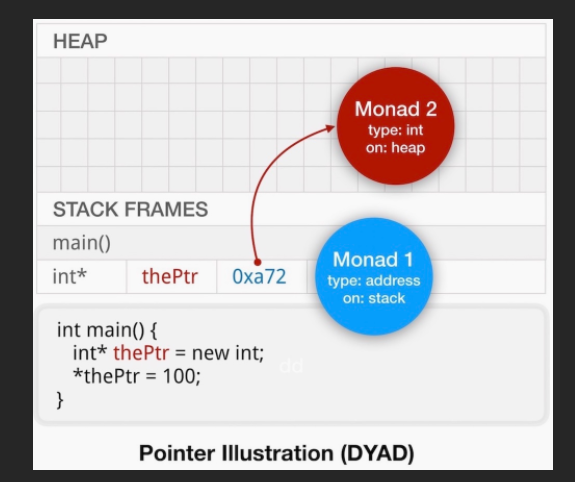

# way to solve problem
1. A way to gather user input.
2. Understand (parse, model)...
3. Tokenize the input, recognize keywords
4. Articulate the problem space (commands)
5. Generate some output
6. Provide error messages

MVC -- Model View Controller

# Variables
1. MONAD
- The most common type of variable, monads have a single part
- subject to data fundamentals discussed earlier.
- Reflect the underlying type;either intrinsic(int,float...)
- By default, monads are transient, occupying space on the stack.
```c++
int i = 10;
char value = 'a';
```
2. DYAD
- The **LHS** usually lives on the stack,and is of type(address). It contains the memory address of the RHS.
- The RHS is a monad of any type, stored on the heap.
  

3. REFERENCE
4. ENUMS
- c-enums
```c
enum basic {first = 10,second, third}
```
- c++ enums
```
class enum improved : char {first = 'a', second = 'b', third = 'c'}
```
5. AUTO
- auto isn't a type in c++, it is a mechanism by which the compiler can auto-detect the associated type.
```c++
int main(){
    auto theValue = 3.14;
}
```

# iteration
1. type1
```cpp
int theInts[] = {100,200,300,400};
const int theCount = std::size(theInts);
for (int i = 0; i < theCount; i++){ std::cout << theInts[i] << "\n";}
//more modern
for (auto theInt: theInts){ std::cout << theInt << "n";}
```
2. type2
```cpp
int theInts[] = {100,200,300,400};
const int theCount = std::size(theInts);
int i = 0;
while (i < theCount){
    std::cout << theInts[i] << "\n";
}
```
3. type3
```cpp
int theInts[] = {100,200,300,400};
const int theCount = std::size(theInts);
int i = 0;
do{
    std::cout << theInts[i] << "\n";
}while(++j < theCount);
```
4. type4
```cpp
void recurse(int aValue,int aMaxinum){
    std::cout << aValue << "\n";
    if (aValue < aMaximum) recurse(aValue + 1,aMaxinum);
}
int main(){
    recurse(0,10);
}
```
5. type5
```c++
#include<algorithm>
void printInt(int aValue){std::cout << aValue << "\n";}

int main(){
    int theInts[] = {100,200,300,400};
    const int theCount = std::size(theInts);
    std::for_each(theInts,theInts + theCount,printInt);
}
```

# making a class in cpp
- your class must provide a default constructor
- every class needs to implement the methods specified in the orthodox canonical form
```cpp
class Foo{
    public:
        Foo();
        Foo(const Foo &aCopy);
        ~Foo();
        Foo& operator=(const Foo &aCopy);
    protected:
        int value;
        std::string str;
}

Foo::Foo():value(0),str(""){};
Foo::Foo(const Foo &aCopy){*this = aCopy;}
~Foo(){};
Foo& Foo::operator=(const Foo &aCopy){
    value = aCopy.value;
    str = aCopy.str;
}
```

## orthodox canonical form
```cpp
class Foo{
    Foo();
    Foo(const Foo &aCopy);
    ~Foo();
    Foo& operator=(const Foo &aCopy);
}
```

# The object AHA
1. class based modeling and inheritance
   1. a class is a blueprint that describes object structure and behavior
   2. each object is an instance - built from the blueprint
   3. classes combine data and methods into a useful abstract model
   4. Methods are functions associated with the class, shared with all of the objects of that class type, to describe and define object behavior
2. encapsulation
   1. permits us hide our implementation details from our users, so that they rely on the services we provide rather than the means by which we provide them.
   2. the primary benefit is that we are free to change our implementation without our users having to change their dependent logic.
3. dynamic message passing
   1. allow one object to request service from another object at any time.
4. polymorphism
   1. compile-time
     ```c++
     int max(int arg1,int arg2){return arg1<arg2? arg2:arg1;}
     float max(float arg1,float arg2){return arg1<arg2? arg2:arg1;}
     int main(){
         float f1{3.14};
         float f2{6.28};
         float f3 = max(f1,f2);
     }
     ```
   2. run-time
   ```cpp
   struct Foo{
       virtual void doSomething(){
           cout << "i am a foo";
       }
   }
    struct Bar{
       virtual void doSomething(){
           cout << "i am a Bar";
       }
   }
   int main(){
       Foo* theFoo = new Bar;
       theFoo -> doSomething();
   }
   ```
   3. run-time with custom dispatch
   4. fully-dynamic
5. open recursion

# operator overloading
1. Arithmetic $\left(+,,{ }^{\star}, l, \% \ldots\right)$
2. Comparison $(<,>,==, \ldots$
3. Logical (!, $\& \&, \| \ldots)$
4. Bitwise $(!, \&, \mid,<<,>>)$
5. Assignment $\left(=,+=,-=,{ }^{\star}=, /=\ldots\right)$
6. Member and pointer $\left(^{\star}, \rightarrow, \&\right)$
7. Index of $\square$
8. Function call ()
9. Memory management (new, delete...)
10. Type conversion operators

## conversion operators
- a conversion operator works in an opposite manner from a conversion constructor. The goal of conversion operators is to allow an object of class A to convert itself to another type

```cpp
class Foo{};
class Bar{
    public:
        Bar();
        Bar(const Bar &aCopy);
        ~Bar();

        operator Foo(){
            return Foo();
        }
};
```

# memory management
- C: alloc,malloc,realloc,free
- C++: new,delete
```cpp
char *theBuffer = new char[100]{0};
delete [] theBuffer;
struct Foo{};
Foo* theFoo = new Foo;
delete theFoo;
```

# type - casts
## in C
- problem: the comiler will blindly try to do what you are asking,even if it does't make sense.
```c
int main(){
    int theValue{12345};
    float theFloat = (float)theValue;
    const char* theString = (char*) theFloat;
}
```
## in cpp
- static_cast: a type-safe version of type-casting
```cpp
Cstruct A{};
struct B{};
struct C: public A{};
int main(){
    A* theA = new A;
    B* theB = new B;
    C* theC = new C;
    theA = static_cast<A*>(theC); // ok
    theA = static_cast<B*>(theB);//will not compile
}

```

- const_cast is used to remove the const-ness of a variable.

```cpp
int main(){
    char theBuffer[1000] = {'h','e','l','l','o','\n'};
    const char* thePtr = &theBuffer; // prevent change to buffer(const char*)
    char* thePtr2 = const_cast<char*>(thePtr);
    stycpy(thePtr2,"what's up");
}
```

# templates
- allow us to write code that is type-independent
## template functions
```cpp
template<typename T>
void swap(T &arg1,T &arg2){
    T temp = arg1;
    arg1 = arg2;
    arg2 = temp;
}

int main(){
    swap<int>(theInt1,theInt2);
}
```

## template methods
```cpp
class Foo{
    Foo(){};
    void swap(T &arg1, T &arg2){};
};
int main(){
    Foo theFoo;
    theFool.swap(theInt1,theInt2);
}
```
## template class

# STL
1. container
   1. sequence
      1. vector
      2. deque
      3. forward-list and list
      4. array
      5. stack
      6. queue
      7. priority-queue
   2. associative
      1. set
      2. map
2. iterators
3. algorithm
4. functors


# functor
- without functor
```cpp
int value = 0;
int add(int i){
    value += i;
}
int main(){
    int theInts[10] = {1,2,3,4,5,6,7,8,9,0};
    for (int theInt: theInts){
        add(theInt);
        cout << value << endl;
    }
}
```
- using functor
```cpp
struct Functor{
    Functor(int aValue):value(aValue){};
    Functor(const Functor &aCopy){};
    Functor& operator=();

    int operate()(int aDelta){
        value += aDelta;
        return value;
    }
    int getValue(){return value};
protected:
    int value;
}

int main(){
    Functor theFunctor;
    int theInts[10] = {1,2,3,4,5,6,7,8,9,0};
    for (int theInt: theInts){
        theFunctor(theInt);
    }
    cout << theFunctor.getValue() << endl;
}
```