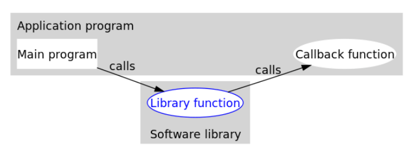
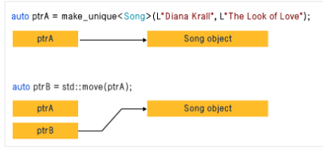

[toc]
# MVC -- Model View Controller

# Variables
1. MONAD
- The most common type of variable, monads have a single part
- subject to data fundamentals discussed earlier.
- Reflect the underlying type;either intrinsic(int,float...)
- By default, monads are transient, occupying space on the stack.
```c++
int i = 10;
char value = 'a';
```
2. DYAD
- The **LHS** usually lives on the stack,and is of type(address). It contains the memory address of the RHS.
- The RHS is a monad of any type, stored on the heap.
  

3. REFERENCE
4. ENUMS
- c-enums
```c
enum basic {first = 10,second, third}
```
- c++ enums
```c++
class enum improved : char {first = 'a', second = 'b', third = 'c'}
```
5. AUTO
- auto isn't a type in c++, it is a mechanism by which the compiler can auto-detect the associated type.
```c++
int main(){
    auto theValue = 3.14;
}
```

# iteration
1. type1
```cpp
int theInts[] = {100,200,300,400};
const int theCount = std::size(theInts);
for (int i = 0; i < theCount; i++){ std::cout << theInts[i] << "\n";}
//more modern
for (auto theInt: theInts){ std::cout << theInt << "n";}
```
2. type2
```cpp
int theInts[] = {100,200,300,400};
const int theCount = std::size(theInts);
int i = 0;
while (i < theCount){
    std::cout << theInts[i] << "\n";
}
```
3. type3
```cpp
int theInts[] = {100,200,300,400};
const int theCount = std::size(theInts);
int i = 0;
do{
    std::cout << theInts[i] << "\n";
}while(++j < theCount);
```
4. type4
```cpp
void recurse(int aValue,int aMaxinum){
    std::cout << aValue << "\n";
    if (aValue < aMaximum) recurse(aValue + 1,aMaxinum);
}
int main(){
    recurse(0,10);
}
```
5. type5
```c++
#include<algorithm>
void printInt(int aValue){std::cout << aValue << "\n";}

int main(){
    int theInts[] = {100,200,300,400};
    const int theCount = std::size(theInts);
    std::for_each(theInts,theInts + theCount,printInt);
}
```

# making a class in cpp
- your class must provide a default constructor
- every class needs to implement the methods specified in the orthodox canonical form
```cpp
class Foo{
    public:
        Foo();
        Foo(const Foo &aCopy);
        ~Foo();
        Foo& operator=(const Foo &aCopy);
    protected:
        int value;
        std::string str;
}

Foo::Foo():value(0),str(""){};
Foo::Foo(const Foo &aCopy){*this = aCopy;}
~Foo(){};
Foo& Foo::operator=(const Foo &aCopy){
    value = aCopy.value;
    str = aCopy.str;
}
```

## orthodox canonical form
```cpp
class Foo{
    Foo();
    Foo(const Foo &aCopy);
    ~Foo();
    Foo& operator=(const Foo &aCopy);
}
```

# polymorphism
 1. compile-time
   ```c++
   int max(int arg1,int arg2){return arg1<arg2? arg2:arg1;}
   float max(float arg1,float arg2){return arg1<arg2? arg2:arg1;}
   int main(){
       float f1{3.14};
       float f2{6.28};
       float f3 = max(f1,f2);
   }
   ```
 2. run-time
 ```cpp
 struct Foo{
     virtual void doSomething(){
         cout << "i am a foo";
     }
 }
  struct Bar{
     virtual void doSomething(){
         cout << "i am a Bar";
     }
 }
 int main(){
     Foo* theFoo = new Bar;
     theFoo -> doSomething();
 }
 ```
 3. run-time with custom dispatch
 4. fully-dynamic


# operator overloading
1. Arithmetic $\left(+,,{ }^{\star}, l, \% \ldots\right)$
2. Comparison $(<,>,==, \ldots$
3. Logical (!, $\& \&, \| \ldots)$
4. Bitwise $(!, \&, \mid,<<,>>)$
5. Assignment $\left(=,+=,-=,{ }^{\star}=, /=\ldots\right)$
6. Member and pointer $\left(^{\star}, \rightarrow, \&\right)$
7. Index of $\square$
8. Function call ()
9. Memory management (new, delete...)
10. Type conversion operators

## conversion operators
- a conversion operator works in an opposite manner from a conversion constructor. The goal of conversion operators is to allow an object of class A to convert itself to another type

```cpp
class Foo{};
class Bar{
    public:
        Bar();
        Bar(const Bar &aCopy);
        ~Bar();

        operator Foo(){
            return Foo();
        }
};
```

# memory management
- C: alloc,malloc,realloc,free
- C++: new,delete
```cpp
char *theBuffer = new char[100]{0};
delete [] theBuffer;
struct Foo{};
Foo* theFoo = new Foo;
delete theFoo;
```

# type - casts
## in C
- problem: the comiler will blindly try to do what you are asking,even if it does't make sense.
```c
int main(){
    int theValue{12345};
    float theFloat = (float)theValue;
    const char* theString = (char*) theFloat;
}
```
## in cpp
- static_cast: a type-safe version of type-casting
```cpp
struct A{};
struct B{};
struct C: public A{};
int main(){
    A* theA = new A;
    B* theB = new B;
    C* theC = new C;
    theA = static_cast<A*>(theC); // ok
    theA = static_cast<B*>(theB);//will not compile
}

```

- const_cast is used to remove the const-ness of a variable.

```cpp
int main(){
    char theBuffer[1000] = {'h','e','l','l','o','\n'};
    const char* thePtr = &theBuffer; // prevent change to buffer(const char*)
    char* thePtr2 = const_cast<char*>(thePtr);
    stycpy(thePtr2,"what's up");
}
```

# templates
- allow us to write code that is type-independent
## template functions
```cpp
template<typename T>
void swap(T &arg1,T &arg2){
    T temp = arg1;
    arg1 = arg2;
    arg2 = temp;
}

int main(){
    swap<int>(theInt1,theInt2);
}
```

## template methods
```cpp
class Foo{
    Foo(){};
    void swap(T &arg1, T &arg2){};
};
int main(){
    Foo theFoo;
    theFool.swap(theInt1,theInt2);
}
```
## template class

# functor
- without functor
```cpp
int value = 0;
int add(int i){
    value += i;
}
int main(){
    int theInts[10] = {1,2,3,4,5,6,7,8,9,0};
    for (int theInt: theInts){
        add(theInt);
        cout << value << endl;
    }
}
```
- using functor
```cpp
struct Functor{
    Functor(int aValue):value(aValue){};
    Functor(const Functor &aCopy){};
    Functor& operator=();

    int operate()(int aDelta){
        value += aDelta;
        return value;
    }
    int getValue(){return value};
protected:
    int value;
}

int main(){
    Functor theFunctor;
    int theInts[10] = {1,2,3,4,5,6,7,8,9,0};
    for (int theInt: theInts){
        theFunctor(theInt);
    }
    cout << theFunctor.getValue() << endl;
}
```
# RAII
- resource acquisition is initialization
- 利用c++构造的对象最终会被销毁的原则
- RAII的做法是使用一个对象，在其构造时获取对应的资源，在对象生命期内控制对资源的访问，使之始终保持有效，最后在对象析构的时候，释放构造时获取的资源
- 理解： 在destructor 中释放资源 如 fd.close(), delete p

```cpp
class BufferManager{
public:
    BufferManager(size_t aPreSize = 0){
        if (aPreSize) buffer = new char[aPreSize];

    }
    ~BufferManager(){delete buffer;}
}
```

# efficiency
1. time efficiency
2. space efficiency
3. cognitive efficiency
4. testing efficiency

# partial template specialization
- 部分模板特化
## 问题提出：
- 实现json的写入

## 解决方法一：
```cpp
class Foo{
    Foo& toJSON(std:stream &anOutput){
        anOutput << "id" << "\"" << ":" << id << "\n";
        anOutput << "amount" << "\"" << ":" << amount << "\n";
        anOutput << "name" << "\"" << ":" << name << "\n";
    }
}

```

## 解决方法二：
```cpp
class JSONWriter{
    public:
    JSONWriter& writeInt(const int &aValue);
    JSONWriter& writeFloat(const float &aValue);
    JSONWriter& writeBool(const bool &aValue);
    JSONWriter& writeString(const std::string &aValue);
}
```

## 解决方法三：
```cpp
class JSONWriter{
    public:
    JSONWriter& writeKeyValue(const std::string &aValue,aKey,const int &aValue);
    JSONWriter& writeKeyValue(const std::string &aValue,aKey,const float &aValue);
    JSONWriter& writeKeyValue(const std::string &aValue,aKey,const bool &aValue);
    JSONWriter& writeKeyValue(const std::string &aValue,aKey,const std::string &aValue);
}
```

## 解决方法四：
```cpp
class JSONWriter{
    public:
    template<typename T>
    JSONWriter& writeKeyValue(const std::string &aValue,aKey,const T &aValue);

    template<>
    JSONWriter& writeKeyValue(const std::string &aValue,aKey,const bool &aValue);

    template<>
    JSONWriter& writeKeyValue(const std::string &aValue,aKey,const std::string &aValue);
    private:
    std::stream &output;
}
```

#  friend
- 友元函数和友元类
- 友元函数内部可以访问该类对象的私有成员
```cpp
class CCar;  
class CDriver
{
public:
    void ModifyCar(CCar* pCar);  //改装汽车
};
class CCar
{
private:
    int price;
    friend int MostExpensiveCar(CCar cars[], int total);  
    friend void CDriver::ModifyCar(CCar* pCar);  
};
```

- 友元类的所有成员函数都可以访问对方对象的私有成员
```cpp
class CCar
{
private:
    int price;
    friend class CDriver;  
};
class CDriver
{
public:
    CCar myCar;
    void ModifyCar()  
    {
        myCar.price += 1000;  
    }
};

```

# CRTP (奇异的递归模板模式)
1. 继承自模板类。
2. 派生类将自身作为参数传给模板类

```cpp
template <typename T>
class Base
{
public:
    void doSomething()
    {
        T& derived = static_cast<T&>(*this);
    }
};

class Derived : public Base<Derived>
{
public:
    void doSomething()
    {
         std::cout << " Derived class " << std::endl;
    }  
};
```

- 作用： 
  - 通过static_cast 把基类转化为派生类，实现基类对象对派生对象的访问
  - 多态是个很好的特性，但是动态绑定比较慢，因为要查虚函数表。而使用 CRTP，完全消除了动态绑定，降低了继承带来的虚函数表查询开销。
  - 具体应用： https://zhuanlan.zhihu.com/p/137879448

# mixin
- Template Parameters as Base Classes
## 问题提出
```
class DerivePrint1 : public BasePrint
{
public :
    virtual void myprint() {
        cout<<"Hello World 1!"<<endl;
    }
    virtual void print() {
        myprint();
    }
};

class DerivePrint2 : public BasePrint
{
public :
    virtual void myprint() {
        cout<<"Hello World 2!"<<endl;
    }
    virtual void print() {
        myprint();
    }
};

class myClass:public DerivePrint1,public DerivePrint2{
};

int main()
{
    myClass my;
    // error，触发了多重继承的问题
    my.print();
}
```
- print 定义不清晰

## mixin解决方法
```
template <typename T>
class DerivePrint1 : public T
{
public :
    void print() {
        cout<<"Hello World 1!"<<endl;
        T::print();
    }
};

template <typename T>
class DerivePrint2 : public T
{
public :
    void print() {
        cout<<"Hello World 2!"<<endl;
        T::print();
    }
};

class myClass{
public:
    void print(){
        cout<<"myClass"<<endl;
    }
};

```
# code smell
1. Bloaters: over-engineering
   1. overly long method
   2. excessively long argument lists
   3. over-engineered primitives
2. oop abuse
   1. unnecessary switch statements
   2. poorly factored methods
   3. temporary fields
   4. poor inheritance design
   5. class alternatives with varying interfaces
3. ice-age
   1. change preventers are practices is make changing code more difficult,time-consuming or expense.
4. dispensables
   1. lazy classes
   2. duplicate code
   3. dead code
5. anti-social network
   1. unnecessary coupling or dependencies
   2. middle man
   3. message chains
   4. overly dependent hierarchies


- 参考资料： https://refactoring.guru/refactoring/smells


# 仿函数Functor
- c++中： 重载operator() 运算符
```cpp
class compare_class{
public:
    bool operator()(int A, int B)const{return A < B;}
};
// Declaration of C++ sorting function.
template<class ComparisonFunctor>
void sort_init(int *begin_items, int num_item, CompareFunctor c)
{
    for(int i = 0; i < num_item; i++)
    {
        for(int j = i + 1; j < num_item; j++)
        {
            if( c(begin_items[i], begin_items[j]) )
            {
                int temp = begin_items[i];
                begin_items[i] = begin_items[j];
                begin_items[j] = temp;
            }
        }
    }
}
int main(){
    int items[]={4, 3, 1, 2};
    compare_class functor;
    sort_ints(items, sizeof(items)/sizeof(items[0]), functor);
}
````
- Java: 实现包含单个函数的接口
```java
List<String> list =Arrays.asList("10", "1", "20", "11", "21", "12");
Comparator<String> numStringComparator =new Comparator<String>(){
    publicint compare(String o1, String o2){
        returnInteger.valueOf(o1).compareTo(Integer.valueOf(o2));
    }
};
Collections.sort(list, numStringComparator);
```

- 作用：
  - 有些功能实现的代码，会不断的在不同的成员函数中用到，但是又不好将这些代码独立出来成为一个类的一个成员函数
  - 函数拥有类的性质，安全传递函数指针
  - 公共的函数但不让函数用到的一些变量，成为公共的全局变量

# callback 回调函数
  

- 举例：
  - 排序算法的人可以写好了算法，但是compare由callback提供。这个是同步回调。但是sort算法和compare解耦了。
  - 起始函数是调用sort()的人，中间函数是sort()，回调函数是compare()

# std:function
- 包装一个类的静态成员函数，成员函数，函数，functor，使其成为Functor
- 可以统一不同的函数对象类型
- 用法：
  - 一般形式
    ```cpp
    std::function< int(int)> Functional;
    auto lambda = [](int a)->int{ return a; };
    Functional = lambda;
    result = Functional(20);
    ```
  - 类的成员函数需要额外使用std::bind
    ```cpp    
    TestClass testObj;
    Functional = std::bind(&TestClass::ClassMember, testObj, std::placeholders::_1);
    result = Functional(40);
    ```

# std::bind
- 它可以预先把指定可调用实体的某些参数绑定到已有的变量，产生一个新的可调 用实体
- 回调函数的使用过程中也颇为有用
```cpp
auto bindFunc1 = bind(TestFunc, std::placeholders::_1, 'A', 100.1);
bindFunc1(10);
```
- 注意点
  - 预先绑定的参数，是pass-by-value的
  - 对于不事先绑定的参数，需要传std::placeholders进去，从_1开始，依次递增。placeholder是pass-by-reference的
  - 如果想预先绑定引用传递，需要用std::ref和std::cref


# std::thread
- 构造函数传参为值传递，如果需要传引用需要用std::ref

# std::mem_fm
- 类似 std::bind， 写法更简洁但是不能绑定参数

# lock_guard 和unique_guard
- lock_guard使用起来比较简单，除了构造函数外没有其他member function
- unique_guard除了lock_guard的功能外，提供了更多的member_function
- unique_lock是对lock_guard的扩展，允许在生命周期内再调用lock和unlock来加解锁以切换锁的状态
- 类 unique_lock 是通用互斥包装器，允许延迟锁定、锁定的有时限尝试、递归锁定、所有权转移和与条件变量一同使用

# std::scoped_lock lock_guard
- scoped-lock是lock——guard的升级，一般情况使用scoped lock
- scoped-lock 可以一次传入多个锁
```cpp
friend void swap(X& lhs, X& rhs)
{
    if (&lhs == & rhs)
        return;
    std::lock(lhs.m, rhs.m);
    std::lock_guard<std::mutex> lock_a(lhs.m, std::adopt_lock);
    std::lock_guard<std::mutex> lock_b(rhs.m, std::adopt_lock);
    swap(lhs.some_detail, rhs.some_detail);
}
vs.

friend void swap(X& lhs, X& rhs)
{
    if (&lhs == &rhs)
        return;
    std::scoped_lock guard(lhs.m, rhs.m);
    swap(lhs.some_detail, rhs.some_detail);
}
```

# explicit关键字
-  在C++中, 如果的构造函数只有一个参数时, 那么在编译的时候就会有一个缺省的转换操作:将该构造函数对应数据类型的数据转换为该类对象.
-  explicit关键字的作用就是防止类构造函数的隐式自动转换
-  如果类构造函数参数大于或等于两个时, 是不会产生隐式转换的
-  除了第一个参数以外的其他参数都有默认值的时候, explicit关键字依然有效
-  https://blog.csdn.net/guoyunfei123/article/details/89003369

# mutable 关键字
- 在C++中，mutable也是为了突破const的限制而设置的。被mutable修饰的变量，将永远处于可变的状态，即使在一个const函数中

# const 函数
- 如果类的成员函数不会改变对象的状态，那么这个成员函数一般会声明成const的

# std::unique_ptr
  

# C++模板的偏特化与全特化
## 函数模板
```cpp
// 类模板
template <class T1, class T2>
class A{
    T1 data1;
    T2 data2;
};

// 函数模板
template <class T>
T max(const T lhs, const T rhs){   
    return lhs > rhs ? lhs : rhs;
}
```

## 全特化
```cpp
// 全特化类模板
template <>
class A<int, double>{
    int data1;
    double data2;
};

// 函数模板
template <>
int max(const int lhs, const int rhs){   
    return lhs > rhs ? lhs : rhs;
}

template <class T>
void f(){ T d; }

template <>
void f<int>(){ int d; }
```

## 偏特化
```cpp
template <class T2>
class A<int, T2>{
    ...
};

```
- 函数模板不允许偏特化,但可以重载
```cpp
template <class T1, class T2>
void f(){}

template <class T2>
void f<int, T2>(){}//错误

template <class T2>
void f(){}              // 注意：这里没有"模板实参"

```

# 函数式编程特点
- 函数是"第一等公民"，函数与其他数据类型一样，处于平等地位
- 只用"表达式"，不用"语句"。"表达式"（expression）是一个单纯的运算过程，总是有返回值；"语句"（statement）是执行某种操作，没有返回值。
- 没有"副作用"。函数要保持独立，所有功能就是返回一个新的值，没有其他行为，尤其是不得修改外部变量的值。
- 不修改状态。函数式编程只是返回新的值。不修改变量，意味着状态不能保存在变量中。函数式编程使用参数保存状态，最好的例子就是递归。
- 引用透明。函数的运行不依赖于外部变量或"状态"，只依赖于输入的参数。

# C++'s most vexing parse
## 1
T1 name(T2());
这是一个 declaration statement。
既可视作声明了一个类型为 T1 名为 name 的 object，并且用一个类型为 T2 的 object 作为其 initilizer（即标准中所谓「an object declaration with a function-style cast as the initializer」），也可视作声明了一个返回值类型为 T1 名为 name 的函数，此函数有一个参数，参数类型为「指向返回值类型为 T2，参数为空的函数的指针」。

C++ 标准规定把这样的 statement 视作函数声明。

## 2
T1 name1(T2(name2));

根据 C++ 标准，此时不把 T2(name2) 视为「a function style cast」，而将其视为 T2 name2，这样整个语句就变成
T1 name1(T2 name2);，显然这是个函数声明。

类似地，
T1 name1(T2(name2), T3(name3)); 被视作 T1 name1(T2 name2, T3 name3);

# future_task, promise区别
https://www.cnblogs.com/guxuanqing/p/11360572.html

# steady_clock， system_clock 和 high_resolution_clock
- steady_clock 是单调的时钟，相当于教练手中的秒表；只会增长，适合用于记录程序耗时；
- system_clock 是系统的时钟；因为系统的时钟可以修改；甚至可以网络对时； 所以用系统时间计算时间差可能不准。
- high_resolution_clock 是当前系统能够提供的最高精度的时钟；它也是不可以修改的。相当于 steady_clock 的高精度版本。

# C++11中的POD和Trivial
## POD类型
- POD是一个类型属性，既不是关键字也不会像”volatile”用来修饰类型信息
- POD类型，说明该数据是普通的，不会有什么虚函数啊，虚继承啊，或者内嵌的数据类型很复杂的情况。
- 可以直接使用memcpy()直接复制而不会出现任何问题
- 两种最基本的属性：
  1. 支持静态初始化
  2. 编译C++中的POD类型所得到的内存布局，和C中编译struct的内存布局相同

## Trivial平凡类型
- 拥有平凡的构造函数(trivial constructor)和析构函数(trivial destructor)
  - 通常情况下，不定义类的构造函数，编译器就会为我们生成一个平凡的默认构造函数   
- 拥有平凡的拷贝构造函数（trivial copy constructor）和移动构造函数（trivial copy constructor)
  - 编译器在用户不提供的情况下，通常会提供平凡的拷贝构造函数
  - 拥有平凡的拷贝赋值运算符（trivial assignment operator）和移动赋值运算符（move operator）
  - 不能包含虚函数以及虚基类
- C++11提供了内置函数来支持Trivial类型的判断: template <typename T> struct std::is_trivial

## POD类型的好处
- 字节赋值(bytewise copy)。可以使用memset和memcpy对POD类型进行初始化
- 提供对C内存布局的兼容。C++程序可以与C函数进行交互操作，POD类型保证这种在C与C++之间的操作总是安全的
- 保证了静态初始化的安全有效，用于提供程序性能。直接放入.bss段，在初始化中直接赋0

# c++ 内存序
- https://www.cnblogs.com/mataiyuan/p/13372374.html
- memory_order_release保证在这个操作之前的memory accesses不会重排到这个操作之后去，但是这个操作之后的memory accesses可能会重排到这个操作之前去。
- memory_order_acquire保证在这个操作之后的memory accesses不会重排到这个操作之前去，但是这个操作之前的memory accesses可能会重排到这个操作之后去。
- 对于seq_cst模式下的操作，所有memory accesses操作的重排不允许跨域这个操作，同时这个限制是双向的
- Consume是一个相比Acquire/Release更加宽松的内存模型，对非依赖的变量也去除了happens-before的限制
- memory_order_relaxed没有happens-before的约束，编译器和处理器可以对memory access做任何的re-order

# Cache ping-pong
- cache ping-pong等效于cache失效，每次CPU都要从RAM中加载数据，这会导致很大的性能问题，这也是编写多线程程序需要考虑的设计问题。应该尽量避免代码中多个线程对同一数据资源的竞争。

- 当多个core要并行操作内存中的同一份数据，就会出现Cache ping-pong的问题，举个例子：
  1. core1 从内存中加载Cache line做操作
  2. core2 也要对这个数据操作，于是它也加载了这个Cache line。core1发现core2加载了这个cache line，于是让自己的加载的cache line失效
  3. core1 又需要处理这个数据，core1需要重新从内存中加载这个cache line，同时导致core2的cache line失效
  4. core2 又要处理这个数据，又要加载cache line，导致core1的cache line失效
  5. 如此反复。