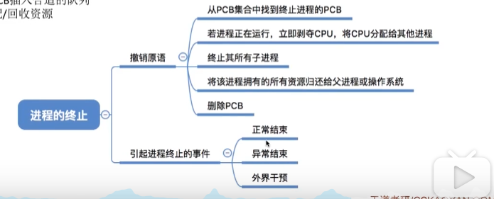
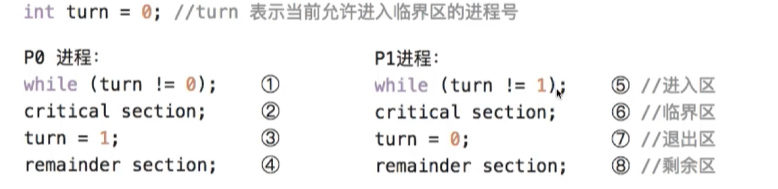
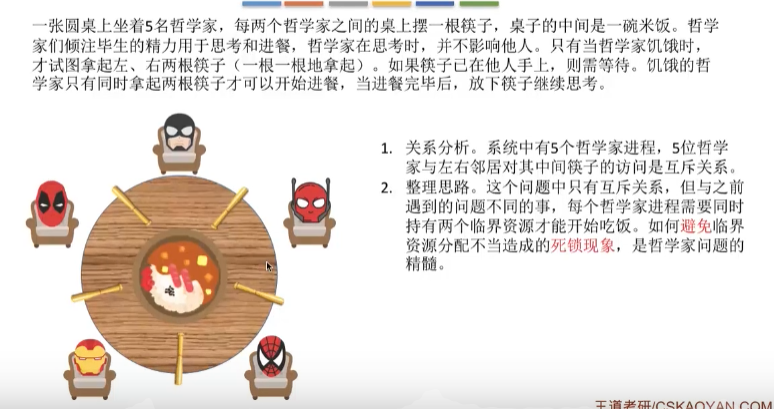
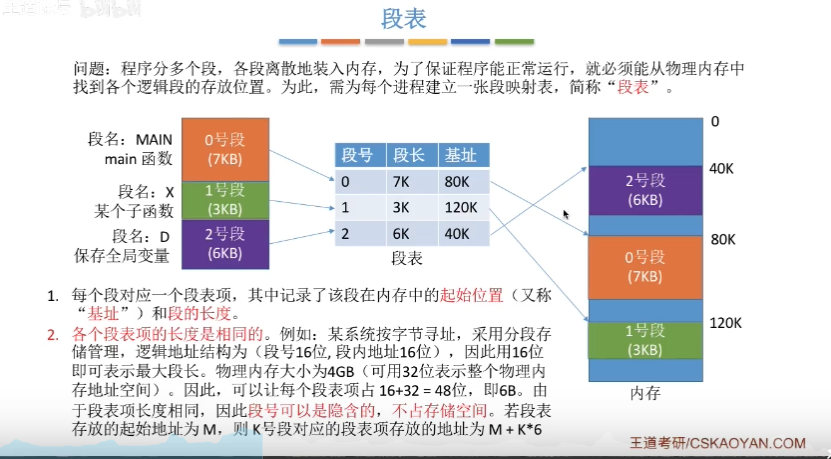
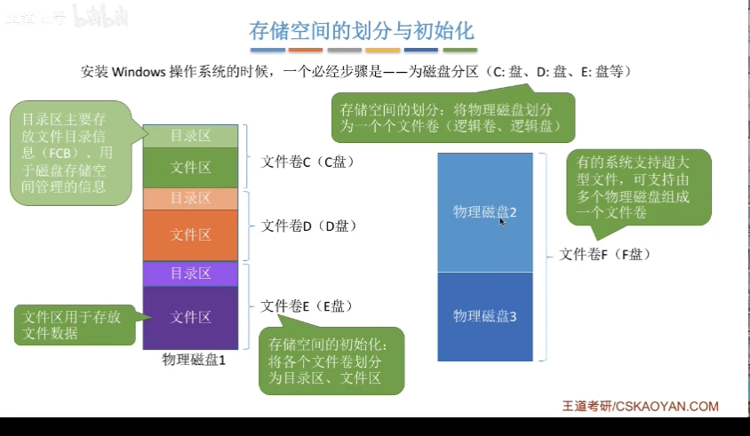

<!-- START doctoc generated TOC please keep comment here to allow auto update -->
<!-- DON'T EDIT THIS SECTION, INSTEAD RE-RUN doctoc TO UPDATE -->
**Table of Contents**  *generated with [DocToc](https://github.com/thlorenz/doctoc)*

- [操作系统的概念](#%E6%93%8D%E4%BD%9C%E7%B3%BB%E7%BB%9F%E7%9A%84%E6%A6%82%E5%BF%B5)
- [操作系统的功能和目标](#%E6%93%8D%E4%BD%9C%E7%B3%BB%E7%BB%9F%E7%9A%84%E5%8A%9F%E8%83%BD%E5%92%8C%E7%9B%AE%E6%A0%87)
  - [系统资源的管理者](#%E7%B3%BB%E7%BB%9F%E8%B5%84%E6%BA%90%E7%9A%84%E7%AE%A1%E7%90%86%E8%80%85)
  - [用户与计算机硬件之间的接口](#%E7%94%A8%E6%88%B7%E4%B8%8E%E8%AE%A1%E7%AE%97%E6%9C%BA%E7%A1%AC%E4%BB%B6%E4%B9%8B%E9%97%B4%E7%9A%84%E6%8E%A5%E5%8F%A3)
  - [作为最接近硬件的层次](#%E4%BD%9C%E4%B8%BA%E6%9C%80%E6%8E%A5%E8%BF%91%E7%A1%AC%E4%BB%B6%E7%9A%84%E5%B1%82%E6%AC%A1)
- [操作系统的特征](#%E6%93%8D%E4%BD%9C%E7%B3%BB%E7%BB%9F%E7%9A%84%E7%89%B9%E5%BE%81)
  - [并发](#%E5%B9%B6%E5%8F%91)
  - [共享](#%E5%85%B1%E4%BA%AB)
  - [虚拟](#%E8%99%9A%E6%8B%9F)
  - [异步](#%E5%BC%82%E6%AD%A5)
- [操作系统的运行机制和体系结构](#%E6%93%8D%E4%BD%9C%E7%B3%BB%E7%BB%9F%E7%9A%84%E8%BF%90%E8%A1%8C%E6%9C%BA%E5%88%B6%E5%92%8C%E4%BD%93%E7%B3%BB%E7%BB%93%E6%9E%84)
  - [什么是指令：](#%E4%BB%80%E4%B9%88%E6%98%AF%E6%8C%87%E4%BB%A4)
  - [分类](#%E5%88%86%E7%B1%BB)
  - [两种处理器状态](#%E4%B8%A4%E7%A7%8D%E5%A4%84%E7%90%86%E5%99%A8%E7%8A%B6%E6%80%81)
  - [内核程序和应用程序](#%E5%86%85%E6%A0%B8%E7%A8%8B%E5%BA%8F%E5%92%8C%E5%BA%94%E7%94%A8%E7%A8%8B%E5%BA%8F)
  - [操作系统的内核](#%E6%93%8D%E4%BD%9C%E7%B3%BB%E7%BB%9F%E7%9A%84%E5%86%85%E6%A0%B8)
  - [大内核与微内核](#%E5%A4%A7%E5%86%85%E6%A0%B8%E4%B8%8E%E5%BE%AE%E5%86%85%E6%A0%B8)
- [中断和异常](#%E4%B8%AD%E6%96%AD%E5%92%8C%E5%BC%82%E5%B8%B8)
  - [中断的概念和作用：](#%E4%B8%AD%E6%96%AD%E7%9A%84%E6%A6%82%E5%BF%B5%E5%92%8C%E4%BD%9C%E7%94%A8)
  - [用户态，核心态的切换是怎么实现的？](#%E7%94%A8%E6%88%B7%E6%80%81%E6%A0%B8%E5%BF%83%E6%80%81%E7%9A%84%E5%88%87%E6%8D%A2%E6%98%AF%E6%80%8E%E4%B9%88%E5%AE%9E%E7%8E%B0%E7%9A%84)
  - [中断的分类](#%E4%B8%AD%E6%96%AD%E7%9A%84%E5%88%86%E7%B1%BB)
  - [外中断的处理过程](#%E5%A4%96%E4%B8%AD%E6%96%AD%E7%9A%84%E5%A4%84%E7%90%86%E8%BF%87%E7%A8%8B)
- [系统调用](#%E7%B3%BB%E7%BB%9F%E8%B0%83%E7%94%A8)
  - [是什么](#%E6%98%AF%E4%BB%80%E4%B9%88)
  - [分类](#%E5%88%86%E7%B1%BB-1)
  - [系统调用与库函数的区别](#%E7%B3%BB%E7%BB%9F%E8%B0%83%E7%94%A8%E4%B8%8E%E5%BA%93%E5%87%BD%E6%95%B0%E7%9A%84%E5%8C%BA%E5%88%AB)
  - [系统调用背后](#%E7%B3%BB%E7%BB%9F%E8%B0%83%E7%94%A8%E8%83%8C%E5%90%8E)
- [进程](#%E8%BF%9B%E7%A8%8B)
  - [定义](#%E5%AE%9A%E4%B9%89)
  - [进程的组成](#%E8%BF%9B%E7%A8%8B%E7%9A%84%E7%BB%84%E6%88%90)
  - [进程的组织](#%E8%BF%9B%E7%A8%8B%E7%9A%84%E7%BB%84%E7%BB%87)
    - [链接方式](#%E9%93%BE%E6%8E%A5%E6%96%B9%E5%BC%8F)
    - [索引表方式（类似）](#%E7%B4%A2%E5%BC%95%E8%A1%A8%E6%96%B9%E5%BC%8F%E7%B1%BB%E4%BC%BC)
  - [进程的特征](#%E8%BF%9B%E7%A8%8B%E7%9A%84%E7%89%B9%E5%BE%81)
  - [进程的状态](#%E8%BF%9B%E7%A8%8B%E7%9A%84%E7%8A%B6%E6%80%81)
  - [进程状态的转换：](#%E8%BF%9B%E7%A8%8B%E7%8A%B6%E6%80%81%E7%9A%84%E8%BD%AC%E6%8D%A2)
- [进程控制](#%E8%BF%9B%E7%A8%8B%E6%8E%A7%E5%88%B6)
  - [创建原语](#%E5%88%9B%E5%BB%BA%E5%8E%9F%E8%AF%AD)
  - [撤销原语](#%E6%92%A4%E9%94%80%E5%8E%9F%E8%AF%AD)
  - [阻塞和唤醒原语](#%E9%98%BB%E5%A1%9E%E5%92%8C%E5%94%A4%E9%86%92%E5%8E%9F%E8%AF%AD)
  - [进程的切换](#%E8%BF%9B%E7%A8%8B%E7%9A%84%E5%88%87%E6%8D%A2)
- [进程通信](#%E8%BF%9B%E7%A8%8B%E9%80%9A%E4%BF%A1)
  - [实现方式](#%E5%AE%9E%E7%8E%B0%E6%96%B9%E5%BC%8F)
- [线程模型](#%E7%BA%BF%E7%A8%8B%E6%A8%A1%E5%9E%8B)
  - [进程带来的变化](#%E8%BF%9B%E7%A8%8B%E5%B8%A6%E6%9D%A5%E7%9A%84%E5%8F%98%E5%8C%96)
  - [线程的属性](#%E7%BA%BF%E7%A8%8B%E7%9A%84%E5%B1%9E%E6%80%A7)
  - [线程的实现方式](#%E7%BA%BF%E7%A8%8B%E7%9A%84%E5%AE%9E%E7%8E%B0%E6%96%B9%E5%BC%8F)
    - [用户级线程](#%E7%94%A8%E6%88%B7%E7%BA%A7%E7%BA%BF%E7%A8%8B)
    - [内核级线程](#%E5%86%85%E6%A0%B8%E7%BA%A7%E7%BA%BF%E7%A8%8B)
    - [多线程模型](#%E5%A4%9A%E7%BA%BF%E7%A8%8B%E6%A8%A1%E5%9E%8B)
- [处理机调度](#%E5%A4%84%E7%90%86%E6%9C%BA%E8%B0%83%E5%BA%A6)
  - [概念](#%E6%A6%82%E5%BF%B5)
  - [时机](#%E6%97%B6%E6%9C%BA)
  - [临界资源](#%E4%B8%B4%E7%95%8C%E8%B5%84%E6%BA%90)
  - [临界区](#%E4%B8%B4%E7%95%8C%E5%8C%BA)
- [进程调度的方式](#%E8%BF%9B%E7%A8%8B%E8%B0%83%E5%BA%A6%E7%9A%84%E6%96%B9%E5%BC%8F)
  - [调度算法的评价指标](#%E8%B0%83%E5%BA%A6%E7%AE%97%E6%B3%95%E7%9A%84%E8%AF%84%E4%BB%B7%E6%8C%87%E6%A0%87)
  - [调度算法](#%E8%B0%83%E5%BA%A6%E7%AE%97%E6%B3%95)
    - [先来先服务（FCFS)](#%E5%85%88%E6%9D%A5%E5%85%88%E6%9C%8D%E5%8A%A1fcfs)
    - [短作业优先（sjf）](#%E7%9F%AD%E4%BD%9C%E4%B8%9A%E4%BC%98%E5%85%88sjf)
    - [高响应比优先（HRNN）](#%E9%AB%98%E5%93%8D%E5%BA%94%E6%AF%94%E4%BC%98%E5%85%88hrnn)
    - [时间片轮转调度算法（RR）](#%E6%97%B6%E9%97%B4%E7%89%87%E8%BD%AE%E8%BD%AC%E8%B0%83%E5%BA%A6%E7%AE%97%E6%B3%95rr)
    - [优先级调度算法](#%E4%BC%98%E5%85%88%E7%BA%A7%E8%B0%83%E5%BA%A6%E7%AE%97%E6%B3%95)
    - [多级反馈调度算法](#%E5%A4%9A%E7%BA%A7%E5%8F%8D%E9%A6%88%E8%B0%83%E5%BA%A6%E7%AE%97%E6%B3%95)
- [进程同步](#%E8%BF%9B%E7%A8%8B%E5%90%8C%E6%AD%A5)
- [进程互斥](#%E8%BF%9B%E7%A8%8B%E4%BA%92%E6%96%A5)
- [进程互斥的软件实现方法](#%E8%BF%9B%E7%A8%8B%E4%BA%92%E6%96%A5%E7%9A%84%E8%BD%AF%E4%BB%B6%E5%AE%9E%E7%8E%B0%E6%96%B9%E6%B3%95)
  - [单标志法](#%E5%8D%95%E6%A0%87%E5%BF%97%E6%B3%95)
  - [双标志先检查法](#%E5%8F%8C%E6%A0%87%E5%BF%97%E5%85%88%E6%A3%80%E6%9F%A5%E6%B3%95)
  - [双标志后检查法](#%E5%8F%8C%E6%A0%87%E5%BF%97%E5%90%8E%E6%A3%80%E6%9F%A5%E6%B3%95)
  - [Peterson算法](#peterson%E7%AE%97%E6%B3%95)
- [进程互斥的硬件实现方法](#%E8%BF%9B%E7%A8%8B%E4%BA%92%E6%96%A5%E7%9A%84%E7%A1%AC%E4%BB%B6%E5%AE%9E%E7%8E%B0%E6%96%B9%E6%B3%95)
  - [中断屏蔽方法](#%E4%B8%AD%E6%96%AD%E5%B1%8F%E8%94%BD%E6%96%B9%E6%B3%95)
  - [Testandset指令](#testandset%E6%8C%87%E4%BB%A4)
  - [swap指令](#swap%E6%8C%87%E4%BB%A4)
- [信号量控制](#%E4%BF%A1%E5%8F%B7%E9%87%8F%E6%8E%A7%E5%88%B6)
  - [信号量机制](#%E4%BF%A1%E5%8F%B7%E9%87%8F%E6%9C%BA%E5%88%B6)
  - [整型信号量](#%E6%95%B4%E5%9E%8B%E4%BF%A1%E5%8F%B7%E9%87%8F)
  - [记录型信号](#%E8%AE%B0%E5%BD%95%E5%9E%8B%E4%BF%A1%E5%8F%B7)
  - [信号量机制实现进程互斥（信号量初始值设为1）](#%E4%BF%A1%E5%8F%B7%E9%87%8F%E6%9C%BA%E5%88%B6%E5%AE%9E%E7%8E%B0%E8%BF%9B%E7%A8%8B%E4%BA%92%E6%96%A5%E4%BF%A1%E5%8F%B7%E9%87%8F%E5%88%9D%E5%A7%8B%E5%80%BC%E8%AE%BE%E4%B8%BA1)
  - [信号量机制实现进程同步（信号量初始值设为0）](#%E4%BF%A1%E5%8F%B7%E9%87%8F%E6%9C%BA%E5%88%B6%E5%AE%9E%E7%8E%B0%E8%BF%9B%E7%A8%8B%E5%90%8C%E6%AD%A5%E4%BF%A1%E5%8F%B7%E9%87%8F%E5%88%9D%E5%A7%8B%E5%80%BC%E8%AE%BE%E4%B8%BA0)
  - [信号量机制实现前驱关系](#%E4%BF%A1%E5%8F%B7%E9%87%8F%E6%9C%BA%E5%88%B6%E5%AE%9E%E7%8E%B0%E5%89%8D%E9%A9%B1%E5%85%B3%E7%B3%BB)
- [生产者消费者问题](#%E7%94%9F%E4%BA%A7%E8%80%85%E6%B6%88%E8%B4%B9%E8%80%85%E9%97%AE%E9%A2%98)
- [多生产者多消费者模型](#%E5%A4%9A%E7%94%9F%E4%BA%A7%E8%80%85%E5%A4%9A%E6%B6%88%E8%B4%B9%E8%80%85%E6%A8%A1%E5%9E%8B)
- [吸烟者问题](#%E5%90%B8%E7%83%9F%E8%80%85%E9%97%AE%E9%A2%98)
- [读者写者问题](#%E8%AF%BB%E8%80%85%E5%86%99%E8%80%85%E9%97%AE%E9%A2%98)
- [哲学家进餐问题](#%E5%93%B2%E5%AD%A6%E5%AE%B6%E8%BF%9B%E9%A4%90%E9%97%AE%E9%A2%98)
- [管程(java中synchronized关键字)](#%E7%AE%A1%E7%A8%8Bjava%E4%B8%ADsynchronized%E5%85%B3%E9%94%AE%E5%AD%97)
  - [组成：](#%E7%BB%84%E6%88%90)
  - [基本特征](#%E5%9F%BA%E6%9C%AC%E7%89%B9%E5%BE%81)
  - [用管程解决生产者消费者模型](#%E7%94%A8%E7%AE%A1%E7%A8%8B%E8%A7%A3%E5%86%B3%E7%94%9F%E4%BA%A7%E8%80%85%E6%B6%88%E8%B4%B9%E8%80%85%E6%A8%A1%E5%9E%8B)
  - [java中类似于管程的机制](#java%E4%B8%AD%E7%B1%BB%E4%BC%BC%E4%BA%8E%E7%AE%A1%E7%A8%8B%E7%9A%84%E6%9C%BA%E5%88%B6)
- [死锁](#%E6%AD%BB%E9%94%81)
  - [死锁，饥饿，死循环概念](#%E6%AD%BB%E9%94%81%E9%A5%A5%E9%A5%BF%E6%AD%BB%E5%BE%AA%E7%8E%AF%E6%A6%82%E5%BF%B5)
  - [区别](#%E5%8C%BA%E5%88%AB)
  - [死锁产生必要条件](#%E6%AD%BB%E9%94%81%E4%BA%A7%E7%94%9F%E5%BF%85%E8%A6%81%E6%9D%A1%E4%BB%B6)
  - [什么时候发生死锁：](#%E4%BB%80%E4%B9%88%E6%97%B6%E5%80%99%E5%8F%91%E7%94%9F%E6%AD%BB%E9%94%81)
  - [死锁的预防措施](#%E6%AD%BB%E9%94%81%E7%9A%84%E9%A2%84%E9%98%B2%E6%8E%AA%E6%96%BD)
- [预防死锁](#%E9%A2%84%E9%98%B2%E6%AD%BB%E9%94%81)
  - [破坏互斥条件](#%E7%A0%B4%E5%9D%8F%E4%BA%92%E6%96%A5%E6%9D%A1%E4%BB%B6)
  - [破坏不剥夺条件](#%E7%A0%B4%E5%9D%8F%E4%B8%8D%E5%89%A5%E5%A4%BA%E6%9D%A1%E4%BB%B6)
  - [破坏请求和保持条件](#%E7%A0%B4%E5%9D%8F%E8%AF%B7%E6%B1%82%E5%92%8C%E4%BF%9D%E6%8C%81%E6%9D%A1%E4%BB%B6)
  - [破坏循环等待条件：](#%E7%A0%B4%E5%9D%8F%E5%BE%AA%E7%8E%AF%E7%AD%89%E5%BE%85%E6%9D%A1%E4%BB%B6)
- [避免死锁](#%E9%81%BF%E5%85%8D%E6%AD%BB%E9%94%81)
  - [什么是安全序列](#%E4%BB%80%E4%B9%88%E6%98%AF%E5%AE%89%E5%85%A8%E5%BA%8F%E5%88%97)
  - [银行家算法](#%E9%93%B6%E8%A1%8C%E5%AE%B6%E7%AE%97%E6%B3%95)
- [内存](#%E5%86%85%E5%AD%98)
  - [逻辑地址和物理地址](#%E9%80%BB%E8%BE%91%E5%9C%B0%E5%9D%80%E5%92%8C%E7%89%A9%E7%90%86%E5%9C%B0%E5%9D%80)
  - [装入模块装入内存](#%E8%A3%85%E5%85%A5%E6%A8%A1%E5%9D%97%E8%A3%85%E5%85%A5%E5%86%85%E5%AD%98)
- [内存管理的概念](#%E5%86%85%E5%AD%98%E7%AE%A1%E7%90%86%E7%9A%84%E6%A6%82%E5%BF%B5)
- [覆盖与交换](#%E8%A6%86%E7%9B%96%E4%B8%8E%E4%BA%A4%E6%8D%A2)
  - [覆盖技术](#%E8%A6%86%E7%9B%96%E6%8A%80%E6%9C%AF)
  - [交换技术](#%E4%BA%A4%E6%8D%A2%E6%8A%80%E6%9C%AF)
    - [换出到什么位置](#%E6%8D%A2%E5%87%BA%E5%88%B0%E4%BB%80%E4%B9%88%E4%BD%8D%E7%BD%AE)
    - [什么时候对换](#%E4%BB%80%E4%B9%88%E6%97%B6%E5%80%99%E5%AF%B9%E6%8D%A2)
    - [换出哪些进程](#%E6%8D%A2%E5%87%BA%E5%93%AA%E4%BA%9B%E8%BF%9B%E7%A8%8B)
- [连续分配管理方式](#%E8%BF%9E%E7%BB%AD%E5%88%86%E9%85%8D%E7%AE%A1%E7%90%86%E6%96%B9%E5%BC%8F)
  - [单一连续分配](#%E5%8D%95%E4%B8%80%E8%BF%9E%E7%BB%AD%E5%88%86%E9%85%8D)
  - [固定分区分配](#%E5%9B%BA%E5%AE%9A%E5%88%86%E5%8C%BA%E5%88%86%E9%85%8D)
  - [动态分区分配](#%E5%8A%A8%E6%80%81%E5%88%86%E5%8C%BA%E5%88%86%E9%85%8D)
- [动态分区分配算法](#%E5%8A%A8%E6%80%81%E5%88%86%E5%8C%BA%E5%88%86%E9%85%8D%E7%AE%97%E6%B3%95)
  - [首次适应算法](#%E9%A6%96%E6%AC%A1%E9%80%82%E5%BA%94%E7%AE%97%E6%B3%95)
  - [最佳适应算法](#%E6%9C%80%E4%BD%B3%E9%80%82%E5%BA%94%E7%AE%97%E6%B3%95)
  - [最坏适应算法](#%E6%9C%80%E5%9D%8F%E9%80%82%E5%BA%94%E7%AE%97%E6%B3%95)
  - [邻近适应算法](#%E9%82%BB%E8%BF%91%E9%80%82%E5%BA%94%E7%AE%97%E6%B3%95)
- [基本分页存储管理的基本概念](#%E5%9F%BA%E6%9C%AC%E5%88%86%E9%A1%B5%E5%AD%98%E5%82%A8%E7%AE%A1%E7%90%86%E7%9A%84%E5%9F%BA%E6%9C%AC%E6%A6%82%E5%BF%B5)
  - [如何实现地址的转换](#%E5%A6%82%E4%BD%95%E5%AE%9E%E7%8E%B0%E5%9C%B0%E5%9D%80%E7%9A%84%E8%BD%AC%E6%8D%A2)
- [页表](#%E9%A1%B5%E8%A1%A8)
- [基本地址变换机构](#%E5%9F%BA%E6%9C%AC%E5%9C%B0%E5%9D%80%E5%8F%98%E6%8D%A2%E6%9C%BA%E6%9E%84)
- [具有块表的地址变换机构](#%E5%85%B7%E6%9C%89%E5%9D%97%E8%A1%A8%E7%9A%84%E5%9C%B0%E5%9D%80%E5%8F%98%E6%8D%A2%E6%9C%BA%E6%9E%84)
  - [局部性原理](#%E5%B1%80%E9%83%A8%E6%80%A7%E5%8E%9F%E7%90%86)
  - [什么是快表](#%E4%BB%80%E4%B9%88%E6%98%AF%E5%BF%AB%E8%A1%A8)
  - [引入块表后的变化](#%E5%BC%95%E5%85%A5%E5%9D%97%E8%A1%A8%E5%90%8E%E7%9A%84%E5%8F%98%E5%8C%96)
- [两级页表](#%E4%B8%A4%E7%BA%A7%E9%A1%B5%E8%A1%A8)
  - [两级页表的原理，地址结构](#%E4%B8%A4%E7%BA%A7%E9%A1%B5%E8%A1%A8%E7%9A%84%E5%8E%9F%E7%90%86%E5%9C%B0%E5%9D%80%E7%BB%93%E6%9E%84)
  - [细节](#%E7%BB%86%E8%8A%82)
- [基本分段存储管理方式](#%E5%9F%BA%E6%9C%AC%E5%88%86%E6%AE%B5%E5%AD%98%E5%82%A8%E7%AE%A1%E7%90%86%E6%96%B9%E5%BC%8F)
  - [分段](#%E5%88%86%E6%AE%B5)
  - [段表](#%E6%AE%B5%E8%A1%A8)
  - [地址变换](#%E5%9C%B0%E5%9D%80%E5%8F%98%E6%8D%A2)
  - [分段与分页的区别](#%E5%88%86%E6%AE%B5%E4%B8%8E%E5%88%86%E9%A1%B5%E7%9A%84%E5%8C%BA%E5%88%AB)
  - [段页式管理方式](#%E6%AE%B5%E9%A1%B5%E5%BC%8F%E7%AE%A1%E7%90%86%E6%96%B9%E5%BC%8F)
- [虚拟内存](#%E8%99%9A%E6%8B%9F%E5%86%85%E5%AD%98)
  - [局部性原理](#%E5%B1%80%E9%83%A8%E6%80%A7%E5%8E%9F%E7%90%86-1)
  - [虚拟内存的定义](#%E8%99%9A%E6%8B%9F%E5%86%85%E5%AD%98%E7%9A%84%E5%AE%9A%E4%B9%89)
  - [特征](#%E7%89%B9%E5%BE%81)
  - [如何实现](#%E5%A6%82%E4%BD%95%E5%AE%9E%E7%8E%B0)
- [请求分页管理方式](#%E8%AF%B7%E6%B1%82%E5%88%86%E9%A1%B5%E7%AE%A1%E7%90%86%E6%96%B9%E5%BC%8F)
  - [页表机制](#%E9%A1%B5%E8%A1%A8%E6%9C%BA%E5%88%B6)
  - [缺页中断机构](#%E7%BC%BA%E9%A1%B5%E4%B8%AD%E6%96%AD%E6%9C%BA%E6%9E%84)
- [页面置换算法](#%E9%A1%B5%E9%9D%A2%E7%BD%AE%E6%8D%A2%E7%AE%97%E6%B3%95)
  - [最佳置换算法（OPT）](#%E6%9C%80%E4%BD%B3%E7%BD%AE%E6%8D%A2%E7%AE%97%E6%B3%95opt)
  - [先进先出置换算法（FIFO）](#%E5%85%88%E8%BF%9B%E5%85%88%E5%87%BA%E7%BD%AE%E6%8D%A2%E7%AE%97%E6%B3%95fifo)
  - [最近最久未使用置换算法（LRU）](#%E6%9C%80%E8%BF%91%E6%9C%80%E4%B9%85%E6%9C%AA%E4%BD%BF%E7%94%A8%E7%BD%AE%E6%8D%A2%E7%AE%97%E6%B3%95lru)
  - [时钟置换算法（CLOCK）](#%E6%97%B6%E9%92%9F%E7%BD%AE%E6%8D%A2%E7%AE%97%E6%B3%95clock)
  - [改进型的时钟置换算法](#%E6%94%B9%E8%BF%9B%E5%9E%8B%E7%9A%84%E6%97%B6%E9%92%9F%E7%BD%AE%E6%8D%A2%E7%AE%97%E6%B3%95)
  - [比较](#%E6%AF%94%E8%BE%83)
- [页面分配策略](#%E9%A1%B5%E9%9D%A2%E5%88%86%E9%85%8D%E7%AD%96%E7%95%A5)
  - [驻留集](#%E9%A9%BB%E7%95%99%E9%9B%86)
  - [固定分配局部置换](#%E5%9B%BA%E5%AE%9A%E5%88%86%E9%85%8D%E5%B1%80%E9%83%A8%E7%BD%AE%E6%8D%A2)
  - [可变分配全局置换](#%E5%8F%AF%E5%8F%98%E5%88%86%E9%85%8D%E5%85%A8%E5%B1%80%E7%BD%AE%E6%8D%A2)
  - [可变分配局部变换](#%E5%8F%AF%E5%8F%98%E5%88%86%E9%85%8D%E5%B1%80%E9%83%A8%E5%8F%98%E6%8D%A2)
  - [何时调入页面](#%E4%BD%95%E6%97%B6%E8%B0%83%E5%85%A5%E9%A1%B5%E9%9D%A2)
  - [从何处调入页面](#%E4%BB%8E%E4%BD%95%E5%A4%84%E8%B0%83%E5%85%A5%E9%A1%B5%E9%9D%A2)
  - [抖动（颠簸）现象](#%E6%8A%96%E5%8A%A8%E9%A2%A0%E7%B0%B8%E7%8E%B0%E8%B1%A1)
  - [工作集](#%E5%B7%A5%E4%BD%9C%E9%9B%86)
- [文件管理](#%E6%96%87%E4%BB%B6%E7%AE%A1%E7%90%86)
- [文件的逻辑结构](#%E6%96%87%E4%BB%B6%E7%9A%84%E9%80%BB%E8%BE%91%E7%BB%93%E6%9E%84)
  - [顺序文件](#%E9%A1%BA%E5%BA%8F%E6%96%87%E4%BB%B6)
  - [索引文件](#%E7%B4%A2%E5%BC%95%E6%96%87%E4%BB%B6)
  - [索引顺序文件](#%E7%B4%A2%E5%BC%95%E9%A1%BA%E5%BA%8F%E6%96%87%E4%BB%B6)
  - [多级索引顺序文件](#%E5%A4%9A%E7%BA%A7%E7%B4%A2%E5%BC%95%E9%A1%BA%E5%BA%8F%E6%96%87%E4%BB%B6)
- [文件目录](#%E6%96%87%E4%BB%B6%E7%9B%AE%E5%BD%95)
  - [文件控制块](#%E6%96%87%E4%BB%B6%E6%8E%A7%E5%88%B6%E5%9D%97)
  - [单级目录结构](#%E5%8D%95%E7%BA%A7%E7%9B%AE%E5%BD%95%E7%BB%93%E6%9E%84)
  - [两级目录结构](#%E4%B8%A4%E7%BA%A7%E7%9B%AE%E5%BD%95%E7%BB%93%E6%9E%84)
  - [多级目录结构（树形目录结构）](#%E5%A4%9A%E7%BA%A7%E7%9B%AE%E5%BD%95%E7%BB%93%E6%9E%84%E6%A0%91%E5%BD%A2%E7%9B%AE%E5%BD%95%E7%BB%93%E6%9E%84)
  - [无环图目录结构](#%E6%97%A0%E7%8E%AF%E5%9B%BE%E7%9B%AE%E5%BD%95%E7%BB%93%E6%9E%84)
  - [索引节点（FCB的改进）](#%E7%B4%A2%E5%BC%95%E8%8A%82%E7%82%B9fcb%E7%9A%84%E6%94%B9%E8%BF%9B)
- [文件的物理结构](#%E6%96%87%E4%BB%B6%E7%9A%84%E7%89%A9%E7%90%86%E7%BB%93%E6%9E%84)
- [文件分配方式](#%E6%96%87%E4%BB%B6%E5%88%86%E9%85%8D%E6%96%B9%E5%BC%8F)
  - [连续分配](#%E8%BF%9E%E7%BB%AD%E5%88%86%E9%85%8D)
  - [链接分配](#%E9%93%BE%E6%8E%A5%E5%88%86%E9%85%8D)
    - [隐式链接](#%E9%9A%90%E5%BC%8F%E9%93%BE%E6%8E%A5)
    - [显式链接](#%E6%98%BE%E5%BC%8F%E9%93%BE%E6%8E%A5)
  - [索引分配](#%E7%B4%A2%E5%BC%95%E5%88%86%E9%85%8D)
  - [如果一个文件过大，一个磁盘块装不下整个索引表？](#%E5%A6%82%E6%9E%9C%E4%B8%80%E4%B8%AA%E6%96%87%E4%BB%B6%E8%BF%87%E5%A4%A7%E4%B8%80%E4%B8%AA%E7%A3%81%E7%9B%98%E5%9D%97%E8%A3%85%E4%B8%8D%E4%B8%8B%E6%95%B4%E4%B8%AA%E7%B4%A2%E5%BC%95%E8%A1%A8)
    - [链接方案](#%E9%93%BE%E6%8E%A5%E6%96%B9%E6%A1%88)
    - [多级索引](#%E5%A4%9A%E7%BA%A7%E7%B4%A2%E5%BC%95)
  - [混合索引](#%E6%B7%B7%E5%90%88%E7%B4%A2%E5%BC%95)
- [文件存储空间的管理](#%E6%96%87%E4%BB%B6%E5%AD%98%E5%82%A8%E7%A9%BA%E9%97%B4%E7%9A%84%E7%AE%A1%E7%90%86)
  - [存储空间的划分](#%E5%AD%98%E5%82%A8%E7%A9%BA%E9%97%B4%E7%9A%84%E5%88%92%E5%88%86)
  - [空闲表法](#%E7%A9%BA%E9%97%B2%E8%A1%A8%E6%B3%95)
  - [空闲链表法](#%E7%A9%BA%E9%97%B2%E9%93%BE%E8%A1%A8%E6%B3%95)
    - [空闲盘块链](#%E7%A9%BA%E9%97%B2%E7%9B%98%E5%9D%97%E9%93%BE)
    - [空闲盘区链](#%E7%A9%BA%E9%97%B2%E7%9B%98%E5%8C%BA%E9%93%BE)
    - [位视图法](#%E4%BD%8D%E8%A7%86%E5%9B%BE%E6%B3%95)
    - [成组链接法](#%E6%88%90%E7%BB%84%E9%93%BE%E6%8E%A5%E6%B3%95)
- [文件的基本操作](#%E6%96%87%E4%BB%B6%E7%9A%84%E5%9F%BA%E6%9C%AC%E6%93%8D%E4%BD%9C)
  - [创建文件](#%E5%88%9B%E5%BB%BA%E6%96%87%E4%BB%B6)
  - [删除文件](#%E5%88%A0%E9%99%A4%E6%96%87%E4%BB%B6)
  - [打开文件](#%E6%89%93%E5%BC%80%E6%96%87%E4%BB%B6)
  - [关闭文件](#%E5%85%B3%E9%97%AD%E6%96%87%E4%BB%B6)
  - [读文件](#%E8%AF%BB%E6%96%87%E4%BB%B6)
  - [写文件](#%E5%86%99%E6%96%87%E4%BB%B6)
- [文件共享](#%E6%96%87%E4%BB%B6%E5%85%B1%E4%BA%AB)
  - [基于索引结点的共享方式（硬链接）](#%E5%9F%BA%E4%BA%8E%E7%B4%A2%E5%BC%95%E7%BB%93%E7%82%B9%E7%9A%84%E5%85%B1%E4%BA%AB%E6%96%B9%E5%BC%8F%E7%A1%AC%E9%93%BE%E6%8E%A5)
  - [基于符号链的共享方式（软连接）](#%E5%9F%BA%E4%BA%8E%E7%AC%A6%E5%8F%B7%E9%93%BE%E7%9A%84%E5%85%B1%E4%BA%AB%E6%96%B9%E5%BC%8F%E8%BD%AF%E8%BF%9E%E6%8E%A5)
- [文件保护](#%E6%96%87%E4%BB%B6%E4%BF%9D%E6%8A%A4)
  - [口令保护](#%E5%8F%A3%E4%BB%A4%E4%BF%9D%E6%8A%A4)
  - [加密保护](#%E5%8A%A0%E5%AF%86%E4%BF%9D%E6%8A%A4)
  - [访问控制](#%E8%AE%BF%E9%97%AE%E6%8E%A7%E5%88%B6)
- [文件系统的层次结构](#%E6%96%87%E4%BB%B6%E7%B3%BB%E7%BB%9F%E7%9A%84%E5%B1%82%E6%AC%A1%E7%BB%93%E6%9E%84)
- [磁盘的结构](#%E7%A3%81%E7%9B%98%E7%9A%84%E7%BB%93%E6%9E%84)
  - [磁盘，磁道，扇区](#%E7%A3%81%E7%9B%98%E7%A3%81%E9%81%93%E6%89%87%E5%8C%BA)
  - [如何读写数据](#%E5%A6%82%E4%BD%95%E8%AF%BB%E5%86%99%E6%95%B0%E6%8D%AE)
  - [盘面，柱面](#%E7%9B%98%E9%9D%A2%E6%9F%B1%E9%9D%A2)
- [磁盘调度算法](#%E7%A3%81%E7%9B%98%E8%B0%83%E5%BA%A6%E7%AE%97%E6%B3%95)
  - [一次磁盘读写所需要的时间](#%E4%B8%80%E6%AC%A1%E7%A3%81%E7%9B%98%E8%AF%BB%E5%86%99%E6%89%80%E9%9C%80%E8%A6%81%E7%9A%84%E6%97%B6%E9%97%B4)
  - [优化寻道时间](#%E4%BC%98%E5%8C%96%E5%AF%BB%E9%81%93%E6%97%B6%E9%97%B4)
    - [先来先服务算法（FCFS）](#%E5%85%88%E6%9D%A5%E5%85%88%E6%9C%8D%E5%8A%A1%E7%AE%97%E6%B3%95fcfs)
    - [最短寻找时间优先（SSTF)](#%E6%9C%80%E7%9F%AD%E5%AF%BB%E6%89%BE%E6%97%B6%E9%97%B4%E4%BC%98%E5%85%88sstf)
    - [扫描算法](#%E6%89%AB%E6%8F%8F%E7%AE%97%E6%B3%95)
    - [LOOK调度算法](#look%E8%B0%83%E5%BA%A6%E7%AE%97%E6%B3%95)
    - [循环扫描算法（C-SCAN)](#%E5%BE%AA%E7%8E%AF%E6%89%AB%E6%8F%8F%E7%AE%97%E6%B3%95c-scan)
    - [C-LOOK 算法](#c-look-%E7%AE%97%E6%B3%95)
- [减少磁盘延迟时间的方法](#%E5%87%8F%E5%B0%91%E7%A3%81%E7%9B%98%E5%BB%B6%E8%BF%9F%E6%97%B6%E9%97%B4%E7%9A%84%E6%96%B9%E6%B3%95)
- [磁盘的管理](#%E7%A3%81%E7%9B%98%E7%9A%84%E7%AE%A1%E7%90%86)
  - [磁盘初始化](#%E7%A3%81%E7%9B%98%E5%88%9D%E5%A7%8B%E5%8C%96)
  - [引导块](#%E5%BC%95%E5%AF%BC%E5%9D%97)
  - [坏块的管理](#%E5%9D%8F%E5%9D%97%E7%9A%84%E7%AE%A1%E7%90%86)
- [io设备的概念和分类](#io%E8%AE%BE%E5%A4%87%E7%9A%84%E6%A6%82%E5%BF%B5%E5%92%8C%E5%88%86%E7%B1%BB)
- [io控制器](#io%E6%8E%A7%E5%88%B6%E5%99%A8)
  - [组成：](#%E7%BB%84%E6%88%90-1)
  - [细节：](#%E7%BB%86%E8%8A%82)
- [io控制方式](#io%E6%8E%A7%E5%88%B6%E6%96%B9%E5%BC%8F)
  - [程序直接控制方式](#%E7%A8%8B%E5%BA%8F%E7%9B%B4%E6%8E%A5%E6%8E%A7%E5%88%B6%E6%96%B9%E5%BC%8F)
  - [中断驱动方式](#%E4%B8%AD%E6%96%AD%E9%A9%B1%E5%8A%A8%E6%96%B9%E5%BC%8F)
  - [DMA方式](#dma%E6%96%B9%E5%BC%8F)
  - [通道控制方式](#%E9%80%9A%E9%81%93%E6%8E%A7%E5%88%B6%E6%96%B9%E5%BC%8F)
- [io软件层次结构](#io%E8%BD%AF%E4%BB%B6%E5%B1%82%E6%AC%A1%E7%BB%93%E6%9E%84)
- [io核心子系统](#io%E6%A0%B8%E5%BF%83%E5%AD%90%E7%B3%BB%E7%BB%9F)
- [假脱机技术](#%E5%81%87%E8%84%B1%E6%9C%BA%E6%8A%80%E6%9C%AF)
- [设备的分配和回收](#%E8%AE%BE%E5%A4%87%E7%9A%84%E5%88%86%E9%85%8D%E5%92%8C%E5%9B%9E%E6%94%B6)
    - [设备分配时应该考虑的因素：](#%E8%AE%BE%E5%A4%87%E5%88%86%E9%85%8D%E6%97%B6%E5%BA%94%E8%AF%A5%E8%80%83%E8%99%91%E7%9A%84%E5%9B%A0%E7%B4%A0)
  - [控制器控制表](#%E6%8E%A7%E5%88%B6%E5%99%A8%E6%8E%A7%E5%88%B6%E8%A1%A8)
  - [通道控制表](#%E9%80%9A%E9%81%93%E6%8E%A7%E5%88%B6%E8%A1%A8)
  - [系统设备表](#%E7%B3%BB%E7%BB%9F%E8%AE%BE%E5%A4%87%E8%A1%A8)
  - [设备分配的步骤](#%E8%AE%BE%E5%A4%87%E5%88%86%E9%85%8D%E7%9A%84%E6%AD%A5%E9%AA%A4)
    - [缺点：](#%E7%BC%BA%E7%82%B9)
- [缓冲区管理](#%E7%BC%93%E5%86%B2%E5%8C%BA%E7%AE%A1%E7%90%86)
  - [单缓冲](#%E5%8D%95%E7%BC%93%E5%86%B2)
  - [双缓冲区](#%E5%8F%8C%E7%BC%93%E5%86%B2%E5%8C%BA)
  - [使用单双缓冲在通信时的区别](#%E4%BD%BF%E7%94%A8%E5%8D%95%E5%8F%8C%E7%BC%93%E5%86%B2%E5%9C%A8%E9%80%9A%E4%BF%A1%E6%97%B6%E7%9A%84%E5%8C%BA%E5%88%AB)
  - [循环缓冲区](#%E5%BE%AA%E7%8E%AF%E7%BC%93%E5%86%B2%E5%8C%BA)
  - [缓冲池](#%E7%BC%93%E5%86%B2%E6%B1%A0)

<!-- END doctoc generated TOC please keep comment here to allow auto update -->

# 操作系统的概念

    - 控制和管理计算机硬件和软件资源。合理组织调度资源。
    - 是系统最基本的系统软件。

# 操作系统的功能和目标
    
## 系统资源的管理者
    - 文件管理
    - 内存管理
    - 处理机处理
    - 设备管理

  
  
## 用户与计算机硬件之间的接口
    - 命令接口
      - 联机命令接口 = 交互式命令接口（e.g cmd 中使用time命令）
      - 脱机命令接口 = 批处理命令接口
    - 程序接口： 允许用户通过程序间接使用
    - GUI
## 作为最接近硬件的层次
    - 对硬件的控制，实现硬件的封装

# 操作系统的特征

## 并发

    两个事件在同一时间间隔内发生，宏观上是同时的，微观上是交替发生的

## 共享

    系统的资源可供内存中多个并发执行的进程共同使用
    - 互斥共享：一段时间是允许一个进程访问该资源
    - 同时共享：同时是宏观的，实际是交替的

## 虚拟
    - 空分复用技术
    - 时分复用技术

## 异步
    多个程序是，允许多个程序并发执行，但由于资源有限，进程的执行不是一管到底的，而是走走停停，可能被阻塞。

# 操作系统的运行机制和体系结构

## 什么是指令：
    处理器能识别，执行的最基本的命令

## 分类
      - 特权指令（如内存清零）
      - 普通指令（如加减乘除）
## 两种处理器状态
    - 用户态： 此时cpu只能执行非特权指令
    - 核心态： 特权指令，非特权指令都可执行
    - 通过程序状态字寄存器（PSW）控制

## 内核程序和应用程序
    - 内核程序： 运行在核心态
    - 应用程序： 运行在用户态

## 操作系统的内核
  

    内核是计算机上配置的底层软件，是操作系统最基本，最核心的部分。
    

  

## 大内核与微内核
    - 大内核：将操作系统的主要功能模块都作为系统内核，运行在核心态，优点是性能高，缺点是代码量大
    - 微内核：只把最基本的功能保留在内核，优点是内核功能少，结构清晰，缺点是需要频繁的在核心态和用户态之间切换，性能低

# 中断和异常

## 中断的概念和作用：
    当中断发生时，cpu 立即进入核心态
    当前进程暂停运行。操作系统介入，开展管理工作

## 用户态，核心态的切换是怎么实现的？
    - 用户态 -> 核心态 是通过中断实现的，并且中断是唯一途径
    - 核心态 -> 用户态的切换是通过执行一个特权指令，将PSW的标志位设置为用户态。

## 中断的分类
    - 内中断（也称异常，例外，陷入）
      - 自愿中断： 指令中断
      - 强迫中断：
        - 硬件故障
        - 软件中断： 整数除零
    - 外中断：
      - 外设请求
      - 人工干预
## 外中断的处理过程
    - 每条指令执行结束后，cpu检查是否有中断信号
    - 若有中断信号，保存当前cpu环境
    - 根据中断信号选择合适的中断处理程序
    - 恢复cpu环境并退出中断

# 系统调用

## 是什么
    应用程序通过系统调用，请求操作系统的服务，防止对系统共享资源的误操作。

## 分类
  

## 系统调用与库函数的区别

    库函数封装了系统调用，操作系统提供系统调用，编程语言提供库函数，隐藏系统调用的一些细节，是上层系统调用更加方便。

## 系统调用背后
    传递系统调用参数 -> 执行陷入指令int（用户态）-> 执行系统调用响应服务程序（核心态） -> 返回用户程序
    1.陷入指令在用户态执行，执行后立即引发一个内中断，从而cpu进入核心态
    2. 发出系统调用指令是在用户态，而对系统调用的相应处理在核心态下进行
    3. 陷入指令时唯一一个只能在用户态执行，而不可在核心态执行的指令

# 进程

## 定义
    - 系统为每个运行的程序配置一个进程控制块（PCB），用来描述进程的各种信息，如程序代码的存放位置。
    - 程序段，数据段（变量），PCB组成了进程实体。创建进程实质上是创建进程中的PCB。
    - 定义（强调动态性）：
      - 程序的一次执行过程
      - 是一个程序及其数据在处理机上顺序执行时所发生的活动
      - **** 是具有独立功能的程序在数据集合上运行的过程，他是系统进行资源分配和调度的一个独立单位
    - 严格来说进程实体是静态的，进程是动态的，但一般认为进程实体就是进程。
  
## 进程的组成
  

## 进程的组织
### 链接方式
    - 执行指针（单核时，同一时刻只有一个进程处于运行态）
    - 就绪队列指针（优先级高的在对头）
    - 阻塞队列指针

### 索引表方式（类似）

## 进程的特征
    - ***动态性：进程是程序执行的一次过程，是动态的产生消亡和变化的
    - 并发性，内存中有多个进程实体，各进程可以并发执行
    - ***独立性： 进程是能独立运行，独立获得资源，独立接收调度的基本单位。
    - 异步性： 各进程按独立的速度推进，可能导致操作结果的不确定性，操作系统要实现进程同步机制
    - 结构性： 每个pcb都会配置一个PCB

## 进程的状态
    - 运行态： 单核时，同一时刻只有一个进程处于运行态
    - 就绪态： 分配好了除了cpu以外的所有资源
    - 阻塞态： 未分配到全部资源（如打印机）
    - 创建态： 创建进程和pcb
    - 终止态： 回收资源
    - *挂起态（就绪挂起)
    - *挂起态：（阻塞挂起）

## 进程状态的转换：
  

  

- 不能由阻塞态直接转换为运行态
- 不能由就绪态直接转换为阻塞态

# 进程控制

- 进程控制就是实现进程状态之间的转换

  

- 用原语实现进程控制，原语的特点是执行期间不允许被中断，只能一气呵成。这种不可被中断的操作即原子操作。

- 过程： 关中断指令 -> 原语代码 -> 开中断指令

- 开关中断指令需要运行在核心态。

- 原语作用：
  1. 更新pcb中的信息。
  2. 将pcb茶会合适的队列
  3. 分配挥回收资源

## 创建原语
  

## 撤销原语
  

## 阻塞和唤醒原语

  

## 进程的切换

  

# 进程通信

- 进程通信就是指进程之间的信息交换。进程是分配系统资源的单位。因此各进程拥有的内存地址空间相互独立。为了保证安全，一个进程不能直接访问另一个进程的地址空间。

## 实现方式
  - 共享存储
 
    - 两个进程对共享空间的访问必须是互斥的
    - 基于数据结构的共享
      - 比如共享空间只能存放一个长度为10的数组
      - 速度慢，限制多，是一种低级通信方式
 
    - 基于存储区的共享
      - 在内存中划出一块共享存储区，数据形式，存放位置由线程控制而不是操作系统
      - 更加自由，速度更快，是一种高级通信方式
  - 消息传递
    以格式化的消息为单位，通过发送消息和接收消息两个原语进行数据交换。分为消息头和消息体。
    - 直接通信方式
        消息直接挂到接收进程的消息缓冲队列上
  

    - 间接通信方式
        消息发送到中间实体（信箱）中。
  

  - 管道通信
    - 管道只能采用半双工通信，同一时间只能实现单向的传输，若要双向需要两个管道
    - 各进程要互斥的访问管道
    - 数据以字符流的形式写入管道，管道写满，写进程被阻塞，等待读进程。读进程全部取走数据后，管道变空，读进程被阻塞。
    - 如果没写满，就不允许读，如果没读空，就不允许写。
    - 数据一旦被读出，就从管道中被抛弃。因此读进程最多只有一个。
  

# 线程模型

- 有的进程可能需要同时执行很多事，而传统的进程只能串行的执行一系列程序。因此引入线程来增加并发度。

- 传统的进程是程序执行流的最小单位，引入线程后，线程成为了程序执行流的最小单位。

- 线程可以理解为轻量级线程

- 线程是一个基本的cpu执行单元，是程序执行流的最小单位。
- 引入线程后，进程只作为除cpu之外的系统资源的分派单元（打印机，内存地址空间都是分配给进程的）

## 进程带来的变化
- 资源分配调度
  - 传统进程机制中，进程是资源分配调度的基本单位
  - 引入线程后，进程是资源分配的基本单位，线程是调度的基本单位
- 并发性
  - 传统进程机制中，只能进程间并发
  - 引入线程后，各线程间也能并发，提升了并发度。
- 系统开销
  - 传统的进程间并发，需要切换进程的运行环境，系统开销大
  - 线程间并发，如果是同一进程内的线程切换，则不需要切换进程环境，系统开销小
  - 引入线程后，并发所带来的系统开销减小

## 线程的属性
- 线程是处理机调度的单位
- 多cpu电脑中，各个线程课占用不同的cpu
- 每个线程都有线程id，线程控制块tcb
- 线程也有就绪，阻塞，运行的三种基本状态
- 线程几乎不拥有系统资源
- 同一进程的不同线程间共享进程的资源
- 由于共享内存地址空间，统一进程中的线程间通信甚至无需系统干预
- 同一进程中的线程切换，不会引起进程切换
- 不同进程中的线程切换，会引起进程切换
- 切换进程，系统开销大

## 线程的实现方式

### 用户级线程
- 应用程序通过线程库实现，线程管理有应用程序负责
- 线程切换可以在用户态下完成，无需系统干预
- 用户线程对用户不透明，对系统透明
  

### 内核级线程
- 线程的管理由操作系统内核完成。
- 内核级线程的切换必须在核心态下完成
- 从操作系统内核视角能看到
  

- 只有内核级线程才是处理机分配的单位

### 多线程模型
- 多对一模型
  - 多个用户及线程映射到一个内核级线程
  - 优点： 在用户态即可完成，效率高
  - 缺点：一个用户级线程被阻塞，整个进程都会被阻塞
- 一对一模型：
  - 一个用户级线程映射到一个内核级线程
  - 优点： 并发能力强，一个线程被阻塞，别的线程还能运行。可在多核处理机上并行执行。
  - 缺点：线程的切换需要核心态，成本高
- 多对多模型

# 处理机调度

## 概念
- 高级调度：
  - 根据一定规则，从后备队列挑选一个或多个做个，再给他们分配内存等必要资源，建立相应的进程（PCB),使他们获得竞争处理机的权利。
  - 每个作业只调入一次，调出一次，作业调入是会建立pcb，调出时才撤销pcb
  - 高级调度是外存与内存之间的调度
- 中级调度
  - 引入虚拟存储技术后，可将暂时不能运行的进程调制外存等待。等他重新具备了运行条件并且内存有空闲时，再重新调入内存
  - 暂时调到外存等待的进程状态为挂起状态。
  - PCB不会掉到外存，会常驻内存，操作系统通过pcb保持对进程的监控。
  - 可能发生多次
- 低级调度（进程调度）
  - 最基本的调度
  - 频率很高
  - 选取一个进程将处理机分配给他

  

## 时机
- 可以进行进程切换的时机
  - 当前进程主动放弃
    - 正常停止
    - 发生异常
    - 进程主动请求阻塞
  - 当前进程被动放弃
    - 分配给进程的时间片用完
    - 有更紧急的事需要处理（中断）
    - 有更高优先级的进程进入就绪队列
- 不能进行进程切换的时机
  - 处理中断的过程中
  - 进程在操作系统内核程序临界区
  - 原子操作中

## 临界资源
一个时间段内只允许一个进程使用的资源，各进程需要互斥访问临界资源

## 临界区
访问临界资源的代码

内核曾与临界区一般是用来访问某种内核数据结构的，比如进程的就绪队列

# 进程调度的方式
  - 非剥夺调度方式，非抢占式。只允许进程主动放弃处理机
  - 剥夺调度方式，抢占式。 允许优先级更高的进程抢占处理机。

广义的进程调度 = 狭义进程调度（选择一个进程） + 进程切换

## 调度算法的评价指标
-  cpu利用率： 忙碌的时间/总时间
-  系统吞吐量： 单位时间完成的作业量
-  周转时间： 作业从提交到完成作业的时间
-  等待时间： 等待被服务时间之和
-  响应时间： 用户提交请求到收到首个响应的时间

## 调度算法

### 先来先服务（FCFS)
  - 按照作业、进程的先后顺序进行服务
  - 非抢占式
  - 优点： 公平，算法实现简单
  - 缺点： 对长作业有利，对短作业不利
  - 不会导致饥饿

### 短作业优先（sjf）
   - 追求最少的平均等待时间
   - 最短的作业、进程得到服务（要求服务时间最短）
   - 非抢占式，也有抢占式的版本（最短剩余时间优先算法SRTN)
   - 优点：最短平均等待时间，平均周转时间
   - 缺点：对短作业有利，长作业不利。运行时间不一定真实。
   - 可能会产生饥饿

### 高响应比优先（HRNN）
   - 综合考虑等待时间和要求服务的时间
   - 每次调度时计算作业、进程的响应比，选择响应比最高的为其服务  (等待时间+要求服务时间）/要求服务时间
   - 非抢占式，只有当一个线程主动放弃cpu的时候才会计算响应比顺序
   - 优点：等待时间相同时，要求服务时间短的优先（SJF),要求服务时间相同时，等待时间长的优先（FCFS),对于长作业，随着等待时间越来越久，响应比也会越来越大，从而避免了长作业饥饿问题

### 时间片轮转调度算法（RR）
   - 公平，轮流的为各个进程服务
   - 用于进程调度（只有作业放入内存建立了相应的进程后才能被分配处理机时间片）
   - 抢占式，由时钟装置发出时钟中断
   - 如果时间片太大，每个进程都可以在一个时间片内完成，则该算法退化为先来先服务算法，并且会增大进程响应时间
   - 如果时间片太小，会使进程切换过于频繁，实际进程执行的时间比例太小
   - 优点：公平，响应快
   - 缺点： 高频率的进程切换有一点开销，不区分紧急任务
   - 不会引起饥饿

### 优先级调度算法
   - 根据任务的紧急程度决定顺序
   - 可用于作业调度也可选择进程调度
   - 有抢占式及非抢占式
   - 静态优先级和动态优先级（可动态调整优先级）
   - 优先级设置
     - 系统进程高于用户进程
     - 前台进程高于后台进程
     - 操作系统更偏好io进程（i/o繁忙进程，与之相对，计算型进程cpu繁忙型）
     - 如果进程在就绪队列等待了很长时间可以提升优先级
     - 当进程运行了很长时间可以降低优先级
     - 进程频繁访问io可以提升优先级
   - 优点： 可用于实时操作系统
   - 缺点： 若源源不断有高优先级进程进入，可能会导致饥饿

### 多级反馈调度算法
   - 集中调度算法折中权衡
   - 用于进程调度
   - 抢占式算法
   - 规则：
     - 设计多级就绪队列，各级队列优先级从高到低，时间片从小到大
     - 新进程到达时先进入第一级队列，按照FCFS的顺序等待分配时间片，若用完时间片还未结束，则进程进入下一级队列队尾。如果此时已经在最下级的队列，则重新放回最下级队列队尾。
     - 只有第k级队列为空时，才会为第k+1级队头的进程分配时间片
     - 被强占处理机的进程重新放回原队列的队尾
  

   - 优点： 对各类进程相对公平（FCFS),每个新到达的进程都可以很快得到响应（RR）,短进程只用比较少的时间可以完成（SPF),不必估计进程的运行时间，可以灵活的调整对各类进程的偏好程度
   - 可能会导致饥饿

# 进程同步

保证进程的运行顺序使我们希望的，可预知的

同步也称为直接制约关系，为完成某个任务而建立的两个或多个进程需要协调他们的工作顺序而产生的制约关系。

# 进程互斥
  某一个资源访问临界资源的时候，另一个想访问临界资源的进程必须等待直到当前进程访问结束释放资源。
  

为了保证互斥，需要遵循以下原则：
1. 空闲让进。临界区空闲时间，可以允许一个请求进入临界区的进程立即进入临界区
2. 忙则等待。 当已有进程进入临界区时，其他试图进入临界区的进程必须等待。
3. 有限等待。对请求访问的进程，应保证能在有限时间内进入临界区（保证不会饥饿）
4. 让权等待。当进程不能进入临界区时，应立即释放处理机，防止进程忙等待。
  
# 进程互斥的软件实现方法

## 单标志法

- 每个进程进入临界区的权限只能被另一个线程赋予。
  

- 问题： 如果允许进入临界区的进程是p0，而p0一直不访问临界区，那么虽然此时临界区空闲，但是并不允许p1访问。（违背了空闲让进原则）

## 双标志先检查法

- 用布尔数组标记各进程想进入临界区的意愿

  

- 缺点：由于并发执行的异步性，若按照152637的顺序进行，那么p0p1将同时访问临界区。违反忙则等待原则。原因在于检查和上锁的处理不是原子操作。

## 双标志后检查法
  

- 缺点： 若按照1526的顺序，p0和p1都无法进入临界区。违反了空闲让进和有限等待的原则。

## Peterson算法
- 当两个对象都想进入临界区，可以主动让对方先使用临界区。
  
- 不遵循让权等待原则，会发生忙等

# 进程互斥的硬件实现方法

## 中断屏蔽方法
- 利用开关中断指令实现
  - 关中断
  - 临界区
  - 开中断
- 优点： 简单高效
- 缺点： 不适用于多处理机，开关中断指令要运行在内核态，不安全
## Testandset指令
- 是硬件指令，以下是c语言描述的逻辑
    

- 不满足让权等待，暂时无法进入临界区的线程会占用cpu并执行tsl指令，导致忙等。

## swap指令

  

- 缺点同tsl指令

# 信号量控制

目的：
1. 使进入区的检查，上锁操作一气呵成
2. 实现让权等待

## 信号量机制
- 通过操作系统提供的一对原语来对信号量进行操作
- 一对原语： wait(s)和signal（s） 原语。s为传入的参数
- wait，signal简称为p，v操作。

## 整型信号量

- 用一个整数作为信号量，用来表示系统中某种资源的数量
  

- 避免了伊布，但还是会导致忙等

## 记录型信号
  

  

- 通过block原语进行自我阻塞，主动放弃处理机，遵循了让权等待的原则，避免了忙等。

## 信号量机制实现进程互斥（信号量初始值设为1）
注意： 
- 不同的临界资源需要设置不同的互斥信号量
- PV操作必须成对出现，缺少p就不能保证临界资源的互斥，缺少v会导致资源永不被释放，等待进程永不被唤醒。
  

## 信号量机制实现进程同步（信号量初始值设为0）
- 要求： 各并发进程按照顺序有序进行

- 方法：
  1. 设置同步信号量S
  2. 在前操作之前执行V(S)
  3. 在后操作之前执行P(S)

- 例： 要求代码4在代码2之后运行
  
  

## 信号量机制实现前驱关系
- 方法
  1. 要为每一对前驱关系各设置一个同步变量
  2. 在前操作之后对应的同步变量执行v操作
  3. 在后操作之前对应的同步变量执行p操作

  

# 生产者消费者问题

- 生产者每次生产一个产品放入缓冲区
- 消费者每次从缓冲区取出一个产品
- 只有缓冲区没满，生产者才能放入缓冲区
- 只有缓冲区不空，消费者才能取出产品
- 缓冲区是临界资源，各进程必须互斥的访问

  

- 必须先判断能不能生产，再判断能不能访问缓冲区。

# 多生产者多消费者模型
- 与上一节区别： 此时不同生产者消费者所消耗的东西是不一样的

  

  

  

该问题中可以不使用互斥信号量，因为缓冲区大小为1，所以在任意时刻，apple,orange,plate 三个同步信号中最多只有一个是1，因此在任何试课，最多只有一个进程的p操作不会被阻塞。由此可见是否需要互斥信号量需要视情况而定。

# 吸烟者问题

  

- 可生产多种产品的单生产者-多消费者

 

# 读者写者问题

- 允许多个读者可以同时对文件执行度操作
- 只允许一个写者往文件中写东西
- 任意写者在完成写操作之前不允许其他读者或者写者工作
- 写者执行写操作之前，应让已有读者和写者全部退出

  

- 采用count用来记录正在访问共享文件的写进程数

# 哲学家进餐问题

  

  

# 管程(java中synchronized关键字)

信号量机制存在的问题： 编写程序困难，容易出错

管程是一种特殊的软件模块

## 组成：
  1. 局部与管程的共享数据结构说明
  2. 对该数据结构进行操作的一组过程
  3. 对局部与管程的共享数据设置初始值的语句
  4. 管程有一个名字

## 基本特征
  1. 局部于管程的数据只能被局部于管程的过程所访问
  2. 一个进程只有通过调用管程内的过程才能进入管程访问共享数据
  3. 每次仅仅允许一个进程在管程内执行某个内部过程，这种互斥特性由编译器实现，程序员不需要关心

## 用管程解决生产者消费者模型
  

## java中类似于管程的机制

- java中 synchronized 关键字

# 死锁

## 死锁，饥饿，死循环概念
- 死锁：
  各进程互相等待对方手里的资源，导致各进程都阻塞，无法向前推进的现象

- 饥饿：
  - 由于长期得不到想要的资源，某进程无法向前推进的现象。
  - 举例： 短进程优先的算法，若源源不断有短进程进入，则长进程将一直得不到处理机
  - 死循环： 某进程执行中一直跳不出某个循环

## 区别
  

- 死锁： 至少有两个及以上的进程
- 饥饿： 可能只有一个进程发生饥饿
- 死锁和饥饿是操作系统的问题，死循环是程序员的问题

## 死锁产生必要条件
- 互斥条件： 必须是互斥使用的资源，如果是可以同时让多个进程使用的资源不会导致死锁
- 不剥夺条件： 不能有其他进程强行夺走，只能主动释放
- 请求和保持条件： 进程已经保持了至少一个资源，又提出了新的资源请求
- 循环等待资源： 存在一种进程资源的循环等待链

## 什么时候发生死锁：
- 对系统资源的竞争
- 进程推进顺序非法。 
- 信号量的使用不当。

  

## 死锁的预防措施
- 预防死锁
- 避免死锁
- 死锁的检测和解除

# 预防死锁
## 破坏互斥条件
- 如果把只能互斥使用的资源改造为允许共享使用，则系统不会进入死锁
- 例：SPOOLling技术。操作系统通过spooling吧独占设备在逻辑上改造为共享设备

  

- 缺点： 很多时候无法破坏互斥条件，为了安全，很多条件需要保护互斥性

## 破坏不剥夺条件
- 方案一 当某个进程请求新的条件不能满足是，他必须立即释放保持的所有资源，待以后需要时再重新重新申请
- 方案二： 当某个进程需要的资源被其他进程所有是，可以由操作系统协助，将想要的资源强行剥夺，一般需要考虑进程的优先级
- 缺点：
  - 实现复杂
  - 释放已获得的资源可能造成前一阶段的工作实效，因此只适用于容易保存和恢复状态的资源如cpu
  - 反复申请和释放资源会增加系统开销，降低吞吐量
  - 若采用方案一，则意味着只要暂时得不到某个资源，之前获得的资源都要放弃，以后再重新申请，就会导致进程饥饿。

## 破坏请求和保持条件
- 采用静态分配的方法，在进程运行前一次申请完他说需要的全部资源，在他的资源满足前，不让他投入运行，投入运行后，该进程就不会请求别的资源。
- 缺点： 有些资源只需要用很短时间，这样会造成资源浪费，并且有可能导致某些进程饥饿。

## 破坏循环等待条件：
- 采用顺序资源分配法： 首先给系统中的资源编号，贵点每个进程必须按照编号递增的顺序请求资源，同类资源（编号相同的资源）一次申请完
- 一个进程只有已占有小编号 的资源时，才有资格申请编号更大编号的资源。因此，拥有大编号资源的进程不可能逆向申请小编号资源，从而不会产生循环等待。
- 缺点： 
  - 不方便增加新的设备，因为需要重新分配所有的编号
  - 进程实际使用资源的顺序可能和编号递增顺序不一致，会导致资源浪费。
  - 必须按照规定次序申请资源，不方便编程

# 避免死锁

## 什么是安全序列
- 系统如果按照这种序列分配资源，则每个进程都能顺利完成
- 只要能找到一个安全序列，系统就是安全状态
- 安全序列可能有多个
- 如果分配资源后找不到一个安全序列，系统就进入了不安全状态
- 如果有进程提前归还了资源，系统有可能重新回到安全状态
- 如果系统处于安全状态，就一定不会发生死锁，如果进入不安全状态，就有可能进入死锁

## 银行家算法
- 在资源分配之前预先判断这次分配是否会导致系统进入不安全状态。以此决定是否答应资源的分配请求。
- 银行家算法步骤
  - 检查此次申请是否超过了之前声明的最大需求数
  - 检查系统剩余的可用资源是否还能满足这次请求
  - 试探着分配
  - 用安全型算法检查此次分配是否会导致系统进入不安全状态。

- 安全性算法步骤
  - 检查当前剩余的可用资源是否能满足某个进程的最大需求，如果可以，就把该线程加入安全队列，并把该进程持有的资源全部回收。
  - 不断重复上述过程，看最终是否能让全部进程都加入安全序列。

  

# 内存

程序执行前需要先放到内存中才能被cpu处理。

## 逻辑地址和物理地址

绝对地址 = 相对地址+起始地址

## 装入模块装入内存
1. 绝对装入
  - 如果程序知道将放到内存的那个位置，编译程序将产生绝对地址的目标代码
  - 缺点： 只适用于单道程序环境
2. 静态重定位
   - 指令中是用的是相对地址，装入模块装入是对地址进行重定位，转化为物理地址
   - 缺点：装入内存是，必须分配其要求的全部内存空间，空间不够就不能装入，并且在运行期间不能移动
3. 动态重定位（现代操作系统）
   - 把地址的转换推迟到程序真正要执行时才进行，装入内存的仍是逻辑地址。需要一个重定位寄存器支持。
   - 允许程序在内存中发生移动
   - 可以将程序分配到不连续的存储区中
   - 可以向用户提供一个比存储空间大的多的地址空间。

# 内存管理的概念
- 内存空间的分配与回收
- 提供某种技术从逻辑上对内存空间进行扩充
- 地址转换，负责程序的逻辑地址与物理地址
- 内存保护。保证各个进程在内存空间互不干扰
  - 方法一： cpu中设置上下限寄存器，判断访问地址是否越界
  - 方法二： 采用重定位寄存器（基址寄存器） 和界地址寄存器（限长寄存器） 进行越界检查

# 覆盖与交换
  用于内存空间的扩充

## 覆盖技术
解决程序大小超过物理内存总和的问题
- 思想： 将程序划分为多个段。常用的段常驻内存，不常用的段在需要时调入内存
- 内存中分为一个固定区和若干个覆盖区
- 需要常驻的段放在固定区，调入后就不在调出，除非程序运行结束
- 必须由程序员声明覆盖接口，系统完成自动覆盖
- 缺点：对用户不透明，增加了编程负担

## 交换技术
- 思想： 当内存空间紧张是，系统将内存中某些进程暂时换出外存，把外存中某些已具备运行条件的进程换入内存。
- 暂时换出外存等待的状态为挂起状态
### 换出到什么位置
- 具有对换功能的操作系统中，磁盘空间分为文件区和对换区。文件区主要存放文件，追求空间利用率，因此对文件区空间的管理采用离散分配。对换区只占小部分空间，被换出的进程放在对换区，追求换出速度，因此采用连续分配方式。对换区io速度比文件区快。
### 什么时候对换
- 内存紧张时进行，系统负荷降低时暂停。

### 换出哪些进程
- 优先换出阻塞进程，优先级低的进程（还要考虑进程在内存的驻留时间）
- pcb会常驻内存不会被换出

# 连续分配管理方式
## 单一连续分配
- 内存分为系统区和用户区
- 内存中只能有一道用户程序
- 优点：实现简单，无外部碎片，可以采用覆盖技术扩充内存，不一定需要采用内存保护
- 缺点：只能用于单用户，单任务的操作系统中，有内部碎片，存储器利用率低
## 固定分区分配
- 将用户空间分为若干个固定大小的分区，每个分区只装入一道作业
- 划分方式：分区大小固定（适用于控制多个相同的对象），分区大小不等（灵活性强）
- 用分区说明表来对各个分区进行管理，包括分区的大小，起始地址，状态
- 优点： 实现简单，无外部碎片
- 缺点： 无法放入大于分区的任务，会产生内部碎片
## 动态分区分配
- 不会预先划分内存分区，根据进程的大小动态的建立分区，分区的大小和数目是可变的
- 用什么数据结构记录内存使用情况：
  - 空闲分区表
  - 空闲分区链
- 选择哪个分区进行分配
  - 动态分区分配算法
- 分区的分配和回收
-  动态分区分配没有内部碎片，但有外部碎片
   -  内部碎片是分配给某进程的内存区域中，有某些部分没有用上
   -  外部碎片是内存中的某些空闲分区由于太小而难以利用。
- 可采用紧凑技术来解决外部碎片

# 动态分区分配算法
## 首次适应算法
- 从低地址开始查找，找到第一个能满足大小的空闲分区
- 空闲分区以地址递增的次序排序，每次分配内存时顺序查找空闲分区链

## 最佳适应算法
- 优先使用最小的空间
- 空闲分区按容量递增次序连接，每次分配内存时顺序查找空闲分区表
- 分配后要重新排序
- 会留下越来越多，很小的外部碎片
  
## 最坏适应算法
- 优先采用最大的空闲区
- 容量按照递减次序链接，每次分配时顺序查找空闲分区表
- 大分区很快用完，容量大的进程无法进入

## 邻近适应算法
- 按照地址递增的顺序排列
- 从上次查找结束的位置开始查找空闲分区表
- 算法开销小，不需要重新排序
- 高地址部分的空闲分区相比首次适应算法更容易使用完，导致无大分区可用

  

# 基本分页存储管理的基本概念

- 把固定分区分配改造为非连续分配版本
- 将内存空间分为一个个大小相等的分区。每个分区就是一个页框，或称内存块，页帧，每个页框有一个页框号
- 将用户进程的地址空间也分为与页框大小相等的一个个区域，成为页或者页面，每个页面也有一个页号。
- 操作系统以页框为单位为各个进程分配空间

## 如何实现地址的转换
  

# 页表
- 为了能知道进程的每个页面在内存中存放的位置，操作系统要为每个进程建立一张页表
- 只需要知道页表存放的起始地址和页表项长度，就可以找到每个页表对应的页表项存放的位置

# 基本地址变换机构
- 基本地址变换机构可以借助进程的页表将逻辑地址转换为物理地址
- 通常会在系统中设置英特页表寄存器（PTR），存放页表在内存中的起始地址和页表长度。进程未执行时，页表的始值和页表长度放在PCB中，当进程被调度时，操作系统内核会把他们放到页表寄存器中。
 

- 根据逻辑地址计算页号和页内偏移量
- 比较是否越界
- 找出对应的页表项地址
- 得到物理地址

# 具有块表的地址变换机构

## 局部性原理

- 时间局部性： 如果执行了程序中的某条指令，那这条指令不久后很可能再次执行
- 空间局部性： 一旦了某个存储单元，在不久后，其附近的存储单元也很可能被访问。
## 什么是快表
  

快表，联想存储器（TLB），是访问速度比内存快很多的高速缓冲存储器。与此对应，内存中的页表常称为慢表。

## 引入块表后的变化
- 算出页号，页内偏移量
- 在快表中访问
- 没找到，访问内存中的页表
- 把页表项存入快表

  

# 两级页表

- 单级页表存在的问题： 
  - 页表需要存放在连续的空间中，单级页表要占用很多个连续的页框。
  - 没必要让页表常驻内存，因为进程在一段时间内可能只要访问某几个特定的页面。
- 可将页表进行分组，为离散分配的页表在建立一张页表，称为页目录表
- 可在需要访问页面时才把页面调入内存。可以在页表项中加入一个标志位，用于表示该页面是否已调入内存。若想访问的页面不在内存中，则产生缺页中断（内中断），然后将目标页面从外存调入内存。

## 两级页表的原理，地址结构
  

## 细节
- 各级页表的大小不能超过一个页面
- 两级也标的访存次数分析
  - 第一次： 访问内存中的页目录表
  - 第二次： 访问内存中的二级页表
  - 第三次： 访问目标内存单元

# 基本分段存储管理方式
## 分段
- 进程的地址空间：按照程序自身的逻辑关系划分为若干个端
- 内存分配规则： 以段为单位进行分配，每个段在内存中占据连续空间，但各段之间可以不相邻

  
## 段表
- 存放各个逻辑段到实际物理内存的映射
  

## 地址变换
- 根据逻辑地址得到段号，段内地址
- 判断是否越界
- 查询段表，找到对应段表项
- 检查段内地址是否超过段长
- 计算得到物理地址
- 访问目标内存单元

## 分段与分页的区别
- 页是信息的物理单位，段是信息的逻辑单位
- 分页对用户不可见，分段对用户可见，需要编程时显式给出段名
- 页的大小由系统决定，段的大小不固定，决定于用户的程序
- 分页用户进程地址空间是一维的，只要给出一个记忆符，分段的用户地址空间是二维的，既要给出段名，也要给出段内地址。 
- 分段比分页更容易实现信息的共享和保护。

  
  

## 段页式管理方式
- 将进程按逻辑模块分段，再将各段分页，再将内存空间分为大小相等的内存块。
- 三次访存
 

# 虚拟内存
- 传统存储管理方式的特点：
  - 一次性： 作业必须一次性全部装入内存后才能运行
    - 作业很大时，不能全部装入内存，导致大作业无法运行
    - 当大量作业要求运行时，由于内存无法容纳全部作业，因此只有少量作业能运行，影响并发度
  - 驻留性： 一旦作业被装入内存就会一直驻留在内存中，知道作业运行结束，浪费了内存

## 局部性原理
  同上

  

## 虚拟内存的定义
- 将程序中很快就会用到的部分装入内存，将暂时用不到的部分留在外存
- 信息不再内存时，由操作系统将所需要的信息从外存调入内存
- 操作系统负责将暂时用不到的信息换出的外存
- 在用户看来似乎有一个比实际内存大得多的内存

## 特征
- 多次性： 无需一次全部调入内存
- 对换性：在作业时无需一直常驻内存
- 虚拟性： 从逻辑上扩充了内存容量

## 如何实现
- 需要建立在离散分配的内存管理方式

# 请求分页管理方式
- 与基本分页管理的区别：
  1. 增加请求调页功能
  2. 增加页面置换功能

## 页表机制
- 需要知道每个页面是否已经调入内存，如果没有调入，需要会自动啊在外存存放的位置
- 需要知道哪个页面被调出，有没有被修改过

- 基本分页存储管理的页表： 页号，内存块号
- 请求分页存储管理的页表： 
  - 页号
  - 内存块号，
  - 状态位（是否已被调入内存）
  - 访问字段（最近已被访问几次，供置换算法参考）
  - 修改位（是否被修改过）
  - 外存地址
## 缺页中断机构
- 每当要访问的页面不在内存是，便产生一个缺页中断，然后由操作系统的缺页中断处理程序处理中断。
- 此时缺页的进程阻塞，放入阻塞队列，调页完成后再将其唤醒，放入就绪队列。
- 如果内存中有空闲块，将所缺页面装入该块，并修改页表中响应的页表项
- 如果内存中没有空闲块，则由页面置换算法选择一个页面淘汰，若该页面在内存期间被修改过，则要将其写回外存。未修改过的页面不用写回外存。
- 缺页中断属于内中断
- 一条指令可能会产生多次缺页中断。

# 页面置换算法

## 最佳置换算法（OPT）
- 每次淘汰的是以后永不使用，或者在最长时间内不再被访问的页面
- 缺点： 无法知道接下来会访问哪个页面，不可实现，理想化
  
## 先进先出置换算法（FIFO）
- 淘汰最早进入内存的页面
- 把调入内存的页面按调入的先后顺序排成队列，每次换出队头页面
- 缺点
  - Belady异常： 当为进程分配的物理块数增大时，缺页次数不减反增，只有FIFO算法会出现
  - 先进入的页面也可能最经常被访问，算法性能差
  - 
## 最近最久未使用置换算法（LRU）
- 每次淘汰最近未使用的页面
- 用访问字段记录该页面自上次被访问以来所经历的时间
- 缺点： 性能好，但实现困难，开销大
## 时钟置换算法（CLOCK）
- 为每个页面设置一个访问位，将内存中的页面通过指针连接成循环队列。淘汰访问位为1的页面。
  

## 改进型的时钟置换算法
- 还需要考虑页面有没有被修改过。
- 在其他条件相同条件下，应优先淘汰没有被修改过的页面。

  

## 比较
  

# 页面分配策略
## 驻留集
- 请求分页存储管理中给进程分配的物理块的集合
- 在采用了虚拟存储技术的系统中，驻留集大小一般小于进程总大小
- 如果驻留集太小，会导致频繁缺页，驻留集太大会导致多道程序并发度下降
- 固定分配： 驻留集大小不变
- 可变分配： 在运行期间，可根据情况调整驻留集大小
- 局部置换： 发生缺页时只能选进程自己的物理块进行置换
- 全局置换： 可以将操作系统保留的空闲物理块分给缺页进程，也可以将别的进程持有的物理块置换到外存，再分配给缺页进程

## 固定分配局部置换
- 缺点： 很难再开始就确定应为每个进程分配多少物理块才算合理

## 可变分配全局置换
- 当某进程发生缺页时，从空闲物理块中取出一块分配给该进程，如果没有空闲物理块，选择一个未锁定的页面换出外存，再将该物理块分配给缺页的进程。
- 只要某进程缺页，都将获得新的物理块，仅当物理快用完时，系统才选择一个未锁定的页面调出。
- 被选择的页可能是系统中任何一个进程中的页，因此这个被选中的进程缺页率会增加。

## 可变分配局部变换
- 只允许进程从自己的物理块中选择一个换出。如果频繁缺页，会为这个进程增加几个物理块。

## 何时调入页面
1. 预调页策略： 根据局部性原理预测不久后可能访问的页。成功率低，故这种策略主要用于进程的首次调入，由程序员指定应该调入的部分。
2. 请求调页策略： 在运行期间发生缺页时才将所缺页面调入内存，由于每次只能调入一个页面，io开销大

## 从何处调入页面
- 对换区大小足够： 在内存和对换区之间进行，程序运行前，将进程相关数据从文件去复制到对换区
- 对换区不够：不会被修改的数据直接从文件区调入，换出时不必写回磁盘，可能被修改的部分换出时要写磁盘对换区，下次需要时再从对换区调入。
- unix方式： 运行之前进程有短的数据全部放在文件区，故未使用过的页面都可从文件区调入，若使用过的页面需要换出，则写回对换区，下次需要时从对换区调入。

## 抖动（颠簸）现象
- 刚刚换出的页面马上又要换入内存，刚刚换入内存的页面马上又要换出外存
- 主要原因： 进程频繁访问的页面数目高于可用的物理块数（分配给进程的物理块数不够）

## 工作集
- 在某段时间间隔里，进程实际访问页面的集合
  

# 文件管理
- 文件的属性
  - 文件名
  - 标识符
  - 类型
  - 位置
  - 大小
  - 创建时间，上次修改时间
  - 文件所有者信息
  - 保护信息

- 无结构文件（流式文件） 有结构文件（记录式文件）

# 文件的逻辑结构

- 无结构文件： 二进制流或字符流，又称流式文件
- 有结构文件： 由一组相似的记录组成，又称记录式文件（如excel表格）

## 顺序文件
- 文件中的记录一个接一个顺序排列。记录可以是定长的或可变长的。各个记录在物理上可以顺序存储或链式存储。
- 顺序存储： 逻辑上相邻，物理上也相邻，类似顺序表
- 链式存储： 逻辑上相邻，物理上不一定相邻，类似链表
- 串结构： 记录之间的顺序与关键字无关，通常按照存入时间
- 顺序结构： 记录之间的顺序按照关节字顺序
  
- 缺点： 增加或删除一个记录比较困难

## 索引文件
- 解决变长记录文件的快速查找问题
- 索引表本身定长记录的顺序文件。
- 主要用于对信息处理的及时性要求很高的场合。
- 可以用不同的数据项建立多个索引表
- 缺点： 索引表可能会很大

## 索引顺序文件
- 同样会建立索引表，但是是一组记录对应一个索引表项

## 多级索引顺序文件

# 文件目录

## 文件控制块
目录文件中的一条记录就是一个文件控制块（FCB） 

- 搜索 找到文件对应的目录项
- 创建 在所属的目录中增加一个目录项
- 删除 删除对应的目录项
- 显示 显示目录中的所有文件和相应属性
- 修改 某些文件属性保存在目录中，属性变化时要修改相应的目录项。

## 单级目录结构
- 整个系统中只建立一张目录表
- 缺点： 不允许文件重名

## 两级目录结构
- 主文件目录和用户文件目录 
- 主文件目录记录用户名和相应用户文件目录存放的位置。
- 用户文件目录由该用户的文件FCB组成
- 缺点： 用户不能把自己的文件分类

## 多级目录结构（树形目录结构）
- 缺点： 不方便文件的共享
- 
## 无环图目录结构
-  可以用不同的文件名指向同一个文件
- 需要为每个共享节点设置一个共享计数器
- 共享文件不是复制文件。只要一个用户修改了文件信息，那么所有用户都可以看到文件数据的变化

## 索引节点（FCB的改进）
  

# 文件的物理结构
- 磁盘块的大小和内存块，页面的大小相同
- 文件的逻辑地址也可以表示为（逻辑块号，块内地址）的形式

# 文件分配方式 
## 连续分配
- 物理块号 = 起始块号 + 逻辑块号
- 优点
  - 支持随机访问
  - 在不同块之间，磁头移动距离短，读写速度最快
- 缺点
  - 不方便拓展
  - 会产生磁盘碎片，存储利用率低

## 链接分配
### 隐式链接
- 目录中记录了文件存放的起始块号和结束块号
- 除了文件最后一个磁盘块之外，每个磁盘块都会保存指向下一个盘块的指针，这些指针对用户是透明的
- 缺点： 只支持顺序访问，不支持随机访问，并且指向下一个盘块的指针也要消耗空间
- 方便拓展文件

### 显式链接
- 把用于连接文件各物理块的指针显式的存放在一张表中，即文件分配表
- 优点： 支持顺序访问，也支持随机访问，方便拓展，相比隐式链接，地址转换时不需要访问磁盘，文件访问效率更低
- 缺点：文件分配表需要占用一定的空间。

## 索引分配
- 索引分配允许文件离散的分配在各个磁盘块中，系统会为每一个文件建立一张索引表，索引表中记录了问阿金的各个逻辑块对应的物理块。索引表存放的磁盘块称为索引块，文件数据存放的磁盘块称为数据块。

## 如果一个文件过大，一个磁盘块装不下整个索引表？
### 链接方案
- 索引表之间采用链接

### 多级索引
- 类似于多级页表

## 混合索引
- 多种索引方式结合。比如一个文件的顶级索引表中既包含直接地址索引（直接指向数据块），又包含一级索引，又包含二级间接索引（指向两层索引表）
- 对于小文件查询次数少

# 文件存储空间的管理

## 存储空间的划分
  

## 空闲表法
- 适用于连续分配方式
  

## 空闲链表法

### 空闲盘块链
- 以盘块为单位组成一条空闲链
- 保存链头链尾的指针
- 分配： 从链头依次摘下k个盘块分配，并修改空闲链的链头指针
- 回收： 回收的盘块依次挂到链尾，并修改空闲链的链尾指针

### 空闲盘区链
- 保存链头链尾的指针
- 以盘区为单位组成一条空闲链
- 空闲盘区的第一个盘块内记录了盘区的长度，下一个盘区的指针
- 分配： 适应算法
- 回收： 相似，但要和相邻的空闲盘区合并，没有就直接挂到链尾
- 分配多个空间速度较快

### 位视图法
- 每个二进制位对应一个盘块。位示图一般用连续的“字”来表示，可以用（字号，位号）对应一个盘块号。
- 分配： 顺序扫描位示图，找到k个相邻或者不相邻的空位置，分配完后把相应位置设置为已使用
- 回收： 根据盘块号计算出字号位号，将相应的二进制位设置为未使用
  

### 成组链接法
- 适用于大型文件系统
- 文件卷的目录区中专门用一个磁盘块作为超级块，当系统启动时需要将超级块读入内存，并且保证内存与外存中的超级块数据一致。
  

# 文件的基本操作

## 创建文件
1. 在外存中找到文件所需的空间
2. 在目录中创建文件的目录项

## 删除文件
1. 找到文件名对应的目录项
2. 回收文件占用的磁盘块
3. 删除文件对应的目录项

## 打开文件
1. 找到文件名对应的目录项，并检查用户操作权限
2. 将目录项复制到内存中的打开文件表（系统和进程都分别有打开文件表）中，之后用户使用打开文件表的编号来指明要操作的文件

## 关闭文件
1. 将进程的打开文件表相应表项删除
2. 回收分配给该文件的内存空间
3. 系统打开文件表的打开计数器减一。如果等于0 则删除对应表项。

## 读文件

## 写文件

# 文件共享

## 基于索引结点的共享方式（硬链接）

- 不同索引结点指针指向同一个索引节点，并增加一个计数器
- 当用户删除结点时，删除索引结点指针，计数器减一，等于零时才真正删除文件

## 基于符号链的共享方式（软连接）
- 索引结点指向了link文件，类似快捷方式，记录了文件的存放路径
  

# 文件保护
## 口令保护
- 用户请求访问文件是必须提供口令
- 优点： 空间，时间开销小
- 缺点： 口令存放在系统内部，不安全

## 加密保护
- 在访问文件时要提供正确的密码才能对文件进行正确的解密
- 优点： 保密性强，不需要在系统中存储密码
- 缺点： 编码，译码需要时间

## 访问控制
- 在每个文件的FPB中增加一个访问控制列表，记录了各个用户的各个权限
- 优点：实现灵活，可以控制不同的权限

# 文件系统的层次结构
  
  

# 磁盘的结构

## 磁盘，磁道，扇区
- 磁盘的盘面划分为一个个磁道，一个圈就是一个磁道
- 一个磁道又被划分为一个个扇区，一个扇区就是一个磁盘块

## 如何读写数据
- 磁头移动到想要读写的扇区所在的磁道，让目标磁区从磁头下划过

## 盘面，柱面
  

# 磁盘调度算法
## 一次磁盘读写所需要的时间
- 寻道时间（可优化）： 将磁头移动到指定磁道的时间
- 延迟时间： 通过旋转磁盘，使磁头定位到目标扇区所需要的时间
- 传输时间： 从磁盘读出或向磁盘写入数据所经历的时间。

## 优化寻道时间
### 先来先服务算法（FCFS）
- 根据进程请求访问磁盘的先后顺序进行调度
- 优点： 公平
- 缺点： 如果有大量进程竞争使用磁盘，请求访问的磁道很分散则性能很差

### 最短寻找时间优先（SSTF)
- 优先处理与当前磁头最近的磁道，可以保证每次寻道的是啊金最短，但不能保证总的寻道时间最短。
- 优点： 性能较好，平均时间短
- 缺点：可能产生饥饿现象
### 扫描算法
- 只有磁头移动到最外侧磁道的时候才能往内移动，移动到最内侧磁道的时候才能往外移动。
- 优点： 性能较好，不会产生饥饿现象
- 缺点： 只有到达最边上才能改变方向，即使外侧已经没有访问请求
- 对于各个位置的磁道的响应频率不平均
  
### LOOK调度算法
- 类似扫描算法，但当磁头移动方向上已经没有别请求就可以立即改变磁头移动方向

### 循环扫描算法（C-SCAN)
- 只有磁头朝某个特定方向移动的时候才能处理磁道的访问请求，而返回时直接快速移动到起始端而不处理任何请求。
- 优点： 各个磁道响应频率很平均
- 缺点： 平均寻道时间更长，只有到达最边上的磁道才能改变磁头移动的方向

### C-LOOK 算法
- 以上两种结合

# 减少磁盘延迟时间的方法 
- 由于磁头读入一个扇区数据后需要一小段时间处理，所以如果逻辑上相邻的扇区在物理上也相邻，则读入几个连续的逻辑扇区，可能需要很长的延迟时间。
- 交替编号：让逻辑上相邻的扇区在物理上有一定的间隔
- 错位命名：不同盘面相同位置的扇区编号错开

# 磁盘的管理
## 磁盘初始化
- 进行低级格式化（物理格式化），将各个磁道划分为扇区
- 将磁盘分区，每个分区由若干个柱面组成
- 逻辑格式化，创建文件系统

## 引导块
- 计算机开机需要进行一系列初始化的工作，这些初始化的工作是通过执行初始化程序的完成的
- 初始化程序程序放在rom中，会导致初始化程序无法更新
- rom中只存放很小的自举装入程序
- 完整的自举程序放在磁盘的启动块，即引导块上，启动块位于磁盘的固定位置。
- 开机时先运行自举装入程序，通过执行该程序就可以找到引导块，并将完整的自举程序读入内存，完成初始化
- 自举装入程序不需要更新

## 坏块的管理
- 简单的磁盘：可在逻辑格式化时对整个磁盘进行检查，标明坏块
- 复杂的磁盘： 维护一个坏块链，并管理备用扇区

# io设备的概念和分类
- io设备： 输入输出设备

# io控制器
- 接收和识别cpu发出的命令 有控制寄存器存放命令和参数
- 向cpu报告设备的状态： 有状态寄存器记录当前状态
- 数据交换： 有数据寄存器暂存cpu发来的数据
- 地址识别： 为了区分设备控制器中的各个寄存器

## 组成：
  

## 细节：
- 一个io寄存器可能对应多个io设备
- 寄存器可能有多个所以需要设置地址。
  - 内存映像io
  - 寄存器独立编址

  

# io控制方式
## 程序直接控制方式
- 关键词： 轮询
  
- cpu干预的频率: 很高，io开始操作之前，完成之后需要cpu介入，并且在等待io完成的过程中需要cpu不断地轮询检查。
- 数据传输的单位： 每次读写一个字
- 数据的流向：
  - 读操作： io设备-> cpu -> 内存
  - 写操作： 内存 -> cpu -> io设备
  - 每个字的读写都要cpu的帮助
- 优点： 实现简单，在读写指令之后，加上实现循环检查的指令即可
- 缺点： cpu，io只能串行工作，cpu需要不断轮询，cpu 利用率低
  

## 中断驱动方式
- 发出读写命令后，可将等待io的进程阻塞
- io完成后，控制器向cpu打出一个中断信号，cpu检查中断信号之后，保存当前进程的运行环境条件，转去处理中断
- 处理中断过程中，cpu从io控制器读一个字的数据传输到cpu，再写入主存。
- cpu回复等待io的进程的运行环境，然后继续执行
- cpu干预频率 每次io开始之前，完成之后需要cpu介入，等待io完成的过程中cpu可以切换到别的进程执行
- 数据传输的单位： 每次读写一个字 
- 数据的流向：
  - 读操作： io设备-> cpu -> 内存
  - 写操作： 内存 -> cpu -> io设备
- 优点： cpu不再需要不停的轮询，cpu和io可以并行工作，cpu利用率提升
- 缺点： 每个字在io设备与内存之间传输都要经过cpu，而频繁的中断处理会消耗比较多的cpu时间
  

## DMA方式
- direct memory access 直接存储器处理
- 数据的处理单位是块，不再是一个字一个字传输
- 数据的流向是从设备直接放入内存，不再需要cpu中介
- 仅在传送一个或者多个数据块的开始和结束时才需要cpu干预
- cpu干预的频率： 仅在传送一个或多个数据块的开始和结束时，才需要cpu干预
- 数据传输的单位： 每次读写一个或多个块，（只能是连续的多个块，并且这些块读入内存之后再内存中也是连续的）
- 数据的流向：
  - 读操作： io设备 -> 内存
  - 写操作： 内存 -> io设备
- 优点： 传输以块为单位，cpu介入频率进一步降低，数据传输不需要cpu中介，提升传输效率。cpu和io设备的并行性得到提升。
- 缺点： cpu美发出一个io指令，只能读写一个或者多个连续的数据块。

  
  

## 通道控制方式
- 通道： 一种硬件，可以识别并执行一系列通道指令。
  
- cpu干预的频率： 极低，通道根据cpu的指示执行响应的通道程序，只有完成一组数据块的读写后才需要发出中断指令，请求cpu干预
- 数据传输的单位： 每次读写一组数据块
- 数据的流向：
  - 读操作： io设备 -> 内存
  - 写操作： 内存 -> io设备
- 缺点： 实现复杂需要特定硬件支持
- 优点： cpu，通道，io可以并行运行，利用率高

# io软件层次结构
  
- 用户层软件：
  - 实现与用户交互的接口
  - 将用户请求翻译成格式化的io请求，并通过系统调用请求操作系统内核的服务
- 设备独立性软件：
  -  向上层提供统一的调用接口
  -  设备的保护（检查用户权限）
  -  差错处理
  -  设备的分配与回收
  -  数据缓冲区管理
  -  建立逻辑设备名到物理设备名的映射关系，根据设备类型调用响应的驱动程序
    

- 设备驱动程序
- 中断处理程序：
  - 根据中断信号类型找到响应的中断处理程序
  

# io核心子系统
- io核心子系统： 设备独立性程序 + 设备驱动程序 + 中断处理程序
  
 
# 假脱机技术
- 脱机技术： 脱离主机的控制进行输入输出操作
- 假脱机技术： spooling 技术，用软件的方式实现脱机技术
  
- 共享设备： 允许多个进程同时使用的设备
  

# 设备的分配和回收
### 设备分配时应该考虑的因素：
  - 设备的固有属性：
    - 独占设备
    - 共享设备
    - 虚拟设备（spooling技术）
  - 设备的分配算法
  - 设备分配的安全性
    - 安全分配方式： 为进程分配一个设备后就将进程阻塞，本次io完成后才将进程唤醒
      - 优点： 破坏了请求和保持条件，不会导致死锁
      - 缺点： 对于一个进程来说，cpu和io设备只能串行工作
    - 不安全分配方式：进程发出io请求后，系统为其分配io设备，进程还可以继续执行，还可以发出新的io请求，只有某个io请求无法被满足时才会被阻塞
      - 优点： 进程计算任务和io任务可以并行执行，进程推进迅速
      - 缺点： 有可能发生死锁
  ## 静态分配和动态分配
    静态分配： 进程运行前为其分配全部的所需资源
    动态分配
  ## 设备控制表
  
## 控制器控制表
  
## 通道控制表
  
## 系统设备表
  
## 设备分配的步骤
- 根据进程请求的物理设备名查找sdt
- 根据sdt找dct
- 根据dct找coct
- 根据coct找chct

### 缺点：
- 用户编程必须使用物理设备名，底层细节对用户不透明
- 若换了一个物理设备，则程序无法运行
- 若请求的物理设备正在忙碌，则即使系统中还有同类型的设备，进程也必须阻塞等待
- 改进方式： 建立逻辑设备名和物理设备名的对应关系
  

# 缓冲区管理
- 缓冲可以由专门的硬件寄存器组成（快表），也可以用内存作为缓冲区
- 硬件缓冲区成本高，容量较小
- 更多的使用内存作为缓冲区
  

## 单缓冲
- 系统在主存中为其分配一个缓冲区。
- 当缓冲区数据非空时，不能忘缓冲区冲入数据，只能从缓冲区中把数据传走； 当缓冲区为空时，可以往缓冲区冲入数据，但必须把缓冲区充满以后，才能从缓冲区把数据传出

## 双缓冲区

## 使用单双缓冲在通信时的区别
- 若两个相互通信的机器设置单缓冲区，在任意时刻只能实现数据的单向传输。
- 若两个相互通信的机器设置双缓冲区，在同一时刻可以实现双向的数据传输。
    

## 循环缓冲区
- 将多个大小相等的缓冲区连接成一个循环队列。

## 缓冲池
- 缓冲池由系统中公用的缓冲区组成，这些缓冲区按使用情况可以分为：空缓冲队列，装满输入数据的缓冲队列（输入队列），装满输出数据的缓冲队列（输出队列）。

  
