<!-- START doctoc generated TOC please keep comment here to allow auto update -->
<!-- DON'T EDIT THIS SECTION, INSTEAD RE-RUN doctoc TO UPDATE -->
**Table of Contents**  *generated with [DocToc](https://github.com/thlorenz/doctoc)*

- [osi 七层模型](#osi-%E4%B8%83%E5%B1%82%E6%A8%A1%E5%9E%8B)
- [具体实现：tcp/ip 四层模型](#%E5%85%B7%E4%BD%93%E5%AE%9E%E7%8E%B0tcpip-%E5%9B%9B%E5%B1%82%E6%A8%A1%E5%9E%8B)
- [ip协议](#ip%E5%8D%8F%E8%AE%AE)
- [tcp协议](#tcp%E5%8D%8F%E8%AE%AE)
  - [tcp报文头](#tcp%E6%8A%A5%E6%96%87%E5%A4%B4)
  - [全双工通信](#%E5%85%A8%E5%8F%8C%E5%B7%A5%E9%80%9A%E4%BF%A1)
  - [三次握手](#%E4%B8%89%E6%AC%A1%E6%8F%A1%E6%89%8B)
    - [为什么需要三次握手才能建立连接](#%E4%B8%BA%E4%BB%80%E4%B9%88%E9%9C%80%E8%A6%81%E4%B8%89%E6%AC%A1%E6%8F%A1%E6%89%8B%E6%89%8D%E8%83%BD%E5%BB%BA%E7%AB%8B%E8%BF%9E%E6%8E%A5)
    - [首次握手的隐患 -- syn超时 （syn flood）](#%E9%A6%96%E6%AC%A1%E6%8F%A1%E6%89%8B%E7%9A%84%E9%9A%90%E6%82%A3----syn%E8%B6%85%E6%97%B6-syn-flood)
    - [建立连接后，client出现故障怎么办](#%E5%BB%BA%E7%AB%8B%E8%BF%9E%E6%8E%A5%E5%90%8Eclient%E5%87%BA%E7%8E%B0%E6%95%85%E9%9A%9C%E6%80%8E%E4%B9%88%E5%8A%9E)
  - [四次挥手](#%E5%9B%9B%E6%AC%A1%E6%8C%A5%E6%89%8B)
    - [为什么有timewait状态](#%E4%B8%BA%E4%BB%80%E4%B9%88%E6%9C%89timewait%E7%8A%B6%E6%80%81)
    - [为什么要四次挥手](#%E4%B8%BA%E4%BB%80%E4%B9%88%E8%A6%81%E5%9B%9B%E6%AC%A1%E6%8C%A5%E6%89%8B)
    - [服务器出现大量close-wait状态](#%E6%9C%8D%E5%8A%A1%E5%99%A8%E5%87%BA%E7%8E%B0%E5%A4%A7%E9%87%8Fclose-wait%E7%8A%B6%E6%80%81)
- [udp协议](#udp%E5%8D%8F%E8%AE%AE)
- [结论  tcp与udp的区别](#%E7%BB%93%E8%AE%BA--tcp%E4%B8%8Eudp%E7%9A%84%E5%8C%BA%E5%88%AB)
- [tcp的滑动窗口](#tcp%E7%9A%84%E6%BB%91%E5%8A%A8%E7%AA%97%E5%8F%A3)
  - [RTT和RTO](#rtt%E5%92%8Crto)
  - [TCP使用滑动窗口做流量控制和乱序重排](#tcp%E4%BD%BF%E7%94%A8%E6%BB%91%E5%8A%A8%E7%AA%97%E5%8F%A3%E5%81%9A%E6%B5%81%E9%87%8F%E6%8E%A7%E5%88%B6%E5%92%8C%E4%B9%B1%E5%BA%8F%E9%87%8D%E6%8E%92)
  - [窗口数据的计算过程](#%E7%AA%97%E5%8F%A3%E6%95%B0%E6%8D%AE%E7%9A%84%E8%AE%A1%E7%AE%97%E8%BF%87%E7%A8%8B)
  - [滑动窗口的基本原理](#%E6%BB%91%E5%8A%A8%E7%AA%97%E5%8F%A3%E7%9A%84%E5%9F%BA%E6%9C%AC%E5%8E%9F%E7%90%86)
- [HTTP协议](#http%E5%8D%8F%E8%AE%AE)
  - [主要特点](#%E4%B8%BB%E8%A6%81%E7%89%B9%E7%82%B9)
  - [http请求结构](#http%E8%AF%B7%E6%B1%82%E7%BB%93%E6%9E%84)
  - [http响应报文](#http%E5%93%8D%E5%BA%94%E6%8A%A5%E6%96%87)
  - [请求响应模型](#%E8%AF%B7%E6%B1%82%E5%93%8D%E5%BA%94%E6%A8%A1%E5%9E%8B)
  - [在浏览器地址栏键入URL，按下回车后经过的流程](#%E5%9C%A8%E6%B5%8F%E8%A7%88%E5%99%A8%E5%9C%B0%E5%9D%80%E6%A0%8F%E9%94%AE%E5%85%A5url%E6%8C%89%E4%B8%8B%E5%9B%9E%E8%BD%A6%E5%90%8E%E7%BB%8F%E8%BF%87%E7%9A%84%E6%B5%81%E7%A8%8B)
  - [常见的HTTP状态码](#%E5%B8%B8%E8%A7%81%E7%9A%84http%E7%8A%B6%E6%80%81%E7%A0%81)
  - [常见状态码](#%E5%B8%B8%E8%A7%81%E7%8A%B6%E6%80%81%E7%A0%81)
  - [get请求和post请求的区别](#get%E8%AF%B7%E6%B1%82%E5%92%8Cpost%E8%AF%B7%E6%B1%82%E7%9A%84%E5%8C%BA%E5%88%AB)
- [Cookie和Session](#cookie%E5%92%8Csession)
  - [Cookie（请记住我选项）](#cookie%E8%AF%B7%E8%AE%B0%E4%BD%8F%E6%88%91%E9%80%89%E9%A1%B9)
    - [Cookie的设置及发送过程](#cookie%E7%9A%84%E8%AE%BE%E7%BD%AE%E5%8F%8A%E5%8F%91%E9%80%81%E8%BF%87%E7%A8%8B)
  - [Session](#session)
    - [Session的实现方式](#session%E7%9A%84%E5%AE%9E%E7%8E%B0%E6%96%B9%E5%BC%8F)
  - [区别](#%E5%8C%BA%E5%88%AB)
- [http和https](#http%E5%92%8Chttps)
  - [SSL（security sockets layer,安全套接层）](#sslsecurity-sockets-layer%E5%AE%89%E5%85%A8%E5%A5%97%E6%8E%A5%E5%B1%82)
  - [加密的方式](#%E5%8A%A0%E5%AF%86%E7%9A%84%E6%96%B9%E5%BC%8F)
  - [HTTPS数据传输流程](#https%E6%95%B0%E6%8D%AE%E4%BC%A0%E8%BE%93%E6%B5%81%E7%A8%8B)
  - [区别：](#%E5%8C%BA%E5%88%AB)
  - [HTTPS真的安全吗](#https%E7%9C%9F%E7%9A%84%E5%AE%89%E5%85%A8%E5%90%97)
- [socket](#socket)
  - [socket通信流程](#socket%E9%80%9A%E4%BF%A1%E6%B5%81%E7%A8%8B)

<!-- END doctoc generated TOC please keep comment here to allow auto update -->

# osi 七层模型

物理层： 解决两台物理机的通讯需求，具体就是机器a往机器b发送比特流。定义了物理设备的标准，如网线的类型，光纤的接口类型，主要作用是传输比特流，转化为电流传输。数模转换与模数转换 例：网卡

数据链路层： 传输可能产生数据错误，定义了如何格式化数据，提供错误检测和纠正，将比特数据转化为帧。例：交换机。

网络层： 点对点通讯有多个节点时，如何找到目标节点及最佳路径。将网络地址转化为物理地址。 例：路由器  重点：ip协议

传输层：为了保证传输大文件时的可靠性，需要对大文件进行切分（segment)。是否需要重传，要不要按照顺序到达。重点：tcp.udp协议

会话层： 自动收发包，自动寻址，建立和管理应用程序之间的通信。

表述层：解决不同系统之间的翻译问题。 根据不同系统格式化。

应用层： 规定发送方和接收方必须使用固定长度的消息头。没有该层，无法知道传输内容的含义。 重点：http协议

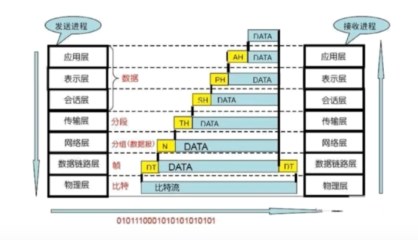  

osi模型只是一个概念性框架

# 具体实现：tcp/ip 四层模型

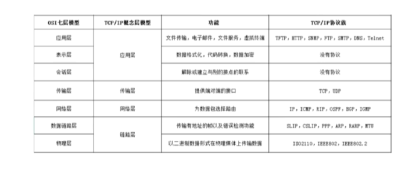  

应用层 = 应用层 +表示层+ 会话层

传输层 =传输层

网络层 = 网络层

链路层 = 数据链路层 + 物理层

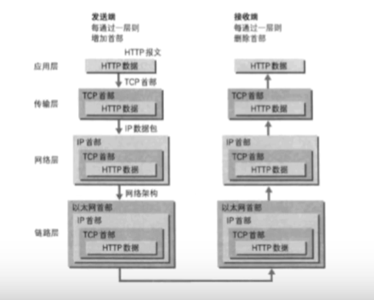  

# ip协议
是无连接的通信协议。ip将每个信息包路由至他的目的地。并没有确认数据包是否按顺序发或者包是否被破坏。所以ip包是不可靠的。需要靠上层协议确定

# tcp协议

- 面向连接的，可靠的，基于字节流的船速层通信协议。
- 将应用层的数据流分割成报文并发送給目标节点的tcp层
- 数据包有序号，对方收到则发送ack确认，未收到则重传。
- 使用校验和来检验数据是否传输有错。
  
## tcp报文头

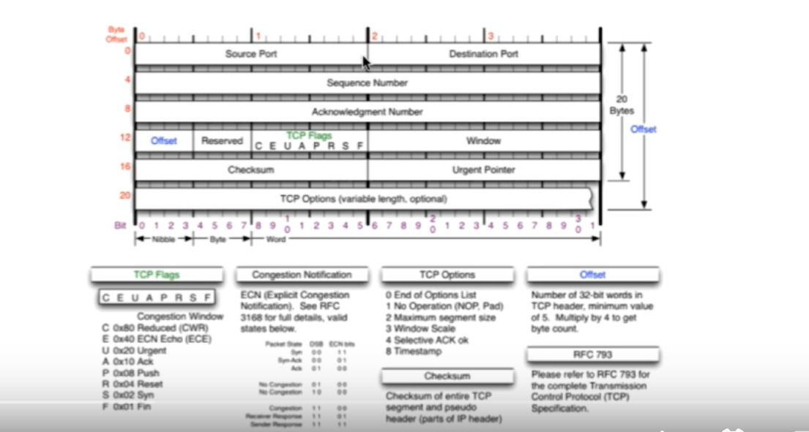  

- 包含源端口和目标端口但不包括ip地址（属于ip层）。
- 端口号：两个进程能通信必须能唯一标识。本地可以使用pid，但只在本地唯一。在不同计算机就要使用端口号。 ip地址+协议+端口号 = 套接字：唯一标识一个进程
- sequence number 序列号：序号107+100字段 -> 下一个序列号为207
- acknowledge number: 期望收到对方下一个报文的第一个字节的序列号。 出现在应答报文中。
- offset 可选：指出报文数据距离起始处的位置。
- reserved :暂无用
- tcp flags 控制位（8个）:
    urg: 紧急指针标志
    ack : 确认序号标志，表述确认号是否有效。
    PSH:push标志。表示应尽快交给应用程序，不要在缓冲区等待。
    RST:重置连接标志。 
    SYN: 同步序号，用于建立连接过程
    FIN : finish位。用于释放连接
- window: 告知发送方接收方的缓存大小。控制发送速率。
- checksum 检验和
- urgent pointer: 指出紧急字节数。

## 全双工通信
占用两个计算机的通讯线路，直到断开连接为止。A能给B发送信息，同时B能给A发送信息。

## 三次握手
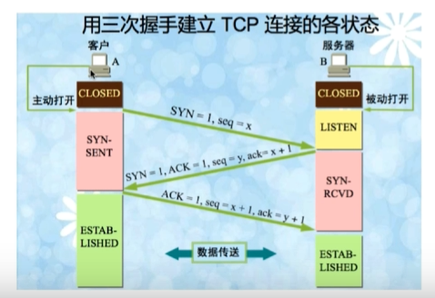  

- 第一次握手：不包含数据，发出连接请求报文。发送端进入syn-sent 状态。syn = 1,seq = x为任意正整数
  A->B
- 第二次握手： 服务器收到syn包，确认sin包，发出确认报文，ack= 1,syn = 1, ack = x+1（需要回应和x相关信息，并且第一次报文消耗了一个选号），seq= y 接收方进入 syn-received 状态
- 第三次握手。 发送端发出报文，ack = 1,seq = x+1,ack = y+1 发送端进入 established状态。第三次握手可以携带数据，也可以不携带。 接收方收到后也进入established状态。
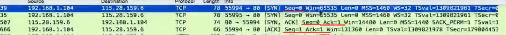  

### 为什么需要三次握手才能建立连接
- 需要初始化各自seqence number 的初始值，也就是上图的x和y。tcp需要用这个序号来拼接数据。
- 第三次握手客户端需要告诉服务器已收到sequence number.
### 首次握手的隐患 -- syn超时 （syn flood）
- 起因
  - server 收到client的syn，回复syn-ack的时候未收到ack确认
  - 连接既没有成功，也没有失败，server不断重试直到超时，linux默认等待63秒才断开连接。（重发syn-ack, 重发5次，初始一秒，每次翻倍，1s+2s+4s+8s+16s= 31s,第五次发出数据后，还需要等待32秒才能判断为超时，31 +32 = 63）

- 结果：syn flood
    恶意程序发送第一次握手后就下线，使服务器在63秒后才能断开连接，攻击者就可以耗尽服务器syn链接队列。
- 防护措施：
    syn队列满后，通过tcp_syncookies参数发回syn——cookie
    若为正常连接则client会回发syncookie，直接建立连接。

### 建立连接后，client出现故障怎么办
- 保活机制
    向对方发送保活探测报文，如果未收到响应则继续发送
    尝试次数达到保活探测数仍未收到响应则中断连接。

## 四次挥手

客户端或服务端任意一端触发

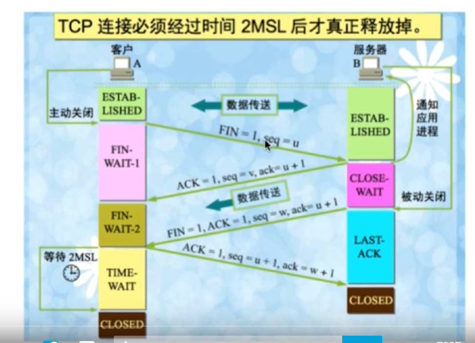  

- 第一次挥手： 客户端释放连接释放报文，fin = 1,seq = u(等于数据最后一次发送的时候已经传送过来的数据的最后一个字节的序号+1)，客户端进入fin-wait1状态
- 第二次挥手：服务端发送确认报文，ack = 1, ack = u+1,seq =v,服务端进入close-wait 状态。此时，客户端已经没有数据要发送，但服务器若是要发送数据，客户端还是可以接收。客户端进入fin-wait2状态。等待连接发送释放连接报文。有可能还需要接收服务端最后发送的数据。
- 第三次挥手：服务器最后的数据发送完毕后，向客户端发送连接释放报文，fin = 1，进入last-ack状态。
- 第四次挥手：客户端收到报文后，必须发送确认报文，ACK = 1,seq = u +1 , ack = w +1,客户端进入timewait状态，必须经过2msl（最长报文段寿命）的时间才能释放tcp连接。而服务器马上释放连接。

### 为什么有timewait状态
- 确保有足够的时间让对方收到ack包，来回两个msl
- 避免新街连接混淆，路由器会ip数据包，如果连接重用了，那么延迟收到的包可能和新连接混淆

### 为什么要四次挥手
- 全双工允许数据在两个方向上传输。因为全双工，发送方和接收方都需要fin报文和ack报文。

### 服务器出现大量close-wait状态
- 对方关闭socket连接，我方忙于读写，没有及时关闭连接。
    检查代码，特别是释放资源的代码
    检查配置，如线程池中的线程数不合理

- 如何查看close-wait状态的进程数
  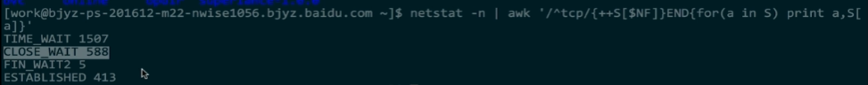  

# udp协议
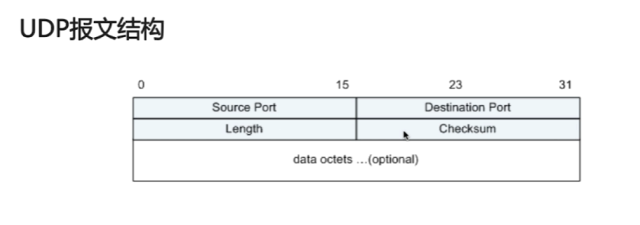  

- 特点：
- 面向非连接 当他想传送时，就简单的抓取应用程序的数据，并尽可能快的把他发送。
- 传送速度仅受应用程序生成数据速度，计算机处理能力，和传输带宽的限制。
- 不维护连接状态，支持同时向多个客户端传送相同的消息
- 数据包报头只有8个字节，额外开销小
- 尽最大努力交付，不保证可靠交付，不需要维持复杂的连接状态表示
- 面向报文，不对应用程序提交的报文信息进行拆分或合并。添加首部后直接交给ip层。应用程序需要决定合适的报文大小。控制交由上层解决。

# 结论  tcp与udp的区别
- 面向连接 无连接
- 可靠性
- 有序性
- 速度（在线视频，在线游戏）
- 量级

# tcp的滑动窗口

## RTT和RTO
- RTT:发送一个数据包到收到对应的ack所花费的时间
- RTO：重传时间间隔（发送一个数据包后，会启动一个重传定时器，RTO是重传的时间，没收到ack就重发），由RTT计算得到。

## TCP使用滑动窗口做流量控制和乱序重排
- 保证tcp的可靠性
- 保证tcp的流控特性
    window:用于告诉发送方自己还有多少缓冲区可以接收数据

## 窗口数据的计算过程
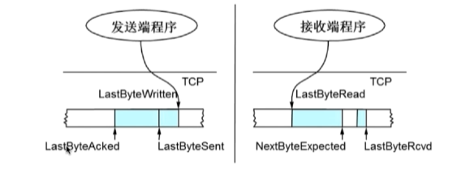  

数据从左到右接收、发送
- 发送端
    - Lastbyteacked:已被接收端ack的sequence number
    - lastbytesent:已发送的最后一个字节的位置，只是发送，未被确认
    - lastbytewritten:上层应用已写完的最后一个位置
发送端的几个位置都是连续的没有空白的

- 接收端
    - Lastbyteread:上层应用已经读完的最后一个字节位置
    - lastbyteexpected:收到的连续的最大的sequence的位置
    - lastbytercvd:已收到的最后一个字节的位置。
    - 接收端中间有空白位置。

Advertisedwindow = maxrcvbuffer(接收端缓存池的大小) - (lastbytercvd -lastbyteread)

effectivewindow = advertisewindow - (lastbytesent-lastbyteacked)

## 滑动窗口的基本原理

- tcp 会话的发送方
  
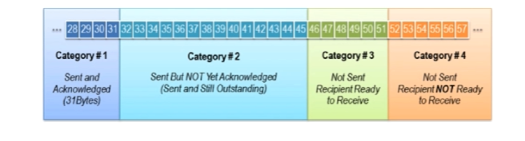  

    category #1 : sent and acknowledged(已经发送并得到端的回应的)
    category #2 : sent but not yet acknowledged(已经发送，未得到端回应的)
    category #3 : note sent recipient ready to receive （没有发送，但对端允许发送的）
    category #4 : not sent recipient not ready to receive （未发送，但由于达到了window的大小无法发送的）

category#2 + category#3 = 发送窗口

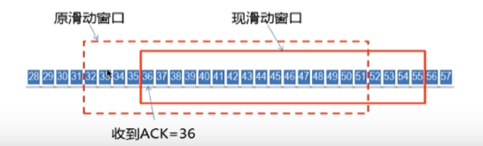  

只有连续32-34被确认窗口才会滑动，若32被确认，33未确认窗口无法滑动，未滑动时，52-54无法被发送。

- tcp会话的接收方

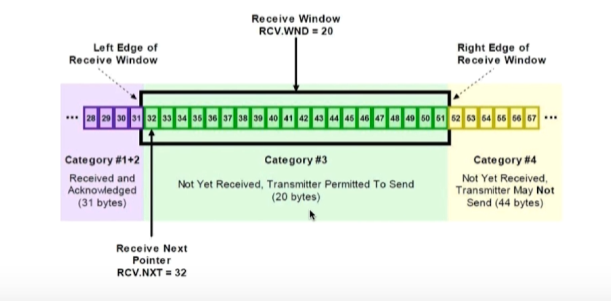  

    category#1+2: received and acknowledged(已接收并且已发送回执)
    categroy#3: not yet received. Transmitter Permitted to sent（未接收但是可以接收，准备接收）
    Category #4: not yet received. Transmitter may not sent.（未接收并且不能接收，因为达到窗口阈值）

category#2 = 接收窗口

- tcp的可靠性来自确认重传机制，发送窗口只有收到接收端对于本段窗口内的ack确认，才会移动发送窗口的左边界。接收端当前面还有字节未接收并且收到了后面的信息时，窗口不会移动，不会对后续字节确认。以此重传。
- 滑动窗口可以是动态调整的，以此达到流量限制。

https://monkeysayhi.github.io/2018/03/07/%E6%B5%85%E8%B0%88TCP%EF%BC%881%EF%BC%89%EF%BC%9A%E7%8A%B6%E6%80%81%E6%9C%BA%E4%B8%8E%E9%87%8D%E4%BC%A0%E6%9C%BA%E5%88%B6/

# HTTP协议

## 主要特点
- 属于应用层的协议
- 常基于tcp的连接方式
- 支持客户，服务器模式
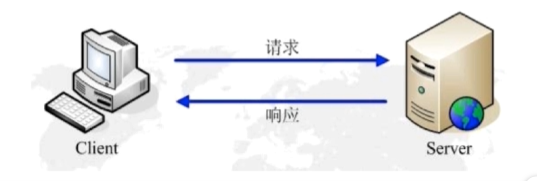  

- 简单快速，客户端仅需要提供请求方法和路径。
- 灵活，允许传输任意类型的数据对象。
- 无连接。限制每次连接只处理一个请求。服务器处理完客户请求并收到客户应答之后就断开连接，可以节约时间。http1.1之后采用长连接（keep alive），即要一段时间后再断开连接。但我们无法知道是否处于长连接状态，我们只需知道当处理完请求后连接就会断开。长连接在下层实现，对上层透明。
- 无状态。协议对于事务处理没有记忆能力如果后续处理需要前面的信息，则必须被重传。

## http请求结构

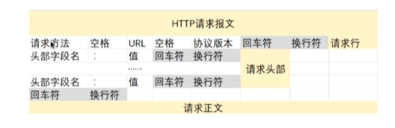  

- 请求行，请求头部，空行，请求正文
- 请求方法：get,post，put
- 协议版本，http1.0, http 1.1

请求正文只有在post里有，要上传的数据
空行是必须的，浏览器通过空行通知服务器已经发送完请求头部。

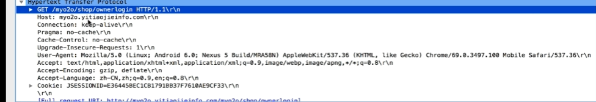  

## http响应报文

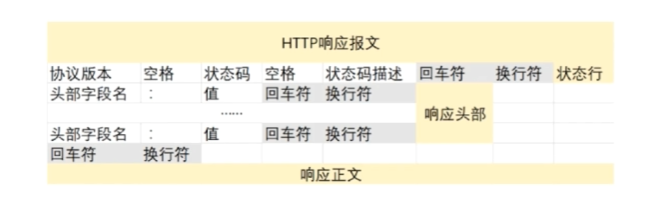  

- 状态行，响应头部，响应正文

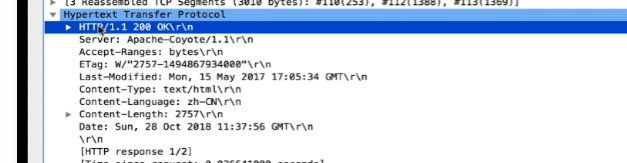  

## 请求响应模型

- 客户端连接到web服务器（建立一个tcp套接字连接）（服务端默认80）
- 发送http请求 通过套接字向服务器发送一个文本的请求
- 服务器接收请求并返回http响应（将资源服务写入tcp套接字）
- 释放连接tcp连接
- 客户端浏览器解析html内容（首先解析状态行，看表明请求是否成功的状态代码，然后解析每一个响应头，根据html语法进行格式化）

## 在浏览器地址栏键入URL，按下回车后经过的流程

- DNS 解析：浏览器根据url逐层查询dns服务器缓存，解析域名对应ip地址，缓存从近及远分别是：浏览器缓存，系统缓存，路由器缓存，ips服务器缓存，域名服务器缓存，顶级域名服务器缓存
- TCP连接
- 发送HTTP请求
- 服务器处理请求并返回HTTP报文
- 浏览器解析渲染页面
- 连接结束
  
## 常见的HTTP状态码

五种可能的取值

- 1XX:指示信息：表示请求已接收，继续处理
- 2XX：成功-- 表示请求已被成功接收，理解，接受
- 3XX:重定向： 要完成请求必须进行更进一步的操作
- 4XX: 客户端错误： 请求有语法错误或请求无法实现
- 5XX: 服务端错误 服务器未能实现合法的请求

## 常见状态码

- 200 ok: 正常返回信息
- 400 Bad Request：客户端请求语法错误，不能被服务器理解
- 401 Unauthorized: 请求未经授权，这个状态代码必须和WWW-authenticate 报头域一起使用，表示客户端没有权限访问某些资源
- 403 Forbidden: 服务器收到请求，但是拒绝提供服务。（比如ip被禁）
- 404 Not found: 请求资源不存在，需检查url及路径配置
- 500 Internal Server Error:服务器发生了不可预期的错误。
- 503 Server unavailable : 服务器当前不能处理客户端的请求，一段时间后可能恢复正常（如连接池已满）

## get请求和post请求的区别

- HTTP报文层面： get将请求信息放在url请求信息和url之间用问号隔开，请求信息的格式为键值对，post将请求信息放在报文体中。想获得请求信息必须解析报文。因此安全性较get方式略高，但要获得报文体中的请求信息也很容易，因此并没有多安全，具体解决安全问题还要靠https，并且由于get将请求信息放在url所以对数据长度有限制。

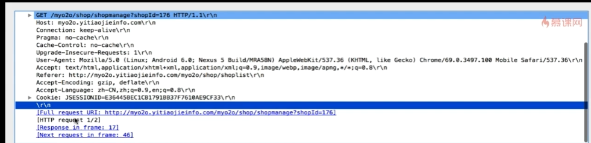  

此处可以看见，请求正文没有数据

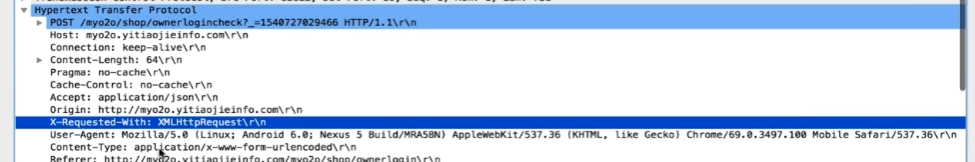  

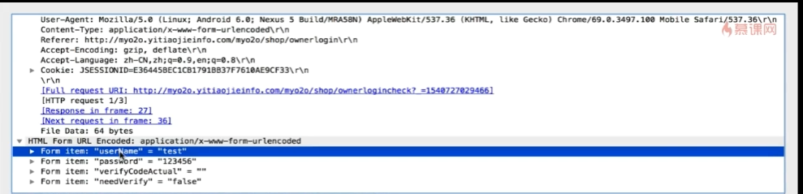  

请求正文中有账户密码，并且是明文的，因此并不安全

- 数据库层面： get方式符合幂等性和安全性，post不符合
  - 幂等性： 对数据库的一次操作和多次操作结果是一致的
  - 安全性： 对数据库的操作没有改变数据库的数据（get做查询操作，因此满足，而post请求会往数据库中提交数据，因此会改变数据库的数据，并且post请求每次获得的结果都可能不一样，因为post请求是作用在上一级的url上，则每次请求都会提交一份新资源）
- 从其他层面： get可以被缓存，被存储，而post不行（由于安全性和幂等性，90%的数据都可以被cdn缓存，大大减少web服务器负担，而post请求是非幂等的，必须交由web服务器处理）
  
# Cookie和Session

http本身无状态，而我们并不是每次都要重新输入用户名密码，这使得http产生了状态，得益于cookie和session

## Cookie（请记住我选项）
- 是服务器发给客户端的特殊信息，以文本的形式存放在客户端，客户端每次请求的时候会戴上这些信息（当用户访问一个支持cookie网站时，会提交用户名密码等信息，服务器将相应信息回复时，也会把用户名密码的信息回发回来，当然这些信息不是存在在http响应体response body中，而是存放在http响应头response header，当浏览器接收到来自服务器的响应时，浏览器会将这些信息存放在统一的位置）
- 客户端再次请求的时候，会把cookie回发，此时cookie存放在http请求头部中
- 服务器接收到后，会解析cookie，动态生成与客户端对应的内容

### Cookie的设置及发送过程
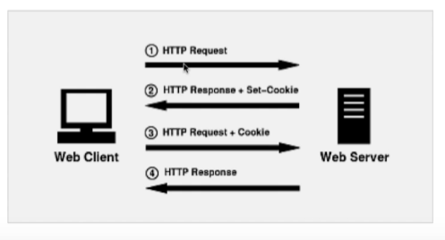  

## Session

- 服务器端的机制，在服务器上保存的信息
- 解析客户端请求并操作session id ,按需保存状态信息（当程序需要为某个客户端的请求创建一个session时，服务器首先检查这个请求中是否包含一个session 标识，即session id,如果已包含，说明已创建过session,服务器就按照session id 检索session 使用，如果检索不到，就可能新建session，并生成对应的session id，session，回发给客户端进行保存）

### Session的实现方式
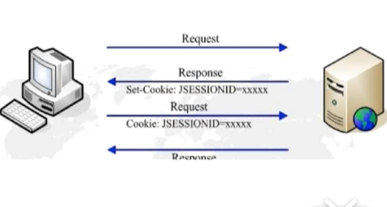  

- 使用cookie实现：服务器给每个session分配一个唯一的jsessionid，并通过cookie发给客户端，当客户端发起新的请求时，会在请求头部中携带这个jsessionid，这样服务器可以找到对应的session
- 使用 url回写实现：服务器在给浏览器发送的所有链接中，都携带jsessionid的信息，这样客户端点击任意一个链接，都会把jsessionid带回服务器，如果直接在浏览器输入服务器资源的url，那么session是匹配不到的。
- Tomcat是同时使用cookie和回写，如果客户端支持cookie就使用cookie，不支持就使用url回写。

## 区别
 - cookie存放在客户的浏览器上，session 信息存放在服务器上
 -  session相对于cookie更安全。别人可以分析存房子本地的cookie进行cookie欺骗
 -  若考虑减轻服务器负担，应当使用cookie

# http和https

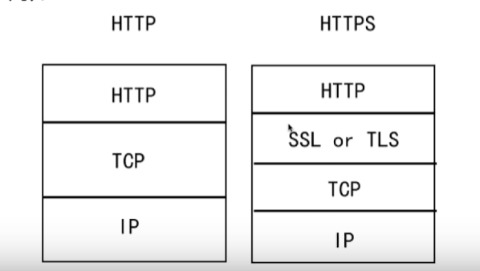  

## SSL（security sockets layer,安全套接层）

- 为网络安全提供安全及数据完整性的一种安全协议
- 是操作系统对外的api，SS3.0后更名为tls
- 采用身份验证和数据加密保证网络通信的安全和数据的完整性

## 加密的方式
- 对称加密，加密和解密都使用同一个密钥（性能高）
- 非对称加密：加密使用的密钥和解密使用的密钥不同，公钥和算法公开，私钥是保密的（性能低，安全性好，加密信息长度有限）
- 哈希算法： 将任意长度的信息转换为固定长度的值，算法不可逆（MD5)
- 数字签名：证明某个消息或者文件是某人发出、认同的（在信息后加入一段内容证明信息未被修改过，和哈希算法一起使用）

## HTTPS数据传输流程
- 浏览器将支持的加密算法信息发送给服务器
- 服务器选择一套浏览器支持的加密算法，将验证身份的信息以证书的形式回发浏览器（包含证书发布的ca机构，证书的有效期，公钥，证书所有者的签名等，Ca机构是 具备证书发布资格的权威机构
- 浏览器验证证书合法性，并结合证书公钥加密信息发送给服务器（如果收到浏览器信任，如果收到信任，在浏览器地址栏会有标志，否则会显示不受信的标识，当证书受信后，会随机生成一串密码，并使用证书中的公钥加密，之后就是使用规定的哈希算法对消息进行加密，将之前生成的信息回发给服务器）
- 服务器使用私钥解密信息，生成密码，用密码解析握手信息，验证哈希，加密响应信息回发浏览器
- 浏览器解密响应消息，并对消息进行验证，之后进行加密交互数据

## 区别：
- https需要到ca申请证书，http不需要
- HTTPS密文传输，http明文传输
- 连接方式不同，HTTPS默认使用443端口，HTTP使用80端口
- HTTPS = http + 加密 + 认证 + 完整性保护，较http安全

## HTTPS真的安全吗
- 浏览器默认填充http 有被劫持的风险
- 可以使用HSTS（http strict transport security）优化

# socket

 socket 是对tcp、ip协议的抽象，是操作系统对外开放的接口，与tcp、ip没有特定的联系

 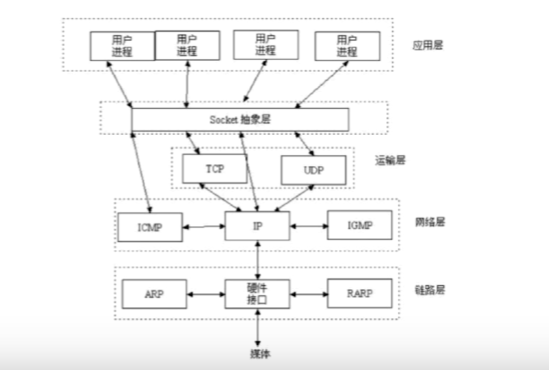  

 ## socket通信流程

 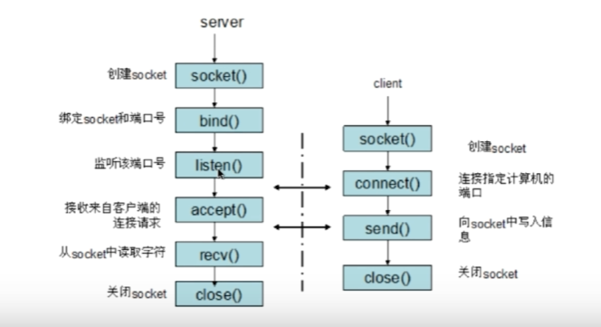  
