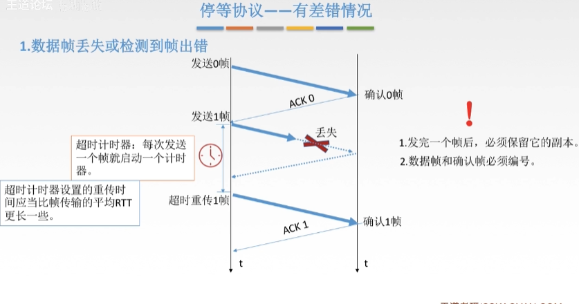
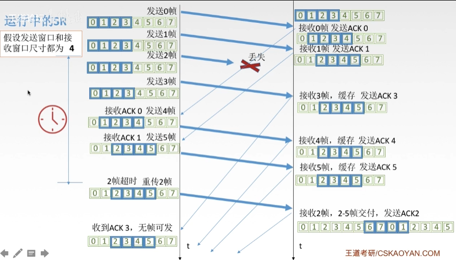
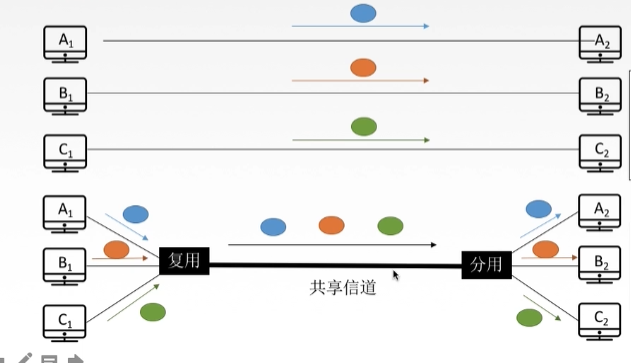
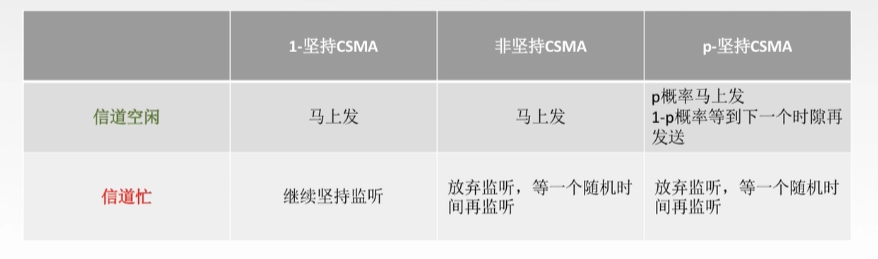
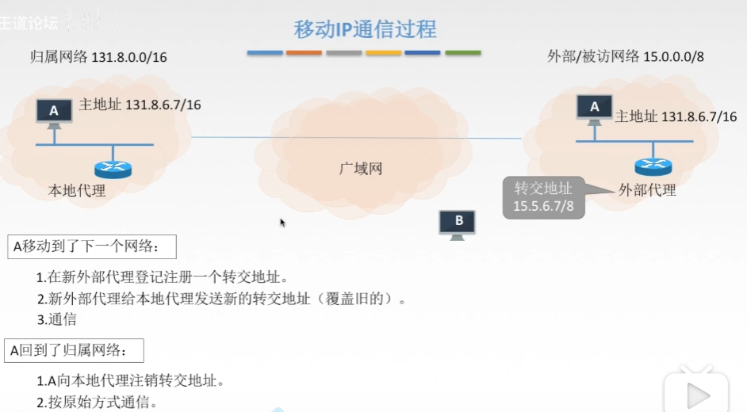
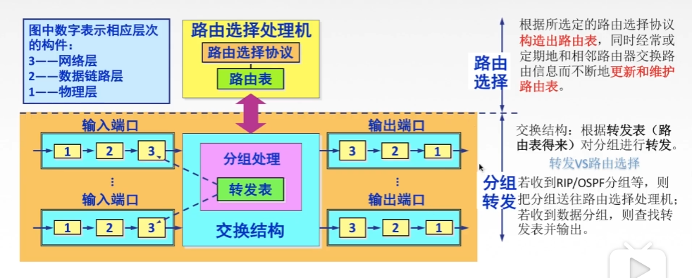
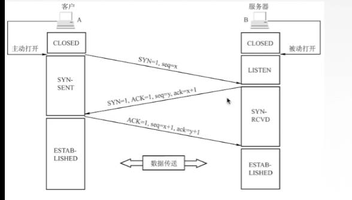
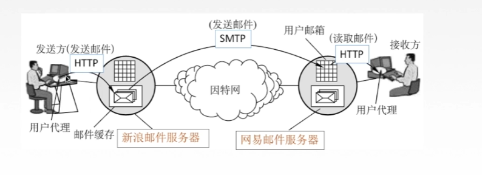
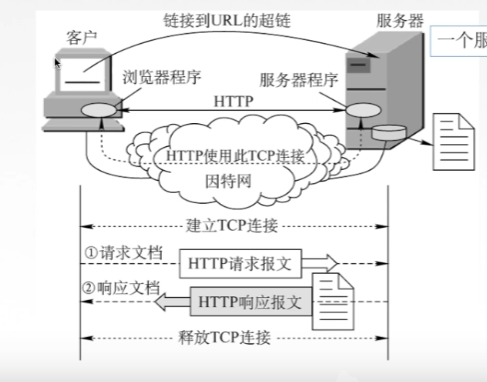

[toc]
# 计算机网络的概念
- 是一个将分散的，独立功能的计算机系统，通过通信设备与线路连接起来。由功能完善的软件实现资源共享和信息传递的系统。

# 计算机网络的功能
- 数据通信 连通性
- 资源共享
- 分布式处理
- 提高可靠性
- 负载均衡

# 计算机网络的组成
- 组成部分： 硬件，软件，协议
- 工作方式： 
  - 边缘部分，用户直接使用：c/s方式和p2p方式
  - 核心部分，为边缘部分服务
- 功能组成： 通讯子网，资源子网
  

- 计算机网络的分类：
1. 按分布范围： 广域网，城域网，局域网
2. 按使用者分： 公用网， 专用网
3. 按交换技术分： 电报交换，报文交换，分组交换
4. 按拓扑结构分： 总线型，星型，环形，网状型
5. 按传输技术分：广播式网络（共享公共通信信道），点对点网络（使用分组存储转发和路由选择机制）

# 标准化工作
- 法定标准： osi
- 事实标准： tcp/ip

# 性能指标
## 速率（比特率）
- 主机在数字信道上传输数据位数的速率

## 带宽
- 原指某个信号具有的频带宽度
- 计算机网络中用来表示网络的通信线路传送数据的能力，指单位时间中从网络中的某一点达到另一点所能通过的最高数据率（网络设备所支持的最高速度）

## 吞吐量
- 单位时间内通过某个网络或信道接口的数据量
- 吞吐量受网络的带宽或网络的额定速率限制

## 时延
- 数据从网络的一端传送到另一端所需的时间，也叫延迟
  - 发送时延： 数据长度/信道带宽
  - 传播时延： 信道长度/电磁波在信道上的传输速率
  - 排队时延：
  - 处理时延：

## 时延带宽积
- 传播时延*带宽

## 往返时延RTT
- 从发送方发送数据开始到发送方收到接收方的确认所经历的时延
- RTT越大，在收到确认之前可以发送的数据越多
- RTT = 往返传播时延 + 末端处理时间

## 利用率
- 信道利用率： 有数据通过的时间/总时间
- 网络利用率： 信道利用率加权平均值

# 分层结构，协议，接口，服务
## 为什么要分层
- 激活通信线路
- 识别目标主机
- 查明目的主机是否开机
- 查看对方计算机文件管理系统是否做好准备工作
- 确保差错和意外可以解决

## 分层基本原则
1. 各层之间相互独立，每层只实现一种相对独立的功能
2. 每层之间界面自然清晰
3. 结构上可分隔开，每层都采用最合适的技术实现
4. 下层对上层的独立性，上层单向使用下层提供的服务
5. 整个分层结构应该能促进标准化工作

## 分层结构
- 实体
- 协议
- 接口
- 服务

  

# osi参考模型
  

- 应用层： 所有能和用户交互产生网络流量的程序（FTP）（SMTP）（HTTP）
- 表示层： 处理在两个通信系统中交换信息的表示方式
  - 功能一： 数据格式变化： 翻译官
  - 功能二： 数据加密解密
  - 数据压缩和恢复

- 会话层： 向表示层实体，用户线程建立连接并在连接上有序的进行传输数据（建立同步）
  - 建立，管理终止对话
  - 使用校验点可使会话在通信失效时从校验点，同步点恢复通信，实现数据同步，适用于大文件

- 传输层： 负责主机中两个进程的通信，即端到端的通信。传输单位是报文段或用户数据报。
  - 可靠传输，不可靠传输
  - 差错控制
  - 流量控制
  - 复用分用
    - 复用： 多个应用层进程可同时使用下面传输层的服务
    - 分用： 运输层把收到的信息分别交付给上面应用层中响应的进程
- 网络层： 把分组从源端传送到目的端，为分组交换网上的不同主机提供通信服务
  - 路由选择
  - 流量控制
  - 差错控制
  - 阻塞控制
- 数据链路层： 把网络层传下来的数据包组装成帧。
  - 成帧
  - 差错控制
  - 流量控制
  - 访问控制
- 物理层： 在物理媒体上实现比特流的透明传输，传输单位是比特。
  - 透明传输： 不管所传的数据是什么样的比特组合，投应当能在链路上传送
  - 定义接口特性
  - 定义传输模式
  - 定义传输速率
  - 比特同步
  - 比特编码

# tcp/ip模型
  
 
# 五层参考模型
  

# 物理层的基本概念
- 物理层解决如何在连接计算机的传输媒体上传输数据比特流，而不是具体的传输媒体
## 主要任务
- 确定传输媒体接口有关的特性
1. 机械特性： 规定物理连接时所采用的规格，接口形状， 引线数目，引脚数量
2. 电气特性： 规定传输二进制位时，线路上型号的电压范围，阻抗匹配，传输速率和距离限制等
3. 功能特性： 指明某条线上出现的某一电平表示何种意义
4. 规程特性： 定义各条物理线路的工作规程和时序关系

# 数据通信基础知识
  

## 三种通信方式
1. 单工通信： 只有一个方向的通信而没有反方向的交互，仅需要一条信道
2. 半双工通信： 通信的双方都可以发送和接收信息，但任何一方都不能同时发送和接收，需要两条信道
3. 全双工通信： 通信双方可以同时发送和接收信息，也需要两条信道。

## 两种传输方式
1. 串行传输： 速度慢，费用低，适合远距离
2. 并行传输： 速度快，费用高，适合近距离。用于计算机内部的数据传输

## 码元
- 一个固定时长的信号波形，代表不同离散数据的基本波形，是数字通信中数字信号的计量单位（一个01：二进制码元）

## 速率
- 数据的传输速率，表示单位时间内传输的数据量
- 码元传输速率：（脉冲个数或信号变化的次数）
- 信息传输速率： 单位时间内数字通信系统传输的二进制码元个数

## 带宽
- 单位时间内从网络中的某一点到另一点所能通过的最高数据率

## 奈氏准则
### 失真
1. 码元传输速率
2. 信号传输距离
3. 噪声干扰
4. 传输媒体质量

### 码间串扰
- 接收端收到的信号波形失去了码元之间清晰界限的现象
- 在理想低通条件下： 为了避免码间串扰，极限码元的传输速率是2w baud，w是信道带宽
- 在任何信道中码元的传输速率是有上线的
- 信道的频带越宽，就可以用更高的速率进行码元的有效传输
- 奈氏准则给出了码元传输速率的限制，但没有对信号的传输速率给出限制
- 由于码元的传输速率受奈氏准则的制约，所以要提高数据的传输速率，就必须设法使每个码元能携带更多个比特的信息量，这就要采用多元制的调制方法。

## 香农定理
- 在带宽受限且有噪声的信道中，为了不产生误差，信号的数据传输速率有上限值。
- 信道的带宽或信道的信噪比越大，，信息的极限传输速率就越高
- 对一定的传输带宽和信噪比，信息传输速率的上限就确定了
- 只要信息的传输速率低于信道的极限传输速率，就一定能找到某种方法实现无差错的传输。
- 香农定理得出的是极限信息传输速率，实际信道能达到的传输速率比他低不少
- 若信道带宽或信噪比没有上限，那么信道的极限信息传输速率也就没有上限。

## 两者对比
  

## 编码与调制
### 基带信号和宽带信号
- 基带信号： 将信号用两种不同的电压表示，再送到数字信道上去传输。发出的直接表示了要传输的信息的信号
- 宽带信号： 将基带信号进行调制后形成的频分复用模拟信号，在传送到模拟信道上去传输。把基带信号经过载波调制后，把信号的频率范围搬移到较高的频段以便在信道中传输。

# 物理层传输介质及分类
## 导向性传输介质： 电磁波被导向沿着固体没接传输
- 双绞线： 绞合可以减少相邻导线的电磁干扰，价格便宜
- 同轴电缆：抗干扰特性较好，传输距离更远，但价格较贵
- 光纤： 用光脉冲来通信，传输苏浩小，中极具立场，抗雷电和电磁干扰性能好，保密性好，体积小，重量轻

## 非导向性传输介质： 自由空间，介质可以是，空气，水等
- 无线电波： 较强穿透能力，可传远距离
- 微波： 频率较高，频段范围宽，数据率高
- 红外线，激光

# 物理层设备
- 中继器：对信号进行再生和还原，对衰减的信号进行放大。
  - 两端的网络部分是网段，而不是子网，适用于完全相同的两类网络的互联，而且两个网段速率要相同。
  - 不管数据中是否有错误数据或不适于网段的数据
  - 两端可连相同媒体，也可连不同媒体中继器两端的网段一定要是同一个协议

- 集线器：对信号进行放大转发，接着转发到所有处于工作状态的端口上，以增加信号传输的距离，不具备信号的定向传送能力，是一个共享式设备

# 数据链路层功能概述
## 基本概念
- 节点： 主机，路由器
- 链路： 两个节点之间的物理通道
- 数据链路： 网络中两个节点之间的逻辑通道，把实现控制数据协议的硬件和软件加到链路上就构成数据链路
- 帧： 链路层的协议数据单元，封装网络层数据报
- 数据链路层负责通过一条链路从一个节点向另一个物理链路直接相连的相邻接点传送数据报。
## 功能概述
- 在物理层提供服务的基础上向网络层提供服务，将网络层来的数据可靠的传输到目标机网络层。主要作用是加强物理层传输原始比特流的功能，将物理层提供的可能出错的物理连接改造成逻辑上无差错的的数据链路。

- 为网络层提供服务，无确认无连接服务，有确认无连接服务，有确认面向连接服务
- 链路管理，即连接的建立，维持，释放
- 组帧
- 流量控制
- 差错控制

## 封装成帧和透明传输
- 封装成帧就是在一段数据的前后部分添加首部和尾部，接收端在收到物理层上交的比特流之后，就能根据首部和尾部的标记，从收到的比特流中识别帧的开始和结束。
- 帧同步： 接收方识别帧的开始和结束
  
- 透明传输： 当所传数据中的比特组合与某一个控制信息完全相同时，采取措施使收方不会把这样的数据误认为是控制信息

1. 字符计数法： 用一个计数字段来表明帧内字符数、
  - 一个错误会导致全部错位
2. 字符填充法：在头尾做标记，当中使用转义字符

  
3. 零比特填充法
- 首部和尾部的标志是一样的
- 在发送端扫描整个信息字段，只要连续五个一，就立即填入一个零
- 在接收端收到一个帧时，先找到标志位确定边界，在用硬件对比特流进行扫描，当发现连续五个一时，就把后面的0删除。
  

4. 违规编码法
- 用高高，低低来定界的起始和终止

## 差错控制
- 概括来说，传输中的差错都是噪声引起的
  - 全局性：随机噪声，是信道固有的
  - 局部性： 冲击噪声，外界的短暂原因
  - 位错，1变成0
  - 帧错，丢失，重复，失序

- 链路层为网络层提供服务
  - 无确认无连接服务： 通信质量好，有现传输链路- 差错控制有上层实现
  - 有确认无连接服务，有确认面向连接服务： 通信质量差的无线传输链路，差错控制由链路层实现

- 差错控制
  - 检错编码：
    - 奇偶校验码
    - 循环冗余码CRC
  - 纠错编码 
    - 海明码

### 与物理层的数据编码区别
- 物理层的编码针对的是单个比特，解决传输过程中比特的同步等问题
- 数据链路层的编码针对的是一组比特，通过冗余码的技术实现一组二级制比特串在传输过程中是否出现了差错。
- 冗余编码： 在数据发送之前按照某种关系加上一定的冗余位，构成一个符合某一规则的码字后再发送。当要发送的有效数据变化时，相应的冗余码也随着变化。接收端根据收到的码字是否符合原规则，从而判断是否出错。

### 检错编码
- 奇偶校验码： 1的个数
  - 只能检测出奇数个比特错误，检错能力为50%
- CRC循环冗余码： 判断余数是否为零
  
  - FCS的生成和接收端CRC校验都是硬件实现，处理很迅速，因此不会延误数据的传输
- 凡是接收端数据链路层接受的帧均无差错。但对错误信息只是丢弃不是纠正，因此不可靠
 
### 纠错编码
- 海明码： 发现双比特错，纠正单比特错
1. 确定校验码的位数

  
2. 确定校验码和数据的位置  放在2的次方位置
  

3. 求出校验码的值
  

4. 检错并纠错
  

## 流量控制与可靠性传输机制
- 较高的发送速度和较低的接收能力不匹配，会造成传输出错
- 数据链路层的流量控制是点对点的，而传输层的流量控制是端到端的。
- 数据链路层的流量控制手段： 接受方收不下就不回复确认
- 传输层的流量控制手段： 接收端给发送端一个窗口公告

## 流量控制的方法
- 停止- 等待协议
  - 每发送完一个帧就停止发送，等待对方的确认，在收到确认后再发送下一个帧
  

- 滑动窗口协议
  - 后退N帧协议(GBN)
  - 选择重传协议（SR)

  

- 停止等待协议 发送窗口大小 = 1，接收窗口大小 = 1
- 后退N帧协议 发送窗口大小 》 1 ，接收窗口大小 = 1
- 选择重传协议 发送窗口大小》1，接收窗口大小 》 1

- 发送窗口与接收窗口大小固定

- 可靠传输： 发送端发傻，接收端收啥
- 流量控制： 控制发送速率，使接收方有足够的缓冲空间来接收每一个帧。

- 滑动窗口解决 流量控制和可靠传输

## 停止-等待协议
1. 为什么要有这个协议
  - 除了比特出差错，底层信道还会出现丢包问题，为了实现流量控制
2. 研究协议的前提
   1. 虽然现在常采用全双工通信，但为了讨论方便，仅考虑一方发送一方接收
   2. 不考虑是在那个层次上传送
   3. 每发送完一个分组就停止发送，等待对方确认，收到确认后在发送下一个分组

### 无差错情况
  

### 有差错情况
1. 数据帧丢失或检测到帧出错
  

2. ack丢失
  
3. ack迟到
  

### 性能分析
- 简单
- 信道利用率低
  

信道利用率： 发送方在一个发送周期内，有效的发送数据所占的时间占整个发送周期的比例。
信道吞吐率： 信道利用率*发送方的传输速率

## 后退N帧协议（GBN)
### 滑动窗口
- 发送方维持一组连续的允许发送的帧的序号
- 接收方维持一组连续的允许接收帧的序号
  

### gbn发送方必须响应的三件事
1. 上层的调用
   上层发送数据时，发送方先检查发送窗口是否已满，如果未满，则产生一个帧并将其发送，如果窗口已满，发送方只需将数据返回给上层，暗示上层窗口已满，上层等一会在发送（实际实现中，发送方可以焕春这些数据，窗口不满时在发送帧）。
2. 收到一个ack
   gbn协议中，对n号帧采用累积确认的方式，标明接收方已经收到n号帧和他之前的全部帧。
3. 超时事件
  若果出现超时发送方重传所有已发送但未被确认的帧。

### gbn接收方要做的事
1. 如果正确收到n号帧，并且按序，那么接收方为n帧发送一个ack，并将该帧帧中的数据交付给上层。
2. 其余情况都丢失帧，并为最近按序接收的帧重新发送ack。接收方无需缓存任何失序帧，只需要维护下一个按序接收的帧序号。

### 运行中的gbn
  

### gbn协议性能分析
- 因连续发送数据帧而提高了信道利用率
- 在重传时必须把原来已经正确的数据帧重传，使传输效率降低

## 选择重传协议（SR)
- 设置单个确认，同时加大接收窗口，设置接收缓存，缓存乱序到达的帧

### 滑动窗口
  

### 发送方必须响应的三件事
1. 上层的调用
从上层收到数据后，sr发送方检查下一个可用于该帧的序号，如果序号位于发送窗口内，则发送数据帧，否则就像gbn一样，要么将数据缓存，要么返回给上层之后再传输
2. 收到了一个ack
如果收到ack,加入该帧序号在窗口内，则sr发送方将那个被确认的帧标记为已接收，如果该序号是窗口的下界，则窗口向前移动到具有最小序号的未确认帧处。如果窗口移动了并且有序号在窗口内的未发送帧，则发送这些帧。
3. 超时事件
每个帧都有自己的定时器，一个超时时间发生后只重传一个帧。

### sr接收方要做的事
1. 来者不拒
  sr接收方将确认一个正确接受的帧而不管其是否按序。失序的帧将被缓存。失序的帧将被缓存，并返回给发送方一个该帧的确认帧。知道所有帧都被收到为止，这时才可以将一批帧交付给上层，然后向前移动滑动窗口。
### 运行中的sr
  
### 滑动窗口大小
- 发送窗口最好等于接收窗口

## 信道划分介质访问控制
### 传输数据是用的两种链路
- 点对点链路： 两个相邻节点通过一个链路相连，没有第三者。
  - 应用： PPP协议，常用于广域网
- 广播式链路： 所有主机共享通信介质
  - 应用： 早期的总线以太网，无线局域网，常用于局域网

### 介质访问控制
- 采取一定的措施，是两对点之间的通信不会发生互相干扰的情况
- 静态划分信道-- 信道划分介质访问控制
  - 频分多路复用 FDM
  - 时分多路复用 TDM
  - 波分多路复用 WDM
  - 码分多路复用 CDM
- 动态分配信道 
  - 轮询访问介质访问控制
    - 令牌传递协议
  - 随机访问介质访问控制
    - ALOHA协议
    - CSMA协议
    - CSMA/CD协议
    - CSMA/CA协议

- 将使用介质的每个设备与来自同一信道上的其他设备通信隔离开来，把时域和频域资源合理的分配给网络上的设备。
- 多路复用技术： 把多个信号组合在一条物理信道上进行传输，使得多个计算机或终端设备共享信道资源，提高信道利用率。
  

## 频分多路复用FDM
所有用户在同样的时间占用不同的带宽资源
  

## 时分多路复用 TDM
每个用户在每一个TDM帧中占用固定序号的时隙，所有用户轮流占用信道。
  

### 改进的时分复用，统计时分复用
  

## 波分多路复用 WDM
光的频带复用
## 码分多路复用 CDM 
  

## ALOHA协议
### 纯aloha协议
- 不监听信道，不按时间槽发送，随机发送，想发就发
1. 冲突如何检测：
   如果发生冲突，接收方会检测出差错，不予确认，发送方一定时间收不到就判断发生冲突
2. 冲突如何解决
   超时后等一随机时间再重传
  

### 时隙aloha协议
- 把时间分成若干个相同的时间片，所有用户在时间片开始时刻同步接入网络信道，若发生冲突，则必须等到下一个时间片开始时刻再发送

## CSMA协议
- cs: 载波监听： 每一个站在发送数据之前检测下总线上是否有其他计算机在发送数据
- MA： 多点接入： 表示许多计算机以多点接入的方式连接在一根总线上
- 发送帧之前，监听信道
- 监听结果： 
  - 信道空闲： 发送完整帧
  - 信道忙： 推迟发送

### 1-坚持CSMA
- 空闲则直接传输，不必等待
- 忙则一直监听，知道空闲马上传输
- 如果有冲突则等待一个随机长的时间再监听，重复上述过程
- 优点： 只要媒体空闲，占点就马上发送，避免了媒体利用率的损失
- 缺点： 加入有两个或两个以上的占点有数据要发送，冲突就不可避免
### 非坚持CSMA
- 忙则等待一个随机的时间之后再进行监听。
- 优点： 采用随机的重发延迟时间可以减少冲突发生的可能性
- 缺点： 可能存在大家都在延迟等待的过程中，使得媒体仍可能处于空闲状态，媒体使用率降低
### p-坚持CSMA
- 空闲则以p概率直接传输，不必等待，概率1-p等待到下一个时间槽再传输
- 忙则等待一个随机的时间之后再进行监听
- 缺点： 发生冲突后还是要坚持吧数据帧发送完，造成了浪费

  

## CSMA/CD协议
- CS: 在发送数据前和发送数据时都要检测总线上是否有其他计算机在发送数据
- CD： 碰撞检测，边发送边监听，半双工网络

### 如何确定碰撞后的重传时机？
- 阶段二进制指数规避算法
  

### 最小帧长问题
- 帧的传输时延至少要两倍于信号在总线中的传播时延
- 对过于短的帧要进行填充

## CSMA-CA 协议
- 使用在无线局域网
  - 无法做到360度全面检测碰撞
  - 隐蔽站： 当A和C都检测不到信号，认为信道空闲时，同时向终端B发送数据帧，就会导致冲突。
- CA: 碰撞避免

### 工作原理
-  发送数据前，检测信道是否空闲
-  空闲则发出RTS(request to send) RTS包括发射端的地址，接收端的地址，下一份数据将持续发送的时间等信息，信道忙则等待。
-  接收端收到RTS后，将相应CTS(clear to send)
-  发送端收到CTS后，开始发送数据帧，同时预约信道，告知其他站点自己要传多久的数据。
-  接收端收到数据帧后，将用CRC来检验数据是否正确，正确则相应ACK帧
-  发送方收到ACK就可以进行下一个数据帧的发送，若没有则一直重传直到规定重发次数为止。（二进制指数退避算法）

## CSMA（CD）与CSMA(CA)

- CD用于总线式以太网，CA用于无线局域网
- 因为传输介质不同，检测方式也不同。
- CD检测冲突，CA避免冲突。

## 轮询访问控制协议
### 轮询协议
- 主节点轮流邀请从属节点发送数据
- 缺点： 1. 轮询开销 2. 等待延迟 3. 单点故障（主节点）

### 令牌传递协议
- 令牌： 一个特殊格式的mac控制帧，不含任何信息
- 控制信道的使用，确保同一时刻只有一个节点独占信道
- 每个节点都可以在令牌持有时间内获得发送数据的权利，并不是无限制的持有令牌。
- 问题 1. 令牌开销 2. 等待延迟 3. 单点故障
- 应用于令牌环网（物理星型拓扑，逻辑换型拓扑）
- 采用令牌传递方式的网络常用于负载较重，通信量较大的网络中

## 介质访问控制方式对比
- 信道划分介质访问控制：
  - 基于多路复用技术划分资源
  - 网络负载重： 共享信道效率高，且公平
  - 网络负载轻： 共享信道效率低
- 随机访问mac协议
  - 用户根据意愿随机发送信息。发送信息时刻独占信道带宽
  - 网络负载重： 产生冲突开销
  - 网络负担轻： 共享信道效率高，单个节点可利用信道全部带宽
- 轮询访问mac协议，轮流协议，轮转访问mac协议
  - 既不要产生冲突，又要发送时占全部带宽

# 局域网基本概念和体系结构
## 特点
- 使用广播信道
- 地理范围小
- 数据传输速率高
- 通信延迟时间短
- 各站互为平等关系，共享信道

## 局域网拓扑结构
  

## MAC子层和LLC子层 
  

# 以太网
- 以太网Ehternet 是基带总线局域网规范，是当今局域网采用的最通用的通信协议标准，采用 CSMA/CD 技术。
## 特点
- 造价低廉
- 应用最广泛
- 满足网络速率的要求 10Mb/s - 10Gb/s
  
## 以太网提供无连接，不可靠的服务
- 无连接，无握手过程
- 不可靠，不对发送方的数据帧编号，接收方不想发送方进行确认，差错帧直接丢弃，差错纠正由高层负责。
## 以太网MAC帧
  

## 高速以太网

# 无线局域网
## 802.11的mac帧头格式
  

# 广域网
- 广域网的通信子网主要使用分组交换技术。广域网的通信子网把局域网或计算机系统互联起来，达到资源共享的目的。

## PPP协议的特点
- 即点对点协议，是目前使用最广泛的数据链路层协议，只支持全双工链路。
### 应满足的要求：
  - 简单： 对于链路层的帧，无需纠错，无需序号，无需流量控制。
  - 封装成帧
  - 透明传输：转义帧定界符 
  - 多种网络层协议：
  - 多种类型链路： 串行，并行，同步，异步。。。
  - 差错检测： 错即丢弃
  - 检测连接状态： 链路是否正常工作
  - 最大传送单元： 数据部分最大长度MTU
  - 网络层地址协商： 知道通信双方的网络层地址
  - 数据压缩协商
### 无需满足的要求：
  - 纠错
  - 流量控制
  - 序号
  - 不支持多点线路
### 三个组成部分
1. 一个将ip数据封装到串行链路的方法
2. 链路控制协议LCP： 建立并维护数据链路连接
3. 网络控制协议NCP： PPP支持多个网络层协议，每个不同的网络层协议都要一个相应的NCP来配置，为网络层协议建立和配置逻辑连接。

### PPP协议的状态图
  

### PPP协议的帧格式
  

## HDLC协议
- 高级数据链路控制，是一个在同步网上传输数据，面向比特的数据链路层协议
- 数据报文可透明传输，采用零比特插入法
- 采用全双工通信

### hdlc的帧格式
  

## 两者区别

- 只支持全双工链路
- 都可以实现透明传输
- 都可以实现差错检测，但不纠正差错

  

# 链路层设备
## 物理层扩展以太网
## 链路层扩展以太网
- 网桥根据mac帧的目的地址对帧进行转发和过滤。当网桥收到一个帧时，并不向所有接口转发此帧，而是先检查帧的目的mac地址，然后确定将该帧转发到哪个接口
  
### 透明网桥
- 自学习，转发表

### 源路由网桥
- 在发送帧时，把详细的路由信息放在帧的首部中
- 源站以广播的方式 向欲通信的目的站发送一个发现帧

### 多接口网桥 - 以太网交换机
- 两种交换方式
  - 直通式交换机： 查完目标地址就立即转发
  - 存储转发式交换机： 将帧放入高速缓存，并检查是否正确，正确就转发，错误就丢弃。

## 冲突域和广播域
  

# 网络层
- 主要任务是把分组从源端传到目的端，为分组交换网上的不同主机提供通信服务

## 功能
- 路由选择和分组转发
- 异构网络互联
- 阻塞控制

## 数据交换方式
### 电路交换：
- 建立连接 -》 通信 -》 释放电路
  - 优点： 1. 通信时延小 2. 有序传输 3. 没有冲突 4. 实时性强
  - 缺点： 1.建立连接时间长 2. 线路独占，使用效率低 3. 灵活性强 4. 无差错控制能力

### 报文交换：
- 报文：  源应用发送的信息主体
- 优点： 1.无需建立连接 2.存储转发，动态分配线路 3. 线路可靠性高 4. 线路利用率高 5. 多目标服务
- 缺点： 1. 有存储转发时延  2. 报文大小不定，需要网络节点有较大缓存空间
  

### 分组交换
- 分组： 把大的数据块分割成小的数据块
- 优点： 1. 无需建立连接 2.存储转发，动态分配线路 3. 线路可靠性高 4. 线路利用率高 5. 相对于报文交换，存储管理更容易，对缓存要求更低
- 缺点： 1. 有存储转发时延 2. 需要传输额外的信息量 3. 乱序到目的主机时，要对分组排序重组
 

### 三种数据交换方式比较
  
 - 报文交换和分组交换都采用存储转发
 - 传输数据量大，且传送时间远大于呼叫时，选择电路交换，没电路交换传输时延最小
 - 从信道利用率上看，报文交换和分组交换优于电报交换，其中分组交换时延更小

### 数据报方式
- 数据报方式为网络层提供无连接服务
- 无连接服务： 不事先为分组的传输确定传输路径，每个分组独立确定传输路径，不同分组的传输路径可能不同。
- 每个分组携带源和目标地址
- 路由器根据分组的目的地址转发分组： 基于路由协议、算法构建转发表，检索转发表，每个分组独立选路

### 虚电路方式
- 虚电路方式为网络层提供连接窗口
- 连接服务： 首先为分组的传输确立传输路径（建立连接），然后沿该路径传输系列分组，系列分组传输路径相同，传输结束后拆除连接。
- 建立连接 -》 数据传输 -》 释放连接

### 两者对比
  

### 传输单元名词辨析
|层|传输单位|
|:----: |:----:|
|应用层   | 报文|
|传输层     | 报文段|
|网络层     | IP数据报，分组  |
|数据链路层 | 帧            |
|物理层    | 比特流         |

## ip数据报格式
  
- 版本 ipv4？IPV6？
- 首部长度 单位是4B，最小是5
- 区分服务： 期望获得哪种类型的服务
- 总长度： 首部 + 数据
- 生存时间： ip分组的保质期。为了无法交付的数据报无限制的网络中兜圈子。经过一个路由器-1，变成0则丢弃
- 协议：数据部分的协议
- 首部检验和： 只检验首部
- 可选字段： 用来支持拍错，测量，以及安全等措施
- 填充:把首部补成4B的整数倍
  

## ip数据报分片
- 最大传送单元： 链路层数据帧课封装数据的上限
- 标识： 同一数据报的分片使用同一标识
- 标志： 中间位DF: 是否允许分片 最低位MF: 还有分片/最后一片，没分片
- 片偏移： 较长分组分片后，某片在原分组中的相对位置。

## ipv4地址
### ip地址分类
  
### 特殊ip地址
 
  
### 私有ip地址
  

## 网络地址转换
网络地址转换NAT： 在专用网连接到因特网的因特网的路由器上安装NAT软件，他至少有一个有效的外部全球ip地址。
  

## 子网划分
- 分类的ip地址的弱点： 
  1. ip地址空间的利用率有时很低
  2. 两级ip地址不够灵活

- 某单位划分子网后，对外仍表现为一个网络，即本单位的网络看不见本单位内子网的划分
  

### 子网掩码
  

## 无分类编址 CIDR
- 变长子网掩码
  

### 构成超网
- 将多个子网聚合成一个较大的子网，叫做构成超网，或者路由聚合
- 方法： 将网络前缀缩短

### 最长前缀匹配
使用CIDR时，查找路由表可能得到几个匹配结果，应选择具有最长网络前缀的路由。前缀越长，地址块越小，路由越具体。

## ARP协议
- 在实际网络的链路上传送数据帧时，最终必须使用mac地址
### ARP协议
- 完成主机或路由器ip地址到mac地址的映射
### arp协议使用过程
- 检查ARP高速缓存，有对应表项则写入mac帧，没有则用目的mac地址为FF-FF-FF-FF-FF-FF的帧封装并广播ARP请求分组，同一局域网中的所有主机都能收到该请求，目的主机收到请求后会向源主机单播一个arp响应分组，源主机收到后将此映射写入arp缓存。
### arp协议的4种典型情况
1. 主机a发给本网络上的主机b： 用arp找到主机b的硬件地址
2. 主机a发给另一网络上的主机b： 用arp找到本网络上一个路由器的硬件地址
3. 路由器发给本网络的主机a: 用arp找到主机a的硬件地址
4. 路由器发给另一网络的主机b： 用arp找到本网络上的一个路由器的硬件地址。

## dhcp协议
- 动态主机配置协议dhcp是应用层协议，使用客户/副武器的方式，客户端和服务端通过广播方式进行交互，基于udp
- dhcp提供即插即用联网的机制，主机可以从服务器动态获取ip地址，子网掩码，默认网关，dns服务器名称，允许地址重用，支持移动用户加入网络支持在用地址续租
### 工作流程
1. 主机广播dhcp发现报文   试图找到网络中的服务器，服务器获得一个ip地址
2. dhcp服务器广播dhcp提供报文  服务器拟分配给主机一个ip地址，先到先得
3. 主机广播dhcp请求报文  主机向服务器请求提供ip地址
4. dhcp服务器广播dhcp确认报文  正式将ip分配给主机

## icmp协议
- 网际控制报文协议icmp
- icmp协议支持主机或路由器 差错报告，网络探询
### icmp差错报文
1. 终点不可达： 当主机不能交付数据报时就向原点发送终点不可达报文（无法交付）
2. 源点抑制： 当路由器或主机由于阻塞而丢弃数据报时，就向原点发送源点抑制报文，使源点摘掉应当把数据包的发送速率放慢（拥塞丢数据）
3. 时间超过(traceroute)： 当路由器收到生存时间为零的数据报时，除丢弃该数据报外，还要向源点发送时间超过报文。当重点在预先规定的时间内不能收到一个数据包的全部数据报片时，就把已收到的数据报都丢弃，并向源点发送时间超过报文。
4. 参数问题： 当路由器或目标主机收到的数据报的首部中有的字段值不正确是，就丢弃该数据报，并向源点发送参数问题报文
5. 改变路由（重定向）：路由器吧改变路由报文发送给主机，让主机知道下次应当将数据包发送给另外的路由器（可通过更好的路由）

### 不应当发送icmp差错报文的情况
1. 对icmp差错报告报文不再发送
2. 对第一个分片的数据报片的所有后续数据报片都不发送
3. 对具有组播地址的数据报
4. 对具有特殊地址的数据报（127.0.0.1或0.0.0.0）

### icmp询问报文
1. 回送和请求报文（ping)： 测试目的站是否可达以及了解其相关状态
2. 时间戳请求和回答报文  用来进行时钟同步和测量时间
3. 掩码地址请求和回答报文
4. 路由器询问和通告报文

  

## ipv6
### ipv6 数据报格式
  
### ipv6 和ipv4
- ipv6 将地址从32位扩大到128位
- ipv6将校验和字段彻底溢出，减少了每跳的处理时间
- ipv6将可选字段溢出首部，变成了扩展首部，路由器通常不对扩展首部进行检查，提高了路由器的处理效率
- ipv6 支持即插即用，不需要dhcp协议
- ipv6只能在主机处分片
### ipv6向ipv4过渡
- 双招协议： 同时启用ipv4协议栈和ipv6协议栈
- 隧道技术： 隧道协议将其他协议的数据帧重新封装然后通过隧道发送
## 路由算法及路由协议
### 静态路由算法
- 管理员手工配置路由信息 ： 简单可靠，路由更新慢，不适用大型网络

### 动态路由算法
- 路由器之间彼此交换信息，按照路由算法优化出路由表项： 更新快，适用大型网络，算法复杂

- 全局性： 链路状态路由算法 ospf
  - 所有路由器掌握完整的网络拓扑和链路费用信息

- 分散性： 距离向量路由算法： rip
  - 路由器只掌握物理相连的邻居及链路费用

### 分层次的路由选择算法
- 自治系统as

- 内部网关协议igp ： 一个as内使用的： rip ospf
- 外部网关协议egp : as之间使用的 bgp

## rip协议与距离向量算法
- 是一种分布式的基于距离向量的路由选择协议，是因特网的协议标准，最大的优点是简单
- 每个路由器都维护从他自己同其他的每一个目的网络的唯一最佳距离记录，距离通常为跳数
- 仅和相邻路由器交换信息
- 路由器交换的信息时自己的路由表
- 每30秒交换一次路由信息

### rip协议特点
- 好消息传得快，坏消息传的慢
- 当网络出现故障时，要经过比较长的时间才能将此信息传送到所有的路由器。

## ospf协议
- 开放最短路径优先协议
- 使用分布式的链路状态协议
- 向自治系统内所有路由器发送信息
- 发送的信息是本路由器相邻的所有路由器的链路状态
- 只有当链路状态发生变化，路由器才向所有的路由器发送此信息
- 最后所有的路由器都能建立一个链路状态数据库，即全网拓扑图

### 链路状态路由算法
  

### ospf的区域
  

### ospf其他特点
1. 每隔30min，要刷新一次数据库中的链路状态
2. 当互联网规模很大时，比rip协议好
3. ospf不存在坏消息传的慢的问题，他的收敛速度很快。

## bgp协议
- 与其他as的邻站bgp发言人交换信息
- 交换网络可达性的信息，即到达某个网络要经过的一系列as
  
- bgp所交换的网络可达性的信息就是到达某个网络所要经历的一系列as,当bgp发言人互相交换了网络可达性的消息后，各bgp发言人就根据所采用的策略从收到的路由信息中找到到达各as的较好路由。

### bgp-4 的4种报文
- open报文： 和相邻的另一个bgp发言人建立关系
- update报文： 通知新路径或撤销原路径
- keepalive 报文： 在无update时，周期性的证实邻站的连通性
- notification报文： 报告先前报文的差错，也可用于关闭连接

## 三种报文的区别
  

## ip组播
### ip数据报的三种传输方式
- 单播 点对点传输方式
- 广播 点对多点传输方式： 数据包发送到同一广播域的所有设备的一种数据传输方式。
- 组播 点对多点传输方式，发送者只发送一次数据，借助组播协议建立分发书，数据到达距离用户端尽可能近的节点后才开始复制和分发

### ip组播地址
- ip组播地址让源设备能够将分组发送给一组设备。属于多播组的设备将被分配一个组播组ip地址。
- 组播地址只能作为目标地址，源地址总是单播地址
- 组播数据报应用udp

### igmp协议和组播路由选择协议

## 移动ip
- 是移动节点一固定的网络ip，实现跨越不同网段的漫游功能，并保证了基于网络ip的网络权限在漫游过程中不发生任何改变 
- 移动节点： 具有永久ip地址的移动设备
- 归属代理（本地代理） 一个移动节点拥有的居所称为归属网络，在归属网络中代表移动节点执行移动管理功能的实体叫归属代理
- 永久地址：（归属地址，主地址） 移动占点在归属网络中的原始地址
- 转交地址（辅地址） 移动站点在外部网络是用的临时地址

### 移动ip通信过程
  
  

## 网络层设备
- 路由器的任务是分组转发

  
- 
## 三层设备的区别

- 路由器： 可以互联两个不同网络层协议的网段
- 网桥： 可以互联两个物理层和链路层不同的网段
- 集线器： 不能互联两个物理层不同的网段

# 传输层（只有主机才有的层次）
- 提供进程和进程之间的逻辑通信
- 复用和分用： 不同进程传输层对收到的报文进行差错检测

## tcp vs udp
  

## 传输层的寻址与端口
- 复用： 应用层所有的应用进程都可以的通过传输层再传输到网络层
- 分用： 传输层从网络层收到数据后交付指明的应用进程
- 端口号只有本地意义，不同计算机的相同端口是没有联系的
  

## udp协议
- udp 只在ip数据报服务上增加了很少功能，即复用分用和差错检测功能
- 无连接，减少开销和发送数据前的时延
- 使用最大努力交付，不保证可靠交付
- 面向报文，适合一次性传输少量数据的网络应用
- 应用层给udp多长的报文，udp照样发送，即一次发一个完整的报文
- udp无拥塞控制，适合很多实时应用
- udp首部开销小，8b，tcp20b

### udp首部格式
  

### udp校验
  

## tcp协议
- tcp是面向连接的传输层协议
- 每一条tcp连接只能有两个端点，每一条tcp连接只能是点对点的
- tcp提供可靠交付的服务，无差错，不丢失，不重复，按需到达。
- tcp提供全双工通信。 （发送缓存，接收缓存）
- tcp面向字节流： tcp把应用程序交下来的数据看成一连串无结构的字节流。

### tcp报文段首部格式
- 序号： 本报文段所发送数据的第一个字节的序号
- 确认号： 期望收到对方下一个报文段的第一个数据字节的序号。
- 数据偏移（首部长度）：tcp报文段数据起始处距离tcp报文段的起始处的距离
- 六个控制位：
  - urg： 表明此报文段中有紧急数据，应尽快发送，不应该在缓存中排队。
  - ack： 在连接建立之后所有传送的报文都必须把ack置为1
  - psh，接收方应尽快交付接收应用进程，不再等到缓存填满在向上发送。
  - rst: 表明tcp连接出现严重差错，必须释放连接，再重新建立传输连接
  - syn: 表明是一个连接请求、接收报文
  - fin: 表明报文段发送方数据已发送完，要求释放连接。
- 窗口： 现在允许对方发送的数据量
- 校验和： 检验首部+ 数据
- 紧急指针： urg = 1才有意义，指出本报文段中紧急数据的字节数
  

### tcp连接管理
- 建立连接 - 数据传输 - 连接释放
- tcp的建立采用客户服务器方式，主动发起连接的进程叫客户，被动等待建立连接的进程叫服务器

#### tcp的连接建立
  

1. 客户端发送连接请求报文段，无应用层数据
2. 服务器为tcp连接分配缓存和变量，并向客户端返回确认报文段，允许连接
3. 客户端为tcp连接分配缓存和变量，并向服务器发送确认的确认，可以携带数据

#### syn洪泛攻击
攻击者发送 TCP SYN，SYN是TCP三次握手中的第一个数据包，而当服务器返回ACK后，该攻击者就不对其进行再确认，那这个TCP连接就处于挂起状态，也就是所谓的半连接状态，服务器收不到再确认的话，还会重复发送ACK给攻击者。这样更加会浪费服务器的资源。攻击者就对服务 器发送非常大量的这种TCP连接，由于每一个都没法完成三次握手，所以在服务器上，这些 TCP连接会因为挂起状态而消耗CPU和内存，最后服务器可能死机，就无法为正常用户提供服务了。

#### tcp的连接释放
  

1. 客户端发送连接释放报文段，停止发送数据，主动关闭tcp连接
2. 服务器回送一个确认报文段，客户到服务器这个方向的连接就释放了-半关闭状态
3. 服务器发完数据，就发出连接释放报文段，主动关闭tcp连接。
4. 客户端回送一个确认报文段，再等到时间等待计数器设置的2msl最长报文段寿命后，连接彻底关闭

### tcp可靠传输
-传输层使用tcp实现可靠传输，网络层提供最大努力交付，不可靠传输
1. 校验： 与udp一样，增加伪首部
2. 序号： 一个字节占一个序号，序号字段指一个报文段第一个字节的序号
3. 确认
4. 重传： tcp采用自适应算法，动态改变重传时间rtt

### tcp流量控制（点对点）
- 利用滑动窗口机制实现流量控制
- 接收方根据自己接受缓存的大小，动态的调整发送方的发送窗口大小，发送方的发送窗口去接收窗口和拥塞窗口的最小值。

  

### tcp拥塞控制（多对点）
- 出现拥塞的条件： 对资源需求的总和 》 可用资源
- 拥塞控制： 防止过多的数据注入到网络中

#### 拥塞控制四种算法
- 假定：
  1. 数据单方向传送，而另一个方向值传送确认
  2. 接收方总是有足够大的缓冲空间，因而发送窗口的大小取决于拥塞程度
- 接收窗口： 接收方根据接收缓存设置的值，并告知给发送方，反应接收方容量
- 拥塞窗口： 发送方根据自己估算的网络拥塞程度而设置的窗口值，反映网络当前容量。
- 慢开始和拥塞避免
  - 一个传输轮次：发送了一批报文段并收到它们的确认的时间。
  

- 快重传和快恢复
  

# 应用层
- 应用层对应用程序的通信提供服务
- 功能
  - 文件传输，访问和管理  FTP
  - 电子邮件  SMTP。POP3
  - 虚拟终端  HTTP
  - 查询服务和远程作业登录  DNS
## 网络应用层模型
### 客户、服务器模型（cs模型）
- 服务器
  - 提供计算服务的设备
  - 永久提供服务
  - 永久性访问地址，域名
- 客户机
  - 请求计算服务的主机
  - 与服务器通信，使用服务器提供的服务
  - 可能使用动态ip地址
  - 不与其他客户机直接通信

### P2P模型
- 不存在永远在线的服务器
- 每个主机即可以提供服务，也可以请求服务
- 任意节点之间可以直接通讯
- 节点间歇性接入网络
- 节点可能改变ip地址
- 可扩展性好
- 网络健壮性强

## DNS系统
- 实现域名到ip地址的转换
  

### 域名解析过程
  

## 文件传输协议FTP
- 文件传输协议 ftp
- 简单文件传送协议 tftp

### FTP服务器和用户端
- 基于客户服务器的协议
### FTP工作原理
  

- 使用tcp实现可靠传输
- 控制连接始终保持
- 数据连接保持一会
- 是否使用tcp20端口建立连接与传输模式有关
  - 主动方式使用tcp20端口
  - 被动方式由服务器和客户端共同决定

## 电子邮件

### 组成结构
  

### 简单邮件传送协议smtp
- 规定了smtp进程之间如何交换信息
- 发送： smtp客户 接收：smtp服务器
- tcp连接
- cs模式

#### 通信过程
1. 建立连接
  
2. 邮件发送
  
3. 连接释放 
  

#### 缺点：
- 不能传送可执行文件或其他二进制对象
- smtp仅限于传送7位ascii码，不能传送非英语国家的文字
- smtp会拒绝超过一定长度的邮件

#### 解决方法： mime
  

### 邮局协议pop3
- tcp连接
- cs模式
- 读取邮件

### 网际报文存取协议IMAP
- 可以在不同的地方使用不同的计算机随时上网处理邮件，还允许只读取邮件的某一个部分

### 基于万维网的电子邮件
- 用http协议代替pop3
  

## 万维网和http协议
- 客户服务器方式

### http协议
  

1. 浏览器分析url
2. 浏览器向dns请求解析ip地址
3. dns解析出ip地址
4. 浏览器与服务器建立tcp连接
5. 浏览器发出取文件命令
6. 服务器响应
7. 释放tcp连接
8. 浏览器显示

### http特点
- http是无状态的
- cookie： 存储在用户主机中的文本文件，记录一段时间内某用户的访问记录
- http采用tcp作为运输层协议，但http本身无连接，通信双方交换http报文之前不需要先建立http连接。
- http连接方式
  - 持久连接
    - 非流水线
    - 流水线
  - 非持久连接

### http协议的连接方式
  

### http协议的报文结构

- 请求报文
- 响应报文

  

### http状态码
- 1xx表示通知信息的，如请求收到了或正在处理。
- 2xx表示成功，如接受或知道了。
- 3xx表示重定向，如要完成请求还必须采取进一步的行动。
- 4xx表示客户的差错，知请求中有错误的语法或不能完成。
- 5xx表示服务器的差错，如服务器失效无法完成请求。