# 设计模式基本要素
1. 模式名称
2. 问题
3. 解决方案
4. 效果

# MVC架构
- model: 应用对象
- view： 屏幕上的显示
- controller： 用户界面对用户输入的响应方式

## 特征
- 通过订购。通知协议来分离试图和模型
- 视图可以嵌套（通过view的子类）
- 允许在不改变视图的外观的情况下改变视图对用户输入的响应（修改controller）
- 主要由observer，composite和strategy模式组成，也包含factory method和decorator

# 设计模式分类
## 创建型(与对象创建有关)
- factory method
- abstract factory
- builder
- prototype
- singleton

## 结构型（处理类或对象的组合）
- adapter
- bridge
- composite
- decorator
- facade
- flyweight
- proxy

## 行为型（对象之间的交互和职责分配）
- interpreter
- template method
- chain of responsibility
- command
- iterator
- mediator
- memento
- observer
- state
- strategy
- visitor

# 相关概念
- 接口： 对象操作所定义的所有操作型构的集合叫对象的接口
- 类型： 表示特定接口的一个名字
- 子类，父类
- 动态绑定： 发送的请求直到运行时刻才收到具体实现的约束
- 多态： 由于动态绑定， 可以在运行时刻彼此替换有相同接口的对象
- 类的实例
- 抽象类，抽象操作，具体类
- 混入类（mixin class）： 给其他类提供可选择的接口或功能的类，要求多继承
## 类（class） 和类型（type）的区别
- 类定义对象怎么实现的
- 类型只与接口有关
- 当我们说一个对象是一个类的实例时，指该对象支持类所定义的接口
  
## 类继承与接口继承
- 类继承： 代码和表示的共享机制
- 接口继承： 一个对象什么时候能用来替代另一个对象

## 对接口编程，而不是对实现编程
## 优先使用对象组合而不是类继承
# 复用机制
## 继承与组合
- 类继承
  - 白箱复用（white reuse)，父类的内部细节对子类课件
  - 编译时刻静态定义，可直接使用
  - 无法时刻改变从父类继承的实现
  - 继承对子类揭示了父类的实现细节，破坏了封装性
- 组合： 
  - 要求被组合对象有良好定义的接口。 黑箱复用，对象内部细节不可见
  - 不会破坏封装性
  - 只要类型一致，运行时刻可以用一个对象类替代另一个对象，较少依赖关系

- 委托
  - 一种组合方式，接收请求的对象将操作委托给他的继承者
  - 便于运行时刻组合对象操作以及改变这些操作的组合方式
  - 比静态更难于理解
  - 运行低效
- 参数化类型（templates)
  - 允许定义一个类型时并不指定该类型所用到的去其他所有类型

# 关联运行时刻和编译时刻的结构
- 面向对象程序在运行时刻的结构与代码结构相差较大
- 聚合（aggregation）
  - 一个对象拥有另一个对象或对另一个对象负责
  - 聚合对象和所有者具有相同的生命周期
- 相识（acquaintance）
  - 一个对象仅仅知道另一个对象
  - 也成为关联或引用
  - 松散的耦合关系

# 设计一个文档编辑器
1. 文档结构
2. 格式化
3. 修饰用户界面
4. 支持多种视感标准
5. 支持多种窗口系统
6. 用户操作
7. 拼写检查和连字符

## 文档结构
- 保持文档物理结构
- 可视化生成和显示文档
- 根据显示位置来映射文档内部表示的元素
- 一致对待文本和图形
- 不应该过分强调单个元素和元素组之间的区别
### 递归组合
- 由较简单的元素主见建立复杂的元素

  

- 对象需要相应的类
- 一致性对待这些对象，类必须有兼容的接口（继承）

### 图元（Glyph)
- 出现在文档结构中的所有对线定义一个抽象类图元
- 子类既包含图形元素，也包含结构元素

  
  

- 子类为了在窗口上表示自己，重新定义了draw操作
- 要一个公共的接口来添加删除和访问这些子图元

## 格式化（formatting）
- 将一个图元集合分解为若干行，格式化 = 分行（linebreaking）

### 封装格式化算法
- 最好将它彻底独立于文档结构之外
- 理想情况下，我们可以自由增加一个Glyph子类而不用考虑格式化算法
- 最好在运行时刻，至少在编译时刻可以方便改变算法

### compositor 和 composition
- 为格式化算法的对象定义一个compositor类
- compositor格式化的是称为compositor的图元的各个子图元

  

- composition格式化时，调用compositor的compose操作。compositor一个遍历composition各个子图元，根据分行算法插入新的行和列图元

### 策略模式
- 目的是在对象中封装算法
- 为strategy和他的环境设计足够通用的接口，以支持一系列的算法，不必为了支持一个新的算法而改变strategy或它的环境

## 修饰用户界面
- 不应该用继承的方式加到用户界面，其他用户界面对象不知道存在这些修饰

### 透明围栏
- 把修饰本身看作对象： 图元和边界
- 一致对待图元，而不是关心图元是否有边界： border作为glyph的子类

### monograph
- glyph的子类，作为其修饰作用的图元的抽象类

  

### decorator模式
- 修饰指给一个对象增加职责的事务

## 支持多种视感标准
- 跨硬件和软件平台的可移植性
- 必须符合各个平台的用户界面风格
- 可以通过抽象对象创建过程来达到要求

### 工厂类和产品类
- 减少直接new对象

  
  

- guifactory的实例可以使全局变量，一个众所周知的类的成员，甚至局部变量

### abstract factory 模式
- factory和product是abstract factory的主要参与者
- 该模式描述了如何在不直接实例化类的情况下就创建一系列相关的产品对象

## 支持多种窗口系统
### 不能继续使用abstract factory
- 使用abstract factory需要假设我们能为每一个视感标准定义具体的窗口组件类。也就是能从抽象产品导出具体产品
- 我们不能实现自己的非标准窗口系统
- 我们可对不同窗口系统做一个统一的抽象，使之符合公共的接口

### 封装实现依赖关系

  

- windows是一个抽象类，具体子类支持用户用到的不同种类的窗口
- 改进前

  

### window和windowimpl
- 定义一个windowimpl来隐藏不同窗口的具体实现
- 通过windowimpl类可以避免对窗口系统的直接依赖，让window层保持相对较小并且稳定

  

- 怎么判断应该使用什么窗口系统，windowimpl子类？ 抽象工厂

### bridge模式
- 允许分类的类层次一起工作，使我们创建了两个分离的类层次，一个支持窗口的逻辑概念，一个描述了窗口的不同实现

## 用户操作
- 我们希望多个用户界面对应一个操作
- 我们想要访问这些功能，又不希望在用户界面类和他的实现之间建立过多依赖关系

### 封装一个请求操作
- MenuItem子类： 响应客户请求
- 用对象来参数化menuitem，通过集成扩充和复用请求实现
- 在command对象中封装每一个请求

### command类和其子类

  

### 撤销和重做
- unexecute

### 命令历史记录
### command模式
- 描述了怎样封装请求，也描述了一致性的发送请求的接口
- 可以委托，也可以不委托

## 拼写检查和断字处理
- 希望支持多种算法
- 避免功能与文档结构的耦合

### 访问分散的信息
- 由于检查算法不同，需要访问机制能容纳不同的数据结构，以及不同的遍历方法

### 封装访问和遍历
- 只有图元自己知道它所使用的数据结构，接口不应该偏向于某个结构，因此数组比链表更好
- 由于遍历方法可能有变，需要封装变化的概念： 引入iterators的对象。

### iterators类和子类

  

- 我们只需创建iterators子类，并增加一个新的遍历算法

### iterators模式
- 抽象了遍历算法， 对客户隐藏了他所遍历对象的内部结构

### 遍历和遍历中的动作
- 将分析与遍历分开
- 一个给定的分析必须能区分不同种类的图元

### 封装分析
- 封装分析，把分析的实例和对应iterators结合起来

### visitor模式
- 访问者泛指遍历过程中访问被被遍历对象并做适当操作的一类对象
- 该模式最适合于你想对一个稳定类结构的对象做许多不同事情的情况
- 如果给类结构增加了一个子类，就必须更新所有访问者的接口及对应visit操作
- 我们比较多的是增加新的分析方法而不是增加新的图元

# 创建型模式
- 抽象了实例化过程
- 创建什么，谁来创建，如何创建，何时创建
## abstract factory 抽象工厂
### 意图
- 提供一个创建一系列相关或相互依赖对象的接口，而无需指定他们具体的类
### 动机
- 保证视感风格标准间的可移植性

  

### 适用性
- 一个系统要独立于他的产品的创建，组合和表示
- 一个系统要由多个产品系列中的一个来配置
- 要强调一系列相关的产品对象的设计一边进行联合使用
- 提供一个产品类库，而指向显示它们的接口而不是实现

### 结构

  

### 参与者
- abstractfactory： 声明一个创建关键抽象产品对象的操作接口
- concretefactory： 实现创建具体产品对象的操作
- abstractproduct： 为一类产品对象声明一个接口
- concreteproduct： 定义一个将被相应的具体工厂创建的产品对象，实现abstractfactory接口
- client： 经使用由abstractfactory和abstractproduct类声明的接口
### 协作
- 运行时刻创建一个concretefactory的实例。为不同的产品对象，使用不同的具体工厂

### 效果
1. 分离了具体的类，将客户和类的实现分离
2. 易于交换产品系列，一个具体工厂类只在一个应用中出现一次，初始化的时候
3. 利于产品的一致性，一个应用一次只能使用同一个系列中的产品
4. 难以支持新种类的产品

### 相关模式
1. abstractfactory类常用factory method实现，也可以用prototype实现
2. 一个具体的工厂通常是一个singleton
## builder 生成器
### 意图
- 将一个复杂对象的构建与他的表示分离，是同样的构建过程可以创建不同的表示
### 动机
- 增加新的转换，同时不改变阅读器
- 为不同转换和不同格式进行特殊处理
- 每种转换将创建和装配一个复杂对象的机制隐藏在抽象接口后面，转换器独立于阅读器，阅读器负责对一个文档进行语法分析
- 转换器称为生成器builder，阅读器称为导向器director

### 适用性
- 当创建对象的算法应该独立于对象的组成部分及他们的装配方式
- 当构造过程必须允许被构造的对象有不同的表示时

### 结构
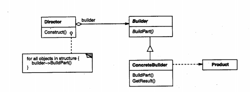  

### 参与者
- builder： 为创建一个product对象的各个部件指定抽象接口
- concretebuilder： 实现builder接口以构造和装配产品，提供一个检索产品的接口
- director： 构造一个使用builder接口的对象
- product： 表示被构造的复杂对象

### 协作
- 客户创建director对象，并用他所想要的builder对象进行配置
- 一旦产品被生成，导向器会通知生成器
- 生成器处理导向器的请求，并将部件添加到产品中
- 客户从生成器中检索产品

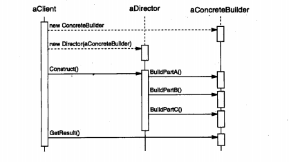  

### 效果
- 可以改变一个产品的内部表示，隐藏产品的表示和内部结构
- 将构造代码和表示代码分开
- 可使对构造过程进行更精细的控制

### 相关模式
- abstract factory： builder着重于一步步构建一个复杂对象，而abstract factory 着重于多个系列的产品对象。builder 在最后一步返回产品，而abstract factory，产品是立即返回的。
## factory method 工厂方法
### 意图
- 定义一个用于创建对象的接口，让子类决定实例化那个对象。将一个类的实例化延迟到子类
### 动机
- application类不能预测到哪个document子类将被实例化
- 框架必须实例化类，但他只知道不能被实例化的抽象类。
  

### 适用性
- 当一个类不知道他说必须创建的对象的类的时候
- 当一个类希望由他的子类来指定他所创建的对象的时候
- 当类将创建对象的职责委托给他多个帮助子类的某一个，并且你希望将哪一个帮助子类是代理者这一信息局部化的时候。

### 结构
  

### 参与者
- product： 定义工厂方法所创建的对象的接口
- concreteproduct： 实现product接口
- creator: 声明工厂方法，该方法返回一个product类型的对象。creator也可以定义一个工厂方法的缺省实现，返回一个缺省的concreteproduct对象，可以调用工厂方法以创建一个product对象
- concretecreator： 重定义工厂方法以返回一个concreteproduct实例

### 协作
- creator 依赖于他的子类来定义工厂方法，所以返回一个适当的concreteproduct实例

### 效果
- 代码仅处理product接口，因此可以和用户定义的任何convreteproduct类一起使用
- 用户可能为了创建一个特定的concreteprodcut对象就不得不创建creator子类

### 相关模式
- abstractfactory经常用工厂方法来实现
- 工厂方法通常扎起templatemethods中被调用
- prototype不需要创建creator子类，但通常要求一个针对product类的initialize操作。
## prototype 原型
### 意图
- 用原型指定创建对象的种类，并通过拷贝这些原型创建新的对象
### 动机
- 通过拷贝和克隆子类的实例来创建新的对象，从而减少子类的数量，所有子类都支持一个clone操作
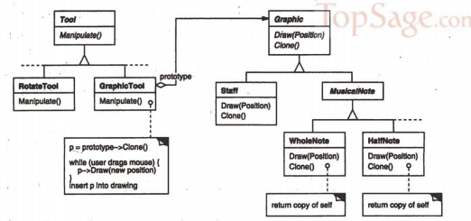  
### 适用性
- 当一个系统独立于他的产品创建，构成和表示
- 要实例化的类是在运行时刻指定的
- 避免创建一个与产品类层次平行的工厂类层次
- 当一个类的实例只能有几个不同状态组合中的一种，建立相应数目的原型并克隆可能比每次用合适的状态手动实例化更方便

### 结构
  

### 参与者
- prototype： 声明一个克隆自身的接口
- concretePrototype： 实现一个克隆自身的操作
- client： 让一个原型克隆自身从而创建一个新的对象

### 协作
- 客户请求一个原型克隆自身

### 效果
- 运行时刻增加和删除产品
- 改变值以指定新对象
- 改变结构以指定新对象
- 减少子类的构造
- 用类动态配置应用

### 相关模式
- prototype和abstract factory会互相竞争
## singleton 单例
### 意图
- 保证一个类仅有一个实例，并提供一个访问它的全局访问点

### 适用性
- 当类只能有一个实例而且客户可以从一个众所周知的访问点访问他时
- 当这个唯一实例应该是通过子类化课扩展的，并且客户应该无需更改代码就能使用一个扩展的实例时

### 结构
  

### 协作
- 客户只能通过singleton的instance操作访问一个singleton的实例

### 效果
- 对唯一实例的受控访问
- 缩小名空间
- 允许对操作和表示的精化
- 允许可变数目的实例
- 比类操作更灵活

### 相关应用 
- abstract factory， builder，prototype都可以用单例实现

# 结构型模式
- 设计如何组合类和对象以获得更大的结构
## adapter 适配器
## bridge 桥接
## composite 组合
## decorator 装饰
### 意图
- 动态的给一个对象增加一些额外的职责，相比生成子类更加灵活

### 动机
- 有时需要给某个对象而不是整个类添加一些功能
- 继承不够灵活
- 装饰对使用组件的客户透明
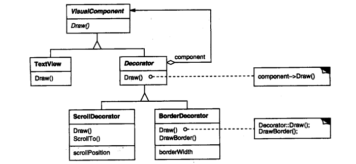  

### 适用性
- 在不影响其他对象的情况下，以动态，透明的方式给单个对象添加职责
- 处理那些可以被撤销的职责
- 当不能蔡总生成子类的方法进行扩充时，比如子类数目爆炸性增长

### 结构
  

### 参与者
- component： 定义一个对象接口，可以给这些对象动态的增加职责
- concretecomponent： 定义一个对象，可以给这个对象增加一些职责
- decorator： 维持一个纸箱component对象的指针，并定义一个与component接口一致的接口
- concretedecorator： 向组件添加职责

### 协作
- decorator将请求转发给他的component对象，并有可能在转发前后附加一些动作。

### 效果
- 比静态继承更加简洁，不会产生许多新的类
- 避免在层次结构高层的类有太多特征，不需要在一个复杂的类中支持所有可预见的特征
- decorator与他的component不一样，装饰时不应该依赖对象标识
- 有许多小对象，排错困难

### 实现
- 装饰对象的接口必须与他所装饰的component的接口是一致的，多有的concretedecorator必须要有一个公共的父类
- 保持component简单
  

### 相关模式
- adapter接口： 不同点在于装饰仅改变对象的职责而不改变它的接口，而适配器讲给对象一个新的接口
- composite模式： 装饰的目的是在于添加额外职责而不在于对象聚集
- strategy模式： strategy模式可以改变对象的内核

## facade 外观
## flyweight 享元
## proxy 代理

# 行为模式
- 算法和对象间的职责分配，通信模式
## chain of responsibility 职责链
### 意图
- 使多个对象都有机会处理请求，从而避免请求的发送者和接收者之间的耦合关系，沿职责链传递请求，知道有对象处理它为止
### 动机
- 根据普遍性，即从最特殊到最普遍的顺序来组织帮助信息
- 从第一个对象开始，链中收到请求的对象要么亲自处理它，要么转发给链中的下一个候选者
- 提交请求的对象并不明确知道哪一个对象会处理它，有一个隐式的接收者（implicit receiver）
  

### 适用性
- 有多个对象可以处理同一个请求，哪一个对象处理该请求运行时自动确定
- 在不明确指定接收者的情况下，向多个对象中的一个提交一个请求

### 结构
  

### 参与者
- handler： 定义一个处理请求的接口，实现后继链
- concreteHandler: 处理请求，访问后继者，处理或转发
- client： 向链上的具体处理者对象提交请求

### 效果
- 降低耦合度，无需知道哪一个对象处理请求
- 增强了指派职责的灵活性： 可以动态的增加或修改请求的职责
- 不保证被接受

### 相关模式
- 常常和composite一起使用，将父构件作为它的后继
## command 命令
### 意图
- 将一个请求封装成一个对象，从而可以用不同的请求对客户进行参数化，对请求排队或记录请求日志，以及支持可撤销的操作

### 动机
- 有时必须向某对象提交请求，但并不知道关于被请求的操作或请求接收者的任何信息
- 通过将请求本身变成一个对象来使工具箱对象可向未指定的应用对象提出请求。
- 抽象的command类，定义了一个execute执行操作的接口

  
  
### 适用性
- 抽象出待执行的动作以参数化某对象，callback： 函数现在某处注册，他将在稍后某个需要的时候调用，command是回调机制一个面向对象的替代品
- 在不同时刻指定，排列和执行请求，command有一个与初始请求无关的生存期
- 支持取消操作，unexecute操作
- 支持修改日志
- 用构件在原语操作上的高层高作构造一个系统。 在支持事务（transaction）的信息系统中很常见。

### 结构
  

### 参与者
- command： 执行操作的接口
- concretecommand：将一个接收者对象绑定于一个动作
- client： 创建一个具体命令对象并设定他的接收者
- invoker： 要求该命令执行这个请求
- receiver： 知道如何实施一个请求相关的操作

### 协作
-  client创建一个concretecommand对象并制定他的receiver对象
-  某invoker对象存储该concretecommand对象
-  invoker调用command对象的execute操作来提交一个请求
-  concretecommand对调用他的receiver执行一些操作

### 效果
- 将调用操作的对象和知道如何实现操作的对象解耦
- command可以被扩展和操纵
- 可以将多个命令装配成一个命令
- 增加新的command很简单

### 相关模式
- composite模式 用来实现宏命令
- memento： 保持某个状态
## interpreter 解释器
### 意图
- 给定一个语言，定义它的文法的一种表示，并定义一个解释器，这个解释器使用该表示来解释语言中的句子

### 动机
- 一种特定类型的问题发生的频率足够高
- 正则表达式
- 使用类来表示每一条文法规则
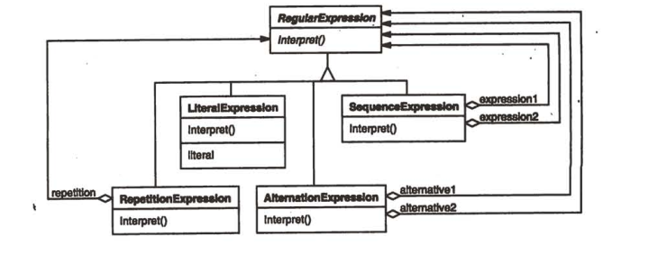  
### 适用性
- 当有一个语言需要解释执行，并且可以将该语言中的句子表示为一个抽象语法树
- 文法简单
- 效率不是关键问题

### 结构
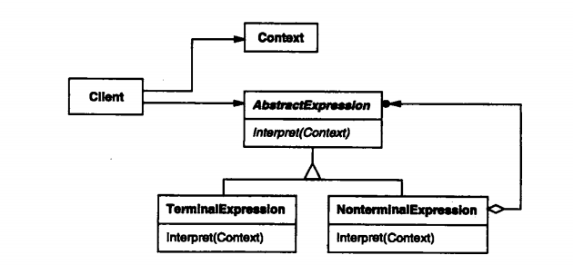  

### 参与者
- abstractexpression： 声明一个抽象的解释操作，这个接口为抽象语法树中所有的节点共享
- terminalexpression： 实现与文法中的终结符相关联的解释操作
- nonterminalExpression: 非终结表达式，为每一条规则都需要一个nonterminalexpression，为每一个符号都维护一个abstractexpression类型的实例变量
- 为文法中的非终结符实现解释操作，解释一般要递归的调用解释操作
- context：上下文，包含解释器之外的一些全局信息
- client： 客户，构建表示该文法定义的语言中一个特定的句子的抽象语法树，该抽象语法树由nonterminalexpression和terminalexpression的实例装配而成。调用解释操作

### 协作
- client构建一个句子，是由nonterminalexpression和terminalexpression的实例的一个抽象语法树，然后初始化上下文并调用解释操作
- 每一非终结符表达式节点定义响应子表达式的解释操作，而各终结符表达式的解释操作构建了递归的基础。
- 每一节点的解释操作用上下文来存储和访问解释器的状态。

### 效果
- 易于改变和扩展文法
- 易于实现文法
- 复杂的文法难以维护
- 增加了新的解释表达式的方式

### 相关模式
- composite模式： 抽象语法树是一个复合模式的实例
- flyweight模式： 说明了如何在抽象语法书中共享终结符
- iterator模式： 解释器可用一个迭代器遍历该结构
- visitor： 可用来在一个类中维护抽象语法树中的各节点的行为
## iterator 迭代器
### 意图
- 提供一种方法顺序访问一个聚合对象中的各个元素，而又不暴露该对象的内部表示
### 动机
- 一个聚合对象如list应该要提供一种方法让别人访问它的元素，又不需要暴露它的内部结构
- 可以有不同的遍历方式
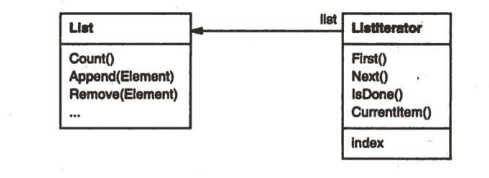  
- 迭代器和列表是耦合在一起的，多态迭代
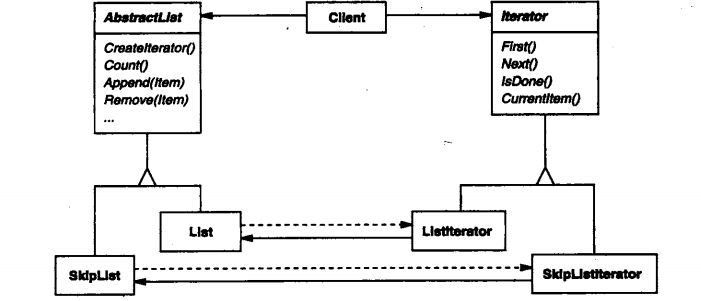  
- 可用工厂方法创建迭代器

### 适用性
- 访问一个聚合对象而不暴露它的内部表示
- 支持对聚合对象的多种遍历
- 为访问不同的聚合结构提供一个统一的接口

### 结构
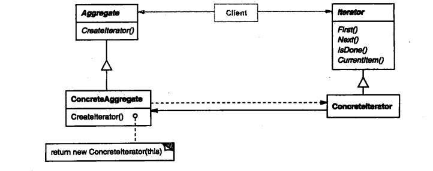  

### 参与者
- iterator，迭代器定义访问和遍历元素的接口
- concreteiterator具体迭代器，具体迭代器实现迭代器接口，对该聚合遍历时跟踪当前位置
- aggregate聚合，聚合定义创响应迭代器对象的接口
- concreteaggregate： 具体聚合，实现响应的迭代器接口，该操作放回concreteiterator的一个适当实例

### 协作
-concreteiterator跟踪聚合中的当前对象，并能计算出待遍历的后继对象

### 效果
- 支持以不同的方式遍历一个集合
- 迭代器简化了聚合的接口
- 在同一个聚合上可以有多个遍历

### 相关模式
- compostite 迭代器常被应用到像符合这样的递归结构上
- factorymethod： 多态迭代器常靠factory method来例化适当的迭代器子类
- memento： 常与迭代器模式一起使用，迭代器可使用一个memento来捕获一个迭代的状态。迭代器在其内部存储memento
## mediator 中介者
### 意图
- 用一个中介对象来封装一系列的对象交互。中介者使个对象不需要显式的相互引用，从而使其耦合松散，而且可以独立的改变他们之间的交互
### 动机
- 对象之间可能有很多链接，最坏情况下，每一个对象都知道其他所有对象，不得不定义很多子类以定制系统的行为
- 将集体行为封装在一个单独的中介者对象中，中介者控制和协调一组对象之间的交互，是的组中的对象不再相互显式引用，对象仅知道中介者（组件通信的中转中心）

### 适用性
- 一组对象定义良好但通信复杂
- 一个对象引用很多对象并直接与这些对象通信
- 想定制一个分布在多个类的行为，而不想生成太多子类

### 结构
  

### 参与者
- mediator： 中介者定义一个接口用于和同事对象通信
- concretemediator： 具体中介者协调各同事对象
- colleague class： 每一个同事类都知道他的中介者对象，对象在与其他同事通信时，与他的中介者通信

### 协作
- 同事向中介者发送和接收请求，中介者适当的转发请求

### 效果
- 减少子类生成
- 解耦colleague
- 简化了对象协议
- 抽象了对象如何协作
- 使控制集中化

### 相关模式
- colleague可使用observer模式与mediator通信
## memento 备忘录
### 意图
- 在不破坏封装性的前提下，捕获一个对象的内部状态，并在该对象之外保存这个状态，这样以后可以把该对象还原到保存的状态
### 动机
- 允许用户取消不确定的操作或从错误中恢复，有检查点和取消机制
- 对象内部状态不能被其他对象访问，也不能违反封装原则
- 备忘录是一个对象，存储另一个对象在某个瞬间的内部状态，称为备忘录的原发器（orginator)
- 当需要触发检查点时，取消操作会向原发器请求一个备忘录，只有原发器可以向备忘录中存取信息

### 适用性
- 必须保存一个对象在某个时刻的状态
- 如果用接口来让其他对象直接得到这些状态会破坏封装性

### 结构
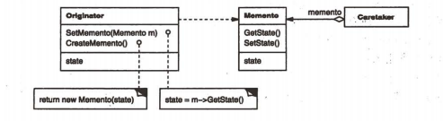  

### 参与者
- memento： 存储原发器对象的内部状态，防止原发器以外的其他对象访问备忘录
- originator： 创建一个备忘录，使用备忘录恢复内部状态
- caretaker： 负责人，负责保存好备忘录，不能对备忘录的内容进行检查或操作

### 协作
- 管理器向元发起请求一个备忘录，保存一段时间后，将其送回给原发器
- 备忘录是被动的，只有原发器会对他的状态进行赋值和检索

### 效果
- 保持封装边界
- 简化了原发器
- 使用备忘录的成本可能很高
- 定义窄接口和宽接口
- 维护备忘录的潜在代价
## observer 观察者
### 意图
- 定义对象间的一种一对多的依赖关系，当一个对象的状态发生改变时，所有依赖它的对象都得到通知并自动更新

### 动机
- 维护相关对象间的一致性，同时不希望使各类紧密耦合
- 用户改变表格信息，柱状图和表格都能同时反映变化
- 目标（object) 和观察者（observer），一旦目标的状态发生改变，所有的观察者都得到通知，也称为发布-订阅（publish-subscribe）

### 适用性
- 一个抽象对象有两个方面，其中一个方面依赖于另一个方面，这两个对象封装在独立的对象中使他们可以各自独立的改变和复用
- 当一个对象的改变需要同时改变其他对象，而不知道具体有多少对象有待改变
- 当一个对象必须通知其他对象，而不知道有多少对象有待改变

### 结构
  

### 参与者
- subject（目标）： 目标知道他的观察者，可以有任意多个观察者观察同一个目标
- observer(观察者)： 为那些在目标发生改变时需要获得通知的对象定义一个更新接口
- concretesubject（具体目标）： 将有关状态存入各concreteobserver对象
- concreteobserver(具体观察者)： 维护一个指向concretesubject对象的引用，存储有关状态，实现observer更新接口

### 协作
- 当concretesubject发生任何可能导致其观察者与其本身状态不一致的变化时，他将通知它的各个观察者
- 在得到一个具体目标的改变通知后，concreteobserver 对象可向目标对象查询信息。concreteobserver使用这个信息使它的状态与目标对象的状态一致。
- 发出改变对象的observer对象并不立即更新，而是推迟到他从目标得到一个通知之后
- notify不总是由目标对象调用，他可以被一个观察者或其他对象调用

### 效果
- 目标与观察者的抽象耦合，目标不知道任何一个观察者属于哪一个具体的类
- 支持广播通信，不需要知道接收者
- 意外的更新，一个观察者不知道其他观察者的存在

### 相关模式
- mediator： changemanager 充当目标与观察者之间的中介
- singleton： changemanager可使用singleton模式来保证他是唯一的并且可以全局访问
## state 状态
### 意图
- 允许一个对象在其内部状态变化时改变他的行为，对象看起来似乎修改了它的类
### 动机
- tcpconnection对象收到其他对象的请求时， 根据他自身不同状态做出不同的反应
- 引入一个tcpstate的抽象类来表示网络的连接状态
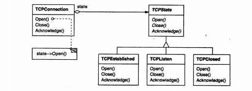  
- tcpconnection类维护一个tcpstate子类的实例。tcpconnection使用他子类的实例来执行特定于连接状态的操作
- 当连接状态改变时会用别的子类实例代替

### 适用性
- 一个对象的行为取决于它的状态，并且必须在运行时刻改变他的行为
- 一个操作中含有庞大的多分支的条件语句，这些分支依赖于对象的状态，状态经常用一个或多个枚举常量表示

### 结构
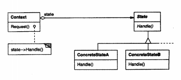  

### 参与者
- Context：定义客户感兴趣的接口，维护一个concrete子类的实例
- state： 定义一个接口封装与context的一个特定状态相关的行为。
- concretestate subclasses： 每一个子类实现一个与context的一个状态相关的操作

### 协作
- context将与状态的请求委托给当前的concretestate对象处理
- context可将自身作为一个参数传给处理该请求的状态对象，使得状态对象在必要时可访问context
- context是用户使用的主要接口，当一个context配置完毕，客户不再需要直接与状态对象交流
- context或concretestate子类都可决定哪个状态是另外哪一个的后继

### 效果
- 将与特定状态相关的行为局部化，并且将不同状态的行为分割开来
- 使得状态转换显式化
- state对象可以被共享

### 相关模式
- 状态对象通常是singleton
- flyweight模式解释了何时以及怎样共享状态对象
## strategy 策略
### 意图
- 定义一系列算法，把他们一个个封装起来，并使他们可互相替换。本模式可独立于使用他的客户而变化

### 动机
- 可以有不同的算法实现同一功能
- 定义一些类来封装不同的算法，称为一个策略
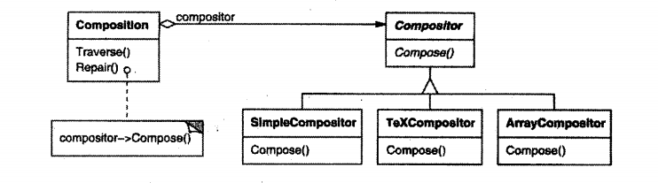  
- composition维护对compositor对象的一个引用。将想要的compositor装入composition中
### 适用性
- 许多相关的类仅仅是行为有不同。
- 需要使用一个算法的不通过辩题
- 算法使用客户不应该知道的数据
- 一个类定义了多种行为，并且这些行为在这个类的操作中以多个条件语句的形式出现。
### 结构
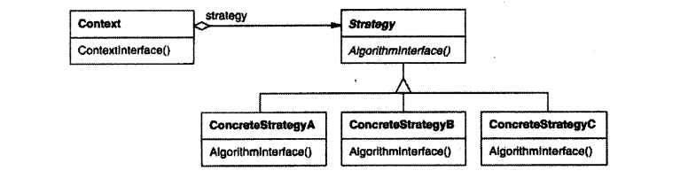  
### 参与者
- strategy： 定义所有支持的算法的公共接口
- concreteStrategy： 实现具体算法
- context： 用一个concretestrategy对象来配置，维护一个对strategy对象的引用，可定义一个接口来让strategy访问它的数据

### 协作
- strategy和context相互作用以实现选定算法，当算法被调用，context将算法所需数据传给strategy
- context将他的客户的请求转发给他的strategy，这样客户仅和context交互
### 效果
- 相关算法序列
- 一个替代继承的方法
- 消除一些条件语句
- 实现的选择
- 客户必须了解不同的strategy
- strategy和context之间的通信开销
- 增加了对象的数目

### 相关模式
-flyweight： strategy对象经常是很好的轻量级对象
## template method 模板方法

### 意图
- 定义一个操作中的算法骨架，从而将一些步骤延迟到子类中
- 使子类可以不改变一个算法的结构就重定义改算法的某些步骤

### 意图
  

- 用一些抽象的操作定义一个算法，子类重定义这些操作以提供具体的行为

### 适用性
- 一次性实现一个算法不变的部分，将可变的行为留给子类
- 各子类公共的行为提取出来到一个公共弗雷避免代码重复
- 控制子类扩展

### 结构
  

- abstractclass： 定义抽象的原语操作
- concreteclass: 实现原语操作以完成算法与特定子类相关的步骤

### 协作
- concreteclass靠abstractclass实现算法不变的步骤
- hook operation： 提供缺省的行为，子类可以在必要时进行扩展

### 相关模式
- factory method： 常被模板方法调用
- strategy： 模板方法使用继承来改变算法的一部分，strategy使用委托来改变整个算法
## visitor 访问者

### 意图
- 表示一个作用域某对象结构中各元素的操作。他使可以在不改变各元素的类的前提下定义作用域这些元素的新操作

### 动机
- 编译器将程序表示为抽象语法树
  

- 可以独立增加新的操作，使这些节点类独立作用与其上的操作
- 将每一个类中相关的操作包装在一个独立对象中（visitor）
- 当一个元素接收访问者时，元素向访问者发送一个包含自身类信息的请求
- 请求将元素本身作为一个参数，执行该操作
  

- 两个类层次，一个对应于接收操作的元素（Node层次），一个对应定义对元素的操作的访问者（NodeVisitor）层次。

### 适用性
- 一个对象结构包含很多对象，他们有不同接口，而对这些对象实施一些以阿里与其具体类的操作
- 需要对一个对象结构中的对象进行很多不同的并且不相关的操作
- 定义对象结构的类很少发生改变，但经常要在此结构上定义新的操作

### 结构
  

### 参与者
- visitor，访问者 为该对象结构中concreteelement的每一个类声明一个visit操作，标识了发送visit请求给访问者哪个类
- concretevisitor 实现每个visitor声明的操作，为算法提供了上下文并存储了它的局部状态
- element：元素 定义一个accept操作，以一个访问者为参数
- concreteelement： 实现accept操作
- objectstructure：对象结构  能枚举它的元素，提供一个高层接口以允许访问者访问它的元素，可以是一个复合或者集合

### 协作
- 一个visitor模式的客户必须创建一个concretevisitor对象然后遍历改对象结构，用该访问者访问每一个元素
- 当一个元素被访问时，他调用对应他类的visitor操作

  

### 效果
- 易于增加新的操作
- 访问者集中相关的操作，分离无关的操作
- 增加新的concreteelement 很困难
- 通过类层次来进行访问，可以访问不具有相同父类的对象
- 积累状态
- 破坏封装，迫使提供访问元素内部状态的公共操作
